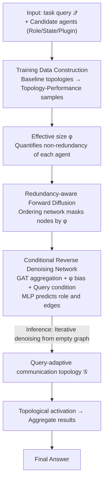

# RADAR: Redundancy-Aware Diffusion for Multi-Agent Communication Structure Generation

**Conference**: ICML 2026  
**arXiv**: [2605.09907](https://arxiv.org/abs/2605.09907)  
**Code**: https://github.com/cszhangzhen/RADAR  
**Area**: Multi-Agent Systems / Graph Diffusion Models / LLM Agent  
**Keywords**: Multi-agent collaboration, graph diffusion, communication topology, effective size, redundancy-aware

## TL;DR
RADAR models the communication topology design of multi-LLM-agent systems as a "redundancy-aware" discrete graph diffusion process. By using effective size as a guiding signal to incrementally generate query-adaptive collaboration graphs, it achieves higher accuracy, lower token consumption, and stronger robustness across six benchmarks.

## Background & Motivation

**Background**: LLM-based multi-agent systems (e.g., LLM-Debate, MetaGPT, AutoGen) have proven significantly more capable than single agents. However, their key bottleneck lies in the "communication topology"—specifically, who communicates with whom and in what sequence. Early methods relied on manual fixed structures (chain, star, tree, fully-connected). Recent works (GPTSwarm, G-Designer, MaAS, ARG-Designer, GTD) have shifted toward "automated topology design."

**Limitations of Prior Work**: Automated approaches generally follow three routes, each with flaws. First, agentic profiling (coordination via meta-agents) introduces single-point bottlenecks. Second, search-based methods (heuristic search in topology space) are computationally expensive and lack scalability. Third, graph learning (using VAEs for one-shot prediction) produces coarse granularity and fails to capture detailed dependencies. Critically, increased structural complexity leads to excessive token consumption—cited data shows complex topologies can consume $2 \sim 11.8\times$ more tokens than chain structures. While methods like AgentPrune utilize pruning to mitigate this, they only perform local modifications on fixed agent sets ("post hoc" patches) rather than designing from scratch under efficiency constraints.

**Key Challenge**: The contradiction between expressiveness (topologies must be complex enough for hard tasks) and efficiency (tokens must not explode). Existing methods either sacrifice one or treat them as independent subproblems.

**Goal**: Explicitly model "redundancy" during the communication graph generation process, enabling joint structure formation and redundancy control while supporting query-adaptivity (using sparse structures for simple queries and dense ones for difficult ones).

**Key Insight**: The authors adopt "effective size" (Burt 1992) from social network analysis—the proportion of non-redundant information in a node's ego network. If two neighbors are highly interconnected, their information overlap is high, resulting in low effective size. Integrating this concept into the graph diffusion process provides a natural "redundancy metric" as a guiding signal for generation.

**Core Idea**: Reformulate multi-agent communication topology design as an "effective size-guided + query-conditioned" discrete graph diffusion problem, incrementally denoising from an empty graph to the final topology.

## Method

### Overall Architecture

RADAR treats designing a multi-agent communication topology for a task query as a conditional graph diffusion problem. Inputs include the task query $\mathcal{Q}$ and a set of candidate agents (each with a Role, State, and Plugin). The output is a directed graph $\mathcal{G} = (\mathcal{V}, \mathcal{E})$, where $A_{ij} = 1$ indicates agent $v_i$ sends information to $v_j$. Once the graph is obtained, agents are activated sequentially following the topological sort. Finally, an aggregate function (e.g., majority voting, concatenation, or the output of the final agent) summarizes the answer. During training, a variety of baseline topologies (fully connected, mesh, star, layered, random, with 3 or 4 agents) are executed on 50 training queries to generate "topology-performance" samples. During inference, the denoising network starts from an empty graph and iteratively denoises to grow a collaboration graph customized for the specific query. The essence of the design is integrating effective size into each diffusion step to continuously suppress redundancy as the structure grows.

### Key Designs

**1. Effective size: Converting redundancy into a guidable geometric quantity**

Previous methods relied on black-box signals like task accuracy for feedback, which are sparse and delayed, leaving the model unaware of which part of the graph is redundant. RADAR borrows "effective size" (Burt 1992) to assign a scalar to each agent, quantifying its local non-redundancy. The incoming effective size is defined as $\varphi^i(v_k) = |\mathcal{N}_i(v_k)| - \frac{\sum_{j,q \in \mathcal{N}_i(v_k)} A_{jq} \mathbb{I}[r(j) = r(q)]}{|\mathcal{N}_i(v_k)|}$. The numerator counts in-neighbors, while the denominator penalizes neighbor pairs that share the same role and are interconnected. The outgoing effective size $\varphi^o(v_k)$ is defined symmetrically, and both are weighted into $\varphi(v_k) = (1-\beta) \varphi^i(v_k) + \beta \varphi^o(v_k)$. High $\varphi$ suggests an agent receives diverse inputs and distributes information through non-overlapping paths.

**2. Redundancy-aware forward diffusion: Using effective size to determine masking order**

General graph diffusion typically masks nodes in a random or fixed order, which erases structural regularities and makes reverse denoising difficult. RADAR uses effective size to determine the masking sequence. The training graph $\mathcal{G}_0$ is transformed into a series of partially masked intermediate graphs $\mathcal{G}_1, \mathcal{G}_2, \dots$ controlled by an ordering network $q_\psi(\pi | \mathcal{G}_0, \varphi) = \prod_t q_\psi(\pi_t | \mathcal{G}_0, \varphi, \pi_{(<t)})$. Nodes with higher effective size are masked earlier. This ensures that the reverse process restores simple sub-structures first and complex dependencies last, making the learning task more structured and efficient.

**3. Conditional reverse denoising network: Joint prediction of roles and edges**

The reverse process starts from an empty graph and recovers a node along with its edges to previously generated nodes, conditioned on query $\mathcal{Q}$. The denoising network $p_\theta(\mathcal{G}_t | \mathcal{G}_{t+1}, \mathcal{Q})$ uses GAT-style attention to aggregate neighbor information, adding effective size as a bias in the final layer: $\mathbf{h}_i^L \leftarrow \mathbf{h}_i^L + \varphi(v_i) \mathbf{1}$. This implicitly biases generation toward low-redundancy structures. An MLP then simultaneously predicts the new node's role and its connectivity using a "mixture of multinomial distributions." This reduces the generation complexity from $\mathcal{O}(N^2)$ to $\mathcal{O}(N)$.

### Loss & Training

The denoising network is trained using a weighted NLL loss $\nabla_\theta \mathcal{G} = \sum_{m,t} \sum_{k \in \pi(\leq t)} w_k^m \nabla \log p_\theta(\mathcal{G}_{v_k}^{\pi(>t)} | \mathcal{G}_{t+1}^m, \mathcal{Q})$, where $w_k^m$ is the probability weight from the ordering network. The ordering network is trained via REINFORCE, where the reward is the negative NLL. Additionally, a task-utility policy gradient term $\nabla_\theta \mathbb{E}[\mathcal{G}] \approx \frac{1}{\mathcal{B}} \sum_k u(\mathcal{G}^{(k)}(\mathcal{Q})) \nabla_\theta \log p_\theta(\mathcal{G}^{(k)} | \mathcal{Q})$ uses task accuracy as a black-box reward.

## Key Experimental Results

### Main Results

Evaluated across six benchmarks with gpt-4o-mini as the base LLM and five agents.

| Method | MMLU | GSM8K | HumanEval | Average |
| :--- | :--- | :--- | :--- | :--- |
| Vanilla (Single Agent) | 78.54 | 87.45 | 87.08 | 85.92 |
| LLM-Debate | 80.56 | 89.47 | 88.68 | 87.46 |
| AgentPrune | 82.40 | 91.92 | 87.17 | 88.22 |
| MaAS | 82.32 | 91.13 | 89.57 | 88.50 |
| ARG-Designer | 79.10 | 91.25 | 89.19 | 88.57 |
| **RADAR (Ours)** | **83.66** | **92.51** | **91.28** | **90.32** |

Ours outperforms the strongest learning-based baseline (ARG-Designer) by an average of 1.75% and single agents by 1.96%~6.59%.

### Ablation Study

| Configuration | MMLU | GSM8K | MultiArith | Description |
| :--- | :--- | :--- | :--- | :--- |
| Full RADAR | 83.66 | 92.51 | 98.81 | Full model |
| w/o ES | 81.05 | 91.22 | 98.31 | Removes effective size from ordering and denoising |
| w/o utility | 82.96 | 92.02 | 98.47 | Removes task-utility policy gradient |
| w/o query | 79.08 | 91.82 | 97.81 | Removes query conditioning (largest drop) |
| non-diffusion | 79.10 | 91.25 | 98.55 | Uses ARG-Designer style autoregression |

### Key Findings
- **Query conditioning** has the highest impact (MMLU drops 4.58), indicating task-adaptivity is the core source of gain.
- **Effective size** systematically improves performance; removing it drops MMLU by 2.61.
- **Token Economy**: On GSM8K, RADAR uses $4.2 \times 10^6$ tokens—half of G-Designer—while achieving higher accuracy.
- **Robustness**: Injecting "liar prompt attacks" into 2/5 agents on MMLU caused fully connected graphs to drop 4.47%, whereas RADAR remained stable.
- **Transferability**: Trained on gpt-4o-mini, it transfers well to DeepSeek-R1 and Qwen3-32B.

## Highlights & Insights
- **Effective size implementation**: Adapting a 1990s social network concept to LLM agent communication is a clean cross-disciplinary insight. It allows for a differentiable redundancy signal.
- **Iterative diffusion vs. One-step generation**: This paradigm shift allows the model to "reflect" on redundancy during growth rather than generating a whole graph blindly.
- **Joint edge prediction**: Using a mixture of multinomial distributions compresses generation complexity to $\mathcal{O}(N)$, making query-adaptive inference practical.

## Limitations & Future Work
- The initial data collection (running baseline topologies on queries) involves a significant startup cost.
- Inference latency is higher than fixed workflow methods due to multi-step denoising.
- Experiments are restricted to a small number of agents (N=5); scaling behavior for large N and the resulting $\mathcal{O}(N^2)$ complexity of effective size calculation remain unexplored.
- Dynamic role generation is not yet supported.

## Related Work & Insights
- **vs. ARG-Designer**: Both are generative, but RADAR uses diffusion with joint edge prediction and redundancy modeling, leading to superior efficiency and quality.
- **vs. AgentPrune**: AgentPrune is a post-hoc pruner limited by the initial topology; RADAR generates optimized structures from scratch.
- **vs. MaAS**: MaAS samples from a continuous architecture distribution in one shot; RADAR’s step-by-step diffusion allows for finer-grained exploration.

## Rating
- **Novelty**: ⭐⭐⭐⭐ Integrating effective size into graph diffusion is a strong cross-domain idea.
- **Experimental Thoroughness**: ⭐⭐⭐⭐⭐ Comprehensive coverage across datasets, baselines, and robustness tests.
- **Writing Quality**: ⭐⭐⭐⭐ Formulas and diagrams are clear, though some network details are compressed.
- **Value**: ⭐⭐⭐⭐ Addresses real pain points in token costs and multi-agent robustness.

<!-- RELATED:START -->

## Related Papers

- [\[AAAI 2026\] Assemble Your Crew: Automatic Multi-agent Communication Topology Design via Autoregressive Graph Generation](../../AAAI2026/multi_agent/assemble_your_crew_automatic_multi-agent_communication_topol.md)
- [\[AAAI 2026\] BAMAS: Structuring Budget-Aware Multi-Agent Systems](../../AAAI2026/multi_agent/bamas_structuring_budget-aware_multi-agent_systems.md)
- [\[ICLR 2026\] GlobeDiff: State Diffusion Process for Partial Observability in Multi-Agent Systems](../../ICLR2026/multi_agent/globediff_state_diffusion_process_for_partial_observability_in_multi-agent_syste.md)
- [\[ACL 2026\] BookAgent: Orchestrating Safety-Aware Visual Narratives via Multi-Agent Cognitive Calibration](../../ACL2026/multi_agent/bookagent_orchestrating_safety-aware_visual_narratives_via_multi-agent_cognitive.md)
- [\[ICLR 2026\] BRIDGE: Bi-level Reinforcement Learning for Dynamic Group Structure in Coalition Formation Games](../../ICLR2026/multi_agent/bridge_bi-level_reinforcement_learning_for_dynamic_group_structure_in_coalition_.md)

<!-- RELATED:END -->
