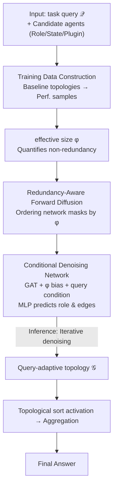

# RADAR: Redundancy-Aware Diffusion for Multi-Agent Communication Structure Generation

**Conference**: ICML 2026  
**arXiv**: [2605.09907](https://arxiv.org/abs/2605.09907)  
**Code**: https://github.com/cszhangzhen/RADAR  
**Area**: Multi-Agent Systems / Graph Diffusion Models / LLM Agents  
**Keywords**: Multi-agent collaboration, graph diffusion, communication topology, effective size, redundancy-aware

## TL;DR
RADAR models the communication topology design of multi-LLM-agent systems as a "redundancy-aware" discrete graph diffusion process. By using effective size as a guidance signal to incrementally generate query-adaptive collaboration graphs, it achieves higher accuracy, lower token consumption, and stronger robustness across six benchmarks.

## Background & Motivation

**Background**: LLM-Agent multi-agent systems (e.g., LLM-Debate, MetaGPT, AutoGen) have proven far more capable than single agents. However, their critical bottleneck lies in the "communication topology"—who talks to whom and in what order. Early methods relied on fixed manual structures like chain, star, tree, or fully-connected. In the past year, research (GPTSwarm, G-Designer, MaAS, ARG-Designer, GTD) has shifted toward "automated topology design."

**Limitations of Prior Work**: Automated approaches generally follow three paths, each with flaws: 1) Agentic profiling (coordination via a meta-agent), which suffers from single-point bottlenecks; 2) Search-based (heuristic search of the topology space), which is computationally expensive and non-scalable; 3) Graph learning (one-shot prediction via VAEs, etc.), where generation is too coarse to capture detailed dependencies. More critically, structural complexity causes token explosion—cited data shows complex topologies consume $2 \sim 11.8\times$ more tokens than chain structures. Methods like AgentPrune or Wang et al. perform pruning as a "post-hoc" patch on fixed agent sets, failing to design from scratch under efficiency constraints.

**Key Challenge**: The contradiction between expressiveness (topology must be complex enough for hard problems) and efficiency (tokens cannot explode). Existing methods either sacrifice one or treat them as independent sub-problems.

**Goal**: To explicitly model "redundancy" during the communication graph generation process, performing structure formation and redundancy control jointly; and to support query-adaptivity, using sparse structures for simple queries and dense structures for hard ones.

**Key Insight**: Borrowing "effective size" (Burt 1992) from social network analysis—the proportion of non-redundant information in a node's ego network. If two neighbors are themselves highly connected, the information they provide overlaps, resulting in a low effective size. Inserting this concept into the graph diffusion process provides a natural "redundancy metric" as a guidance signal for generation.

**Core Idea**: Reformulate multi-agent communication topology design as an "effective size-guided + query-conditioned" discrete graph diffusion problem, denoising from an empty graph to the final topology step-by-step.

## Method

### Overall Architecture

RADAR treats "designing a multi-agent communication topology for a task query" as a conditional graph diffusion problem. Input includes a task query $\mathcal{Q}$ and a set of candidate agents (each with Role/State/Plugin). The output is a directed graph $\mathcal{G} = (\mathcal{V}, \mathcal{E})$, where $A_{ij} = 1$ indicates agent $v_i$ sends information to $v_j$. Agents are activated sequentially according to a topological sort, and outputs are synthesized via an Aggregate function (majority vote, concatenation, or the last agent's output). During training, baseline topologies (fully connected, mesh, star, layered, random; $N=3,4$) are run on 50 training queries to build "topology $\leftrightarrow$ performance" samples. At inference, the denoising network iterates from an empty graph, growing a collaboration graph tailored to the specific query.

### Key Designs

**1. Effective size: Converting redundancy into a geometric quantity**
Automated design often relies solely on task accuracy, which is a sparse and delayed black-box signal. RADAR adopts "effective size" (Burt 1992) to quantify the non-redundant degree of each agent's local structure. The incoming metric is defined as $\varphi^i(v_k) = |\mathcal{N}_i(v_k)| - \frac{\sum_{j,q \in \mathcal{N}_i(v_k)} A_{jq} \mathbb{I}[r(j) = r(q)]}{|\mathcal{N}_i(v_k)|}$: the numerator is the count of in-neighbors, while the denominator penalizes neighbor pairs that have the same role and are interconnected. The outgoing metric $\varphi^o(v_k)$ is defined symmetrically, and they are merged via $\varphi(v_k) = (1-\beta) \varphi^i(v_k) + \beta \varphi^o(v_k)$. A high $\varphi$ means the agent receives diverse inputs and distributes info across non-overlapping paths.

**2. Redundancy-aware forward diffusion: Ordering noise by effective size**
Standard graph diffusion (Kong et al., Chen et al.) masks nodes in random or fixed orders. RADAR uses effective size to determine the masking order: training graphs $\mathcal{G}_0$ are incrementally masked to produce $\mathcal{G}_1, \mathcal{G}_2, \dots$. The ordering network $q_\psi(\pi | \mathcal{G}_0, \varphi) = \prod_t q_\psi(\pi_t | \mathcal{G}_0, \varphi, \pi_{(<t)})$ uses GNN-derived node embeddings $h_t$ to sample node $\pi_t$ with weight $q_\psi \propto \exp(h_t + \varphi(v_t))$. Consequently, nodes with higher effective size are masked earlier. This ensures simple sub-structures are reconstructed first during reverse denoising.

**3. Conditional reverse denoising network: Joint role and edge prediction**
The reverse process starts from an empty graph, reconstructing nodes and their connections under condition $\mathcal{Q}$. The denoising network $p_\theta(\mathcal{G}_t | \mathcal{G}_{t+1}, \mathcal{Q})$ uses GAT-style attention $\alpha_{i,j}$ and explicitly adds effective size as a bias in the final layer: $\mathbf{h}_i^L \leftarrow \mathbf{h}_i^L + \varphi(v_i) \mathbf{1}$. An MLP then jointly predicts the new node's role and all edges using a "mixture of multinomial distributions." This reduces the generation complexity from $\mathcal{O}(N^2)$ to $\mathcal{O}(N)$.

### Loss & Training

The denoising network is trained using a weighted NLL loss $\nabla_\theta \mathcal{G} = \sum_{m,t} \sum_{k \in \pi(\leq t)} w_k^m \nabla \log p_\theta(\mathcal{G}_{v_k}^{\pi(>t)} | \mathcal{G}_{t+1}^m, \mathcal{Q})$, where $w_k^m$ are probabilities from the ordering network. The ordering network is trained via REINFORCE with reward $R^m = -\sum_t \sum_k w_k^m \log p_\theta(\cdot)$. Additionally, a task-utility policy gradient term $\nabla_\theta \mathbb{E}[\mathcal{G}] \approx \frac{1}{\mathcal{B}} \sum_k u(\mathcal{G}^{(k)}(\mathcal{Q})) \nabla_\theta \log p_\theta(\mathcal{G}^{(k)} | \mathcal{Q})$ uses task accuracy as a black-box reward.

## Key Experimental Results

### Main Results

Evaluated on 6 benchmarks with gpt-4o-mini as the base LLM and 5 agents.

| Method | MMLU | GSM8K | HumanEval | Average |
| :--- | :---: | :---: | :---: | :---: |
| Vanilla (Single Agent) | 78.54 | 87.45 | 87.08 | 85.92 |
| LLM-Debate | 80.56 | 89.47 | 88.68 | 87.46 |
| AgentPrune | 82.40 | 91.92 | 87.17 | 88.22 |
| MaAS | 82.32 | 91.13 | 89.57 | 88.50 |
| ARG-Designer | 79.10 | 91.25 | 89.19 | 88.57 |
| **RADAR** | **83.66** | **92.51** | **91.28** | **90.32** |

RADAR outperforms the strongest learning-based baseline (ARG-Designer) by 1.75% on average.

### Ablation Study

| Configuration | MMLU | GSM8K | MultiArith |
| :--- | :---: | :---: | :---: |
| Full RADAR | 83.66 | 92.51 | 98.81 |
| w/o ES | 81.05 | 91.22 | 98.31 |
| w/o utility | 82.96 | 92.02 | 98.47 |
| w/o query | 79.08 | 91.82 | 97.81 |
| non-diffusion | 79.10 | 91.25 | 98.55 |

### Key Findings
- **Goal Dependency**: "w/o query" results in a 4.58 drop on MMLU, identifying task-adaptive selection as the primary performance driver.
- **Redundancy Control**: Removing "effective size" (ES) drops MMLU by 2.61, validating the redundancy-aware design.
- **Token Economy**: On GSM8K, RADAR uses $4.2 \times 10^6$ tokens, half that of G-Designer, and less than AgentPrune ($1.1 \times 10^7$).
- **Robustness**: Against "liar prompt attacks," full connectivity accuracy drops 4.47%, while RADAR is nearly unaffected.
- **Transferability**: Models trained on gpt-4o-mini transfer effectively to DeepSeek-R1 and Qwen architectures.

## Highlights & Insights
- **Interdisciplinary Translation**: Bringing "effective size" (Burt 1992) from human social network analysis to LLM agents is a clean, effective bridge.
- **Process Shift**: Moving from one-shot generation to an iterative diffusion process allows the model to "reflect" on redundancy during growth.
- **Efficiency**: The joint edge prediction via mixture multinomials keeps inference overhead at $\mathcal{O}(N)$, making query-adaptive topology practical.

## Limitations & Future Work
- **Initialization Cost**: Requires sampling 50 queries across baseline topologies to initialize the dataset for new tasks.
- **Latency**: Iterative denoising per query is slower than static workflow methods (e.g., 17.55min vs 7.32min on GSM8K).
- **Scale**: Experiments used only 5 agents; the $\mathcal{O}(N^2)$ calculation of effective size may bottleneck larger networks.
- **Role Search**: Agents are selected from a fixed pool; dynamic role prompt generation is reserved for future work.

## Related Work & Insights
- **vs ARG-Designer**: Both are generative, but RADAR uses diffusion and explicit redundancy modeling for better efficiency and quality.
- **vs GTD**: GTD also uses conditional discrete diffusion but lacks structural metrics like effective size to guide redundancy suppression.
- **vs AgentPrune**: AgentPrune is a post-hoc modification limited by the initial topology; RADAR generates optimized structures from scratch.

## Rating
- Novelty: ⭐⭐⭐⭐
- Experimental Thoroughness: ⭐⭐⭐⭐⭐
- Writing Quality: ⭐⭐⭐⭐
- Value: ⭐⭐⭐⭐

<!-- RELATED:START -->

## Related Papers

- [\[AAAI 2026\] Assemble Your Crew: Automatic Multi-agent Communication Topology Design via Autoregressive Graph Generation](../../AAAI2026/multi_agent/assemble_your_crew_automatic_multi-agent_communication_topol.md)
- [\[ACL 2026\] BookAgent: Orchestrating Safety-Aware Visual Narratives via Multi-Agent Cognitive Calibration](../../ACL2026/multi_agent/bookagent_orchestrating_safety-aware_visual_narratives_via_multi-agent_cognitive.md)
- [\[AAAI 2026\] BAMAS: Structuring Budget-Aware Multi-Agent Systems](../../AAAI2026/multi_agent/bamas_structuring_budget-aware_multi-agent_systems.md)
- [\[NeurIPS 2025\] GauDP: Reinventing Multi-Agent Collaboration through Gaussian-Image Synergy in Diffusion Policies](../../NeurIPS2025/multi_agent/gaudp_reinventing_multi-agent_collaboration_through_gaussian-image_synergy_in_di.md)
- [\[NeurIPS 2025\] Thought Communication in Multiagent Collaboration](../../NeurIPS2025/multi_agent/thought_communication_in_multiagent_collaboration.md)

<!-- RELATED:END -->
