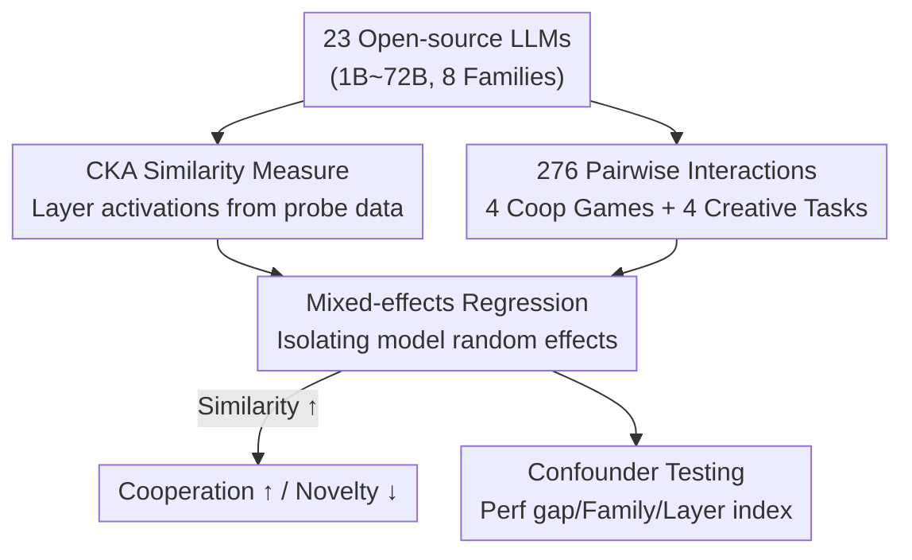

# Representational Similarity and Model Behavior in Multi-Agent Interaction

**Conference**: ICML2026  
**arXiv**: [2606.07818](https://arxiv.org/abs/2606.07818)  
**Code**: To be confirmed  
**Area**: Multi-Agent / LLM Interaction Analysis  
**Keywords**: Representational Similarity, Multi-Agent, Cooperation, Novelty, CKA  

## TL;DR
This paper pairs 276 LLMs across 8 interactive games and identifies a robust pattern: pairs with higher internal representational similarity (quantified by CKA) exhibit better cooperation but lower collective novelty in their outputs—revealing a fundamental trade-off between cooperation and creativity driven by representational similarity.

## Background & Motivation
**Background**: Multi-agent LLM systems have transitioned from concept to application, being utilized for social simulations, collaborative coding, brainstorming, and scientific idea generation. The mainstream assumption is that "multi-agent is superior to single-agent," leading many systems to simply stack models. However, most deployments involve multiple copies of the same model, with little research into "which models should be combined."

**Limitations of Prior Work**: Existing research focuses almost exclusively on **output-layer behavior** (who cooperates, who free-rides) while lacking a characterization of "why this happens" and the underlying internal mechanisms. Meanwhile, neuroscience has long established that "neural similarity" between humans predicts social closeness and cooperation, whereas innovation often arises from the collision of **heterogeneous individuals**—yet this principle has not been verified in the context of AI.

**Key Challenge**: Cooperation requires agents to "be on the same page" (alignment), while innovation requires them to "think differently" (diversity). If representational similarity influences both ends, it acts as an invisible lever that simultaneously boosts cooperation and suppresses novelty—a core tension in multi-agent system design that has been largely overlooked.

**Goal**: To answer a clear empirical question: What is the relationship between the **representational similarity** of two models and their **interaction behavior** (cooperation vs. novelty)? Furthermore, after controlling for confounding factors like performance gaps, model size, or model family, does similarity remain a strong independent predictor?

**Key Insight**: Borrowing the hypothesis from neuroscience that "similar neural responses predict cooperation, while heterogeneity inspires innovation," this study maps it to LLMs. It uses CKA to measure the internal representational similarity between two models and analyzes the impact of this similarity on outcomes across a large-scale set of games and creative tasks using regression analysis.

**Core Idea**: Use "representational similarity," a computable internal metric, to predict two macro-behaviors in multi-agent interaction—cooperation and novelty—and prove it is an independent, robust predictor primarily driven by **early layers**.

## Method

### Overall Architecture
This is an **empirical analysis** paper. Instead of proposing a new model, it builds a pipeline of "measure similarity $\rightarrow$ model interaction $\rightarrow$ regression analysis" to test a hypothesis. The process consists of three steps: first, extracting representations of each model across layers using a probe dataset and calculating CKA similarity scores for 276 pairings; second, pairing 23 open-source models to interact in 4 cooperative games and 4 creative tasks; and finally, using mixed-effects regression to decouple the impact of similarity from the individual capabilities of the models.

### Key Designs

**1. CKA Similarity Measure: Compressing "How Similar Two Models Are" into a Comparable Score**

To test the hypothesis, a metric capable of comparing internal representations across architectures and layer counts is required. The paper adopts linear **CKA** (Centered Kernel Alignment). For each model, activations of the last token in the $k$-th layer are extracted using a probe dataset $\mathcal{D}=\{x_i\}_{i=1}^m$ (e.g., 1000 prompts sampled from WikiText), forming a matrix $R_\theta^k \in \mathbb{R}^{m\times n}$. CKA is calculated for every pair of layers $(i,j)$ between two models, resulting in an $l_1\times l_2$ score grid. This is aggregated into a single score via **global averaging** or **max-alignment averaging**:

$$\frac{1}{2}\Bigg(\frac{\sum_i \max_j \text{CKA}(R_{\theta_1}^i, R_{\theta_2}^j)}{l_1} + \frac{\sum_j \max_i \text{CKA}(R_{\theta_1}^i, R_{\theta_2}^j)}{l_2}\Bigg)$$

The latter ensures identical models score 1. CKA ranges from $[0,1]$, with higher values indicating greater similarity. Since CKA is architecture-agnostic, 23 models from different families (1B to 72B) can be compared.

**2. Dual-Axis Interaction Tasks: Quantifying Cooperation and Novelty**

The paper designs a symmetric "dual-axis" task suite. The **Cooperation Axis** employs 4 economic/linguistic games: Taboo (one provides clues, the other guesses), Public Goods Game (multiround investment with 30% dividend), Divide the Dollar (sum must not exceed $1), and Keynesian Beauty Contest (KBC) (guessing 2/3 of the average to test recursive reasoning). The **Novelty Axis** adapts 4 creative tasks from NoveltyBench (stories, fictional biographies, haikus, vacation brainstorming) into multi-agent versions where models brainstorm individually before producing a joint final draft.

**3. Mixed-effects Regression: Isolating the Effect of Similarity**

Since models appear in multiple pairs and pairs undergo multiple samplings, data points are not independent. Simple linear regression would be invalid. The paper uses mixed-effects regression:

$$Y_{ij} = \alpha + \beta\cdot\text{CKA}_{ij} + u_i + v_j + \epsilon_{ij}$$

where $Y_{ij}$ is the interaction outcome, and $u_i, v_j$ are random effects for models $i$ and $j$, absorbing "inherent model capability." The focus is on the slope $\beta$ and its $p$-value, measuring how much the result changes per unit of similarity after controlling for individual differences.

**4. Layer-wise Attribution: Locating the Driver of the Pattern**

To explain "why," the paper segments models into early, middle, and late layers. Regression is rerun using similarity from specific segments. Results show that **early 1/3 layers** consistently provide the strongest predictive power for both cooperation and novelty. This suggests the mechanism is rooted in **lexical-semantic grounding**—shared low-level representations facilitate alignment (cooperation), while divergence at this level fosters collective novelty.

### Loss & Training
No training is involved. Experiments use a temperature of 0.7 (consistent results at 0.3). At least 4 samplings per pair for games and 10 for creative tasks. Four probe datasets—WikiText, GSM8K, MATH, and TruthfulQA—are used to ensure results are independent of probe selection.

## Key Experimental Results

### Main Results: Regression Coefficients of Similarity on Behavior
In all cooperative games, similarity coefficients are significantly positive. In all creative tasks, "response uniqueness" is significantly negative.

| Task (Axis) | Metric | Similarity Effect (WikiText) | Significance |
|-----------|------|----------------------|--------|
| Taboo (Coop) | Relative Change in Accuracy | +88.2% (0→1) | Significant |
| Public Goods (Coop) | Relative Change in Total Assets | +34.8% | Significant |
| Divide Dollar (Coop) | Relative Change in Total Assets | +29.9% | Significant |
| KBC (Coop) | Relative Change in Total Score | +4.5% (Weakest) | Significant |
| Haiku (Novelty) | Response Uniqueness Coefficient | −3.425 (Strongest) | $p<.001$ |
| Haiku (Novelty) | Mutual Information Coefficient | +1.310 (Higher = Less Novel) | $p<.001$ |

The KBC effect is weakest as it has a unique Nash Equilibrium (choosing 0), making optimal strategy independent of similarity, yet the trend remains significant. Notably, response **quality** shows no systematic trend with similarity, implying that interacting with heterogeneous models increases diversity without sacrificing performance.

### Ablation Study

| Test | Conclusion |
|------|------|
| Controlling Behavior Diff | Similarity remains significant ($p<.001$) in Public Goods/Divide Dollar; behavior diff is not significant. |
| Controlling MMLU Perf | Main trends remain robust; results cannot be explained solely by "who is stronger." |
| Controlling Family/Size/Tokenizer | Similarity remains the strongest predictor (Coop coeff=0.060, $p=.001$; Uniqueness coeff=−0.087, $p=.026$). |
| Layer-wise Attribution | Early 1/3 layers show the strongest effect → Low-level grounding is the core driver. |

### Key Findings
- **The Cooperation-Novelty Trade-off is Robust**: Holds across 4 probe datasets, 4 CKA variants, and different aggregation methods. Effect size does not fluctuate significantly with the choice of probe data.
- **Not a Spurious Correlation**: Even after controlling for behavioral similarity, MMLU performance, family, and size, similarity remains independently significant—likely acting as a proxy for latent attributes like training data overlap.
- **Mechanism Located in Lower Layers**: Stronger sharing in early layers facilitates cooperation, while divergence at the bottom level is necessary for collective novelty.

## Highlights & Insights
- **Translating Neuroscience into Falsifiable AI Experiments**: Mapping "similarity promotes cooperation, heterogeneity promotes innovation" to LLMs via CKA and mixed-effects regression is a sophisticated cross-disciplinary translation.
- **CKA as a Proxy for Latent Attributes**: The insight that similarity remains significant after controlling for all observable factors suggests it captures deep properties (e.g., training data overlap) that are otherwise difficult to quantify.
- **Actionable System Design Principles**: "Pair similar models for stable cooperation, pair heterogeneous models for creativity" provides a practical guideline for multi-agent model selection.
- **Mechanistic Grounding in Early Layers**: Locating the effect in early layers provides a testable mechanistic explanation rather than just a superficial correlation.

## Limitations & Future Work
- **Representational Limits of CKA**: CKA only captures specific geometric aspects of the manifold; it cannot pinpoint exact features driving the trends.
- **Context Dependence**: The KBC results indicate that game structure (e.g., Nash Equilibrium) can diminish the role of similarity.
- **Pairwise Limitation**: The study focuses on pairs. Whether these conclusions generalize to larger groups or complex role-playing scenarios remains unverified.
- **Task Scope**: While diverse, the tasks are controlled small-scale experiments, which may differ from complex real-world workflows like collaborative software engineering.

## Related Work & Insights
- **vs. Output-layer Multi-agent Studies (Lai et al. 2024)**: Previous works observe how behavior changes after interaction; this paper uses internal similarity as an independent variable to **predict** those behaviors.
- **vs. Neuroscience Research (Parkinson et al. 2018)**: This study is the AI counterpart to findings that neural similarity predicts friendship, replacing fMRI with CKA and social interaction with economic games.
- **vs. CKA for Performance Prediction (Moschella et al. 2022)**: While previous work used CKA to predict single-model performance, this paper is the first to use it to predict **interactive behavior** between two agents.

## Rating
- **Novelty**: ⭐⭐⭐⭐⭐ First rigorous transfer of the "neural similarity-cooperation" hypothesis to LLM multi-agents with layer-wise localization.
- **Experimental Thoroughness**: ⭐⭐⭐⭐⭐ 276 pairs × 8 tasks × 4 probes with extensive confounder control.
- **Writing Quality**: ⭐⭐⭐⭐ Logical flow with strong interdisciplinary motivation.
- **Value**: ⭐⭐⭐⭐⭐ Provides actionable design principles for model selection in multi-agent systems.

<!-- RELATED:START -->

## Related Papers

- [\[ACL 2026\] LLM-Based Human-Agent Collaboration and Interaction Systems: A Survey](../../ACL2026/multi_agent/llm-based_human-agent_collaboration_and_interaction_systems_a_survey.md)
- [\[AAAI 2026\] AgentODRL: A Large Language Model-based Multi-agent System for ODRL Generation](../../AAAI2026/multi_agent/agentodrl_a_large_language_model-based_multi-agent_system_fo.md)
- [\[NeurIPS 2025\] R&D-Agent-Quant: A Multi-Agent Framework for Data-Centric Factors and Model Joint Optimization](../../NeurIPS2025/multi_agent/rd-agent-quant_a_multi-agent_framework_for_data-centric_factors_and_model_joint_.md)
- [\[ICML 2026\] E-mem: Multi-Agent Based Episodic Context Reconstruction for LLM Agent Memory](e-mem_multi-agent_based_episodic_context_reconstruction_for_llm_agent_memory.md)
- [\[ICML 2026\] MASPO: Joint Prompt Optimization for LLM-based Multi-Agent Systems](maspo_joint_prompt_optimization_for_llm-based_multi-agent_systems.md)

<!-- RELATED:END -->
