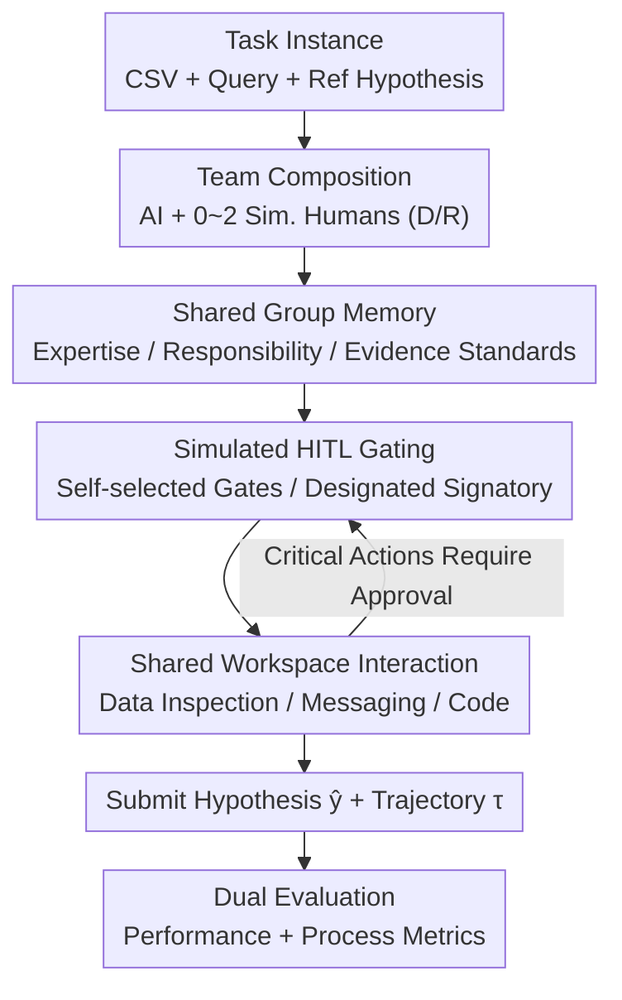

# Searching for Synergy in Shared Workspace Human-AI Collaboration

**Conference**: ICML 2026 (Workshop on Human-AI Co-Creativity)  
**arXiv**: [2606.18413](https://arxiv.org/abs/2606.18413)  
**Code**: The paper states it is released alongside the reference workflow graph (see original Appendix B)  
**Area**: Multi-agent / Human-AI Collaboration  
**Keywords**: Human-AI Collaboration, Shared Workspace, Process Loss, Group Memory, Human-in-the-loop Gating

## TL;DR
This paper identifies a counter-intuitive phenomenon in shared-workspace human-AI collaboration environments: **adding (simulated) human collaborators with relevant expertise can actually degrade performance**. The root cause is identified as "process loss" resulting from a lack of coordination structure. By borrowing two mechanisms from group psychology—Shared Group Memory and Simulated HITL Approval Gating—as scaffolds, the authors restore the average score of a three-agent team from 0.63 to 0.76.

## Background & Motivation
**Background**: Most current AI agent evaluations focus on whether "a single autonomous agent can complete a task independently." However, real-world scientific and professional work often requires human judgment and domain knowledge. This leads to the more challenging problem of "human-AI collaboration," which evaluates team cohesion and the integration of complementary expertise rather than individual capability.

**Limitations of Prior Work**: Collaboration introduces new failure modes absent in individual settings. In data analysis, a collaborator with domain expertise might immediately identify a key variable or weak evidence. For this expertise to be effective, however, the team must **expose it at the right time, route it to the correct decision, and incorporate it into the final product**. If this chain breaks, collaborators increase interaction volume without improving results—effectively becoming pure coordination overhead.

**Key Challenge**: Group psychology defines this as **process loss** (Steiner 1972): the inability of a team to convert member resources into output when coordination is ineffective. Coordination theory further notes that collaboration is essentially the management of dependencies between activities (Malone & Crowston 1994). Teams often suffer from **coordination neglect**, underestimating the effort required to integrate interdependent contributions. Human-AI teams exhibit similar pathologies: adding expertise is not always beneficial, and humans may over-rely on or misinterpret AI suggestions.

**Goal**: Using group psychology as a design lens, this work aims to answer two questions: (1) what happens when collaborators are added without coordination structures, and (2) can two specific coordination structures from group research recover performance and what processes do they alter?

**Key Insight**: The authors argue that failure often **manifests in the interaction process before it reflects in the final answer**. Thus, evaluation must examine both the "submitted hypothesis $\hat{y}$" and the "interaction trajectory $\tau$"—many useful intermediate steps may never reach the final answer.

**Core Idea**: Explicitly define expertise, responsibility, and evidence requirements. Use **Shared Group Memory** to externalize expertise and responsibility, and **Simulated HITL Approval Gating** to formalize responsibility by requiring designated approval for specific actions, thereby reducing process loss.

## Method

### Overall Architecture
The study is built on the Collaborative Gym environment, utilizing 38 archaeology data analysis tasks from DiscoveryBench. Each task instance is a triple $x=(\mathcal{D},q,y^{\star})$: where $\mathcal{D}$ is a set of CSV files, $q$ is a natural language query, and $y^{\star}$ is the benchmark reference hypothesis. A team (1 AI agent + 0–2 simulated human collaborators) interacts in a shared workspace by inspecting data, messaging, and running code, ultimately submitting a hypothesis $\hat{y}$ via a result editor. A session produces an ordered trajectory $\tau=((u_t,a_t,o_t))_{t=1}^{T}$, where $u_t$ is the participant, $a_t$ is the action, and $o_t$ is the observation. Each participant $u$ has a fixed private prompt $\pi_u$ defining their "persona" (Data Analyst D / Researcher R). Actions are given by $a_t=f_u(x,o_{t-1},M_{<t},A^u_{<t},\pi_u)$. Notably, the AI agent can see the entire team's action history, while simulated humans only see their own.

The experiments compare two collaboration structures: **Default** (original shared workspace without extra coordination) and **Scaffolded** (Shared Group Memory + Simulated HITL Gating). In the Scaffolded setting, a shared record (expertise/responsibility/plan/evidence standards) is established first and then used to determine which actions require approval and by whom.

### Key Designs

**1. Shared Group Memory: Externalizing Expertise and Evidence Requirements**

This addresses the "hidden profile" problem in process loss—group research shows teams tend to discuss **shared information** while neglecting **unshared information** (biased information sampling), wasting distributed expertise. Before starting the task, a "build" stage is added based on Transactive Memory Systems theory. The team collectively records four items: who knows what, who should be trusted with what, how work is coordinated, and which evidence standards the final answer must meet. Unlike private memories, this is a **single, transparent team state**—a map of expertise and responsibility. Once the build phase ends, this memory is frozen and read-only. Used alone, it primarily improves the initiative distribution (more balanced participation), but experiments show that increased communication is insufficient to recover performance.

**2. Simulated HITL Gating: Enforcing Responsibility through Approvals**

A map is insufficient; responsibility must be binding. The gating mechanism marks selected actions as "requiring approval from a designated participant before taking effect." Crucially, **not all actions are gated**. In the Scaffolded setting, the team **autonomously decides which actions require gates and who serves as the gatekeeper** based on their expertise map. Ungated actions proceed as normal. This mimics real-world collaboration patterns like code reviews or clinical sign-offs, where AI assistants route "high-consequence operations" to human supervisors while allowing routine work to flow. A diagnostic variant, **Preassigned Gating**, was also tested where gatekeepers are externally configured by action type to decouple the contribution of "autonomous gate selection."

**3. Synergy of Scaffolds: Memory for Justification, Gating for Enforcement**

The two mechanisms are designed to be synergistic: the group memory build phase is where the team decides "which actions to gate and who is responsible," while the gating mechanism enforces these decisions during the task. When a gated action is proposed, the designated gatekeeper must approve or reject it. The pre-agreed expertise map and evidence standards provide context for this decision. Experiments show both are necessary—Shared Group Memory alone improves initiative but may decrease R-team performance, whereas Preassigned Gating more directly aligns with Hypothesis Support. Maximum improvement in three-agent teams is only achieved when combined.

### Loss & Training
No models are trained in this study. All participants use DeepSeek V3.2 with the Collaborative Gym ReAct-style action loop and private scratchpads. The only variables are the persona prompts $\pi_u$ and the collaboration structure. Thus, performance differences reflect team composition and coordination rather than model or interface differences. Evaluation uses a set of metrics to decouple "hypothesis quality" from "trajectory quality."

## Key Experimental Results

### Main Results
Each team variant was run on 38 tasks with 3 independent seeds. Reported values are Mean ± SE. Core metrics: Performance (normalized task score), $H_{\mathrm{init,norm}}$ (normalized initiative entropy, higher is more uniform), $A_{\mathrm{profile}}$ (profile alignment), $C_{\mathrm{wf}}$ (workflow coverage), and $S_{\mathrm{hyp}}$ (hypothesis support). Initiative entropy is defined as $H_{\mathrm{init,norm}}=\dfrac{-\sum_{u\in\mathcal{U}}p_u\log p_u}{\log|\mathcal{U}|}$, where $p_u$ is the proportion of events initiated by participant $u$.

| Structure / Profile | $H_{\mathrm{init,norm}}$ | $S_{\mathrm{hyp}}$ | Performance |
|------|------|------|------|
| Single-agent | – | 0.28 | **0.71** |
| Default-D | 0.31 | 0.18 | 0.69 |
| Default-R | 0.37 | 0.18 | 0.68 |
| Default-DR (3-agent) | 0.54 | 0.19 | **0.63** (Worst) |
| Scaffolded-D | 0.74 | 0.23 | 0.72 |
| Scaffolded-R | 0.77 | 0.18 | 0.73 |
| Scaffolded-DR (3-agent) | 0.85 | 0.23 | **0.76** |

Observations: **Default teams failed to exceed the single-agent baseline**, with the 3-agent Default-DR performing worst. Scaffolded structures outperformed their Default counterparts across all compositions, with the largest gain in DR (+0.13).

### Ablation Study
The authors decomposed two diagnostic variants: adding only Shared Group Memory or only Preassigned Gating (interpreted as diagnostic decomposition rather than symmetric ablation).

| Configuration (Example: D Profile) | $H_{\mathrm{init,norm}}$ | $S_{\mathrm{hyp}}$ | Description |
|------|---------|------|------|
| Default | 0.31 | 0.18 | No coordination |
| + Shared Group Memory Only | Large ↑ | Minor improvement | Boosts initiative; R-team performance dropped (0.68 → 0.64) |
| + Preassigned Gating Only | Moderate | ↑ Across all | Directly aligns with Hypothesis Support |
| Scaffolded (Full) | 0.74 | 0.23 | Synergistic; maximum gain in 3-agent teams |

### Key Findings
- **Expertise can degrade performance**: The largest performance drop occurred in Default-DR (0.63) where both personas were present. This was not due to inactivity—human effort and message volume were higher than in single-persona Default teams. Increased interaction produced hypotheses with lower evidence support ($S_{\mathrm{hyp}}$ dropped from 0.28 to 0.18–0.19), identifying the issue as "evidence hand-off" rather than a lack of capability.
- **Scaffolding primarily modifies initiative distribution**: Moving from Default-DR to Scaffolded-DR, total work $W_{\mathrm{total}}$ remained stable (7.6 → 7.9), but human work $W_{\mathrm{human}}$ increased from 1.6 to 2.2, and $H_{\mathrm{init,norm}}$ jumped by +0.31 to +0.43. The total volume of work was unchanged; only the distribution shifted.
- **Synergy of components**: Group memory provides the basis for dividing responsibility, while gating converts that responsibility into binding requirements. In 3-agent DR teams, neither component alone reached the performance of the full Scaffolded setting.

## Highlights & Insights
- **Counter-intuitive findings as a contribution**: This work refutes the naive assumption that "adding human expertise always improves performance." Trajectory-level diagnostics prove the root cause is "unassigned responsibility and weak evidence hand-off," shifting the research focus from model capability to team coordination.
- **Dual-track evaluation is crucial**: Assessing both $\hat{y}$ and $\tau$ is essential. Many useful intermediate steps never reach the final answer; relying solely on final results misses signals of process failure. This "process over result" stance is applicable to any multi-agent collaboration evaluation.
- **Autonomous vs. Preassigned Gating**: Comparison cleanly isolates the "who decides the routing" variable. This echoes findings from AutoResearchClaw: human-mediated **routing** is more important than frequency; dense step-by-step supervision is often inferior to targeted intervention.

## Limitations & Future Work
- **Simulated collaborators**: Although simulated agents can replicate key behavior patterns of real participants (Shao et al. 2024), whether these conclusions transfer to teams of real humans remains to be verified.
- **Domain and scale constraints**: The study is limited to 38 archaeology tasks from DiscoveryBench to ensure comparability of semantics and benchmarks. Generative conclusions are somewhat limited, as significant gains for D/R single personas were within the margin of error.
- **Simplified mechanisms**: As a workshop paper, designs such as frozen group memory and LLM-judge annotation of gated events are simplified, leaving room for dynamic updating and true human-in-the-loop experiments.

## Related Work & Insights
- **vs. Collaborative Gym (Shao et al. 2024)**: This work builds upon it but treats team size as a controlled variable, injects different private prompts into simulated humans, and adds coordination scaffolds.
- **vs. Interactive Agent Benchmarks**: While most focus on turn-taking or task orchestration, this work examines non-turn-based coordination in an **open shared workspace**, which is closer to real workspace awareness in collaborative work.
- **vs. HITL Ablations in AutoResearchClaw (Liu et al. 2026)**: While that paper found targeted intervention superior to dense supervision, this work transforms the gating model into "the team deciding which actions require signatures and from whom," further validating that "routing is more important than frequency."

## Rating
- Novelty: ⭐⭐⭐⭐ Successfully grounded group psychology concepts (process loss/transactive memory) into measurable collaboration scaffolds with robust counter-intuitive findings.
- Experimental Thoroughness: ⭐⭐⭐ 1482 sessions with dual-track metrics and diagnostic variants, though limited by 38 tasks in a single domain and simulated humans.
- Writing Quality: ⭐⭐⭐⭐ Clear logical chain; the theoretical lens aligns tightly with experimental observations.
- Value: ⭐⭐⭐⭐ Successfully shifts human-AI collaboration research from "agent capability" toward "coordination structures."

<!-- RELATED:START -->

## Related Papers

- [\[ACL 2026\] PaperMentor: A Human-Centered Multi-Agent Writing Tutor for AI Research Papers on Overleaf](../../ACL2026/multi_agent/papermentor_a_human-centered_multi-agent_writing_tutor_for_ai_research_papers_on.md)
- [\[ACL 2026\] LLM-Based Human-Agent Collaboration and Interaction Systems: A Survey](../../ACL2026/multi_agent/llm-based_human-agent_collaboration_and_interaction_systems_a_survey.md)
- [\[NeurIPS 2025\] GauDP: Reinventing Multi-Agent Collaboration through Gaussian-Image Synergy in Diffusion Policies](../../NeurIPS2025/multi_agent/gaudp_reinventing_multi-agent_collaboration_through_gaussian-image_synergy_in_di.md)
- [\[CVPR 2026\] AgentDet: A Shared-Blackboard Multi-Agent Framework for Zero-/Few-Shot Object Detection](../../CVPR2026/multi_agent/agentdet_a_shared-blackboard_multi-agent_framework_for_zero-few-shot_object_dete.md)
- [\[ACL 2026\] AutoReproduce: Automatic AI Experiment Reproduction with Paper Lineage](../../ACL2026/multi_agent/autoreproduce_automatic_ai_experiment_reproduction_with_paper_lineage.md)

<!-- RELATED:END -->
