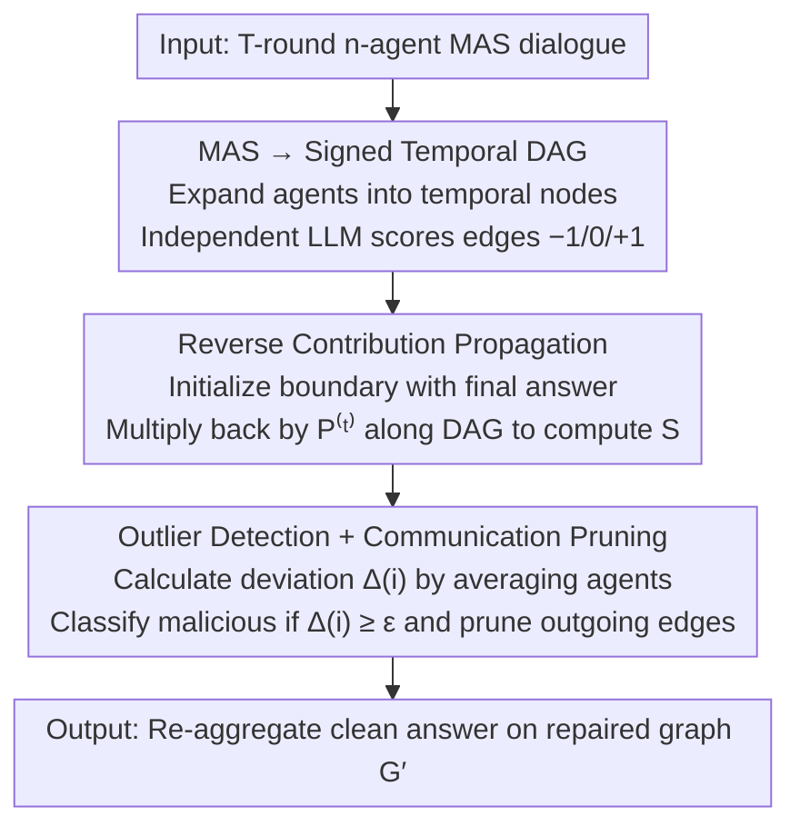

# Securing Multi-Agent Systems Against Corruptions via Node Contribution Backpropagation

**Conference**: ICML 2026  
**arXiv**: [2510.19420](https://arxiv.org/abs/2510.19420)  
**Code**: https://github.com/ChengcanWu/BPD  
**Area**: Multi-Agent System Security / LLM Agent Defense  
**Keywords**: Multi-Agent System, Corruption Attack, Signed DAG, Backpropagation, PageRank

## TL;DR
BPD reconfigures multi-round interactions in LLM Multi-Agent Systems (MAS) into a "signed temporal Directed Acyclic Graph (DAG)," scoring each message as $\{-1, 0, 1\}$ (disagree / indifferent / agree). It then utilizes a PageRank-style single-pass reverse topological propagation to compute each agent's contribution to the final answer. Outliers are identified as malicious agents and their outgoing edges are pruned—making it training-free, query-time ready, and naturally robust to dynamic topologies.

## Background & Motivation
**Background**: LLM Agents have evolved from single-entity systems to Multi-Agent Systems (MAS), applied in software engineering, market analysis, and web automation. Common topologies include Flat (equal discussion) and Hierarchical (Respondent + Reviewer).

**Limitations of Prior Work**: MAS is more fragile than individual LLMs because information flows "contagiously"—harmful content from a hijacked agent can propagate through the dialogue topology to contaminate all downstream agents (corruption attack). Existing defenses fall into three main categories, each with critical flaws:
- Output-supervision (BlockAgents, AgentForest): Rely on multi-round debates or similarity comparisons but are vulnerable to subtle text perturbations or direct attacks on the evaluator;
- Static-graph (Huang et al.): Based on fixed topology robustness but fail when the topology changes;
- Dynamic-training (G-Safeguard): Train classifiers to read agent internal states but rely only on local signals, failing to see how "corrupted information flows to the final decision."

**Key Challenge**: Existing defenses are either "global but static" or "dynamic but local." No method exists to perform "global influence traceability" for each query without retraining to quantify an agent's true contribution to the final answer.

**Goal**: (i) Establish a unified graph representation for MAS communication across arbitrary topologies, agent counts, and rounds; (ii) Design a training-free, single-pass backpropagation influence operator to make "per-agent contribution to decision" a computable quantity; (iii) Use statistical outlier detection to identify malicious agents and repair the graph, ensuring immunity to dynamic topology and attacker identity switching.

**Key Insight**: A multi-round MAS dialogue expanded by "time + agent" is naturally a DAG—edges only cross adjacent rounds with no cycles, allowing a perfect closed-form solution for reverse recursion. Borrowing the PageRank concept where "influence aggregates downstream," the signed transfer probability $\{-1, 0, +1\}$ is used to backpropagate influence from the final answer to compute the cumulative signed influence of each node.

**Core Idea**: MAS = signed temporal DAG; agent contribution = signed PageRank reverse topological propagation; malicious agent = intra-group contribution deviation outlier; defense = delete all outgoing edges of outlier agents.

## Method

### Overall Architecture
BPD addresses the issue where a hijacked agent contaminates all downstream agents via the dialogue topology. It treats the entire MAS session as a "signed computation graph" for influence traceability. The conversation is reconfigured into a signed DAG across $T$ rounds and $n$ agents. An independent LLM scores each message as $\{-1, 0, +1\}$. A single reverse topological pass from the final answer computes the cumulative contribution of each agent. Outliers are identified as malicious and pruned. The process is training-free, single-pass, and interpretable.

### Key Designs

**1. MAS → Signed Temporal DAG: Mapping arbitrary topologies into an acyclic graph**

MAS topologies vary (Flat, Hierarchical), and rounds/agent counts are not fixed. BPD expands agent $A(i)$ at round $t$ into a temporal node $A_t(i)$. The node set $V = \{A_t(i) \mid t=1..T,\, i=1..n\}$ has size $N = nT$. A message $A(i) \to A(j)$ at round $t$ is a directed edge $e_t(i,j): A_t(i) \to A_{t+1}(j)$. Since edges only move from $t$ to $t{+}1$, the graph is inherently acyclic, enabling a single-pass closed-form solution. An independent LLM assigns "stances" $g_{ij} = f(s_i, s_j) \in \{-1, 0, +1\}$ to edges, where positive indicates agreement/adoption and negative indicates rejection/rebuttal. This signature mechanism ensures that both successful and failed attacks leave computable traces.

**2. Reverse Contribution Propagation Operator: Trace influence from the final answer**

To quantify an agent's contribution, BPD adapts the PageRank logic in reverse. Given the signed adjacency matrix $\mathbf{G} \in \mathbb{R}^{N \times N}$ and degree matrix $\mathbf{D} = \text{diag}(k_1, \ldots, k_N)$, the row-normalized propagation operator is $\mathbf{B} = \mathbf{D}^{-1}\mathbf{G}$. The terminal layer is initialized by consistency with the final answer $y_{\text{final}}$: $S(A_T(i)) = +1$ if consistent, else $-1$. The reverse recursion is:

$$S(C_i) = \frac{1}{k_i} \sum_{C_j \in \mathcal{N}^+(C_i)} g_{ij}\, S(C_j) = \sum_j B_{ij}\, S(C_j),$$

In vector form: $\mathbf{S}^{(t)} = \mathbf{P}^{(t)} \mathbf{S}^{(t+1)}$, where $\mathbf{P}^{(t)}_{ij} = g_{t,i \to j} / k_{t,i}$. Because it is a DAG, a single pass gives a unique closed-form solution $\mathbf{S}^{(t)} = \mathbf{P}^{(t)} \mathbf{P}^{(t+1)} \cdots \mathbf{P}^{(T-1)} \mathbf{S}^{(T)}$ without power iteration. This generalizes PageRank to a signed, layer-wise DAG context.

**3. Outlier Detection + Communication Pruning: Identifying and silencing anomalous agents**

Temporal node scores are averaged per agent: $\hat{S}(A(i)) = \frac{1}{|\mathcal{T}(i)|} \sum_{t \in \mathcal{T}(i)} S(A_t(i))$. The mean absolute deviation is $\Delta(i) = \frac{1}{n-1} \sum_{j \ne i} |\hat{S}(A(i)) - \hat{S}(A(j))|$. Agents with $\Delta(i) \ge \epsilon$ (empirically $\epsilon = 1.5$) are classified as malicious. Pairwise deviation is more robust than z-scores for small agent populations ($n \le 5$). Pruning removes all outgoing edges of malicious agents $E_\mathcal{M} = \{e_{t,i\to j} \mid A(i) \in \mathcal{M}\}$ to create repaired graph $G'$, silencing them from the decision path without collapsing the topology.

### Mechanism Example
Consider a 5-agent Flat session where agent #3 is hijacked. After DAG expansion, the scorer marks edges. If #3 successfully convinces #1 and #4, those edges get $g = +1$; if #2 and #5 reject it, those edges get $g = -1$. Backpropagation starts at the terminal layer and propagates these signs backward. In the outlier detection phase, if #3 was either highly persuasive (amplified positive) or highly rejected (amplified negative), its $\hat{S}$ will deviate significantly from the group, triggering $\Delta(3) \ge 1.5$. Its influence is then pruned.

### Loss & Training
BPD is **training-free**. The scorer $f$ can be any third-party LLM, and backpropagation is simple matrix multiplication. The only hyperparameter is $\epsilon = 1.5$. Complexity is $O(|E|)$ for backpropagation and LLM scoring, with overall overhead under 10%.

## Key Experimental Results

### Main Results
Using GPT-4o as the base LLM, 5 agents in Flat/Hierarchy topologies, evaluated on MMLU sub-domains.

| Structure | Method | Algebra | Math | Chemistry | Computer | Security | Avg |
|------|------|---------|------|-----------|----------|----------|-----|
| Flat | No Attack | 95.0 | 94.7 | 75.3 | 92.0 | 85.0 | 88.4 |
| Flat | Attack (No Defense) | 78.7 | 74.7 | 64.7 | 82.3 | 81.0 | 76.3 |
| Flat | G-Safeguard | 88.3 | 88.7 | 71.0 | 87.7 | 83.0 | 83.7 |
| Flat | AGENTXPOSED | 90.0 | 79.0 | 67.0 | 89.0 | 87.3 | 82.5 |
| Flat | Challenger | 88.7 | 87.3 | 68.3 | 84.0 | 75.3 | 80.7 |
| Flat | Inspector | 84.0 | 89.0 | 65.7 | 80.7 | 75.7 | 79.0 |
| Flat | **BPD (Ours)** | 92.3 | 93.0 | 73.3 | 87.3 | 81.0 | **85.4** |
| Hier | Attack (No Defense) | 81.7 | 81.7 | 66.7 | 84.7 | 78.0 | 78.6 |
| Hier | G-Safeguard | 92.0 | 91.7 | 71.3 | 90.3 | 82.3 | 85.5 |
| Hier | **BPD (Ours)** | 93.3 | 95.7 | 73.7 | 91.0 | 83.7 | **87.5** |

BPD gains 9–10% over no-defense, outperforming G-Safeguard by 1.7% in Flat and 2% in Hierarchical topologies.

### Ablation Study

| Configuration | Monitor ACC | Task ACC | Key Insight |
|------|----------|----------|----------|
| BPD Full | 90%+ | 85–88% | Signed DAG + Backprop + Pruning |
| No Signature (Only $\{0, 1\}$) | ↓↓ | ↓↓ | Cannot detect rejected malicious agents |
| No Backprop (Local $g_{ij}$) | ↓↓ | ↓ | Fails on deep contagion |
| $\epsilon = 1.0$ | High Rec / Low Prec | ↓ | False positives (pruning clean agents) |
| $\epsilon = 1.5$ (Default) | Balanced | Optimal | Selected setting |
| $\epsilon = 2.0$ | Low Recall | ↓ | Misses latent attacks |

### Key Findings
- Global backpropagation is stronger than local signals, especially in topologies with deep contagion (Flat/Hier).
- BPD excels in dynamic MAS scenarios where baselines drop ~3% while BPD remains stable due to its per-query computation.
- Superiority in semantic perturbation attacks (~+10% gain) where output-supervision often fails but contribution anomalies remain visible.
- Latency overhead is <10%, primarily from LLM scoring calls.

## Highlights & Insights
- The "MAS dialogue = temporal DAG" abstraction is clean and applicable to any topology, providing a closed-form solution without iterative convergence issues.
- The signed $\{-1, 0, +1\}$ logic is crucial—it enables the detection of "rejected influence," preventing attackers from evading detection by failing on purpose.
- Pairwise deviation $\Delta(i)$ is robust for small groups ($n \le 5$) where normal distribution assumptions (z-score) fail.
- The structural similarity between reverse PageRank and neural network backpropagation (propagating signals back through a graph) is an elegant cross-domain analogy.

## Limitations & Future Work
- Scorer $f$ reliability: If the external LLM is compromised (e.g., prompt injection), BPD fails.
- DAG constraint: Does not directly support asynchronous or cyclic tool-calling without first performing temporal expansion.
- Static threshold: $\epsilon = 1.5$ is empirical and may require adjustment for different tasks or scales.
- Byzantine scenarios: If malicious agents exceed 50%, the outlier assumption collapses.
- Coordinated attacks: If multiple attackers coordinate a consistent but false solution, backpropagation may categorize them as a "correct" majority.

## Related Work & Insights
- **vs G-Safeguard**: Both are dynamic, but G-Safeguard relies on GNN classifiers and local signals; BPD is training-free and global.
- **vs BlockAgents / AgentForest**: These rely on output similarity and fail under semantic perturbations; BPD relies on contribution deviation.
- **vs Huang et al. 2025**: Their static topology search fails when the environment changes; BPD adapts query-by-query.
- **vs Challenger / Inspector**: These rely on specific reviewer agents which become single points of failure; BPD has no centralized vulnerability.

## Rating
- Novelty: ⭐⭐⭐⭐ Mapping PageRank into a signed layer-wise DAG for MAS security is a mathematically elegant application.
- Experimental Thoroughness: ⭐⭐⭐⭐ Covers various topologies, LLMs, task domains, and baselines including dynamic scenarios.
- Writing Quality: ⭐⭐⭐⭐ Clear derivation from MAS to DAG to backprop; well-argued connections to classical graph algorithms.
- Value: ⭐⭐⭐⭐ Provides a training-free, global-view, dynamically adaptive defense for immediate deployment in agent systems.

<!-- RELATED:START -->

## Related Papers

- [\[ICML 2026\] MASPO: Joint Prompt Optimization for LLM-based Multi-Agent Systems](maspo_joint_prompt_optimization_for_llm-based_multi-agent_systems.md)
- [\[ICLR 2026\] Stochastic Self-Organization in Multi-Agent Systems](../../ICLR2026/multi_agent/stochastic_self-organization_in_multi-agent_systems.md)
- [\[ACL 2026\] Conjunctive Prompt Attacks in Multi-Agent LLM Systems](../../ACL2026/multi_agent/conjunctive_prompt_attacks_in_multi-agent_llm_systems.md)
- [\[ACL 2026\] Towards Self-Improving Error Diagnosis in Multi-Agent Systems](../../ACL2026/multi_agent/towards_self-improving_error_diagnosis_in_multi-agent_systems.md)
- [\[AAAI 2026\] BAMAS: Structuring Budget-Aware Multi-Agent Systems](../../AAAI2026/multi_agent/bamas_structuring_budget-aware_multi-agent_systems.md)

<!-- RELATED:END -->
