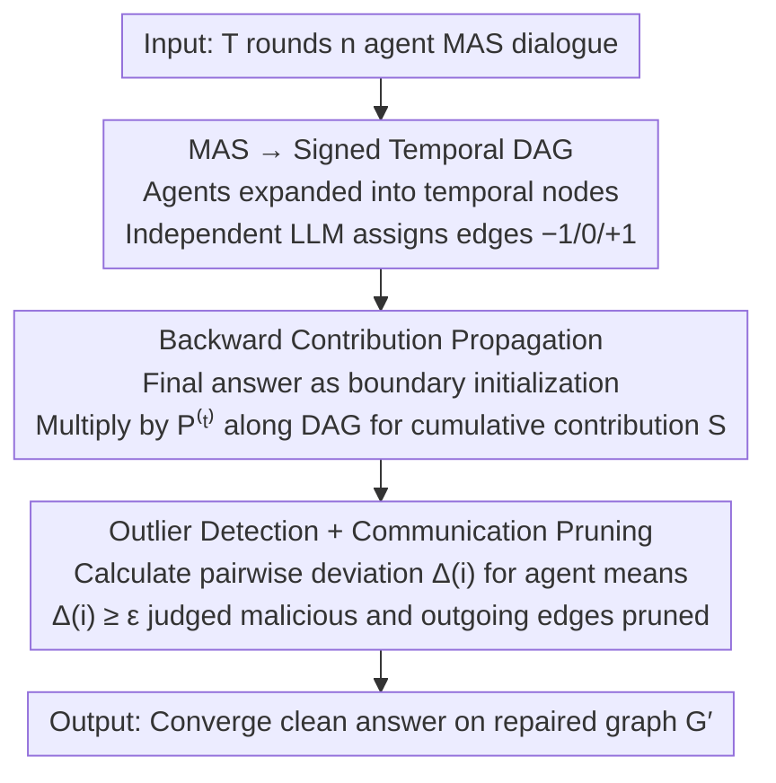

# Securing Multi-Agent Systems Against Corruptions via Node Contribution Backpropagation

**Conference**: ICML 2026  
**arXiv**: [2510.19420](https://arxiv.org/abs/2510.19420)  
**Code**: https://github.com/ChengcanWu/BPD  
**Area**: Multi-Agent System Security / LLM Agent Defense  
**Keywords**: Multi-Agent System, Corruption Attack, Signed DAG, Backpropagation, PageRank

## TL;DR
BPD reconstructs the multi-round interactions of an LLM Multi-Agent System (MAS) into a "signed Directed Acyclic Graph (DAG)," scoring each message as $\{-1, 0, 1\}$ for agreement, indifference, or disagreement. It then utilizes a PageRank-style single-pass reverse topological propagation to calculate the contribution score of each agent to the final answer. Outliers are identified as malicious agents and their outgoing edges are pruned—offering a training-free, single-query utility that is naturally robust to dynamic topologies.

## Background & Motivation
**Background**: LLM Agents have evolved from individual entities to Multi-Agent Systems (MAS), applied in software engineering, market analysis, and web automation. Common topologies include Flat (equal discussion) and Hierarchical (Respondent + Reviewer).

**Limitations of Prior Work**: MAS is more fragile than single LLMs because information flows "infectiously"—harmful content from a hijacked agent can propagate through the dialogue topology and contaminate all downstream agents (corruption attack). Existing defenses fall into three categories, each with weaknesses:
- Output Supervision (BlockAgents, AgentForest): Rely on multi-round debate or similarity comparisons, but are powerless against subtle text perturbations or direct attacks on the evaluator.
- Static Graphs (Huang et al. comparison of topological robustness): Treat MAS as fixed GNNs, failing when the topology changes.
- Dynamic Training (G-Safeguard): Train classifiers to read internal agent states but only observe local signals, failing to see "how corruption information flows to the final decision."

**Key Challenge**: Existing defenses are either "global but static" or "dynamic but local." No method exists that performs "global impact tracing" for each query to quantify an agent's true contribution to the final answer without retraining.

**Goal**: (i) Establish a unified graph representation for MAS communication describing any topology, agent count, or round number; (ii) Design a training-free, single-pass backpropagation operator to make "each agent's contribution to the final decision" a computable quantity; (iii) Use statistical outlier detection to identify malicious agents and repair the graph, making the process immune to dynamic topologies or attacker identity switching.

**Key Insight**: Noticing that MAS multi-round dialogues, when expanded by "time + agent," naturally form a DAG—edges only cross adjacent rounds with no cycles. This provides a perfect closed-form solution for backward recursion. Drawing inspiration from PageRank's "influence aggregates downstream," the $\{-1/0/+1\}$ agreement signs are treated as "signed transition probabilities." A single backward pass from the final answer recovers the cumulative signed influence of each node.

**Core Idea**: MAS = signed temporal DAG; Agent contribution = signed PageRank single-pass topological propagation; Malicious agent = grouping deviation outlier; Defense = prune all outgoing edges of outlier agents.

## Method

### Overall Architecture
BPD addresses the issue where a hijacked agent contaminates downstream agents through the dialogue topology. It treats the entire MAS dialogue as a "signed computation graph" for impact tracing. It first reconstructs $T$ rounds of $n$ agents into a signed DAG, uses an independent LLM to score each message as $\{-1, 0, +1\}$ (disagree/indifferent/agree), and then performs a single backward topological pass from the final answer to calculate each agent's cumulative contribution. Outliers are judged malicious and their outgoing edges are cut. This process occurs during the inference phase of each query and is training-free, single-pass, and interpretable.

### Key Designs

**1. MAS → Signed Temporal DAG: Flattening Multi-round Dialogues of Arbitrary Topology**

MAS topologies vary (Flat, Hierarchy) and round/agent counts are unfixed, making standard propagation formulas difficult to apply. BPD expands agent $A(i)$ at round $t$ into a temporal node $A_t(i)$. The node set $V = \{A_t(i) \mid t=1..T,\, i=1..n\}$ has size $N = nT$. A message $A(i) \to A(j)$ at round $t$ is an edge $e_t(i,j): A_t(i) \to A_{t+1}(j)$. Crucially, all edges only cross adjacent time steps, always pointing from $t$ to $t{+}1$, ensuring the graph is acyclic. This allows a closed-form solution in one pass without power iteration. Edges are assigned "stances": an independent LLM evaluates every edge. Given $C_j$ receives message $s_i$ from $C_i$ and outputs $s_j$, the scorer computes $g_{ij} = f(s_i, s_j) \in \{-1, 0, +1\}$, where positive indicates agreement/adoption and negative indicates disagreement/rebuttal. The signing mechanism allows both "successful attacks" (positive scores amplified) and "identified attacks" (negative scores amplified) to leave computable traces.

**2. Backward Contribution Propagation Operator: Tracing Node Influence from the Final Answer**

With the graph and stances defined, the "contribution of an agent to the final answer" must be quantified. BPD adopts the PageRank concept—influence aggregates downstream—but reverses it. Defining a signed adjacency matrix $\mathbf{G} \in \mathbb{R}^{N \times N}$ and out-degree matrix $\mathbf{D} = \text{diag}(k_1, \ldots, k_N)$, the row-normalized signed propagation operator is $\mathbf{B} = \mathbf{D}^{-1}\mathbf{G}$. The terminal layer uses the final answer for boundary initialization: $S(A_T(i)) = +1$ if $A(i)$'s answer matches the MAS final answer $y_{\text{final}}$, otherwise $-1$. The backward recursion is:

$$S(C_i) = \frac{1}{k_i} \sum_{C_j \in \mathcal{N}^+(C_i)} g_{ij}\, S(C_j) = \sum_j B_{ij}\, S(C_j),$$

In vector form: $\mathbf{S}^{(t)} = \mathbf{P}^{(t)} \mathbf{S}^{(t+1)}$, where $\mathbf{P}^{(t)}_{ij} = g_{t,i \to j} / k_{t,i}$. Since $G$ is a DAG, a single backward multiplication yields a unique closed-form solution $\mathbf{S}^{(t)} = \mathbf{P}^{(t)} \mathbf{P}^{(t+1)} \cdots \mathbf{P}^{(T-1)} \mathbf{S}^{(T)}$. This is effectively a signed, layer-wise, DAG generalization of classic PageRank $\mathbf{r}^{(\ell+1)} = (1-d)\mathbf{1}/N + d\,\mathbf{W}^\top \mathbf{r}^{(\ell)}$, with $\mathbf{P}^{(t)}$ replacing $\mathbf{W}^\top$, the introduction of signs, and boundary initialization replacing teleportation. The complexity is linear with respect to the number of edges, keeping overhead below 10%.

**3. Outlier Detection + Communication Pruning: Identifying and Muting Deviant Agents**

Temporal node scores are aggregated to the agent level: $\hat{S}(A(i)) = \frac{1}{|\mathcal{T}(i)|} \sum_{t \in \mathcal{T}(i)} S(A_t(i))$. The mean absolute difference relative to all other agents is computed: $\Delta(i) = \frac{1}{n-1} \sum_{j \ne i} |\hat{S}(A(i)) - \hat{S}(A(j))|$. Agents with $\Delta(i) \ge \epsilon$ are categorized as malicious $\mathcal{M}$ (empirical $\epsilon = 1.5$). Pairwise deviation is used instead of z-scores because MAS groups are small ($n \le 5$), making normal distribution assumptions invalid. Pruning involves deleting all outgoing edges of malicious agents $E_\mathcal{M} = \{e_{t,i\to j} \mid A(i) \in \mathcal{M}\}$, resulting in a repaired graph $G' = (V, E \setminus E_\mathcal{M})$. This "mutes" them from the decision path without collapsing the topology.

### Function
Consider a Flat discussion with 5 agents, where agent #3 is hijacked. First, the conversation is expanded into a signed DAG; the independent scorer marks edges. If #3 successfully convinces #1 and #4, those edges get $g = +1$; if #2 and #5 identify and rebut it, those edges get $g = -1$. Second, backpropagation starts from the terminal layer $S(A_T(i)) = \pm1$ and is multiplied backward layer-by-layer. Third, agent-level $\hat{S}$ and $\Delta(i)$ are calculated. Normal agents have similar scores, while #3—whether adopted (positive amplified) or rebutted (negative amplified)—deviates significantly, triggering $\Delta(3) \ge 1.5$. Finally, #3's outgoing edges are deleted, and the MAS converges on a clean answer using $G'$.

### Loss & Training
BPD is **training-free**. The scorer $f$ can be any third-party LLM (prompts in Appendix A.3). Backpropagation is simply matrix multiplication. The only hyperparameter is the outlier threshold $\epsilon$, set to $1.5$ (values too low like $1.0$ misidentify normal agents; values too high like $2.0$ miss stealthy attacks). Complexity for one backward pass is $O(|E|)$ plus LLM calls for scoring, with a total time overhead of less than 10%.

## Key Experimental Results

### Main Results
GPT-4o serves as the base LLM, with 5 agents in Flat/Hierarchy topologies. Evaluation is on MMLU sub-domains, with default attacks based on Amayuelas et al. (2024). Results are means $\pm$ 1 std of 3 runs.

| Structure | Method | Algebra | Math | Chemistry | Computer | Security | Avg |
|------|------|---------|------|-----------|----------|----------|-----|
| Flat | No Attack | 95.0 | 94.7 | 75.3 | 92.0 | 85.0 | 88.4 |
| Flat | Attack (No Defense) | 78.7 | 74.7 | 64.7 | 82.3 | 81.0 | 76.3 |
| Flat | G-Safeguard | 88.3 | 88.7 | 71.0 | 87.7 | 83.0 | 83.7 |
| Flat | AGENTXPOSED | 90.0 | 79.0 | 67.0 | 89.0 | 87.3 | 82.5 |
| Flat | Challenger | 88.7 | 87.3 | 68.3 | 84.0 | 75.3 | 80.7 |
| Flat | Inspector | 84.0 | 89.0 | 65.7 | 80.7 | 75.7 | 79.0 |
| Flat | **BPD (Ours)** | 92.3 | 93.0 | 73.3 | 87.3 | 81.0 | **85.4** |
| Hier | Attack (No Defense) | 81.7 | 81.7 | 66.7 | 84.7 | 78.0 | 78.6 |
| Hier | G-Safeguard | 92.0 | 91.7 | 71.3 | 90.3 | 82.3 | 85.5 |
| Hier | **BPD (Ours)** | 93.3 | 95.7 | 73.7 | 91.0 | 83.7 | **87.5** |

BPD gains 9–10 percentage points over no defense, outperforming G-Safeguard by 1.7% in Flat and 2% in Hierarchical topologies. Monitor Accuracy (Monitor ACC) reaches 90.7% in Flat scenarios.

### Ablation Study
Trends as reported in the paper:

| Configuration | Monitor ACC | Task ACC | Key Finding |
|------|----------|----------|----------|
| Full BPD | 90%+ | 85–88% | Full signed DAG + Backprop + Outlier pruning |
| No Signing (Only $\{0, 1\}$) | ↓↓ | ↓↓ | Rebuttal signals lost; failed attacks not detected |
| No Backprop (Local $g_{ij}$ only) | ↓↓ | ↓ | Degenerates to local G-Safeguard signals; fails on deep infection |
| $\epsilon = 1.0$ | High recall, Low prec. | ↓ | Misidentifies normal agents |
| $\epsilon = 1.5$ (Default) | Optimal Balance | Optimal | Used in the paper |
| $\epsilon = 2.0$ | Low recall | ↓ | Misses stealthy attacks |
| Dynamic Topology | Stable | -0% | Baselines drop by 3% on average |
| Semantic Perturbation | Advantage grows | + ~10% | Output supervision methods largely fail |

### Key Findings
- The global perspective of backpropagation is stronger than any local signal: in high-infection Flat topologies, BPD outperforms G-Safeguard by ~1.7%. Gains are more pronounced as the infection chain lengthens.
- Dynamic MAS scenarios (graph structure and attacker identity change per query) are BPD's primary strength. While competitors drop ~3%, BPD remains stable.
- BPD shows the greatest advantage (~+10%) against semantic perturbation attacks, which bypass output supervision but leave traces in contribution deviation.
- Time overhead is <10%, primarily from LLM calls; the backpropagation calculation itself is negligible.

## Highlights & Insights
- Reconstructing MAS dialogues as "Temporal DAGs" is a clean abstraction applicable to any topology. The DAG structure ensures closed-form solutions for backpropagation, avoiding power iteration.
- Signed signals $\{-1, 0, +1\}$ are crucial—inclusion of negative signs allows "rebuttal" to be an observable signal, extending detection to failed attacks.
- Using pairwise mean deviation $\Delta(i)$ instead of z-scores is robust for small populations ($n \le 5$) without relying on normality.
- Mapping "error signal backpropagation" from neural networks to the MAS security domain is an elegant cross-disciplinary analogy.

## Limitations & Future Work
- Scorer $f$ reliability: If the external LLM scorer is manipulated (e.g., prompt injection), BPD fails.
- DAG Assumption: Requires "round-based" progression. Asynchronous MAS or complex tool-calling memory loops may require temporal linearization.
- Empirical threshold $\epsilon = 1.5$: May need adjustment across different tasks or topologies; lacks an adaptive mechanism.
- Byzantine Scenarios: If malicious agents exceed 50%, the outlier assumption collapses, and BPD may misidentify normal agents as malicious.
- Coordinated Attacks: If attackers coordinate on a "consistent but wrong" answer, backpropagation may struggle to distinguish them from the majority without external ground truth.

## Related Work & Insights
- **vs G-Safeguard**: Both are dynamic, but G-Safeguard trains GNNs on local states/communication. BPD is training-free and uses a global perspective.
- **vs BlockAgents / AgentForest (Output Supervision)**: These rely on debate/similarity and fail against text perturbations. BPD relies on contribution deviation and performs significantly better (~+10%) against semantic attacks.
- **vs Huang et al. 2025 (Static Topology)**: They search for robust topologies that fail when the environment changes. BPD adapts per query.
- **vs Challenger / Inspector (Collaborative Defense)**: These rely on specific reviewer agents; if the reviewer is compromised, the defense fails. BPD has no single point of failure.

## Rating
- Novelty: ⭐⭐⭐⭐ Mapping PageRank to MAS security in a signed, layer-wise DAG format is elegant.
- Experimental Thoroughness: ⭐⭐⭐⭐ Covers various topologies, LLMs, task domains, and attacks, including dynamic scenarios.
- Writing Quality: ⭐⭐⭐⭐ Clear derivation from MAS to DAG to backpropagation to outlier detection.
- Value: ⭐⭐⭐⭐ Provides a training-free, global, and adaptive defense solution for deployed agent systems.

<!-- RELATED:START -->

## Related Papers

- [\[ICLR 2026\] Breaking and Fixing Defenses Against Control Flow Hijacking in Multi-Agent Systems](../../ICLR2026/multi_agent/breaking_and_fixing_defenses_against_control_flow_hijacking_in_multi-agent_syste.md)
- [\[ICML 2026\] MASPO: Joint Prompt Optimization for LLM-based Multi-Agent Systems](maspo_joint_prompt_optimization_for_llm-based_multi-agent_systems.md)
- [\[ICML 2026\] When Cloud Agents Meet Device Agents: Lessons from Hybrid Multi-Agent Systems](when_cloud_agents_meet_device_agents_lessons_from_hybrid_multi-agent_systems.md)
- [\[ICLR 2026\] Stochastic Self-Organization in Multi-Agent Systems](../../ICLR2026/multi_agent/stochastic_self-organization_in_multi-agent_systems.md)
- [\[ICML 2026\] Multi-Agent Systems are Mixtures of Experts: Who Becomes an Influencer?](multi-agent_systems_are_mixtures_of_experts_who_becomes_an_influencer.md)

<!-- RELATED:END -->
