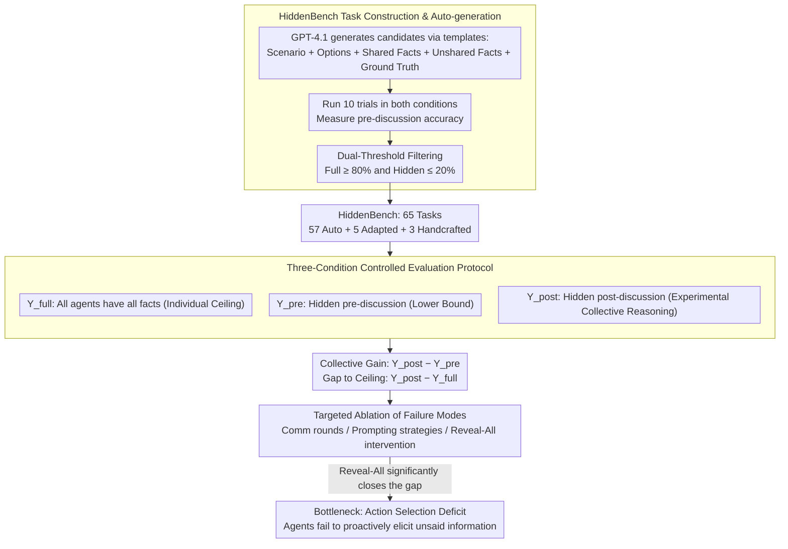

# Systematic Failures in Collective Reasoning under Distributed Information in Multi-Agent LLMs

**Conference**: ICML 2026  
**arXiv**: [2505.11556](https://arxiv.org/abs/2505.11556)  
**Code**: HuggingFace + GitHub (Available)  
**Area**: LLM Agent / Multi-Agent / Collective Reasoning Evaluation  
**Keywords**: HiddenBench, Hidden Profile, Distributed Information, Information Asymmetry, Collective Reasoning Failure

## TL;DR
This paper adapts the Hidden Profile paradigm from social psychology into a multi-agent LLM evaluation, constructing the HiddenBench with 65 tasks. Systematically evaluating 15 frontier LLMs reveals a stark performance gap: while a single agent achieves 80.7% accuracy under Full Profile, a group of agents achieves only 30.1% under distributed information. The fundamental failure mode is the **inability to proactively elicit information that remains unsaid by others**, which can be significantly mitigated across model families by a lightweight structured communication protocol.

## Background & Motivation

**Background**: Multi-agent LLM systems are increasingly deployed in scenarios such as software development, scientific discovery, and social simulation. The **core promise is that "as a group, agents can consolidate more information than any single agent."** This assumption posits the multi-agent paradigm as naturally superior to single-model approaches.

**Limitations of Prior Work**: In practice, many reproduction efforts show that multi-agent systems often underperform single agents. However, **no clean evaluation exists to separate "collective reasoning failure" from "individual reasoning deficiency"**—when a group fails, is it due to the model's inherent limitations or a flawed information integration mechanism? Existing benchmarks conflate the two, preventing proper attribution.

**Key Challenge**: To evaluate "collective reasoning" itself, one must ensure: (i) the task is **unsolvable** by any individual alone (necessitating a group); (ii) the task is **solvable** if all information is provided to a single agent (to exclude "task difficulty" as a confounder). Ground truth for verification is also required.

**Goal**: To engineer the social psychology Hidden Profile paradigm into a scalable multi-agent benchmark and systematically characterize the failure modes of frontier LLMs under distributed information, while testing if they can be rescued by simple protocols.

**Key Insight**: The Hidden Profile is a classic paradigm used in social psychology for decades to study human group decision-making failures. In this setup, each member holds different key information; the correct answer can only be found by pooling these unshared facts, otherwise, shared information leads to an incorrect decision. Formalizing this for LLM evaluation naturally satisfies the requirements of "individual impossibility, collective possibility, and verifiable ground truth."

**Core Idea**: The authors construct HiddenBench (65 tasks: 5 adapted from human studies, 3 handcrafted, and 57 automatically generated). They evaluate 15 frontier LLMs under both Hidden and Full Profile conditions and use ablation to isolate the true bottleneck of failure—agents **can** integrate information that has been stated, but they **cannot** proactively elicit information that has not been stated.

## Method

### Overall Architecture
Task Structure: Each task consists of several decision options and task-relevant facts. Under the **Hidden Profile condition**, some facts ($\mathcal{I}_s$) are shared by all agents, while unshared facts ($\mathcal{I}_u$) are uniquely distributed to each agent, i.e., agent $a_i$ receives $I_i=\mathcal{I}_s\cup\{u_i\}$. The shared information is designed to **support an incorrect option**, and only pooling all unshared facts points to the correct option. Under the **Full Profile condition**, all agents receive $\mathcal{I}_s\cup\mathcal{I}_u$. Agents are not informed of the information asymmetry. The evaluation compares $Y^{\text{pre}}$ (pre-discussion), $Y^{\text{post}}$ (post-discussion), and $Y^{\text{full}}$ (Full Profile upper bound). The method follows a diagnostic pipeline: building a clean benchmark, measuring failure through three-condition control, and locating failure in specific mechanisms via ablation.

### Key Designs

**1. HiddenBench Task Construction and Automated Generation Pipeline: Turning social psychology soft constraints into machine-verifiable hard thresholds**

To measure "collective reasoning" specifically, each task must satisfy "individual impossibility, collective possibility." Manual design is unscalable and prone to bias, while pure GPT generation cannot guarantee formal correctness. The authors use a "generate-execute-filter" pipeline: GPT-4.1 generates candidate tasks based on templates; each candidate is tested 10 times under both Full and Hidden conditions; finally, only tasks with Full Profile accuracy $\ge 80\%$ and Hidden Profile accuracy $\le 20\%$ are retained. These thresholds operationalize the paradigm's constraints: high Full accuracy ensures the task is solvable with complete information, while low Hidden accuracy ensures shared facts are misleading without pooling. From 200 candidates, 57 passed (28.5% pass rate), supplemented by 5 human-study adaptations and 3 handcrafted tasks, totaling 65 cross-domain tasks (medical, organizational planning, etc.).

**2. Three-Condition Controlled Evaluation Protocol: Adding causal counterfactual control to accuracy**

Traditional benchmarks report a single accuracy figure, making it impossible to distinguish between "stupid models" and "poor coordination" when a group fails. This study uses three informational conditions for the same task: $Y^{\text{full}}$ (all agents get all facts, individual ceiling), $Y^{\text{pre}}$ (pre-discussion Hidden Profile, lower bound), and $Y^{\text{post}}$ (post-discussion Hidden Profile, measured collective reasoning). Comparing these yields two clean metrics—Collective Gain ($Y^{\text{post}}-Y^{\text{pre}}$) and Gap to Ceiling ($Y^{\text{post}}-Y^{\text{full}}$)—disentangling model capability from coordination failure. The evaluation covers 15 frontier LLMs (OpenAI, Google, Alibaba, Meta), running 10 sessions per model per task, varying communication depth $T\in\{5,10,15,20\}$ and group size.

**3. Targeted Ablation of Failure Modes: Upgrading "multi-agent failure" to mechanistic diagnosis**

Merely stating that "multi-agent systems fail" is insufficient; the link in the process that breaks must be identified. The authors decompose collective failure into three candidates: aggregation failure (cannot integrate stated info), inference failure (cannot deduce correct answer even with info), and action selection failure (failure to ask for unsaid info). They use ablation to exclude these: varying communication rounds, changing prompting strategies (cooperative, conflictual, CoT, informing asymmetry, share-all), and finally, a "reveal-all" intervention (forcing disclosure of all info in round 1). The key finding is that the reveal-all intervention significantly closes the gap—once information is disclosed, agents reason correctly. This indicates that aggregation and inference are functional; the bottleneck is strictly that **agents do not realize they should elicit unsaid information from others**.

### Loss & Training
This is an evaluation paper with no training involved. All experiments are zero-shot via API calls.

## Key Experimental Results

### Main Results
HiddenBench performance across 15 frontier LLMs (65 tasks, 10 sessions, average rule, post-discussion accuracy under Hidden Profile):

| Model | $Y^{\text{full}}$ (Full) | $Y^{\text{pre}}$ (Pre-Hidden) | $Y^{\text{post}}$ (Post-Hidden) | Gain | Gap to Full |
|------|--------------------------|----------------------------------|-----------------------------------|------|---------------|
| Gemini-2.5-Pro | 0.981 | 0.217 | **0.671** | +0.454 | -0.310 |
| Gemini-2.5-Flash | High | Mid | 0.550 | Moderate | Moderate |
| Gemini-2.5-Flash-Lite | High | Mid | 0.394 | Moderate | Large |
| GPT-5 (minimal reasoning) | High | Mid | Mid | Small | **-0.750** |
| GPT-5-Nano | High | Mid | Low | **-0.004** (Minimal) | Very Large |
| **All models mean (15 models)** | **0.807** | 0.082~0.217 | **0.301** | Moderate | ~ -0.5 |

Key Facts: (i) Single agents under Full Profile average 80.7%, while groups under Hidden Profile achieve only 30.1% (a 50-point gap). (ii) Model scale or individual reasoning strength **does not** reliably predict collective performance (e.g., GPT-5 is individually strong but collectively weak). (iii) The Gemini family significantly outperforms other families in collective settings.

### Ablation Study

| Intervention Dimension | Key Observation | Interpretation |
|---------|---------|------|
| Comm Depth $T=5/10/15/20$ | Peak at $T=15$ ($Y^{\text{post}}=0.233$), drops at $T=20$ (0.133) | Excessive discussion reinforces false consensus rather than exploration |
| Cooperative / Constructive prompt | $Y^{\text{post}}=0.20\sim 0.24$ | No significant improvement |
| Conflictual prompt | $Y^{\text{post}}=0.0\sim 0.26$, no majority consensus | Conflictual prompts prevent convergence |
| Zero-shot CoT | 0.222 | Limited improvement |
| Informing asymmetry ("Info may be missing") | 0.367 | Simple awareness helps but is insufficient |
| Share All Information (Prompted) | 0.467 | Only closes half the gap; models still fail to disclose fully |
| **Reveal-All (Mechanistic Force)** | Significant gap reduction | **Proves bottleneck is action selection, not inference** |
| Scaling Group Size | $Y^{\text{post}}$ declines | More agents increase coordination difficulty |

### Key Findings
- **Failure Mode Localization**: Agents can aggregate disclosed information but **fail to proactively elicit unshared information**. This is the core conclusion attributing the 50-point gap to a specific capability deficit.
- Model scale / Individual reasoning $\neq$ Collective reasoning. Reasoning-heavy models do not show a significant advantage in collective settings, challenging the "scale up will solve it" assumption.
- Excessive communication rounds **reinforce premature consensus**, mirroring human "groupthink."
- A **lightweight structured communication protocol** (explicitly listing unique evidence before debating) significantly improves $Y^{\text{post}}$ across families, proving the bottleneck is actionable without changing base models.

## Highlights & Insights
- Transforming the soft concept of "collective reasoning" into hard formal constraints (individual impossibility, collective possibility) via dual-threshold filtering is a brilliant engineering move applicable to any multi-agent benchmark.
- The three-condition control protocol (Hidden-pre / Hidden-post / Full) essentially adds **causal counterfactual control** to evaluation. Running the same task under different information states allows for direct "failure attribution," a paradigm applicable to other collective reasoning or cooperation tests.
- The contrast between "Reveal-All intervention" and "Share-All prompting" is educational: prompting makes models "aware they should speak" but they still don't disclose everything; mechanistic intervention forces full disclosure and works—indicating that elicitation is not a knowledge problem but a **goal/incentive problem**.
- It reveals a counter-intuitive fact: **more agents $\neq$ better**. Contrary to the "wisdom of the crowd" assumption, this aligns with March's exploration-exploitation and Janis's groupthink theories.

## Limitations & Future Work
- Tasks are restricted to multiple-choice decisions, not covering open-ended generation, tool-use, or long-term collaboration.
- Communication is limited to synchronous all-to-all broadcasting; it does not test partial observability, asynchronous messaging, or structured organizational hierarchies.
- Prompting interventions show the bottleneck is elicitation, but **no systematic solution is provided at the training level**. Future work should explore RL/SFT dataset designs to address this behavior.
- While covering 15 models, the study lacks finer attribution based on specific training data or RLHF recipes for closed-source models.

## Related Work & Insights
- **vs. Du et al. multi-agent debate**: They assume debate inherently brings benefits; this paper refutes that—more debate can worsen performance and the bottleneck is unrelated to "debate quality."
- **vs. Cemri et al. LLM coordination failure**: They observed coordination issues but lacked controlled variables. HiddenBench isolates information asymmetry as the sole variable for cleaner attribution.
- **vs. Social Psych Hidden Profile Research**: This paper serves as a template for engineering human psychology paradigms into LLM evaluations, proving many AI agent failures are isomorphic to human group failures.

## Rating
- Novelty: ⭐⭐⭐⭐⭐ Adapting the Hidden Profile paradigm into a scalable LLM benchmark is a pioneering bridge between social psychology and AI evaluation.
- Experimental Thoroughness: ⭐⭐⭐⭐⭐ 15 models, 65 tasks, dual conditions, and multi-dimensional ablation provide rare breadth and depth.
- Writing Quality: ⭐⭐⭐⭐⭐ The logical chain identifying the failure mode as "action selection" is exceptionally clear and reproducible.
- Value: ⭐⭐⭐⭐⭐ Provides a clean evaluation tool and a clear research direction (elicit-aware coordination) for the multi-agent LLM community.

<!-- RELATED:START -->

## Related Papers

- [\[ICML 2026\] Toward Culturally Aligned LLMs through Ontology-Guided Multi-Agent Reasoning](toward_culturally_aligned_llms_through_ontology-guided_multi-agent_reasoning.md)
- [\[ACL 2026\] Collaborative Multi-Agent Scripts Generation for Enhancing Imperfect-Information Reasoning in Murder Mystery Games](../../ACL2026/multi_agent/collaborative_multi-agent_scripts_generation_for_enhancing_imperfect-information.md)
- [\[ICML 2026\] Beyond Majority Voting: LLM Aggregation by Leveraging Higher-Order Information](beyond_majority_voting_llm_aggregation_by_leveraging_higher-order_information.md)
- [\[ICLR 2026\] MARSHAL: Incentivizing Multi-Agent Reasoning via Self-Play with Strategic LLMs](../../ICLR2026/multi_agent/marshal_incentivizing_multi-agent_reasoning_via_self-play_with_strategic_llms.md)
- [\[ACL 2026\] SILO-BENCH: A Scalable Environment for Evaluating Distributed Coordination in Multi-Agent LLM Systems](../../ACL2026/multi_agent/silo-bench_a_scalable_environment_for_evaluating_distributed_coordination_in_mul.md)

<!-- RELATED:END -->
