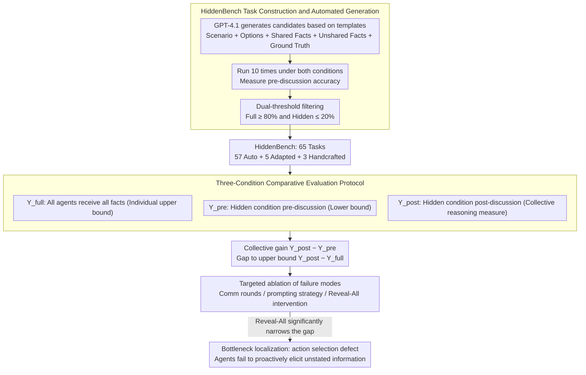

# Systematic Failures in Collective Reasoning under Distributed Information in Multi-Agent LLMs

**Conference**: ICML 2026  
**arXiv**: [2505.11556](https://arxiv.org/abs/2505.11556)  
**Code**: HuggingFace + GitHub (Available)  
**Area**: LLM Agent / Multi-Agent / Collective Reasoning Evaluation  
**Keywords**: HiddenBench, Hidden Profile, Distributed Information, Information Asymmetry, Collective Reasoning Failure

## TL;DR
This paper migrates the Hidden Profile paradigm from social psychology to multi-agent LLM evaluation, constructing HiddenBench with 65 tasks. Systematically revealing across 15 cutting-edge LLMs: for tasks where a single agent achieves 80.7% accuracy under Full Profile, a group of agents under distributed information achieves only 30.1%. The fundamental failure mode is that **agents do not proactively elicit unshared information from others**, which can be significantly mitigated across model families via lightweight structured communication protocols.

## Background & Motivation

**Background**: Multi-agent LLM systems are increasingly deployed in scenarios such as software development, scientific discovery, and social simulation. The **core promise is that "a group can integrate more information than a single agent."** This assumption suggests the multi-agent paradigm is inherently superior to single models.

**Limitations of Prior Work**: In reality, numerous replication studies show multi-agent systems often underperform single agents. However, **there is no clean evaluation that separates "collective reasoning failure" from "individual reasoning deficiency."** When a group fails, is it because the models are incompetent or because the information integration mechanism is poor? Existing benchmarks conflate the two, making attribution impossible.

**Key Challenge**: To measure "collective reasoning" itself, one must ensure: (i) the task is **unsolvable** for individuals (requiring a group); (ii) it must be **solvable** if all information is given to a single agent (excluding the "task is too hard" confounder). There must also be verifiable ground truth.

**Goal**: To engineer the Hidden Profile paradigm from social psychology into a scalable multi-agent benchmark and systematically characterize the failure modes of frontier LLMs under distributed information, determining if success can be achieved through simple protocols.

**Key Insight**: Hidden Profile is a classic paradigm in social psychology for studying collective decision-making failures in human groups. Each member holds different critical information; they must pool information to find the correct solution, otherwise, shared information leads to the wrong answer. Formalizing this as an LLM evaluation naturally satisfies the requirements of "individual unsolvability, collective solvability, and ground truth."

**Core Idea**: Construct HiddenBench (65 tasks: 5 adapted from human studies + 3 handcrafted + 57 automatically generated), evaluating 15 frontier LLMs under both Hidden and Full Profile conditions. Through ablation, the true bottleneck of failure is isolated: agents **can** integrate information that has been stated but **will not** proactively elicit unstated information.

## Method

### Overall Architecture
Task Structure: Each task consists of several decision options and several task-relevant facts. Under the **Hidden Profile condition**, some facts ($\mathcal{I}_s$) are shared by all agents, while unshared facts ($\mathcal{I}_u$) are uniquely distributed to each agent. That is, agent $a_i$ receives $I_i=\mathcal{I}_s\cup\{u_i\}$. Shared information is constructed to **support a wrong option**, while only pooling all unshared facts points to the correct option. Under the **Full Profile condition**, all agents receive $\mathcal{I}_s\cup\mathcal{I}_u$. Agents are not informed of the information asymmetry. The evaluation compares $Y^{\text{pre}}$ (pre-discussion), $Y^{\text{post}}$ (post-discussion), and $Y^{\text{full}}$ (Full Profile upper bound). The overall methodology is a diagnostic pipeline: "clean benchmark construction -> detection of failure using three conditions -> localization of failure to specific mechanisms via ablation."

### Key Designs

**1. HiddenBench Task Construction and Automated Generation Pipeline: Turning Soft Social Psychology Constraints into Machine-Verifiable Hard Thresholds**

To measure "collective reasoning," each task must satisfy the "individual unsolvability, collective solvability" requirement. However, manual creation is not scalable and prone to subjective bias, while pure GPT generation cannot guarantee formal correctness. Ours uses a "generate-execute-filter" pipeline to compress these requirements into machine-verifiable thresholds: First, GPT-4.1 generates candidate tasks based on structured templates (scenario + options + shared facts + unshared facts + ground truth). Then, each candidate is run 10 times under both Full and Hidden conditions to measure pre-discussion accuracy. Finally, only tasks with Full Profile accuracy $\ge 80\%$ and Hidden Profile accuracy $\le 20\%$ are retained. These thresholds operationalize the paradigm's hard constraints: high Full Profile accuracy ensures "solvability when information is complete" (excluding task difficulty as a confounder), while low Hidden Profile accuracy ensures "misleading by shared facts when information is distributed" (ensuring pooling is truly required). Out of 200 candidates, 57 were selected (28.5% pass rate), plus 5 adapted from human studies and 3 handcrafted, totaling 65 cross-domain tasks (medical, organizational planning, cultural preservation, etc.).

**2. Comparative Evaluation Protocol with Three Conditions: Adding Causal Counterfactual Control to Accuracy**

Traditional benchmarks only report accuracy, making it impossible to distinguish between "incompetent models" and "poor coordination" when a group fails. The diagnostic tool in Ours is running the same task under three information conditions: $Y^{\text{full}}$ (all agents have all facts, serving as the individual reasoning upper bound), $Y^{\text{pre}}$ (pre-discussion under Hidden Profile, serving as the "group required" lower bound), and $Y^{\text{post}}$ (post-discussion under Hidden Profile, the actual measure of collective reasoning). Comparing these three metrics reveals two clean indicators—collective gain $Y^{\text{post}}-Y^{\text{pre}}$ and the gap to the upper bound $Y^{\text{post}}-Y^{\text{full}}$, isolating model capability from coordination failure. The evaluation covers 15 cutting-edge LLMs (OpenAI GPT, Google Gemini, Alibaba Qwen, Meta Llama), with 10 sessions per model per task, while varying communication depth $T\in\{5,10,15,20\}$ and group size to measure scaling.

**3. Targeted Ablation of Failure Modes: Upgrading "Multi-Agent Inefficiency" to Mechanism Diagnosis**

Simply stating "multi-agent systems fail" is of little value; the specific breaking point must be located. Ours deconstructs collective failure into three candidates—aggregation failure (cannot integrate stated information), inference failure (cannot deduce correctly even after integration), and action selection failure (failing to proactively request unshared information). These are excluded one by one using ablations: varying communication rounds (5/10/15/20), changing prompting strategies (cooperative / conflictual / CoT / informing asymmetry / share-all), and finally, a mechanism-level Reveal-All intervention (forcing the disclosure of all information in round 1). The critical pivot is that Reveal-All significantly narrows the gap—once agents are forced to disclose information, they can reason correctly. This indicates that aggregation and inference are intact; the sole bottleneck is **agents failing to realize they should elicit unstated information from others**. This step anchors the 50-point gap from a "phenomenon" to an "action selection defect."

### Loss & Training
This is an evaluation paper with no training; all experiments use zero-shot API calls to various LLMs.

## Key Experimental Results

### Main Results
HiddenBench performance across 15 cutting-edge LLMs (65 tasks, 10 sessions, average rule, post-discussion accuracy under Hidden Profile):

| Model | $Y^{\text{full}}$ (Full) | $Y^{\text{pre}}$ (Hidden Pre) | $Y^{\text{post}}$ (Hidden Post) | Gain | Gap with Full |
|------|--------------------------|----------------------------------|-----------------------------------|------|---------------|
| Gemini-2.5-Pro | 0.981 | 0.217 | **0.671** | +0.454 | -0.310 |
| Gemini-2.5-Flash | High | Medium | 0.550 | Large | Medium |
| Gemini-2.5-Flash-Lite | High | Medium | 0.394 | Medium | Large |
| GPT-5 (minimal reasoning) | High | Medium | Medium | Small | **-0.750** |
| GPT-5-Nano | High | Medium | Low | **-0.004** (Almost none) | Extreme |
| **Global Mean (15 Models)** | **0.807** | 0.082~0.217 | **0.301** | Medium | ~ -0.5 |

Key cross-sectional facts: (i) A single agent averages 80.7% under Full Profile, whereas a group under Hidden only reaches 30.1%, a 50-point gap; (ii) Model size/individual reasoning ability **cannot** reliably predict collective performance (GPT-5 is strong individually but weak collectively); (iii) The Gemini family significantly outperforms other families in collective settings.

### Ablation Study

| Intervention Dimension | Key Phenomenon | Interpretation |
|---------|---------|------|
| Comm Depth $T=5/10/15/20$ | $Y^{\text{post}}$ peaks at $T=15$ (0.233), drops to 0.133 at $T=20$ | Long discussions reinforce false consensus rather than promoting exploration |
| Cooperative / Constructive prompt | $Y^{\text{post}}=0.20\sim 0.24$ | No significant improvement with cooperative prompts |
| Conflictual prompt | $Y^{\text{post}}=0.0\sim 0.26$, no majority consensus in most cases | Conflictual prompts lead to non-convergence |
| Zero-shot CoT | 0.222 | Limited improvement |
| Informing asymmetry (Informing agents of possible asymmetry) | 0.367 | Merely informing helps but is insufficient |
| Share All Information (Prompting to share) | 0.467 | Still only fills about half the gap, showing prompting disclosure is enough |
| **Reveal-All (Mechanism-level forced round-1 disclosure)** | Significantly narrows the gap | **Proves the bottleneck is action selection rather than inference** |
| Enlarging Group size | $Y^{\text{post}}$ actually decreases | More agents make coordination more difficult |

### Key Findings
- **Failure Mode Localization**: Agents can integrate disclosed information but **fail to proactively elicit unshared information**—this is the core conclusion attributing the 50-point gap to a specific capability defect.
- Model scale / individual reasoning $\neq$ collective reasoning. Reasoning-heavy models like GPT-5 showed no significant advantage in collective settings, challenging the "scale up will solve it" assumption.
- Excessive communication rounds actually **reinforce premature consensus**, consistent with groupthink in human social psychology.
- A **lightweight structured communication protocol** (making agents explicitly list their unique evidence before debating) significantly improves $Y^{\text{post}}$ across families, proving the bottleneck is actionable and does not necessitate changing models.

## Highlights & Insights
- Turning the abstract concept of "collective reasoning" into hard formal constraints (individual solvable, collective unsolvable via dual-threshold filtering) is a brilliant engineering move that can be applied to any work building multi-agent benchmarks.
- The three-condition comparative protocol (Hidden-pre / Hidden-post / Full) essentially adds **causal counterfactual control** to the evaluation—running the same task under different information conditions allows for direct "failure attribution." This paradigm can be generalized to other collective reasoning/cooperation evaluations.
- The comparison between "Reveal-All intervention" and "Share-All prompting" is particularly educational: prompting makes the model "know it should talk" but it still fails to share everything, whereas mechanism intervention forcing full disclosure leads to major improvements—indicating that the elicitation behavior is not a knowledge problem, but an **objective/incentive problem** that should be addressed through RL objective design.
- Revealed an anti-intuitive fact: **more agents $\neq$ better**. Contrary to naive "wisdom of the crowd" assumptions, this aligns with March’s exploration-exploitation and Janis’s groupthink theories.

## Limitations & Future Work
- Tasks are limited to multiple-choice decision-making and do not cover open-ended generation, tool-use, or long-term collaboration scenarios.
- The communication protocol is synchronous, fully connected broadcasting; it does not test partial observability, async messaging, or structured organizational hierarchies.
- While prompting interventions prove the bottleneck is elicit behavior, no **systemic solution at the training level** was provided—future work requires RL/SFT dataset designs to change this behavior fundamentally.
- The 15 models are mostly closed-source plus some open-source; while coverage is broad, more granular attribution regarding training data or RLHF recipes was not possible.

## Related Work & Insights
- **vs. Du et al. multi-agent debate**: They assume debate automatically brings benefits; Ours directly refutes this—more debate rounds can lead to degradation, and the core bottleneck is unrelated to "debate quality."
- **vs. Cemri et al. LLM coordination failure**: They observe coordination issues but lack controlled variables; HiddenBench isolates information asymmetry as the single variable, providing cleaner attribution.
- **vs. Social Psychology Hidden Profile studies**: This paper serves as a template for engineering human psychology paradigms into LLM evaluations, proving many AI agent failure modes are isomorphic to human group failures—suggesting a promising path for future AI evaluation based on social psychology.

## Rating
- Novelty: ⭐⭐⭐⭐⭐ Adapting the Hidden Profile paradigm into a scalable LLM benchmark is a pioneering bridge between social psychology and AI evaluation.
- Experimental Thoroughness: ⭐⭐⭐⭐⭐ 15 models, 65 tasks, dual conditions, and multi-dimensional ablations provide rare breadth and depth of attribution.
- Writing Quality: ⭐⭐⭐⭐⭐ The logical chain localizing failure modes to "action selection" is clear and reproducible.
- Value: ⭐⭐⭐⭐⭐ Provides a clean evaluation tool and a clear research direction (elicit-aware coordination) for the multi-agent LLM community; its impact will likely be long-lasting.

<!-- RELATED:START -->

## Related Papers

- [\[ACL 2026\] Collaborative Multi-Agent Scripts Generation for Enhancing Imperfect-Information Reasoning in Murder Mystery Games](../../ACL2026/multi_agent/collaborative_multi-agent_scripts_generation_for_enhancing_imperfect-information.md)
- [\[ICML 2026\] Beyond Majority Voting: LLM Aggregation by Leveraging Higher-Order Information](beyond_majority_voting_llm_aggregation_by_leveraging_higher-order_information.md)
- [\[ACL 2026\] SILO-BENCH: A Scalable Environment for Evaluating Distributed Coordination in Multi-Agent LLM Systems](../../ACL2026/multi_agent/silo-bench_a_scalable_environment_for_evaluating_distributed_coordination_in_mul.md)
- [\[ACL 2026\] Scaling External Knowledge Input Beyond Context Windows of LLMs via Multi-Agent Collaboration](../../ACL2026/multi_agent/scaling_external_knowledge_input_beyond_context_windows_of_llms_via_multi-agent_.md)
- [\[ACL 2026\] Diversity Collapse in Multi-Agent LLM Systems: Structural Coupling and Collective Failure in Open-Ended Idea Generation](../../ACL2026/multi_agent/diversity_collapse_in_multi-agent_llm_systems_structural_coupling_and_collective.md)

<!-- RELATED:END -->
