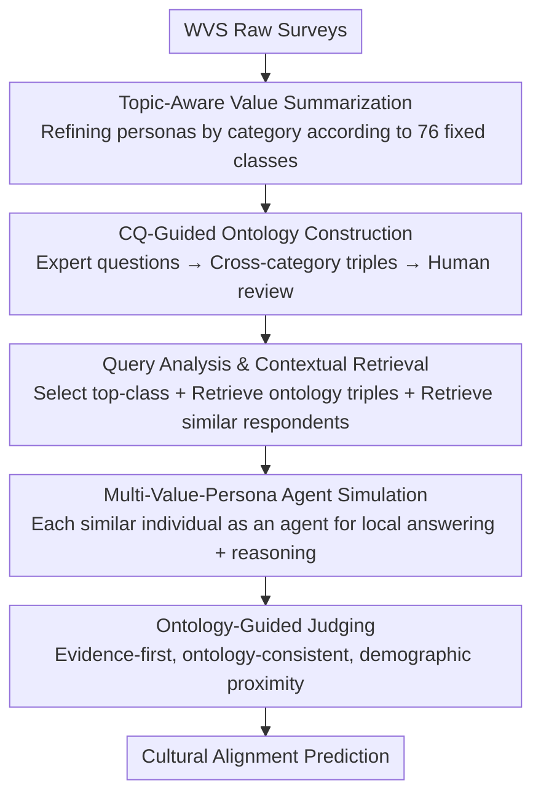

# Toward Culturally Aligned LLMs through Ontology-Guided Multi-Agent Reasoning

**Conference**: ICML2026  
**arXiv**: [2601.21700](https://arxiv.org/abs/2601.21700)  
**Code**: TBD  
**Area**: Multi-Agent / Cultural Alignment / RAG  
**Keywords**: Cultural Alignment, Ontology-Guided, Multi-Agent Reasoning, World Values Survey, Persona Simulation

## TL;DR
OG-MAR organizes raw World Values Survey (WVS) data into a "cultural ontology with structural relations + individual value personas." During inference, it retrieves ontology triples relevant to the target population alongside demographically similar real-world respondents to instantiate multiple "Value Persona Agents." A judge agent then synthesizes a final answer following an "evidence-first, ontology-consistent" protocol, improving cultural alignment and providing explainable reasoning trajectories across six regional social survey benchmarks.

## Background & Motivation
**Background**: LLMs are increasingly used for culture-sensitive tasks involving social norms and value judgments. However, pre-training corpora are severely imbalanced geographically and linguistically, often causing models to adopt a "Western high-resource perspective" as the default, leading to systematic misjudgments of non-mainstream value systems. To mitigate this, prior work has attempted role-playing (setting a cultural persona for the model), few-shot cultural prompting, retrieval augmentation (e.g., ValuesRAG retrieving evidence from external surveys), and multi-agent debate (iterative critique among agents).

**Limitations of Prior Work**: The authors categorize the shortcomings of these methods into three points. First, many methods rely on "implicit cultural assumptions" not grounded in actual value distributions, making outputs fragile and sensitive to prompt phrasing. Second, even when external evidence is introduced, cultural values are treated as **independent, unstructured signals**, losing "dependencies between different issues" (e.g., attitudes toward religion are often correlated with attitudes toward family and gender roles). Third, while multi-agent aggregation improves robustness and diversity, stacking agents without specific value structures or grounding reduces explainability—it is unclear exactly how a particular viewpoint emerged.

**Key Challenge**: The fundamental issue lies in the "representation of value knowledge." Existing methods either lack empirical grounding (not tied to real distributions) or flatten values into discrete fragments (lack of structure), resulting in a lack of both stability and transparency.

**Goal**: Construct a cultural reasoning framework that possesses **empirical grounding** (derived from real survey distributions), **explicit structure** (a network of relationships between issues), and **explainable aggregation** (traceable sources for every viewpoint), and validate its alignment, robustness, and explainability on cross-regional benchmarks.

**Key Insight**: The authors draw from ontology engineering—ontologies are formal specifications of "domain concepts + relationships," naturally suited to expressing "cross-issue dependencies between value categories." Combining this with real WVS respondent profiles and multi-agent simulation addresses the triad of grounding, structure, and explainability.

**Core Idea**: Replace "unstructured value fragments" with "ontology triples on a fixed taxonomy + demographically similar profiles," and replace "simple majority voting" with an "evidence-first judge agent," making cultural reasoning grounded, structured, and traceable.

## Method

### Overall Architecture
OG-MAR consists of two main components: **offline data preprocessing and ontology construction**, and an **online multi-agent reasoning pipeline**. In the offline phase, raw WVS surveys are transformed into two assets—a "structured value persona" for each respondent (summarized by category according to a fixed taxonomy) and a "global cultural ontology" characterizing relationships between value categories. In the online phase, given a query $q$ (a value survey question with options) and a target demographic description $d_q$, the system performs topic identification and contextual retrieval to extract relevant ontology triples $O_q$ and demographically similar real respondents $R_q$ with their value personas. Each retrieved individual is instantiated as a Value Persona Agent to answer the query, and finally, a judge agent synthesizes all persona answers and rationales to output a culturally aligned final prediction.

### Key Designs

**1. Topic-Aware Value Summarization: Compressing Noisy Raw Surveys into Category-Aligned Structured Personas**

Large-scale surveys feature diverse question types, scales, and answer formats. Using raw answers directly for retrieval or reasoning easily mixes irrelevant signals and amplifies noise. OG-MAR defines a **fixed set of ontology classes** $C$ ($|C|=76$, containing 12 top-level classes $c_1,\dots,c_{12}$ and their 64 sub-classes $c_{i,j}$). A summarization agent $G_{\text{sum}}$ then produces a short summary of a respondent's answers within the semantic scope of each category: for respondent $i$'s raw answer set $\mathcal{R}_i$ and a category $c$, it generates a category-conditioned summary $s_i(c)=G_{\text{sum}}(\mathcal{R}_i\mid c)$. The aggregate of all categories forms the respondent’s structured value persona $V_i=\{s_i(c)\mid c\in C\}$. The key constraint is "summarizing only information relevant to that category without introducing new concepts," ensuring each individual is represented by a persona strictly aligned with the taxonomy, providing clean input for demographic grounding and persona simulation.

**2. CQ-Guided Ontology Relationship Construction: Explicitly Weaving "Cross-Issue Value Relationships" using Expert Questions**

Category-wise personas alone are insufficient; the dependencies between values (which issue influences another) are the structures missing in existing methods. OG-MAR employs human-guided construction based on **Competency Questions (CQ)**: domain experts design CQs regarding "what meaningful interactions might exist between sub-classes of two top-level classes." For each CQ, an LLM describes the relationship at the sub-class level, strictly constrained to (i) use only classes from the predefined taxonomy, (ii) not add new classes, and (iii) only discuss relationships between sub-classes of the two given top-level classes. To inject cultural diversity, the LLM is conditioned on value personas of 120 individuals from six major regions (20 per region) during construction. Each candidate relationship is represented as an ordered triple $t_{a,b}=(c_a, p_{a,b}, c_b)$, where $c_a, c_b$ are noun phrases of sub-classes and $p_{a,b}$ is a natural language relational verb phrase (natural language is used instead of symbolic IDs to maintain human readability and consistency with CQ phrasing). Experts then perform a merge-and-review: verifying cultural plausibility, refining relationship descriptions, and deleting spurious or inconsistent relations. The **taxonomy itself remains fixed** (no merging, splitting, or adding classes); human judgment is applied only to the relationships, resulting in an ontology triple set $T=\{t_h\}$ of approximately 150 object-property relations.

**3. Query Analysis & Three-Way Contextual Retrieval: Extracting Relevant Issues, Ontology Relations, and Real Personas for Each Query**

During inference, given a query $q$ and target demographic $d_q$, OG-MAR retrieves three components to form the context for downstream simulation. The first step is **Topic Identification**: a text encoder $G_{\text{topic}}$ fine-tuned on WVS data across 12 top-level classes identifies scores $\ell_u$ for each top-level class $c_u$, selecting the top-$k$ classes to form $D_q$, which limits the sub-classes to be considered. The second step is **Ontology Triple Retrieval**: node relevance $\alpha(c)=\mathrm{sim}(\mathbf{e}_q,\mathbf{e}_c)$ is calculated within the sub-classes of $D_q$. Each triple is then scored based on the maximum relevance of its endpoints $\alpha_{\text{triple}}(t_h)=\max(\alpha(c_a),\alpha(c_b))$, and the top-$M$ triples are selected as the ontology context $O_q$ (in practice, top-3 triples per category are taken, typically 3–9 triples per query). The third step is **Similar Individual Retrieval**: target demographic descriptions and each respondent's demographic profile are encoded via dense vectors and ranked by similarity; the top-$K$ real individuals form $R_q$ (default $K=5$), with their value personas as $\mathcal{V}_q=\{V_i\mid i\in R_q\}$. This step ensures reasoning is grounded in "relevant issue boundaries," "structured relationships," and "real-world population evidence."

**4. Multi-Persona Simulation + Evidence-First Judging: Letting Real Personas Speak, then Factoring in Ontology Consistency Instead of Voting**

With $\mathcal{V}_q$, OG-MAR instantiates a Value Persona Agent $G_{\text{persona}}$ for each retrieved individual $i$. Each agent's context is $z_i=\mathrm{Concat}(O_q, V_{i,q}, d_i)$, where $O_q$ are the ontology triples, $V_{i,q}=\{s_i(c)\mid c\in C_q\}$ is the individual’s persona filtered to the sub-classes referenced by the triples, and $d_i$ are the demographic attributes. The agent outputs an answer and an explicit reasoning trajectory $G_{\text{persona}}(q,z_i)=(\hat{y}_i,\rho_i)$. All outputs are collected into set $A$. Finally, a judge agent $G_{\text{judge}}$ performs a **constrained meta-judgment** $\hat{y}_q=G_{\text{judge}}(A,q)$. Unlike majority voting, it follows an "evidence-first" protocol: assessing the argumentative solidity and ontology compliance of each $(\hat{y}_i,\rho_i)$ and aggregating by option. "Vote totals" are used only as a **secondary** signal when leading options have comparable evidence strength; if a tie persists, the option supported by personas more relevant to $d_q$ serves as the tie-breaker. Notably, the judgment is completed in a **single LLM call**; the criteria guide its internal reasoning. Moreover, the judge agent does not directly receive $O_q$ or $\mathcal{V}_q$—grounding to the ontology and personas is carried entirely through the persona outputs, keeping the "why it reached this viewpoint" chain within the traceable reasoning trajectories.

## Method Detail: A Complete Example
Suppose the query is a value question regarding "family obligations vs. individual freedom" for a Chinese (CGSS) respondent. Topic identification first selects top-$k$ classes related to "family/social norms/individual values" from the 12 top-level categories. Ontology retrieval extracts about 5 triples within these sub-classes (e.g., "family responsibility—reinforces—obedience to elders"). Similar individual retrieval uses the target demographics (e.g., middle-aged, married, specific education level) to find 5 demographically similar real respondents from WVS. The system then starts 5 persona agents, each seeing only the "filtered persona of that person falling within those sub-classes + ontology triples + demographics," and each provides an answer and rationale favoring either "family obligations" or "individual freedom"—perhaps 3 favor obligations and 2 favor freedom. The judge agent does not simply count votes; it first checks which side's reasoning is truly supported by the ontology relations and persona evidence: if the obligation-side rationales map to triples like "family responsibility—obedience" while the freedom-side rationales are generic, the obligation side receives a higher evidence score. Only if evidence is equal would it refer to the 3:2 vote, ultimately outputting a prediction more aligned with the cultural context. Every step of "what evidence was used, who supported it, and why this side was judged better" is human-readable.

## Key Experimental Results

### Main Results
Binary accuracy was evaluated across six regional social survey benchmarks (EVS Europe, GSS US, CGSS China, ISD India, AFRO Africa, LAPOP Latin America) using four LLM backbones. OG-MAR led competitive baselines in average accuracy across all four backbones, with the largest gains in "culturally challenging" scenarios (CGSS, ISD) that deviate from mainstream pre-training priors.

| Backbone / Method | EVS | GSS | CGSS | ISD | AFRO | LAPOP | Avg. |
|------|------|------|------|------|------|------|------|
| GPT-4o-mini · ValuesRAG | 0.6127 | 0.5589 | 0.5889 | 0.6420 | 0.5654 | 0.6085 | 0.5961 |
| GPT-4o-mini · **OG-MAR** | 0.6206 | 0.5480 | 0.6509 | 0.6192 | 0.5389 | 0.6268 | **0.6007** |
| Gemini 2.5 · ValuesRAG | 0.6075 | 0.5376 | 0.6084 | 0.6041 | 0.5472 | 0.5339 | 0.5731 |
| Gemini 2.5 · **OG-MAR** | 0.6249 | 0.5489 | 0.7017 | 0.7007 | 0.5701 | 0.6385 | **0.6308** |
| Qwen 2.5 · ValuesRAG | 0.5538 | 0.5215 | 0.4697 | 0.6591 | 0.4724 | 0.5268 | 0.5339 |
| Qwen 2.5 · **OG-MAR** | 0.5898 | 0.5325 | 0.5220 | 0.6599 | 0.5180 | 0.6005 | **0.5705** |
| EXAONE 3.5 · ValuesRAG | 0.5172 | 0.5520 | 0.5833 | 0.6446 | 0.4794 | 0.5913 | 0.5613 |
| EXAONE 3.5 · **OG-MAR** | 0.6080 | 0.5636 | 0.6307 | 0.7810 | 0.5045 | 0.7022 | **0.6317** |

On Gemini, CGSS jumped from 0.6084 (ValuesRAG) to 0.7017, and ISD from 0.6041 to 0.7007, an increase of nearly +0.10. This confirms that "structural cultural relations + demographically grounded personas" are most valuable when the target distribution is far from the default Western prior (average gains marked with $\ast$, paired $t$-test + Holm–Bonferroni correction, $p<0.05$).

### Ablation Study

| Configuration | Key Metric (Avg. Accuracy over 4 Backbones) | Description |
|------|------|------|
| OG-MAR (Full) | 0.6007 / 0.6308 / 0.5705 / 0.6317 | Multi-persona + Judge |
| w/o Multi-Persona (Single-Judge) | 0.5987 / 0.6022 / 0.5311 / 0.5627 | Skips persona simulation, judge agent outputs answer directly |
| Retrieval Depth $K$ | $K{=}5$ optimal | $K{\in}\{1,3,5,10\}$; $K{=}10$ drops accuracy by 0.02–0.07 |

Removing the multi-persona simulation (Single-Judge variant) led to drops across all backbones: +0.002 for GPT-4o-mini, but +0.03 for Gemini, +0.04 for Qwen, and +0.07 for EXAONE. This indicates that persona simulation contributes significantly when "reconciling competing value considerations." Meanwhile, Single-Judge remains competitive, suggesting gains are not solely from the simulation layer but also from the ontology-grounded retrieval and value summarization pipeline itself providing structured, survey-backed evidence.

### Key Findings
- **Retrieval depth trade-off**: $K{=}1$ is too narrow, while $K{=}10$ introduces noise that drops performance. $K{=}5$ is the "sweet spot" between richness and stability and is thus set as the default.
- **Strong cross-backbone consistency**: Four very different LLMs (including two open-source models) were improved by OG-MAR, suggesting gains stem from the framework rather than specific model features.
- **Explainability validated by human evaluation**: Nine experts rated outputs on a 5-point Likert scale. OG-MAR's Grounding score for CGSS (China) was 4.02, slightly higher than GSS (US) at 3.97, suggesting ontology-guided value injection can mitigate "cultural default" tendencies and encourage evidence-based reasoning.
- **Cost is the token budget**: OG-MAR has the highest token budget. The authors position it as a "structural reasoning framework" rather than a cost-saving alternative to lightweight prompting; the extra computation buys more robust and explainable cultural reasoning.

## Highlights & Insights
- **Explicitly building "relationships between values" into an ontology** is the core differentiator: Compared to retrieving values as discrete fragments, triples based on a fixed taxonomy allow "cross-issue dependencies" to be retrieved, constrained, and reviewed—which is also the source of explainability.
- **Judging with "evidence-first" rather than majority voting** is clever: By scoring argumentative solidity and ontology compliance first, vote counts are downgraded to secondary signals, avoiding "majority bias" and drift common in multi-agent methods. Furthermore, the single-call judgment is engineering-efficient.
- **Intentionally withholding the ontology and personas from the judge agent** forces all grounding evidence to be carried through persona outputs. This essentially forces the "evidence—viewpoint—conclusion" chain into a traceable format, a design pattern transferable to any multi-agent system requiring reasoning audits.
- **The paradigm of "fixed taxonomy + human-reviewed relations"** for ontology construction is a pragmatic compromise given the tendency of LLMs to invent concepts: CQs + strong constraints keep the LLM within the taxonomy "cage," with expert review as a safeguard.

## Limitations & Future Work
- The authors admit remaining failures often stem from **sparse ontology coverage** or **imprecise demographic retrieval**—even with self-consistent judging logic, grounding remains limited if evidence is insufficient.
- The framework has the **highest token cost**, making it unfriendly for cost-sensitive or low-latency scenarios; it is positioned as a "quality-first" structured reasoning tool.
- Ontology construction heavily relies on **expert human review** (designing CQs, adjudicating relations), leading to high scalability and cross-domain migration costs. The fixed taxonomy provides stability but limits coverage of emerging value dimensions.
- Evaluation is anchored to WVS and six WVS-comparable regional surveys. Cultural alignment is operationalized as "matching the survey majority," which still offers limited characterization of individual differences and minority positions.

## Related Work & Insights
- **vs. Role-playing / Cultural Prompting (Role, Tao et al. 2024)**: These rely on persona prompts for steering but are weakly grounded and phrasing-sensitive. OG-MAR uses real respondent personas + ontology relations as hard evidence for stronger robustness.
- **vs. ValuesRAG (Seo et al. 2025)**: Both retrieve survey evidence, but ValuesRAG treats values as unstructured fragments, lacking control over "relationships." OG-MAR's triples express cross-issue dependencies, showing clear advantages on benchmarks deviating from Western priors.
- **vs. Multi-Agent Debate (Debate, Ki et al. 2025)**: Debate relies on iterative critique but is prone to drift without explicit evidence constraints and fails to capture cross-issue value dependencies. OG-MAR employs ontology constraints + evidence-first judging for stability and explainability.

## Rating
- Novelty: ⭐⭐⭐⭐ Combining ontology engineering, survey grounding, and multi-agent simulation for cultural alignment is a distinctive approach.
- Experimental Thoroughness: ⭐⭐⭐⭐ 6 regions × 4 backbones + ablations for retrieval depth/multi-persona/single-judge + human eval; however, "ground truth" is anchored entirely to WVS-style surveys.
- Writing Quality: ⭐⭐⭐⭐ Diagrams and notation are clear; ontology construction and judging protocols are well-explained, though some details rely on appendices.
- Value: ⭐⭐⭐⭐ Provides a practical paradigm for "cultural alignment + explainable multi-agent systems," despite the trade-off of high token usage and manual ontology construction.

<!-- RELATED:START -->

## Related Papers

- [\[ICML 2026\] MAS-Orchestra: Understanding and Improving Multi-Agent Reasoning Through Holistic Orchestration and Controlled Benchmarks](mas-orchestra_understanding_and_improving_multi-agent_reasoning_through_holistic.md)
- [\[ICLR 2026\] MARSHAL: Incentivizing Multi-Agent Reasoning via Self-Play with Strategic LLMs](../../ICLR2026/multi_agent/marshal_incentivizing_multi-agent_reasoning_via_self-play_with_strategic_llms.md)
- [\[ICML 2026\] Systematic Failures in Collective Reasoning under Distributed Information in Multi-Agent LLMs](systematic_failures_in_collective_reasoning_under_distributed_information_in_mul.md)
- [\[ACL 2025\] GETReason: Enhancing Image Context Extraction through Hierarchical Multi-Agent Reasoning](../../ACL2025/multi_agent/getreason_enhancing_image_context_extraction_through_hierarchical_multi-agent_re.md)
- [\[ICLR 2026\] Aligned Agents, Biased Swarm: Measuring Bias Amplification in Multi-Agent Systems](../../ICLR2026/multi_agent/aligned_agents_biased_swarm_measuring_bias_amplification_in_multi-agent_systems.md)

<!-- RELATED:END -->
