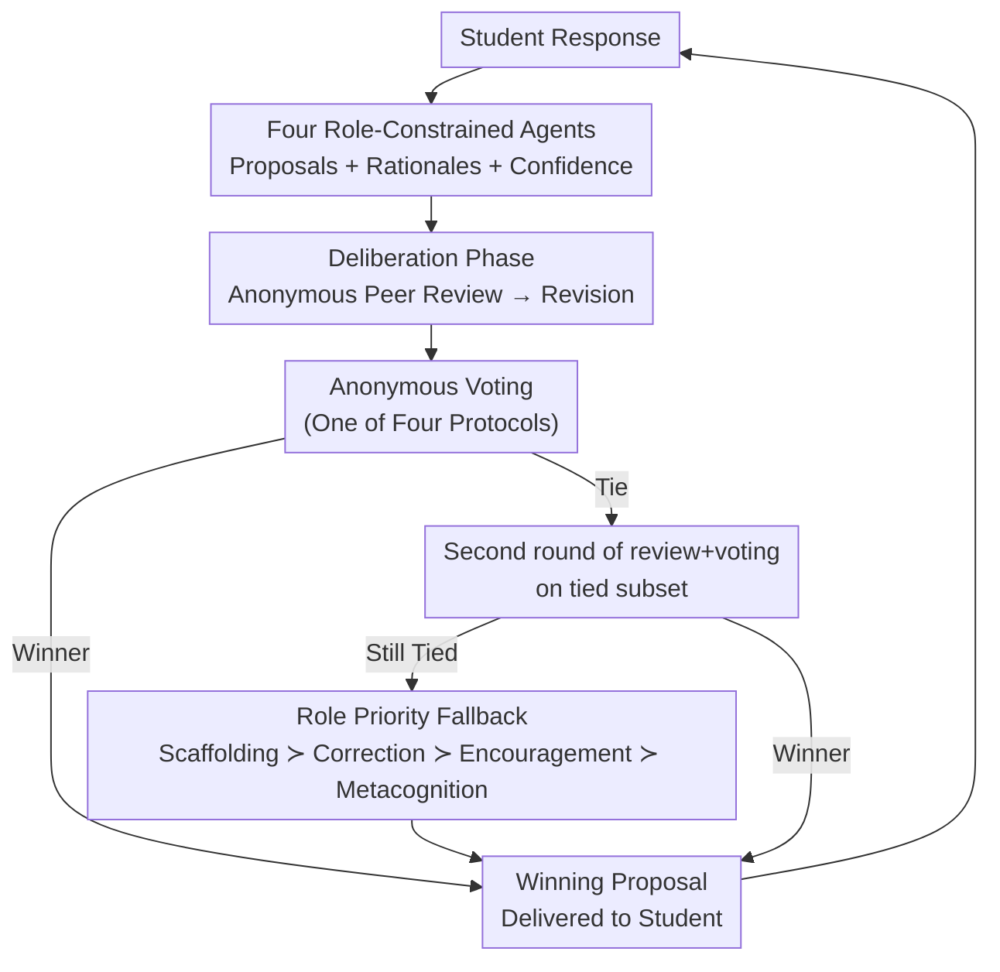

# Voting Protocols as Coordination Mechanisms for Role-Constrained Multi-Agent Tutoring Systems

**Conference**: ICML2026  
**arXiv**: [2606.08030](https://arxiv.org/abs/2606.08030)  
**Code**: TBD  
**Area**: Multi-agent coordination / Cooperative AI  
**Keywords**: Voting Protocols, Multi-agent Coordination, Role Constraints, Intelligent Tutoring Systems, Cooperative AI

## TL;DR
The paper situates four "tutoring agents" with non-overlapping responsibilities (Scaffolding/Correction/Encouragement/Metacognition) within the same tutoring turn, allowing them to propose, peer-review, and revise responses before using four distinct voting protocols (Plurality / Borda / Cumulative / Approval) to converge disagreements into a final response. Rather than simply proving "voting makes tutoring better," the study uses tutoring as an experimental testbed for **partially aligned but locally conflicting goals**, systematically characterizing how different voting rules induce divergent coordination behaviors.

## Background & Motivation
**Background**: Cooperative AI focuses on scenarios where multiple agents have goals that are "aligned in direction but not identical." Tutoring serves as a natural exemplar of this: a good teacher must simultaneously clarify concepts, correct misconceptions, maintain motivation, and guide reflection.

**Limitations of Prior Work**: While these pedagogical goals all serve the objective of "helping the student learn," they often clash at the level of "what to say next." For instance, an utterance aimed at maintaining student morale might leave an underlying conceptual misunderstanding unaddressed, while direct correction might discourage the learner. When all objectives are compressed into a single model, these conflicts are hidden, making them impossible to observe or analyze.

**Key Challenge**: Tutoring is essentially not a single-objective optimization problem but a **collective decision-making process among competing pedagogical priorities**. The fundamental issue is that when multiple agents with local preferences must provide a single action, the "aggregation rules" themselves shape the coordination outcome—a step long treated as a trivial implementation detail.

**Goal**: This study addresses three research questions: How do different voting protocols shape coordination among role-constrained agents? How does the deliberation phase (peer review + revision) alter the final selected action? How do these coordination differences reflect in tutoring outcomes across different tasks and learner personas?

**Key Insight**: The authors intentionally **decouple** pedagogical functions into four minimally overlapping roles to make disagreements explicit rather than masking them within a single strategy. Coordination becomes an observable phenomenon only when different roles naturally prefer different tutoring actions.

**Core Idea**: Repositioning voting from an "aggregation step for finding an answer" to a "coordination microscope for exposing and parsing pedagogical conflicts"—using four voting rules as probes to observe how collective decision rules structure group behavior.

## Method

### Overall Architecture
The system consists of four **role-constrained tutoring agents**, a simulated student, and an independent judge. A tutoring turn proceeds through five stages: the student attempts a task $\rightarrow$ the four roles generate individual proposals (including brief rationales and confidence scores) $\rightarrow$ anonymous peer review (each agent identifies one strength and one weakness for every proposal) $\rightarrow$ agents revise their own proposals $\rightarrow$ anonymous voting selects the final response for the student. If a vote results in a tie, a second round of "criticism + voting" is run on the tied subset; if the tie persists, a deterministic role-priority fallback rule is applied. The process repeats for the next student turn.

### Key Designs

**1. Four Minimally Overlapping Role-Constrained Agents: Making Pedagogical Disagreements Explicit**

This is the prerequisite for observing coordination. To prevent single tutoring models from hiding goal conflicts, the authors assign pedagogical responsibilities to four non-overlapping agents: **Scaffolding** (cognitive support: breaking tasks into sub-problems, providing hints), **Correction** (epistemic correction: identifying and pointing out false beliefs), **Encouragement** (affective support: affirming effort, maintaining confidence), and **Metacognition** (self-regulation support: prompting students to articulate reasoning, plan steps, or evaluate knowledge). Crucially, these roles are designed for "minimal overlap"—if the agents behaved identically, there would be no meaningful disagreement for voting protocols to resolve. The collaboration and coordination only become measurable because different roles naturally prefer different tutoring actions. This enforced division of labor is the primary independent variable.

**2. Deliberation Phase (Anonymous Peer Review + Revision): Tracking Preference Shifts**

To capture how agents influence each other, a "deliberation" stage is inserted. All proposals are anonymized (using random labels A/B/C/D), and each agent identifies one strength and one weakness for every proposal before revising their own. Anonymization suppresses "self-favoritism," ensuring that the adoption of other roles' ideas is interpreted as peer influence rather than self-identification. Furthermore, the authors record an extra "initial vote" after peer review but before revision; this vote is purely for **diagnostic purposes** and does not determine the action. By comparing initial and final vote distributions, the authors quantify how much deliberation shifts agent preferences, turning abstract "coordination" into a measurable metric.

**3. Four Voting Protocols: Using Different Systems as Probes for Coordination Behavior**

This is the core independent variable. Applying different aggregation rules to the same set of proposals yields distinct coordination dynamics: **Plurality** (one vote per agent, most votes win), **Borda Count/Ranking** (agents rank all proposals; e.g., 3/2/1/0 points for ranks, highest total wins), **Cumulative Voting** (agents distribute 25 points across proposals, highest total wins), and **Approval Voting** (agents mark all "acceptable" proposals, most approvals win). These rules differ significantly—for instance, Cumulative voting spreads points out, making it harder for deliberation to shift the distribution (most stable), whereas Plurality relies on a single vote where one change shifts 25% of the support vector (most volatile). The paper uses $\Delta_{\text{vote}}=\tfrac{1}{2}\sum_i |p^{\text{init}}_i - p^{\text{final}}_i|$ (the half-L1 distance between normalized initial and final distributions, where 0 = no change and 1 = complete redistribution) to characterize the magnitude of preference shift under each protocol.

**4. Fallback Rules: Separating "Protocol Winners" from "Unresolved Disagreements"**

Voting protocols sometimes fail to distinguish a single winner. The authors use a deterministic role-priority fallback: a second round of review and voting on the tied subset, followed by a fixed hierarchy of $\text{Scaffolding} \succ \text{Correction} \succ \text{Encouragement} \succ \text{Metacognition}$. This ranking places epistemic correction above affective support and direct scaffolding above both, reflecting common priorities in classical Intelligent Tutoring Systems (ITS). The authors explicitly acknowledge this as a design choice that influences results. Consequently, they report the **Fallback rate** for each protocol. This allows "fallback-driven outcomes" to be interpreted separately from "protocol-driven outcomes"—a role winning 70 times under Approval voting (fallback rate 0.14) is partly due to the fallback rule, whereas the same win rate under Cumulative voting (fallback rate 0.03) is almost entirely due to voter preferences.

### A Complete Example
The paper provides a trace from SciQ involving a low-confidence novice student in Turn 1 under Cumulative voting. The student used two related terms, "altitude vs elevation," simultaneously. Initial proposals varied: Scaffolding defined the difference and ended with a prompt; Correction pointed out "elevation" was more precise; Encouragement affirmed "both are correct, trust yourself"; Metacognition asked "what do you already know before I tell you?" Initial votes were [S=28, C=34, E=7, M=31], with **Correction leading**. After review and revision—where Scaffolding softened its prompt, Encouragement added a clarifying sentence, and Metacognition reframed the question more collaboratively—the final votes became [S=24, C=25, E=16, M=35], resulting in a **reversal win for Metacognition**. This illustrates how deliberation changes the balance between directness, correctness, and student support.

## Key Experimental Results

Experiments were conducted in two simulated environments: **SciQ** (conceptual tutoring with natural language explanations) and **HumanEval** (algorithmic tutoring requiring natural language reasoning and Python code). 1,200 simulated interactions were conducted across 40 tasks $\times$ 6 learner personas $\times$ 5 conditions.

### Main Results: Coordination Diagnostics (Across 240 interactions per protocol)

| Protocol | $\Delta_{\text{vote}}$ | Flip Rate | Fallback Rate | Winning Turns | S / C / E / M |
| :--- | :--- | :--- | :--- | :--- | :--- |
| Plurality | 0.41 | 0.70 | 0.10 | 222 | 61 / 42 / 30 / 89 |
| Borda/Ranking | 0.20 | 0.59 | 0.05 | 223 | 77 / 70 / 33 / 43 |
| Cumulative | 0.08 | 0.56 | 0.03 | 236 | 54 / 42 / 27 / 113 |
| Approval | 0.36 | 0.64 | 0.14 | 234 | 69 / 56 / 39 / 70 |

Interpretation: Cumulative voting is the most stable ($\Delta_{\text{vote}}=0.08$), while Plurality is the most volatile (0.41). However, **Flip Rates are high across all protocols (0.56–0.70)**, meaning the initially leading proposal was rejected in over half the cases, proving that the deliberation step substantially alters outcomes. Approval voting has the highest fallback rate (0.14), while Cumulative is the lowest (0.03). Winner distributions also vary: Cumulative favors Metacognition, while Borda splits wins between Scaffolding and Correction.

### Main Results: Student Outcomes

| Benchmark | Condition | Initial | Final | Gain |
| :--- | :--- | :--- | :--- | :--- |
| SciQ | Baseline | 0.55 | 0.50 | −0.04 |
| SciQ | Plurality | 0.54 | 0.60 | +0.06 |
| SciQ | Approval | 0.55 | 0.64 | **+0.10** |
| HumanEval Text | Baseline | 0.69 | 0.83 | +0.14 |
| HumanEval Text | Ranking | 0.68 | 0.89 | **+0.21** |
| HumanEval Code | Ranking | 0.54 | 0.84 | **+0.30** |
| HumanEval Code | Approval | 0.50 | 0.72 | +0.22 |

### Key Findings
- **No "Universal Best" Protocol**: Approval voting performed best for SciQ conceptual tutoring (+0.10) but was the worst for HumanEval (Code +0.22); Ranking/Borda was strongest for HumanEval (Code +0.30). The optimal rule depends on the coordination setting.
- **Single-agent baselines are surprisingly competitive on code tasks** (Gain +0.29, nearly tied with Ranking), but fail on SciQ (Gain −0.04). Coding tasks likely have clearer success signals, allowing general models to provide useful scaffolding without explicit role separation.
- **Fallback rates must be interpreted alongside winners**: A role winning 70 times under high fallback (Approval 0.14) is often "firing" due to the fallback rule, whereas the same wins under low fallback (Cumulative 0.03) reflect true preferences.
- **Measurable gains even in short turns**: Across 490 episodes, the average interaction was only 2.38 turns (SciQ 2.53, HumanEval 2.14). Simulated students still showed measurable learning improvements within this short window.

## Highlights & Insights
- **Redefining Voting as a "Coordination Microscope"**: Unlike most multi-agent work that uses voting to maximize task accuracy, this paper uses it as a probe to observe coordination dynamics. The focus shifts from "is the answer right?" to "how do collective decision rules structure group behavior?"
- **The Diagnostic "Virtual Vote"**: Recording an initial vote that doesn't influence the outcome is a clever design. It provides a baseline to transform the abstract concept of "deliberation-induced change" into a comparable scalar $\Delta_{\text{vote}}$.
- **Methodological Separation of Check-and-Balances**: Anonymization suppresses favoritism, while explicit fallback reporting prevents misinterpreting fallback-driven results as protocol-driven ones.
- **Minimal Overlap as an Observability Prerequisite**: Ensuring agents *actually* disagree is essential for studying coordination—a principle applicable to any multi-agent research scenario.

## Limitations & Future Work
- **No claim that "voting improves tutoring" or "simulations prove educational efficacy"**: Simulated students are a methodological starting point for studying coordination mechanisms, not a proof of pedagogical value.
- The fallback priority ($S \succ C \succ E \succ M$) is a design choice that influences results. The paper mitigates this by reporting fallback rates but does not systematically explore the impact of different hierarchies.
- The four roles and six learner personas are not exhaustive or psychologically definitive; they are designed to create the systemic heterogeneity necessary for coordination to be observable.
- Cross-benchmark comparisons require caution as SciQ and HumanEval have different difficulty levels and success signals.
- Future work could involve small-scale human trials, systematic scanning of fallback hierarchies, or extending the framework to dynamic role weights.

## Related Work & Insights
- **vs. Multi-Agent Debate (Liang/Du et al.)**: While Debate uses adversarial discussion to improve accuracy, this paper uses role-induced conflict to study coordination dynamics.
- **vs. Voting Aggregation (Kaesberg et al.)**: This work builds on the insight that decision rules affect outcomes but focuses on the visibility of coordination dynamics rather than final answer correctness.
- **vs. CAMEL (Li et al.)**: Adopts role-playing to structure interaction but uses it specifically to induce observable pedagogical conflict.
- **vs. Classical ITS (VanLehn) / LLM Tutoring (Puech et al.)**: Aligns with the consensus that effective tutoring requires more than just correct answers (scaffolding, diagnosis), but differs by distributing these functions across specialized agents.

## Rating
- Novelty: ⭐⭐⭐⭐ Repositions voting as a coordination microscope; uses $\Delta_{\text{vote}}$ and fallback separation.
- Experimental Thoroughness: ⭐⭐⭐ Large-scale simulations across benchmarks/protocols, but lacks human validation.
- Writing Quality: ⭐⭐⭐⭐ Clear research questions; honest about design choices and limitations.
- Value: ⭐⭐⭐⭐ Provides a reusable framework for analyzing coordination in multi-agent deliberation systems.

<!-- RELATED:START -->

## Related Papers

- [\[ICML 2026\] Beyond Majority Voting: LLM Aggregation by Leveraging Higher-Order Information](beyond_majority_voting_llm_aggregation_by_leveraging_higher-order_information.md)
- [\[ACL 2025\] Voting or Consensus? Decision-Making in Multi-Agent Debate](../../ACL2025/multi_agent/voting_or_consensus_decision-making_in_multi-agent_debate.md)
- [\[ICLR 2026\] Multi-agent Coordination via Flow Matching](../../ICLR2026/multi_agent/multi-agent_coordination_via_flow_matching.md)
- [\[AAAI 2026\] Hierarchical Pedagogical Oversight: A Multi-Agent Adversarial Framework for Reliable AI Tutoring](../../AAAI2026/multi_agent/hierarchical_pedagogical_oversight_a_multi-agent_adversarial_framework_for_relia.md)
- [\[ACL 2026\] Debating the Unspoken: Role-Anchored Multi-Agent Reasoning for Half-Truth Detection](../../ACL2026/multi_agent/debating_the_unspoken_role-anchored_multi-agent_reasoning_for_half-truth_detecti.md)

<!-- RELATED:END -->
