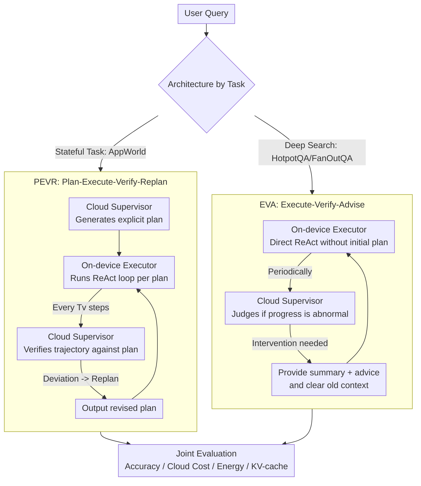

# When Cloud Agents Meet Device Agents: Lessons from Hybrid Multi-Agent Systems

**Conference**: ICML2026  
**arXiv**: [2605.30102](https://arxiv.org/abs/2605.30102)  
**Code**: None  
**Area**: Multi-Agent  
**Keywords**: Hybrid Multi-Agent Systems, Cloud Models, On-device Models, Agent Evaluation, Context Efficiency

## TL;DR
This paper systematically investigates hybrid multi-agent systems consisting of a cloud-based GPT-4o supervisor and on-device Qwen3 executors. It finds that PEVR and EVA have respective advantages in UI assistance and deep search. More cloud intervention is not necessarily better, while context resetting and summarization significantly improve costs and KV-cache pressure for long-duration on-device tasks.

## Background & Motivation
**Background**: LLM agents are transitioning from short dialogues to long-horizon task execution, requiring goal decomposition, tool invocation, state maintenance, and multi-step actions in environments. The strongest frontier LLMs are typically deployed in the cloud with high capability but substantial token costs; smaller SLMs can run on phones or laptops with lower costs and better privacy but limited long-context and complex reasoning abilities.

**Limitations of Prior Work**: Hybrid AI often employs routers to choose between large and small models or escalates to large models when small models fail. However, in agent scenarios, computation involves not just "which model answers," but also who plans, who executes, who verifies, and when to restart the context. Most existing systems are designed ad-hoc for single tasks, lacking systematic comparisons across tasks and cost dimensions.

**Key Challenge**: Increased cloud model intervention theoretically provides stronger supervision but increases API costs and may frequently interrupt on-device execution. Sustained on-device execution saves money but results in KV-cache growth, context corruption, and error accumulation due to long contexts. The difficulty in hybrid MAS lies in finding a Pareto balance between accuracy, cloud expenses, and on-device energy consumption.

**Goal**: The authors aim to adapt representative multi-agent architectures into cloud-edge hybrid versions and systematically evaluate the impact of task division, supervision frequency, restart methods, and context management on performance and cost across HotpotQA, FanOutQA, and AppWorld tasks.

**Key Insight**: The paper utilizes cloud-based GPT-4o as an intermittent Supervisor and on-device Qwen3 (4B/8B/14B/32B) as long-term Executors. In this setup, the token-intensive ReAct execution remains on-device, while the expensive cloud model intervenes only for planning, verification, or advice.

**Core Idea**: Treat hybrid agent design as a multi-agent role assignment problem rather than simple model routing. By comparing PEVR and EVA architectures, the study identifies the boundaries where "planned supervision" and "advisory summarization" are respectively suitable for different tasks.

## Method
The paper does not propose a new agent benchmark but conducts systematic experiments around the design space of hybrid MAS. Core variables include whether the architecture uses PEVR or EVA, the size of the on-device Executor (Qwen3), the frequency of cloud Supervisor verification, and whether failure leads to re-planning or advice with context reset.

### Overall Architecture
The system consists of two roles. The Executor is an on-device small model responsible for the continuous ReAct loop: generating reasoning/actions based on the current task, context, and available tools, invoking the environment, and collecting observations. The Supervisor is cloud-based GPT-4o, which does not directly execute tools but periodically reviews the trajectory to decide whether to intervene. Users control the cloud intervention frequency via a verification interval; a smaller interval leads to more frequent cloud calls and higher costs.

The experiments cover three task families of increasing difficulty. HotpotQA is short-range multi-hop QA (reporting ROUGE-1 F1); ForOutQA is long-range fan-out information aggregation (reporting ROUGE-1 F1); AppWorld is a stateful API environment (reporting Test Pass Ratio and Task Success). Efficiency metrics include cloud API cost in USD, estimated on-device energy consumption, and maximum KV-cache usage. Two mutually exclusive architecture combinations, PEVR and EVA, are compared by task type and evaluated across accuracy, cost, and context dimensions.

### Key Designs

**1. PEVR: Plan-Execute-Verify-Replan**

This pipeline serves stateful API tasks like AppWorld—where an early erroneous action might be irreversible, and the control flow and tool call sequence must be correct from the start. Mechanistically, the cloud Supervisor first generates a natural language plan based on the user query, and the on-device Executor runs the ReAct loop following the plan. Every $T_v$ steps, the Supervisor checks the trajectory against the plan. If a deviation is detected, it outputs a revised plan, and the Executor continues under the updated strategy. Expensive cloud capabilities are concentrated on "planning + correction," while token-heavy step-by-step execution remains on-device.

**2. EVA: Execute-Verify-Advise**

This follows a strategy for deep search tasks like HotpotQA / FanOutQA—where performance relies heavily on continuous exploration and information aggregation, and frequent re-planning might interrupt accumulated search trajectories. Thus, EVA provides no initial plan; the on-device Executor explores autonomously via ReAct. The cloud Supervisor periodically judges progress. When intervention is needed, it does not rewrite the plan but generates a summary of past actions plus a piece of advice, then clears the Executor's old context to continue. Lightweight advice and summarization maintain the search direction while pruning accumulated long contexts on-device.

**3. Cost and Context Efficiency Joint Evaluation**

The value of hybrid MAS is not just being "more accurate than a standalone on-device model," but also being "cheaper than a pure cloud model" and "capable of completing long tasks within on-device memory limits." Thus, the paper tracks accuracy alongside cloud expenditures (total GPT-4o API price), on-device energy (estimated by inference volume), and context pressure (max KV-cache footprint). Crucially, PEVR's re-planning and EVA's summarization/resetting periodically truncate the on-device context, directly limiting KV-cache growth—turning context management into an inherent benefit of the architecture.

### Loss & Training
No models are trained; all experiments involve system design comparisons during inference. The cloud model is fixed as GPT-4o, and on-device models are Qwen3 4B, 8B, 14B, and 32B. HotpotQA has a maximum of 10 ReAct turns with verification intervals of 1/2/3/5; FanOutQA has 20 turns with intervals 1/2/3/5/10; AppWorld has 40 turns with intervals 1/2/4/8/16. Qwen3 32B uses fp8 KV-cache and weight quantization for single A100 experiments.

## Key Experimental Results

### Main Results
The main conclusions are drawn from the comparison of "who acts as Executor and who acts as Supervisor." Scores are the best accuracy settings for each task, while cost represents cloud API costs (lower is better).

| Configuration | AppWorld Task Success | AppWorld Cost | FanOutQA ROUGE-1 F1 | FanOutQA Cost | Conclusion |
|------|----------------------|---------------|---------------------|---------------|------|
| GPT-4o Monolithic Cloud | 0.25 | 0.37 | 0.14 | 0.19 | Accurate but high cost |
| Qwen 32B Executor + GPT-4o Supervisor | 0.21 | 0.09 | 0.23 | 0.11 | Superior to pure cloud in FanOutQA and cheaper |
| Qwen 14B Executor + GPT-4o Supervisor | 0.19 | 0.08 | 0.12 | 0.04 | Low cost, performance limited by on-device model |
| Qwen 8B Executor + GPT-4o Supervisor | 0.16 | 0.08 | 0.09 | 0.04 | Still superior to some on-device standalone configs |
| Qwen 4B Executor + GPT-4o Supervisor | 0.11 | 0.13 | 0.06 | 0.04 | Small model execution capability becomes bottleneck |
| GPT-4o Executor + Qwen 32B Supervisor | 0.25 | 0.67 | 0.14 | 0.17 | Cloud execution with device supervision is more expensive |
| Qwen 32B Monolithic On-device | 0.07 | 0.00 | 0.15 | 0.00 | Cheap but significantly lacking in AppWorld |

### Ablation Study
The paper analyzes verifier misjudgment, role reversal, and context efficiency.

| Benchmark | Verifier | False Negative | False Positive | Explanation |
|-----------|----------|----------------|----------------|------|
| AppWorld | Plan-based PEVR | 5.3% | 6.2% | More aggressive intervention; plan deviation is an effective signal |
| AppWorld | Query-based EVA | 6.0% | 1.9% | More conservative; lacks initial plan assistance |
| FanOutQA | Plan-based PEVR | 8.4% | 7.7% | Too many restarts hurt long-range search |
| FanOutQA | Query-based EVA | 14.8% | 6.1% | Higher leakage but fewer execution interruptions |

| Max Turns | Architecture | Qwen3 8B Task Success | Qwen3 8B KV$ GB | Qwen3 32B Task Success | Qwen3 32B KV$ GB |
|-----------|--------------|-----------------------|------------------|------------------------|-------------------|
| 20 | Monolithic | 0.00 | 3.52 | 0.05 | 6.59 |
| 20 | PEVR | 0.07 | 3.34 | 0.18 | 6.53 |
| 40 | Monolithic | 0.02 | 4.82 | 0.07 | 11.34 |
| 40 | PEVR | 0.09 | 3.65 | 0.16 | 6.98 |
| 80 | Monolithic | 0.00 | 5.17 | 0.09 | 13.12 |
| 80 | PEVR | 0.11 | 3.82 | 0.19 | 7.90 |

### Key Findings
- Hybrid MAS can find configurations that are more accurate than standalone on-device models and cheaper than standalone cloud models, though the optimal point varies by task.
- PEVR is better suited for AppWorld because stateful environments require initial plans and actionable re-planning; EVA is better for FanOutQA / HotpotQA as deep search performance is significantly harmed by frequent restarts.
- More cloud supervision does not equal higher accuracy. Intervals that are too short increase costs and might interrupt on-device execution through over-intervention.
- Larger on-device models are generally better, but hybrid architectures complete tasks that neither pure cloud nor pure on-device models finish, indicating that collaboration is not just a union of simple routers.
- The context resetting and summarization in PEVR/EVA limit KV-cache growth. In the AppWorld 80-turn scenario, Qwen3 32B with PEVR uses 7.90GB KV-cache vs. 13.12GB for the monolithic on-device version.

## Highlights & Insights
- The paper avoids simplifying hybrid agents into "ask the big model when the small model fails," instead decomposing roles like planning, execution, verification, and advice.
- "More cloud intervention could be worse" is a critical engineering insight. Strong models that frequently restart long-range searches may destroy accumulated intermediate states.
- The difference between PEVR and EVA suggests agent architectures should be task-adaptive: stateful tasks need executable plans, while open information search needs exploration preservation and moderate summarization.
- Context efficiency data is highly practical. The bottleneck for many on-device agents is not single-step inference but KV-cache explosion from long trajectories; MAS periodic resetting alleviates this.

## Limitations & Future Work
- Cloud models are fixed to GPT-4o and on-device models to the Qwen3 series; different model families or stronger local models might shift the optimal architecture.
- Evaluations cover HotpotQA, FanOutQA, and AppWorld but exclude code agents, robot control, browser GUI, or real mobile deployment.
- Energy consumption is estimated rather than measured on actual hardware. Real-world latency, thermal throttling, and memory bandwidth on phones/laptops introduce additional constraints.
- Verification intervals are currently set by manual sweep; a future direction involves learning dynamic supervisor policies that decide when to request cloud assistance based on uncertainty.

## Related Work & Insights
- **vs. Monolithic Cloud Agents**: Cloud agents are capable but expensive. Hybrid MAS can enter a similar or better Pareto region at lower costs.
- **vs. Monolithic On-device Agents**: On-device agents are cheap but often fail on long-range stateful tasks like AppWorld; cloud planning/verification provides critical error correction.
- **vs. Model Routing**: Routing selects one model per query, whereas MAS performs tasks that both pure cloud and pure on-device models fail, indicating that role collaboration yields new behaviors.
- **vs. AgentFlow / Advisor-style MAS**: PEVR is similar to planner-executor-verify-replan, while EVA is like an advisor with reset. The paper's contribution lies in comparing them within a unified cloud-edge cost framework.

## Rating
- Novelty: ⭐⭐⭐⭐☆ Hybrid cloud/device agents are not entirely new, but the systematic decomposition of PEVR/EVA relative to cost, energy, and context efficiency is valuable.
- Experimental Thoroughness: ⭐⭐⭐⭐☆ Solid analysis across three benchmarks and multiple model sizes; however, physical device measurements are lacking.
- Writing Quality: ⭐⭐⭐⭐☆ Clear structure and logic; some figures require cross-referencing with tables for full comprehension.
- Value: ⭐⭐⭐⭐⭐ Extremely practical for deploying on-device agents with cloud assistance, especially the design principle of "limited cloud supervision + context management."

<!-- RELATED:START -->

## Related Papers

- [\[ICLR 2026\] When Agents "Misremember" Collectively: Exploring the Mandela Effect in LLM-based Multi-Agent Systems](../../ICLR2026/multi_agent/when_agents_misremember_collectively_exploring_the_mandela_effect_in_llm-based_m.md)
- [\[AAAI 2026\] EcoAgent: An Efficient Device-Cloud Collaborative Multi-Agent Framework for Mobile Automation](../../AAAI2026/multi_agent/ecoagent_an_efficient_device-cloud_collaborative_multi-agent.md)
- [\[AAAI 2026\] Scalable and Accurate Graph Reasoning with LLM-Based Multi-Agents](../../AAAI2026/multi_agent/scalable_and_accurate_graph_reasoning_with_llm-based_multi-agents.md)
- [\[ICLR 2026\] Multi-Agent Design: Optimizing Agents with Better Prompts and Topologies](../../ICLR2026/multi_agent/multi-agent_design_optimizing_agents_with_better_prompts_and_topologies.md)
- [\[ICML 2026\] EngiAgent: Fully Connected Coordination of LLM Agents for Solving Open-ended Engineering Problems with Feasible Solutions](engiagent_fully_connected_coordination_of_llm_agents_for_solving_open-ended_engi.md)

<!-- RELATED:END -->
