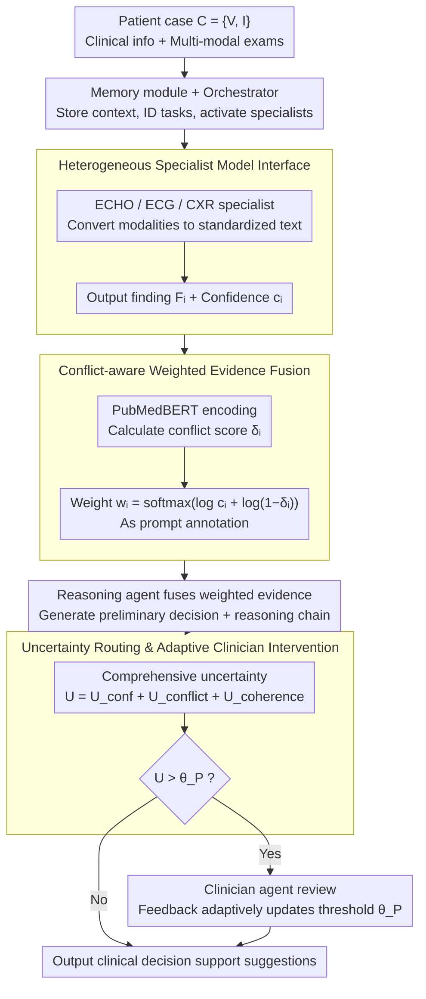

# Why Specialist Models Still Matter: A Heterogeneous Multi-Agent Paradigm for Medical Artificial Intelligence

**Conference**: ICML2026  
**arXiv**: [2605.29744](https://arxiv.org/abs/2605.29744)  
**Code**: No public code available  
**Area**: Multi-Agent / Clinical Decision Making
**Keywords**: Medical Multi-Agent, Specialist Models, Clinical Decision Support, Uncertainty Routing, Evidence Fusion  

## TL;DR
HetMedAgent organizes generalist LLMs, modal-specific specialist models, and clinicians into a heterogeneous multi-agent system. Through conflict-aware evidence fusion and uncertainty routing, it demonstrates on cardiovascular and chest X-ray clinical decision tasks that specialist models and human supervision remain indispensable components of medical AI.

## Background & Motivation
**Background**: Generalist LLMs such as GPT and Claude are exhibiting increasing performance in medical Q&A and clinical reasoning. A natural question arises in the medical field: since large models can read medical records, answer medical questions, and explain diagnoses, is there still a need to train specialist models for specific modalities like ECG, ECHO, and CXR.

**Limitations of Prior Work**: The risks of a single medical LLM are evident. While it can produce fluent reasoning chains, its understanding of low-level signals in specific examination modalities is not necessarily reliable. Furthermore, medical data is highly private, scarce, and fragmented across institutions, making the training of an all-encompassing medical foundation model costly and regulatorily challenging. On the other hand, while pure specialist models are strong in narrow tasks, they lack cross-modal integration, clinical context reasoning, and liability boundaries.

**Key Challenge**: Medical decision-making is not a matter of "one model outputting one answer" but a collaborative process involving multiple types of evidence, various professional roles, and ultimate responsibility. Generalist LLMs excel at organizing language and comprehensive reasoning; specialist models excel at modality-specific diagnosis; and physicians are responsible for safety, ethics, and final adjudication. Pursuing single-model automation alone sacrifices at least one of these capabilities.

**Goal**: The paper aims to demonstrate that specialist models have not been rendered obsolete by generalist LLMs; a more rational path is to treat them as plug-and-play experts that, along with a generalist LLM and a clinician agent, form a clinical decision support system. The system should not only improve AUROC/F1 but also know when it should not answer automatically and should instead escalate to a physician.

**Key Insight**: The authors design medical AI as a heterogeneous multi-agent collaborative workflow. Each patient case includes clinical information and multi-modal examinations. An orchestrator selects specialist models, specialists output structured findings with confidence, a reasoning agent performs evidence fusion, and uncertainty routing decides whether to trigger clinician intervention.

**Core Idea**: Instead of letting generalist LLMs replace specialist models, LLMs should be responsible for coordination and reasoning, specialist models for providing modal evidence, and physicians for handling high-uncertainty cases.

## Method
The core of HetMedAgent is not a single network but a medical decision-making workflow. it formalizes MDT-style collaboration as an executable agent pipeline and explicitly models evidence conflict, generated confidence, reasoning consistency, and physician intervention thresholds within the pipeline.

### Overall Architecture
The system input is a patient case $C=\{V,I\}$, where $V$ represents clinical information such as age, gender, chronic history, treatment history, and symptoms, and $I$ represents examination modalities, such as ECHO reports, ECG images, or CXR images. The goal is to output a set of clinical decisions, such as 180-day cardiovascular admission risk, etiology prediction, severity assessment, or acute/non-acute judgment of chest X-rays.

In the process, the memory module first stores patient information, interaction history, available modalities, and task definitions. The orchestrator agent reads this context, identifies the task, and activates the appropriate specialist agents. Each specialist converts its modality into standardized diagnostic text and confidence $c_i$. Subsequently, the system calculates semantic conflict scores between different specialists and assigns weights to each finding. The reasoning agent receives the clinical context and weighted evidence to generate a preliminary decision and a reasoning chain. Finally, the system calculates a comprehensive uncertainty; if it exceeds a threshold, the case is handed to a clinician agent for review; otherwise, the output is provided as a clinical decision support recommendation.

### Key Designs
1.  **Heterogeneous Specialist Model Interface**:
    - **Function**: Allows medical models of different modalities to access the system in a unified format while retaining their respective specialized capabilities.
    - **Mechanism**: Each specialist agent outputs $F_i^w=\{diagnosis:F_i, confidence:c_i\}$. The ECHO specialist uses a text-to-text Transformer/LSTM structure to process report sequences. The ECG specialist uses a CNN image encoder plus a Transformer encoder-decoder to convert ECG images into diagnostic text. A dual-view chest X-ray specialist is also included in CXR expansion experiments.
    - **Design Motivation**: Medical modalities vary significantly; forcing all inputs into a single LLM loses modal details. A unified text finding interface allows the downstream reasoning agent to consume evidence explainably while allowing new specialist models to be added incrementally via standard interfaces.

2.  **Conflict-aware Weighted Evidence Fusion**:
    - **Function**: When multiple specialists provide complementary or contradictory evidence, the system does not simply concatenate them but adjusts evidence weights based on confidence and the degree of conflict.
    - **Mechanism**: Each finding is projected into semantic space using a PubMedBERT bi-encoder to calculate its average similarity with other specialists, yielding a conflict score $\delta_i$. Weights are calculated as $w_i=\mathrm{softmax}(\log c_i+\log(1-\delta_i))$ and provided to the reasoning agent as prompt-level annotations to indicate which evidence is more reliable.
    - **Design Motivation**: Natural language findings from different modalities do not share a probability label space, making a direct product-of-experts impossible. Using weights as structured text annotations preserves the LLM's integrated reasoning capability while allowing it to see evidence reliability explicitly.

3.  **Uncertainty Routing and Adaptive Clinician Intervention**:
    - **Function**: Positions the system as clinical decision support rather than an unsupervised autonomous diagnoser.
    - **Mechanism**: Comprehensive uncertainty consists of three parts: specialist confidence gap $U_{conf}=1-\max_i(c_i)$, average conflict $U_{conflict}=\frac{1}{k}\sum_i\delta_i$, and reasoning chain incoherence $U_{coherence}$. When $U(D_{prelim})>\theta_P$, the case is escalated to the clinician agent. The threshold is updated based on physician feedback: if the physician accepts, the threshold is slightly increased; if the physician modifies, the threshold is decreased.
    - **Design Motivation**: The core of medical scenarios is not to have AI answer automatically as much as possible, but to automate low-risk, low-conflict cases while precisely handing difficult/contradictory cases to physicians to balance efficiency and safety.

### Loss & Training
The paper does not train the entire multi-agent system end-to-end; instead, it individually trains/configures specialist models and uses a generalist LLM as the orchestrator and reasoning backend. ECHO/ECG specialists output diagnostic text, with diagnostic quality evaluated via BERTScore. Clinical decision results are evaluated using AUROC and F1. In the main experiments, the generalist LLM defaults to GPT-4o, with substitution experiments using Claude, Gemini, Llama, Qwen, and GLM. Physician intervention threshold experiments use a fixed threshold $\theta_P=0.5$ and simulated sequential feedback to verify the calibration mechanism.

## Key Experimental Results

### Main Results
The main experiment involve 613 real cardiovascular cases from 514 patients. Inputs include ECHO reports and ECG images; tasks include admission risk stratification, etiology prediction, and severity assessment. HetMedAgent is compared with medical LLMs and standard multi-agent systems.

| Method | Risk AUROC/F1 | Etiology AUROC/F1 | Severity AUROC/F1 | Average Observation |
|------|---------------|---------------|-----------------|----------|
| Meditron | 0.801 / 0.768 | 0.723 / 0.681 | 0.673 / 0.634 | One of the strongest single-model baselines |
| MedAgents | 0.823 / 0.789 | 0.751 / 0.708 | 0.692 / 0.653 | Strongest multi-agent baseline |
| AgentClinic | 0.817 / 0.781 | 0.738 / 0.695 | 0.681 / 0.641 | Multi-role collaboration with GPT-4 physicians |
| HetMedAgent w/o Clinician (Ours) | 0.866 / 0.844 | 0.801 / 0.757 | 0.727 / 0.719 | Best across all three tasks |

The authors report that HetMedAgent improves average AUROC by +6.6% and F1 by +7.9% compared to the best single-model baseline and improves average AUROC by +4.3% and F1 by +5.7% compared to the best multi-agent baseline. This indicates that gains come not just from "multi-LLM discussion" but also from specialist models and conflict/uncertainty mechanisms.

### Ablation Study

| Configuration | Key Metrics | Explanation |
|------|---------|------|
| GPT-4o Standalone | Avg AUROC 0.671, F1 0.625 | Clinical decision is clearly insufficient with generalist LLM only |
| + ECHO specialist | Avg AUROC 0.752, F1 0.711 | ECHO info brings +8.1% AUROC, +8.6% F1 |
| + ECG specialist | Avg AUROC 0.734, F1 0.692 | ECG info also significantly improves performance |
| + Two specialists | Avg AUROC 0.798, F1 0.773 | Best with bi-modal complementarity |
| Weighted evidence | Avg AUROC 0.798, F1 0.773 | Best with correct weight annotations |
| No annotation | Avg AUROC 0.777, F1 0.749 | Performance drops after removing weights |
| Inverse-weighted | Avg AUROC 0.758, F1 0.727 | Inverse weighting hurts most, showing LLM utilizes weights |

### Key Findings
- Transformer-based specialists are significantly stronger than traditional CNN specialists. ECHO BERTScore increased from 0.707 (ResNet-based) to 0.800; ECG increased from 0.658 to 0.717, and the average conflict score decreased.
- Different generalist LLMs can be integrated, but GPT-4o performs best with an average AUROC/F1 of 0.798/0.773; Claude-3.5-Sonnet achieved 0.791/0.766, and Gemini-2.0-Flash achieved 0.783/0.757, showing the framework is not strictly tied to one LLM.
- With a fixed threshold $\theta_P=0.5$, 114 out of 613 test cases (18.6%) triggered physician intervention. These cases had lower F1 scores, indicating the uncertainty mechanism successfully filtered more difficult cases.
- Adaptive thresholding reduced interventions from 114 to 97 (15.8%), while AIR increased from 1.468 to 1.679, showing that feedback calibration can more accurately distinguish between automated and intervention-required cases.
- In cross-domain chest X-ray experiments, HetMedAgent achieved an AUROC of 0.820 and F1 of 0.537 on IU X-Ray acute/non-acute tasks, outperforming ViT-BERT's 0.783/0.468, verifying the framework's transferability across medical specialties.

## Highlights & Insights
- The paper explicitly opposes the narrative of "medical LLM dominance" and instead emphasizes collaborative system design. This is pragmatic: medical AI bottlenecks often lie not in linguistic ability but in modal expertise, liability boundaries, and uncertainty management.
- Using specialist weights as prompt-level evidence annotations is a clever compromise. It avoids the difficulty of cross-modal probability calibration while allowing the LLM to explicitly know which evidence is more credible during reasoning.
- Uncertainty routing brings the system closer to real clinical workflows. Automation is not the goal itself; correctly knowing when to escalate to a doctor is a key capability for safe deployment.
- Although the cross-domain CXR experiment is supplementary, it is vital. It demonstrates that HetMedAgent is not just a manually assembled pipeline for ECHO+ECG but a modular paradigm where specialists can be replaced.

## Limitations & Future Work
- Generated confidence $c_i$ is essentially token-level confidence and is not equivalent to clinical correctness. Future work needs stronger per-modality calibration, such as Platt scaling or confidence calibration based on expert labels.
- Physician feedback in the experiments was primarily simulated using ground truth rather than real multi-physician consensus. In real deployment, physician opinions may have noise and disagreement; threshold updates need more robust handling of momentum, boundaries, and abnormal feedback.
- The main dataset comes from cardiovascular cases at a single institution with a small scale of 613 cases; sub-groups like Age $\ge 85$ have fewer samples, so conclusions on fairness and generalization are not yet robust.
- The exchange of primarily text between agents may lose spatial structures and continuous representations in ECG/CXR. The paper suggests that future work could allow specialists to output structured text and embeddings simultaneously for the reasoning module.
- Commercial LLM APIs pose privacy and compliance issues. Although the authors discuss local open-weight replacements, actual performance, cost, and safety audits still need verification.

## Related Work & Insights
- **vs Medical LLMs**: PMC-LLaMA, Meditron, and BioMistral inject medical knowledge into a single model; HetMedAgent argues that medical decisions are better suited for generalist reasoning + specialist precision + clinician oversight.
- **vs AgentClinic/MedAgents**: These systems are mostly LLM role-playing collaborations lacking real modal specialist models and physician routing mechanisms; the heterogeneity of HetMedAgent is closer to clinical MDT.
- **vs Traditional Specialist Models**: Single-modal models like ResNet/EfficientNet can perform local diagnosis but cannot integrate clinical context; HetMedAgent retains their modal capabilities while delegating cross-evidence reasoning to the LLM.
- **vs Traditional CDSS**: Conventional CDSS often provide rules or risk scores; HetMedAgent further provides traceable agent chains, weight annotations, and uncertainty escalation, suitable for process auditing.

## Rating
- Novelty: ⭐⭐⭐⭐☆ The idea of a medical multi-agent framework is not entirely new, but the systematic integration of specialist models, LLMs, physician intervention, and conflict weighting is comprehensive.
- Experimental Thoroughness: ⭐⭐⭐⭐☆ Main experiments, modal ablation, weight sensitivity, cross-LLM, and CXR transfer are extensive; however, real multi-institutional/real-physician feedback is still lacking.
- Writing Quality: ⭐⭐⭐⭐☆ Framework diagrams and processes are clear, and results are well-explained; there are many symbols, and some formulas may be heavy for clinical readers.
- Value: ⭐⭐⭐⭐☆ Very valuable for medical AI system design, especially emphasizing the long-term necessity of specialist models and clinician oversight.

<!-- RELATED:START -->

## Related Papers

- [\[AAAI 2026\] MedLA: A Logic-Driven Multi-Agent Framework for Complex Medical Reasoning with Large Language Models](../../AAAI2026/multi_agent/medla_a_logic-driven_multi-agent_framework_for_complex_medic.md)
- [\[ICLR 2026\] MMedAgent-RL: Optimizing Multi-Agent Collaboration for Multimodal Medical Reasoning](../../ICLR2026/multi_agent/mmedagent-rl_optimizing_multi-agent_collaboration_for_multimodal_medical_reasoni.md)
- [\[AAAI 2026\] LieCraft: A Multi-Agent Framework for Evaluating Deceptive Capabilities in Language Models](../../AAAI2026/multi_agent/liecraft_a_multi-agent_framework_for_evaluating_deceptive_capabilities_in_langua.md)
- [\[ACL 2026\] AgenticEval: Toward Agentic and Self-Evolving Safety Evaluation of Large Language Models](../../ACL2026/multi_agent/agenticeval_toward_agentic_and_self-evolving_safety_evaluation_of_large_language.md)
- [\[NeurIPS 2025\] MedAgentBoard: Benchmarking Multi-Agent Collaboration with Conventional Methods for Diverse Medical Tasks](../../NeurIPS2025/multi_agent/medagentboard_benchmarking_multi-agent_collaboration_with_conventional_methods_f.md)

<!-- RELATED:END -->
