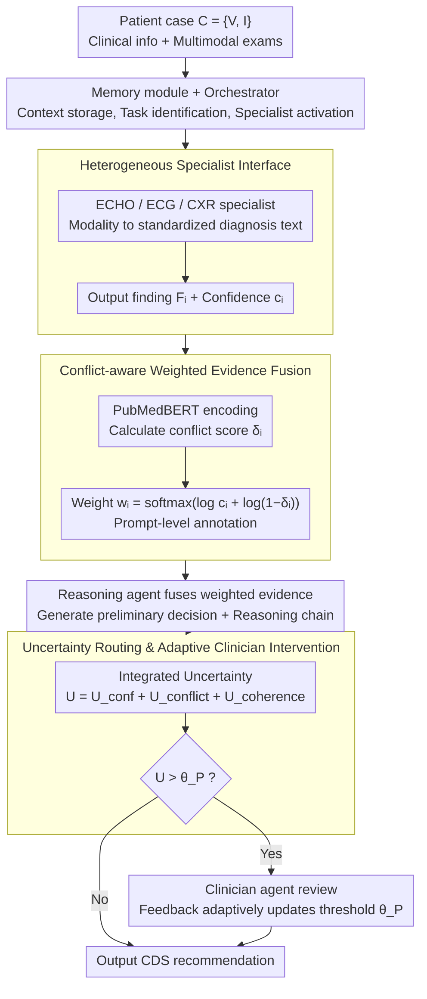

# Why Specialist Models Still Matter: A Heterogeneous Multi-Agent Paradigm for Medical Artificial Intelligence

**Conference**: ICML2026  
**arXiv**: [2605.29744](https://arxiv.org/abs/2605.29744)  
**Code**: No code publicly available  
**Area**: Multi-Agents / Clinical Decision Making  
**Keywords**: Medical Multi-Agents, Specialist Models, Clinical Decision Support, Uncertainty Routing, Evidence Fusion  

## TL;DR
HetMedAgent organizes generalist LLMs, modality-specific models, and clinicians into a heterogeneous multi-agent system. Through conflict-aware evidence fusion and uncertainty routing, it demonstrates that specialist models and human supervision remain irreplaceable components of medical AI in cardiovascular and chest X-ray clinical decision-making tasks.

## Background & Motivation
**Background**: Generalist LLMs like GPT and Claude are demonstrating increasing performance in medical QA and clinical reasoning. A natural question arises in the medical field: since large models can read medical records, answer medical questions, and explain diagnoses, is there still a need to train specialist models for specific modalities such as ECG, ECHO, and CXR.

**Limitations of Prior Work**: The risks of a single medical LLM are evident. It can provide fluent reasoning chains, but its understanding of the underlying signals of specific examination modalities is not necessarily reliable. Furthermore, medical data is highly private, scarce, and fragmented across institutions, making the training of an all-encompassing medical foundation model costly and difficult regarding compliance. Conversely, while pure specialist models are strong in narrow tasks, they lack cross-modal integration, clinical background reasoning, and responsibility boundaries.

**Key Challenge**: Medical decision-making is not a matter of "one model outputting one answer" but a collaboration between multiple types of evidence, various professional roles, and final accountability. Generalist LLMs excel at language organization and synthesis, specialist models excel at modality-specific diagnosis, and clinicians are responsible for safety, ethics, and final adjudication. Pursuing only single-model automation sacrifices at least one of these capabilities.

**Goal**: This paper aims to prove that specialist models have not been eliminated by generalist LLMs. A more reasonable path is to treat them as pluggable experts that form a clinical decision support system alongside generalist LLMs and clinician agents. The system should not only improve AUROC/F1 but also know when it should not answer automatically and instead escalate the case to a physician.

**Key Insight**: The authors design medical AI as a heterogeneous multi-agent collaborative workflow. Each patient case includes clinical information and multimodal examinations; an orchestrator selects specialist models, specialists output structured findings with confidence, a reasoning agent performs evidence fusion, and uncertainty routing determines whether to trigger clinician intervention.

**Core Idea**: Instead of letting generalist LLMs replace specialist models, let LLMs handle coordination and reasoning, while specialist models provide modality evidence and clinicians handle high-uncertainty cases.

## Method
The core of HetMedAgent is not a single network but a set of medical decision-making processes. It formalizes MDT-style (Multi-Disciplinary Team) collaboration as an executable agent pipeline, explicitly modeling evidence conflict, generation confidence, reasoning consistency, and clinician intervention thresholds within the pipeline.

### Overall Architecture
The system input is a patient case $C=\{V,I\}$, where $V$ includes clinical information such as age, sex, chronic history, treatment history, and symptoms, and $I$ represents examination modalities like ECHO reports, ECG images, or CXR images. The goal is to output a set of clinical decisions, such as 180-day cardiovascular admission risk, etiology prediction, severity assessment, or acute/non-acute judgment of chest X-rays.

In the workflow, a memory module first stores patient information, interaction history, available modalities, and task definitions. An orchestrator agent reads this context, identifies the task, and activates the appropriate specialist agents. Each specialist converts its modality into standardized diagnostic text and confidence. The system then calculates semantic conflict scores between different specialists and assigns weights to each finding. The reasoning agent receives the clinical context and weighted evidence to generate a preliminary decision and reasoning chain. Finally, the system calculates the integrated uncertainty; if it exceeds a threshold, the case is handed to a clinician agent for review; otherwise, it is output as a clinical decision support recommendation.

### Key Designs
1. **Heterogeneous Specialist Model Interface**:
	- **Function**: Allows medical models of different modalities to access the system in a unified format while retaining their respective specialized capabilities.
	- **Mechanism**: Each specialist agent outputs $F_i^w=\{diagnosis:F_i, confidence:c_i\}$. The ECHO specialist uses a text-to-text Transformer/LSTM structure to process report sequences; the ECG specialist uses a CNN image encoder with a Transformer encoder-decoder to convert ECG images into diagnostic text; dual-view chest X-ray specialists were also added in expansion experiments.
	- **Design Motivation**: Medical modalities vary significantly; forcing all inputs into a single LLM loses modality details. A unified text finding interface allows the downstream reasoning agent to consume evidence explainably while allowing new specialist models to be added incrementally via standard interfaces.

2. **Conflict-aware Weighted Evidence Fusion**:
	- **Function**: When multiple specialists provide complementary or contradictory evidence, the system adjusts evidence weights based on confidence and conflict levels instead of simple concatenation.
	- **Mechanism**: Each finding is projected into semantic space using a PubMedBERT bi-encoder to calculate its average similarity with other specialists, yielding a conflict score $\delta_i$. Weights are calculated as $w_i=\mathrm{softmax}(\log c_i+\log(1-\delta_i))$ and used as prompt-level annotations to inform the reasoning agent which evidence is more reliable.
	- **Design Motivation**: Natural language findings from different modalities do not share a probability label space, so a product-of-experts approach cannot be used directly. Using weights as structured text annotations preserves LLM diagnostic reasoning while allowing it to explicitly see evidence reliability.

3. **Uncertainty Routing & Adaptive Clinician Intervention**:
	- **Function**: Positions the system as a clinical decision support tool rather than an unsupervised automatic diagnostic engine.
	- **Mechanism**: Integrated uncertainty consists of three parts: specialist confidence gap $U_{conf}=1-\max_i(c_i)$, average conflict $U_{conflict}=\frac{1}{k}\sum_i\delta_i$, and reasoning chain incoherence $U_{coherence}$. When $U(D_{prelim})>\theta_P$, the case is escalated to the clinician agent. The threshold is updated based on doctor feedback: it increases if the doctor accepts and decreases if the doctor modifies the output.
	- **Design Motivation**: The core of medical scenarios is not to automate as many AI responses as possible, but to automate low-risk, low-conflict cases while precisely delivering difficult/contradictory cases to doctors, balancing efficiency and safety.

### Loss & Training
The paper does not train the entire multi-agent system end-to-end; instead, specialist models are trained/configured separately, and generalist LLMs serve as the orchestrator and reasoning backend. ECHO/ECG specialists output diagnostic text evaluated via BERTScore; clinical decision results are evaluated using AUROC and F1. GPT-4o is the default generalist LLM, with substitution experiments for Claude, Gemini, Llama, Qwen, and GLM. Adaptive thresholding was verified using a fixed baseline $\theta_P=0.5$ and simulated sequential feedback.

## Key Experimental Results

### Main Results
The main experiment involves 613 real cardiovascular cases from 514 patients. Inputs include ECHO reports and ECG images. Tasks include admission risk stratification, etiology prediction, and severity assessment. HetMedAgent was compared against medical LLMs and standard multi-agent systems.

| Method | Risk AUROC/F1 | Etiology AUROC/F1 | Severity AUROC/F1 | Average Observation |
|------|---------------|---------------|-----------------|----------|
| Meditron | 0.801 / 0.768 | 0.723 / 0.681 | 0.673 / 0.634 | One of the strongest single-model baselines |
| MedAgents | 0.823 / 0.789 | 0.751 / 0.708 | 0.692 / 0.653 | Strongest multi-agent baseline |
| AgentClinic | 0.817 / 0.781 | 0.738 / 0.695 | 0.681 / 0.641 | Multi-GPT-4 clinician role collaboration |
| **Ours** (w/o Clinician) | **0.866 / 0.844** | **0.801 / 0.757** | **0.727 / 0.719** | Best performance across all tasks |

The authors report that Ours achieves an average AUROC improvement of +6.6% and F1 improvement of +7.9% compared to the best single-model baseline, and +4.3% AUROC / +5.7% F1 compared to the best multi-agent baseline. This indicates gains come not just from "using multiple LLMs" but from specialist models and conflict/uncertainty mechanisms.

### Ablation Study

| Configuration | Key Metrics | Note |
|------|---------|------|
| GPT-4o Alone | Avg AUROC 0.671, F1 0.625 | Clinical decision performance is significantly insufficient with only a generalist LLM |
| + ECHO specialist | Avg AUROC 0.752, F1 0.711 | ECHO info yields +8.1% AUROC, +8.6% F1 |
| + ECG specialist | Avg AUROC 0.734, F1 0.692 | ECG info also provides significant gains |
| + Both specialists | Avg AUROC 0.798, F1 0.773 | Dual-modality complementarity is optimal |
| Weighted evidence | Avg AUROC 0.798, F1 0.773 | Correct weight annotation yields best results |
| No annotation | Avg AUROC 0.777, F1 0.749 | Performance drops without weights |
| Inverse-weighted | Avg AUROC 0.758, F1 0.727 | Inverse weights cause maximum harm, proving LLM utilizes weights |

### Key Findings
- Transformer-based specialists are significantly stronger than traditional CNN specialists. ECHO BERTScore increased from 0.707 (ResNet) to 0.800, ECG from 0.658 to 0.717, and average conflict scores decreased.
- Different generalist LLMs can be integrated, but GPT-4o performed best (Avg AUROC/F1: 0.798/0.773); Claude-3.5-Sonnet (0.791/0.766) and Gemini-2.0-Flash (0.783/0.757) followed, showing the framework is not bound to a specific LLM.
- With a fixed threshold $\theta_P=0.5$, 114 out of 613 test cases (18.6%) triggered clinician intervention; these cases had lower F1, indicating the uncertainty mechanism successfully filters harder cases.
- Adaptive thresholding reduced interventions from 114 to 97 (15.8%) while increasing AIR from 1.468 to 1.679, showing feedback calibration more accurately distinguishes between automatic processing and cases requiring intervention.
- In cross-domain chest X-ray experiments, HetMedAgent achieved AUROC 0.820 and F1 0.537 on the IU X-Ray acute/non-acute task, outperforming ViT-BERT (0.783/0.468).

## Highlights & Insights
- The paper explicitly opposes the narrative of "Medical LLM dominance," emphasizing collaborative system design. This is pragmatic: the bottleneck of medical AI is often modality expertise, responsibility boundaries, and uncertainty management rather than language capability.
- Using specialist weights as prompt-level evidence annotations is a clever compromise. It avoids the difficulty of cross-modal probability calibration while allowing the LLM to explicitly recognize more reliable evidence during reasoning.
- Uncertainty routing brings the system closer to real clinical workflows. Automation is not the goal itself; knowing when to escalate to a doctor is a critical capability for safe deployment.
- The cross-domain CXR experiment validates that HetMedAgent is a modular paradigm rather than a pipeline handcrafted only for ECHO+ECG.

## Limitations & Future Work
- Generated confidence $c_i$ is essentially token-level confidence and is not equivalent to clinical correctness. Stronger per-modality calibration (e.g., Platt scaling) is needed.
- Clinician feedback in the experiments was primarily simulated using ground truth rather than real multi-physician consensus. Actual deployment requires handling noisy or divergent expert opinions.
- The main dataset is from a single institution with 613 cases; sample sizes for subgroups (e.g., Age ≥85) are small, so fairness and generalization conclusions need further validation.
- Agents primarily exchange text, potentially losing spatial structures and continuous representations in ECG/CXR. Future work could allow specialists to output structured text and embeddings simultaneously.
- Commercial LLM APIs pose privacy and compliance issues. While the authors discuss local open-weight replacements, actual performance and security auditing remain to be verified.

## Related Work & Insights
- **vs. Medical LLMs**: PMC-LLaMA, Meditron, and BioMistral inject medical knowledge into single models; HetMedAgent argues medical decisions are better suited for generalist reasoning + specialist precision + clinician oversight.
- **vs. AgentClinic/MedAgents**: These systems mostly involve LLM role-playing collaboration, lacking real modality specialist models and clinician routing; HetMedAgent's heterogeneity is closer to clinical MDTs.
- **vs. Traditional Specialist Models**: Mono-modal models like ResNet/EfficientNet perform local diagnosis but cannot integrate clinical context; HetMedAgent preserves their modality capabilities while tasking the LLM with cross-evidence reasoning.
- **vs. Traditional CDSS**: Conventional CDSS often provide rules or risk scores; HetMedAgent provides traceable agent chains, weight annotations, and uncertainty escalation suitable for process auditing.

## Rating
- **Novelty**: ⭐⭐⭐⭐☆ The idea of medical multi-agent frameworks is not entirely new, but the systematic integration of specialist models, LLMs, clinician intervention, and conflict weighting is comprehensive.
- **Experimental Thoroughness**: ⭐⭐⭐⭐☆ Main experiments, modality ablations, weight sensitivity, and cross-LLM/CXR transfers are comprehensive; real multi-institution data and real clinician feedback are still lacking.
- **Writing Quality**: ⭐⭐⭐⭐☆ Framework diagrams and workflows are clear, and results are well-explained; though symbols are numerous, the mathematical weight might be heavy for clinical readers.
- **Value**: ⭐⭐⭐⭐☆ Highly valuable for medical AI system design, emphasizing the long-term necessity of specialist models and clinician oversight.

<!-- RELATED:START -->

## Related Papers

- [\[AAAI 2026\] MedLA: A Logic-Driven Multi-Agent Framework for Complex Medical Reasoning with Large Language Models](../../AAAI2026/multi_agent/medla_a_logic-driven_multi-agent_framework_for_complex_medic.md)
- [\[ICLR 2026\] From What to Why: A Multi-Agent System for Evidence-based Chemical Reaction Condition Reasoning](../../ICLR2026/multi_agent/from_what_to_why_a_multi-agent_system_for_evidence-based_chemical_reaction_condi.md)
- [\[ICLR 2026\] MMedAgent-RL: Optimizing Multi-Agent Collaboration for Multimodal Medical Reasoning](../../ICLR2026/multi_agent/mmedagent-rl_optimizing_multi-agent_collaboration_for_multimodal_medical_reasoni.md)
- [\[ICLR 2026\] Emergent Coordination in Multi-Agent Language Models](../../ICLR2026/multi_agent/emergent_coordination_in_multi-agent_language_models.md)
- [\[AAAI 2026\] LieCraft: A Multi-Agent Framework for Evaluating Deceptive Capabilities in Language Models](../../AAAI2026/multi_agent/liecraft_a_multi-agent_framework_for_evaluating_deceptive_capabilities_in_langua.md)

<!-- RELATED:END -->
