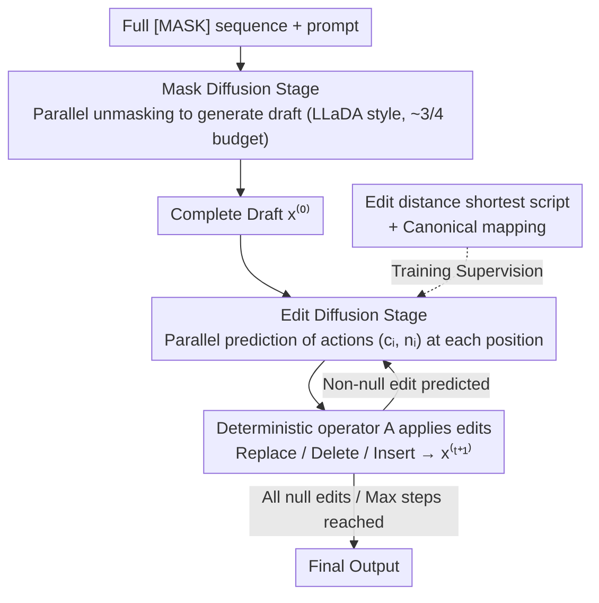

# Edit-Based Refinement for Parallel Masked Diffusion Language Models

**Conference**: ICML 2026  
**arXiv**: [2605.09603](https://arxiv.org/abs/2605.09603)  
**Code**: https://github.com/renhouxing/ME-DLM  
**Area**: Diffusion Language Models / Parallel Decoding / LLaDA / Text Generation  
**Keywords**: Masked Diffusion, edit-based refinement, edit distance supervision, parallel decoding

## TL;DR
ME-DLM introduces a lightweight "decode-then-edit" refinement stage to masked diffusion language models (e.g., LLaDA). The first stage generates a draft via standard parallel unmasking, while the second stage performs parallel corrections using replace/delete/insert actions supervised by the shortest edit distance scripts. Using only 1/8 of the diffusion step budget, it outperforms LLaDA-Instruct by +11.6 on HumanEval and +33.6 on GSM8K.

## Background & Motivation

**Background**: Masked Diffusion Language Models (MDLM) such as LLaDA and Dream have matched autoregressive LLMs at the billion-parameter scale. Their primary advantage is **parallel decoding**—filling multiple mask tokens simultaneously in a single step, which is significantly more time-efficient than autoregressive generation.

**Limitations of Prior Work**: When the number of tokens parallelly predicted per step increases from 1 to 4, 8, or 16, generation quality **plummets**. A striking example provided in the paper: models trained on "2+2=4", "2+3=5", and "3+2=5" might generate "2+2=5" during parallel decoding, as tokens are sampled independently based on marginal probabilities, violating arithmetic logic when combined.

**Key Challenge**: The MDLM training objective is token-level cross-entropy $\mathcal{L} \propto \mathbb{E}[-\log p_\theta(x_{0,i}|x_t)]$, which only models the **marginal distribution** of each position. However, during parallel decoding, the model takes the argmax across a set $\mathcal{S}$ simultaneously, implicitly assuming conditional independence $p_\theta(x_{0,\mathcal{S}}|x_t)\approx\prod_{i\in\mathcal{S}}p_\theta(x_{0,i}|x_t)$. **Marginal optimality $\neq$ Joint optimality**, which is the root cause of failure in multi-token parallel decoding.

**Goal**: To compensate for this "lack of joint consistency" without altering the LLaDA training paradigm or increasing the total diffusion step budget.

**Key Insight**: The authors observed that drafts produced via parallel decoding are often close to correct, containing only sparse structural errors (extra, missing, or incorrect tokens). By retaining the parallel unmasking stage to obtain a draft and adding a **lightweight edit refinement stage** for local corrections, one can achieve joint consistency while maintaining parallel speed.

**Core Idea**: Decompose the diffusion process into "mask diffusion (draft generation) + edit diffusion (local refinement)". The edit stage utilizes three token-level actions (Replace/Delete/Insert), supervised by the **shortest edit script (edit distance)** from the draft to the target.

## Method

### Overall Architecture
A two-stage diffusion process sharing a single set of parameters (LLaDA-8B), trained through three progressive stages:

- **Mask Diffusion Stage**: Starting from a fully masked sequence, tokens are unmasked following a schedule $\{t_K>\dots>t_0=0\}$. In each step, multiple mask tokens are filled in parallel to produce a complete draft $x^{(0)}$. This is identical to LLaDA.
- **Edit Diffusion Stage**: Starting from $x^{(0)}$, the model predicts a pair of actions $(c_i,n_i)$ for each token position—$c_i\in\mathcal{V}\cup\{\text{[DEL]}\}$ indicates replace/delete/keep at the current position, and $n_i\in\mathcal{V}$ indicates what to insert after the current position (if $n_i=c_{i+1}$, no insertion occurs). A deterministic operator $A$ applies these actions: $x^{(t+1)}=A(x^{(t)},\{(c_i,n_i)\})$. Actions are **predicted in parallel**, but the sequence changes holistically during application, coupling dependencies at the application layer.
- **Termination**: The process stops when the model predicts "null edits" for all positions ($c_i=x_i$ and no insertion) or reaches the maximum number of steps.

### Key Designs

**1. Token-level $(c_i,n_i)$ Edit Actions + Deterministic Application: Parallel Prediction, Serial Coupling**

To maintain MDLM's parallel advantage, the prediction must be factorized. However, solving "marginal $\neq$ joint" requires positional constraints. The authors resolve this by moving the "coupling" from the prediction phase to the application phase. Each position independently outputs actions: $c_i \in \mathcal{V}\cup\{\text{[DEL]}\}$ and $n_i \in \mathcal{V}$. Transitions appear independent at the prediction layer: $p_\theta(x^{(t+1)}|x^{(t)}) \equiv \prod_{i=1}^{L_t} p_\theta(c_i,n_i|x^{(t)})$. 

The deterministic operator $A$ introduces coupling: it scans from left to right, deleting $x_i^{(t)}$ if $c_i=\text{[DEL]}$, otherwise replacing it with $c_i$; then if $n_i \neq c_{i+1}$, it inserts $n_i$ after position $i$. Sequential insertions use a canonical representation. By keeping parallelism in prediction and moving joint consistency to deterministic application, the model bypasses the fundamental conflict between parallelism and explicit joint modeling—a clever engineering design.

**2. Edit Distance Supervision + Canonical Mapping: Learning "Minimal Correction" over "Rewriting"**

For the action space, a supervision signal is required that directs the model to "only change what is necessary." During training, the model generates an intermediate state $x^{(m)}$. The shortest edit script from $x^{(m)}$ to the ground-truth $x^\star$ is calculated using a standard edit distance algorithm. Canonical rules then map this script to target actions $(c_i^\star,n_i^\star)$. If multiple tokens need insertion at one spot, only the first is supervised in the current step, deferring the rest. This unique supervision prevents contradictory signals and encourages conservative edits, leading to natural convergence.

**3. Three-Stage Curriculum Training + Inference Step Allocation: Draft first, Patch later**

Training the edit stage directly would fail due to poor initial drafts. A curriculum approach is used: Stage 1 involves learning to predict the current and next token (Nemotron-Pretraining-SFT) to ground $(c_i, n_i)$ predictions; Stage 2 performs standard masked diffusion fine-tuning on R1-Distilled data for a strong baseline; Stage 3 interleaves mask and edit training with an increasing edit step parameter $m$. 

During inference, most of the budget is allocated to mask diffusion (e.g., 48 mask + 16 edit for a 64-step/1-8 budget). Table 3 shows that with a 1/1 budget, convergence often occurs in 6-9 edit steps, confirming it as a convergence process rather than open-ended rewriting.

### Loss & Training
- Progressive fine-tuning of LLaDA-8B: Stage 1 (lr=5e-5, batch=2048), Stage 2 (lr=5e-5, batch=128), Stage 3 (lr=1e-5, batch=128). Total training ~213 hours on 64×H800 GPUs.
- Inference: Mask diffusion followed by edit diffusion (max 32 steps) with early stopping on null edits.

## Key Experimental Results

### Main Results

Average gains across 6 math and code benchmarks at different budgets (Budget = total steps × tokens per step / sequence length):

| Budget | LLaDA-Instruct | ME-DLM Stage-2 | **ME-DLM Stage-3** | Gain (S3 vs S2) |
|--------|----------------|----------------|--------------------|--------------------|
| 1/1 | 45.3 | 55.7 | **60.0** | +4.3 |
| 1/2 | 42.5 | 50.7 | **55.4** | +4.7 |
| 1/4 | 32.3 | 37.7 | **46.4** | +8.7 |
| 1/8 | 20.9 | 19.3 | **32.6** | +13.3 |

Specific results at 1/8 budget (parallel 8 tokens/step, 64 steps total):

| Dataset | LLaDA-Instruct | ME-DLM Stage-3 | Gain |
|--------|----------------|----------------|------|
| HumanEval | 12.2 | 25.0 | **+12.8** |
| HumanEval+ | 9.8 | 22.6 | +12.8 |
| MBPP | 17.5 | 26.7 | +9.2 |
| GSM8K | 50.3 | 83.8 (84.8 @ 1/1) | **+33.5** |
| MATH-500 | 20.2 | 34.4 | +14.2 |

### Ablation Study

Step Allocation (1/8 budget = 64 steps total):

| m/e (mask/edit) | HumanEval | GSM8K | Remarks |
|-----------------|-----------|-------|------|
| 64/0 (only mask) | Significant drop | Significant drop | Validates parallel decoding failure |
| 32/32 | Moderate | Moderate | Balanced but insufficient mask |
| 48/16 (Default) | **Optimal** | **Optimal** | Sufficient draft + enough edit steps |

Edit Convergence Steps:

| Budget | Max Edit Cap | HumanEval (Actual) | MATH-500 (Actual) |
|--------|-------------|----------------|---------------|
| 1/1 | 32 | 6.2 | 7.4 |
| 1/2 | 32 | 21.6 | 17.8 |
| 1/4 | 32 | 27.6 | 24.1 |
| 1/8 | 16 | 15.2 | 14.7 |

### Key Findings
- **Smaller budgets yield higher edit returns**: The gain of Stage-3 over Stage-2 increases from +4.3 at 1/1 budget to +13.3 at 1/8, proving edit refinement effectively rescues aggressive parallel decoding.
- **Edit steps decrease as mask steps increase**: Validates the intuition that better drafts require fewer patches.
- **Significant GSM8K Improvement (+33.6)**: Mathematical reasoning is highly sensitive to joint consistency (one wrong token invalidates the whole problem), making edit refinement essential for such tasks.
- **Code vs. Math**: Improvements in code are smaller than in math, possibly because code has strong syntactic constraints that allow some error tolerance during parallel decoding.

## Highlights & Insights
- **Decoupled Design**: Separating factorized prediction from deterministic coupling allows the model to enjoy parallel efficiency while maintaining joint consistency. This trick is transferable to other parallel generation frameworks.
- **Edit Distance as Supervision**: In an era of RLHF/DPO, edit distance provides a stable, deterministic, and computable signal for "minimal correction" tasks.
- **Self-generated Trajectory Training**: Using the model's own drafts during Stage 3 training aligns the training and inference distributions, mitigating exposure bias.

## Limitations & Future Work
- **High Training Barrier**: Requires a three-stage progressive curriculum; Stage 1 alone takes approx. 150 hours.
- **Training Cost**: The edit stage requires self-rollouts, making the training per step significantly more expensive than standard SFT.
- **Diminishing Returns at 1/1 Budget**: When decoding is not aggressive, the overhead of the edit mechanism may not be justified.
- **Action Granularity**: Edits are limited to the token level and cannot perform span-level rewriting or structural reordering.

## Related Work & Insights
- **vs Soft Mask / EvoToken**: These modify the mask representation. ME-DLM is orthogonal, focusing on post-decoding refinement. ME-DLM outperforms Soft Mask by +14.3 on GSM8K (1/4 budget).
- **vs Speculative Decoding**: While similar in "draft-verify" philosophy, ME-DLM implements "draft-edit" within the diffusion framework.
- **vs Levenshtein Transformer**: ME-DLM scales these non-autoregressive MT concepts to modern large-scale diffusion language models like LLaDA.

## Rating
- Novelty: ⭐⭐⭐⭐ 
- Experimental Thoroughness: ⭐⭐⭐⭐ 
- Writing Quality: ⭐⭐⭐⭐⭐ 
- Value: ⭐⭐⭐⭐⭐ 

<!-- RELATED:START -->

## Related Papers

- [\[ACL 2025\] Just Go Parallel: Improving the Multilingual Capabilities of Large Language Models](../../ACL2025/multilingual_mt/just_go_parallel_improving_the_multilingual_capabilities_of_large_language_model.md)
- [\[ICML 2026\] Optimizing Language Models for Crosslingual Knowledge Consistency](optimizing_language_models_for_crosslingual_knowledge_consistency.md)
- [\[ACL 2026\] Language Models Entangle Language and Culture](../../ACL2026/multilingual_mt/language_models_entangle_language_and_culture.md)
- [\[AAAI 2026\] ViDia2Std: A Parallel Corpus and Methods for Low-Resource Vietnamese Dialect-to-Standard Translation](../../AAAI2026/multilingual_mt/vidia2std_a_parallel_corpus_and_methods_for_low-resource_vietnamese_dialect-to-s.md)
- [\[ACL 2026\] XQ-MEval: A Dataset with Cross-lingual Parallel Quality for Benchmarking Translation Metrics](../../ACL2026/multilingual_mt/xq-meval_a_dataset_with_cross-lingual_parallel_quality_for_benchmarking_translat.md)

<!-- RELATED:END -->
