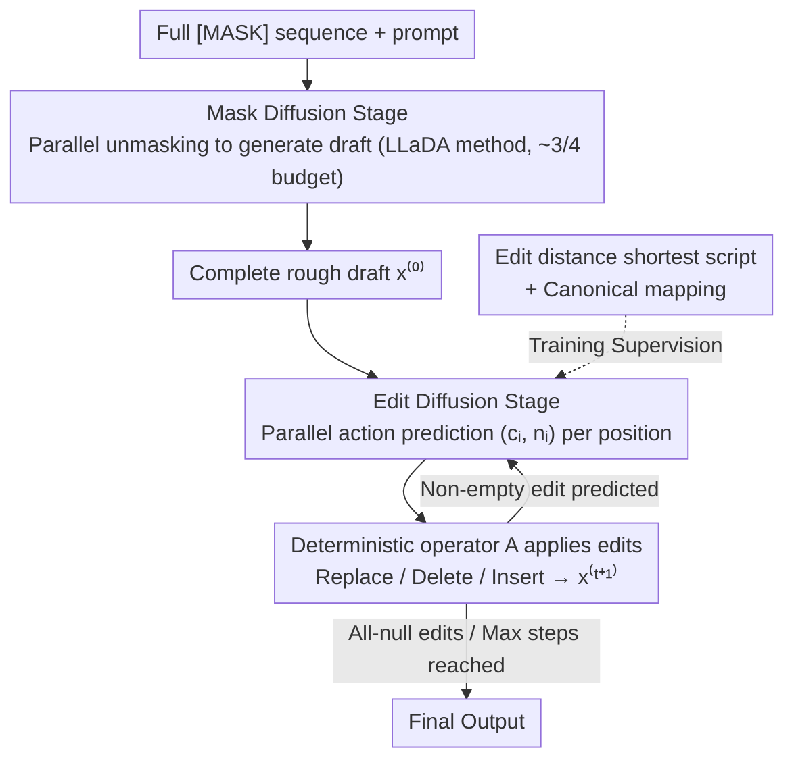

# Edit-Based Refinement for Parallel Masked Diffusion Language Models

**Conference**: ICML 2026  
**arXiv**: [2605.09603](https://arxiv.org/abs/2605.09603)  
**Code**: https://github.com/renhouxing/ME-DLM  
**Area**: Diffusion Language Models / Parallel Decoding / LLaDA / Text Generation  
**Keywords**: Masked Diffusion, edit-based refinement, edit distance supervision, parallel decoding

## TL;DR
ME-DLM adds a lightweight "post-decoding edit-and-patch" stage to masked diffusion language models (such as LLaDA). The first stage generates a rough draft via standard unmasking, while the second stage performs parallel corrections using three token-level edit operations: replace, delete, and insert. Supervised by the shortest edit script from the edit distance algorithm, it surpasses LLaDA-Instruct by +11.6 on HumanEval and +33.6 on GSM8K using only 1/8 of the diffusion steps.

## Background & Motivation

**Background**: Masked Diffusion Language Models (MDLM), such as LLaDA and Dream, can match autoregressive LLMs at the billion-parameter scale. Their primary advantage is **parallel decoding**—filling multiple mask tokens simultaneously in one step, which saves more time than autoregressive generation.

**Limitations of Prior Work**: When the number of tokens predicted in parallel per step increases from 1 to 4, 8, or 16, generation quality suffers a **catastrophic drop**. The paper provides a vivid extreme example: if the training set contains only "2+2=4", "2+3=5", and "3+2=5", and the model samples independently based on marginal token probabilities, it may produce "2+2=5"—each token is individually the most probable, but the combination violates arithmetic.

**Key Challenge**: The MDLM training objective is token-level cross-entropy $\mathcal{L} \propto \mathbb{E}[-\log p_\theta(x_{0,i}|x_t)]$, which only models the **marginal distribution** of each position. However, during parallel decoding, the model takes the argmax across a set $\mathcal{S}$ simultaneously, implicitly assuming conditional independence between positions: $p_\theta(x_{0,\mathcal{S}}|x_t) \approx \prod_{i\in\mathcal{S}} p_\theta(x_{0,i}|x_t)$. **Marginal optimization $\neq$ joint optimization**; this is the root cause of the failure in multi-token parallel decoding.

**Goal**: To compensate for this "lack of joint consistency" without altering the LLaDA training paradigm or increasing the total number of diffusion steps.

**Key Insight**: The authors observe that rough drafts generated by parallel decoding are often close to correct, containing only scattered structural errors (extra, missing, or incorrect tokens). If the first stage retains parallel unmasking to obtain a draft and is followed by a **lightweight edit-refinement stage** for local corrections, the model can maintain parallel speed while achieving joint consistency.

**Core Idea**: The diffusion process is split into two stages: "mask diffusion (draft generation) + edit diffusion (local refinement)." The edit stage uses three token-level edit actions (replace, delete, insert), with supervision signals derived from the **shortest edit script (edit distance)** from the draft to the target.

## Method

### Overall Architecture
A two-stage diffusion process sharing the same set of parameters (LLaDA-8B). Training proceeds through three progressive stages:

- **Mask diffusion stage**: Starting from an all-mask sequence, unmasking is performed iteratively according to a schedule $\{t_K > \dots > t_0 = 0\}$. Multiple mask tokens are filled in parallel at each step to obtain a complete rough draft $x^{(0)}$. This part is identical to LLaDA.
- **Edit diffusion stage**: Starting from $x^{(0)}$, the model predicts a pair of actions $(c_i, n_i)$ for each token position at each step. $c_i \in \mathcal{V} \cup \{\text{[DEL]}\}$ indicates whether to replace, delete, or keep the current position, and $n_i \in \mathcal{V}$ indicates what to insert after the current position (if $n_i = c_{i+1}$, no insertion occurs). A deterministic operator $A$ applies these actions: $x^{(t+1)} = A(x^{(t)}, \{(c_i, n_i)\})$. Actions for all positions are **predicted in parallel**, but the sequence changes collectively during application, coupling token dependencies at the application layer.
- **Termination**: The process stops when the model predicts "null edits" (where $c_i = x_i$ and no insertion occurs) for all positions or reaches the maximum number of iterations.

### Key Designs

**1. Token-level $(c_i, n_i)$ edit actions + Deterministic application: Parallel prediction, sequential coupling**

To maintain the parallel advantage of MDLM, the prediction side must be factorized. However, solving the "marginal $\neq$ joint" issue requires dependency between positions. The author's solution is to move the "coupling" from prediction to application. Each position outputs an action pair in parallel: $c_i$ determines replace/delete/keep, and $n_i$ determines what to insert after it. Transitions are independent at the prediction layer: $p_\theta(x^{(t+1)}|x^{(t)}) \equiv \prod_{i=1}^{L_t} p_\theta(c_i, n_i|x^{(t)})$.

The actual coupling occurs via the deterministic operator $A$: it scans from left to right, deleting $x_i^{(t)}$ if $c_i = \text{[DEL]}$ and replacing it otherwise, followed by inserting $n_i$ if $n_i \neq c_{i+1}$. Consecutive insertions use a canonical representation. This keeps parallelism in prediction and puts joint consistency in deterministic application, bypassing the fundamental conflict between parallelism and explicit joint modeling.

**2. Edit distance supervision + Canonical mapping: Learning "minimal correction" instead of "re-writing"**

Supervision signals must guide the model to change only what is necessary. During training, the current model generates an intermediate state $x^{(m)}$. The shortest edit script from $x^{(m)}$ to the ground-truth $x^\star$ is calculated using the edit distance algorithm. Canonical rules then map the script to target actions $(c_i^\star, n_i^\star)$. If multiple tokens need to be inserted at one position, only the first is supervised in the current step, with others deferred to subsequent steps.

Using edit distance as supervision avoids ambiguity: given $(x^{(m)}, x^\star)$, the shortest canonical script is unique. Learning "minimal modification" makes the model naturally conservative, outputting null edits to terminate as the sequence stabilizes, which aligns with the convergence semantics of diffusion.

**3. Three-stage curriculum training + Inference step allocation: Prioritizing draft quality before refinement**

Directly training the edit stage can fail if the initial draft is too poor. A curriculum is used: Stage 1 learns to predict the current and next token on Nemotron-Pretraining-SFT to lay the groundwork for $(c_i, n_i)$ predictions. Stage 2 involves standard masked diffusion fine-tuning on R1-Distilled data to establish a strong baseline. Stage 3 uses the same data with interleaved mask and edit training, gradually increasing the number of edit steps $m$.

During inference, most of the budget is allocated to mask diffusion. For example, in a 1/8 budget (64 steps), the allocation is 48 mask steps and 16 edit steps. Better drafts require fewer corrections, as confirmed in Table 3.

### Loss & Training
- Three-stage progressive fine-tuning of LLaDA-8B parameters. Stage 1: lr=5e-5, batch=2048; Stage 2: lr=5e-5, batch=128; Stage 3: lr=1e-5, batch=128; total training ~213 hours on 64×H800 GPUs.
- Inference: Mask diffusion followed by edit diffusion (max 32 steps). Early stopping occurs on all-null edits.

## Key Experimental Results

### Main Results

Average gains across 6 math and code benchmarks under different budgets (Budget = total steps × tokens per step / sequence length):

| Budget | LLaDA-Instruct | ME-DLM Stage-2 | **ME-DLM Stage-3** | Stage-3 vs Stage-2 |
|--------|----------------|----------------|--------------------|--------------------|
| 1/1 | 45.3 | 55.7 | **60.0** | +4.3 |
| 1/2 | 42.5 | 50.7 | **55.4** | +4.7 |
| 1/4 | 32.3 | 37.7 | **46.4** | +8.7 |
| 1/8 | 20.9 | 19.3 | **32.6** | +13.3 |

Specific dataset performance at 1/8 budget (8 tokens in parallel, 64 total steps):

| Dataset | LLaDA-Instruct | ME-DLM Stage-3 | Gain |
|--------|----------------|----------------|------|
| HumanEval | 12.2 | 25.0 | **+12.8** |
| HumanEval+ | 9.8 | 22.6 | +12.8 |
| MBPP | 17.5 | 26.7 | +9.2 |
| GSM8K | 50.3 | 83.8 (84.8 @ 1/1) | Significant |
| MATH-500 | 20.2 | 34.4 | +14.2 |

### Ablation Study

Step allocation at 1/8 budget (64 total steps):

| m/e (mask/edit) | HumanEval | GSM8K | Note |
|-----------------|-----------|-------|------|
| 64/0 (only mask) | Drop | Drop | Validates failure of base parallel decoding |
| 32/32 | Mid | Mid | Balanced but insufficient masking |
| 48/16 (Default) | **Best** | **Best** | More mask steps improve draft; 16 edit steps suffice |
| 0/64 (only edit) | - | - | Flexible but unstable |

Edit convergence steps:

| Budget | Max Edit Steps | Actual HumanEval | Actual MATH-500 |
|--------|----------------|------------------|-----------------|
| 1/1 | 32 | 6.2 | 7.4 |
| 1/2 | 32 | 21.6 | 17.8 |
| 1/4 | 32 | 27.6 | 24.1 |
| 1/8 | 16 | 15.2 | 14.7 |

### Key Findings
- **The lower the budget, the higher the gain from editing**: Stage-3 gain is +4.3 at 1/1 budget but reaches +13.3 at 1/8 budget, proving edit refinement is built for aggressive parallel decoding.
- **Edit steps decrease as mask steps increase**: At 1/1 budget, only 6-9 edit steps are needed for convergence, validating that better drafts require less patching.
- **GSM8K shows the most dramatic improvement (+33.6)**: Mathematical reasoning is highly sensitive to joint consistency; a single wrong token can invalidate the entire logic.
- **Code tasks show smaller improvements than math**: Code has strong syntax constraints which may make parallel decoding less prone to total failure compared to arithmetic.

## Highlights & Insights
- **"Factorized prediction + Deterministic coupling" is a clever decoupling design**: By keeping parallelism in prediction and moving joint consistency to deterministic application, the model bypasses the fundamental conflict of parallel joint modeling. This trick is transferable to any token-level parallel generation framework.
- **Edit distance is an undervalued supervision signal**: In the era of RLHF/DPO, edit distance provides a level of determinism, minimality, and computability that is much more stable than training a reward model for "minimal correction."
- **Self-generated trajectory for self-correction**: Stage 3 uses the model's own drafts for edit supervision, ensuring the training distribution matches the inference distribution and avoiding exposure bias.

## Limitations & Future Work
- **Mandatory three-stage curriculum training** is more complex than standard LLaDA fine-tuning, and Stage 1 is computationally expensive.
- **Training costs are higher** because the edit stage requires self-rollout to generate data.
- **Diminishing returns at 1/1 budget**: When parallelism is not aggressive, edit refinement is less cost-effective.
- **Ambiguity in canonical mapping**: Multiple shortest scripts exist for the same edit distance; the current strategy just chooses one.
- **Evaluation limited to code and math**: It is unclear if open-ended generation or dialogue benefits similarly from "minimal editing."

## Related Work & Insights
- **vs Soft Mask / EvoToken**: These methods soften the mask representation. ME-DLM is orthogonal, as it adds an edit stage after decoding.
- **vs Speculative Decoding / Medusa**: Those are draft-verify mechanisms for AR models; ME-DLM is a draft-edit mechanism for diffusion models.
- **vs Levenshtein Transformer**: ME-DLM migrates edit-based non-autoregressive concepts to modern diffusion LMs like LLaDA at scale.

## Rating
- Novelty: ⭐⭐⭐⭐ Solve joint consistency in parallel diffusion via edit refinement.
- Experimental Thoroughness: ⭐⭐⭐⭐ Strong coverage of math/code benchmarks and budgets.
- Writing Quality: ⭐⭐⭐⭐⭐ Clear methodology and compelling examples.
- Value: ⭐⭐⭐⭐⭐ Significant improvement for the practicality of diffusion LMs.

<!-- RELATED:START -->

## Related Papers

- [\[ACL 2025\] Just Go Parallel: Improving the Multilingual Capabilities of Large Language Models](../../ACL2025/multilingual_mt/just_go_parallel_improving_the_multilingual_capabilities_of_large_language_model.md)
- [\[ICML 2026\] Optimizing Language Models for Crosslingual Knowledge Consistency](optimizing_language_models_for_crosslingual_knowledge_consistency.md)
- [\[ACL 2026\] Language Models Entangle Language and Culture](../../ACL2026/multilingual_mt/language_models_entangle_language_and_culture.md)
- [\[AAAI 2026\] Focusing on Language: Revealing and Exploiting Language Attention Heads in Multilingual Large Language Models](../../AAAI2026/multilingual_mt/focusing_on_language_revealing_and_exploiting_language_attention_heads_in_multil.md)
- [\[AAAI 2026\] ViDia2Std: A Parallel Corpus and Methods for Low-Resource Vietnamese Dialect-to-Standard Translation](../../AAAI2026/multilingual_mt/vidia2std_a_parallel_corpus_and_methods_for_low-resource_vietnamese_dialect-to-s.md)

<!-- RELATED:END -->
