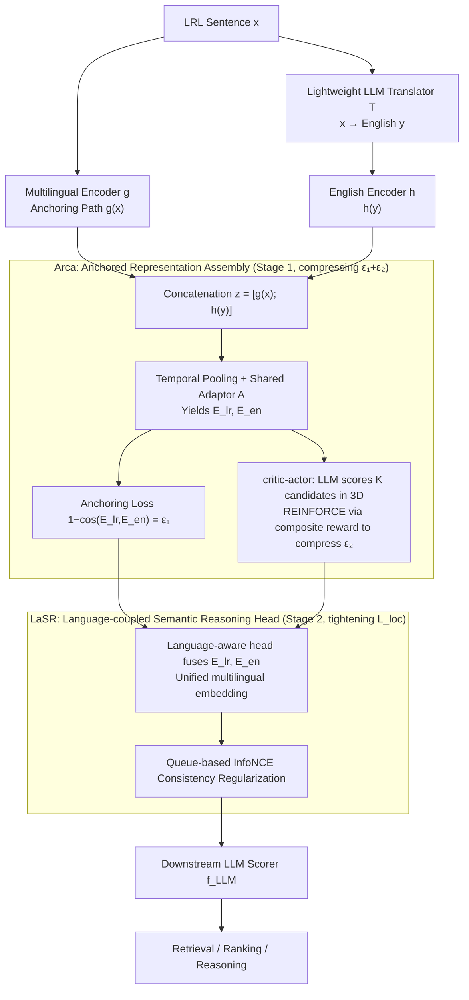

# Toward Robust Multilingual Adaptation of LLMs for Low-Resource Languages

**Conference**: ICML 2026  
**arXiv**: [2510.14466](https://arxiv.org/abs/2510.14466)  
**Code**: The paper promises to open-source; the repository is currently pending release.  
**Area**: Multilingual Machine Translation / Cross-lingual Retrieval and Reasoning  
**Keywords**: Low-resource languages, Cross-lingual alignment, Anchored representation, Translation noise, LLM adaptation

## TL;DR
LiRA inserts a lightweight fine-tuning module featuring "anchoring + consistency regularization" between a frozen multilingual encoder and an English LLM. It constrains the sentence vectors of low-resource languages into a shared English semantic space through two theoretically controllable quantities: $\epsilon_1$ (anchoring error) and $\epsilon_2$ (translation KL distance), achieving stable improvements across retrieval, ranking, and reasoning tasks.

## Background & Motivation
**Background**: LLM capabilities are highly concentrated in high-resource languages such as English and Chinese, while significantly degrading when processing low-resource languages (LRLs) in Southeast and South Asia (e.g., Bengali, Indonesian, Burmese, Pashto, Thai, Filipino, Vietnamese). Current mainstream approaches follow two paths: the MT pipeline of "Translation → English LLM Reasoning → Back-translation," or training multilingual encoders (mBERT, XLM-R, E5-Mistral) for language-agnostic alignment.

**Limitations of Prior Work**: MT pipelines accumulate translation noise and cause semantic drift, particularly amplifying errors in queries requiring multi-step reasoning. While multilingual encoders are inherently cross-lingual, they lack the powerful reasoning heads of English LLMs and suffer from a scarcity of training samples in low-resource domains. Recent works like MindMerger and LUSIFER attempt to bridge multilingual encoders with English LLMs, but the former depends on parallel corpora (inheriting translation noise) and the latter rarely sees low-resource languages during training, leading to unstable cross-lingual alignment during migration.

**Key Challenge**: Errors in cross-lingual systems stem from two categories: representation space mapping errors (inconsistent landing points of different encoding paths) and translation-induced semantic shifts. Existing methods neither systematically model how these errors propagate nor provide formal bounds driven by optimization objectives, resulting in robustness that relies solely on "empirical tuning."

**Goal**: (i) Establish a theoretical framework for cross-lingual adaptation that derives an upper bound for representation deviation, making both types of errors explicitly optimizable. (ii) Design a lightweight plugin compatible with various backbones that simultaneously supports retrieval, ranking, and reasoning. (iii) Provide a multilingual evaluation set that closely reflects real-world low-resource scenarios (e.g., e-commerce product retrieval).

**Key Insight**: Imagine a low-resource sentence $x$ and its English translation $y = T(x)$ as "two paths leading to the same English semantic space"—the multilingual anchoring path $g(x)$ and the English encoding path $h(y)$. Using the "ideal English representation" $\mathbf{z}^\star = [h(y^\star); h(y^\star)]$ as a mathematical reference frame, the paper proves that as long as the anchoring error $\epsilon_1$ and the translation KL distance $\epsilon_2$ decrease simultaneously, the output of the entire pipeline is tightly bounded by the Lipschitz constant $L^{\text{loc}}$.

**Core Idea**: LiRA = Arca (utilizing critic-actor reinforcement learning to compress $\epsilon_1, \epsilon_2$) + LaSR (employing language-aware heads for cross-lingual consistency regularization), translating theoretical upper bounds into two jointly optimizable losses.

## Method

### Overall Architecture
The input is a low-resource language sentence $x \in \mathcal{X}$. LiRA processes it through two parallel paths: Path 1 uses a multilingual encoder $g: \mathcal{X} \to \mathbb{R}^d$ to obtain the "anchored representation" $g(x)$; Path 2 first uses a lightweight LLM translator $T$ to obtain English $y = T(x)$, then uses an English encoder $h: \mathcal{Y} \to \mathbb{R}^d$ to obtain $h(y)$. The two representations are concatenated into $\mathbf{z}(x) = [g(x); h(y)] \in \mathbb{R}^{2d}$ and fed into a downstream LLM scorer $f_{\text{LLM}}$ for retrieval, ranking, or reasoning.

Theoretically, $\mathbf{z}$ is expected to approach the "ideal reference" $\mathbf{z}^\star = [h(y^\star); h(y^\star)]$ (where both paths consistently land at the position of the ideal English translation $y^\star$). The paper proves that under the anchoring hypothesis $\|g(x) - h(y^\star)\|_2 \le \epsilon_1$ and the translation fidelity hypothesis $D_{\text{KL}}(p(s|x) \| p(s|T(x))) \le \epsilon_2$, we have:
$\|\mathbf{z} - \mathbf{z}^\star\|_2 \le \epsilon_1 + C\sqrt{2\epsilon_2}$,
consequently $\|f_{\text{LLM}}(\mathbf{z}) - f_{\text{LLM}}(\mathbf{z}^\star)\|_2 \le L^{\text{loc}}(y;\delta)(\epsilon_1 + C\sqrt{2\epsilon_2})$. Arca and LaSR are the engineering implementations designed to push these $\epsilon$ terms toward zero.

### Key Designs

**1. Arca — Anchored Representation Assembly Architecture: Decomposing the theoretical bound $\epsilon_1+C\sqrt{2\epsilon_2}$ into two directly optimizable losses**

While the theoretical upper bound is elegant, $\epsilon_1$ (anchoring error) and $\epsilon_2$ (translation distortion) are abstract quantities that must be mapped to back-propagatable targets. Arca first takes the multilingual token stream $g_{\text{tok}}(x) \in \mathbb{R}^{L_x \times d_g}$ and the English token stream $h_{\text{tok}}(y) \in \mathbb{R}^{L_y \times d_h}$, aligns them via $S_{\text{feat}}$-bin temporal pooling, and maps them through a shared Adaptor $A(\cdot)$ to a unified $d$-dimensional space resulting in sentence vectors $E_{lr}$ and $E_{en}$. The anchoring loss is defined as the cosine distance $\mathcal{L}_{\text{anchor}} = 1 - \cos(E_{lr}, E_{en})$, representing $\epsilon_1$. For $\epsilon_2$, a critic-actor loop is employed: a lightweight LLM provides three-dimensional scores $(s_k, e_k, p_k) \in [1,10]$ (semantic faithfulness, emotional consistency, pragmatic appropriateness) for $K$ candidate translations. These are combined with Adaptor similarity $\text{sim}_k$ into policy features $\mathbf{c}_k = [s_k, e_k, p_k, \text{sim}_k]^\top$, fed into an MLP to obtain the policy $\pi_\phi(k|\mathbf{c}_{1:K}) = \text{softmax}(g_\phi(\mathbf{c}_{1:K}))$, and optimized via REINFORCE using a composite reward $R_k = 0.1(\alpha s_k + \beta e_k + \gamma p_k) + \delta\,\text{sim}_k$.

The total objective $\mathcal{L} = \mathcal{L}_{\text{RL}} + \eta\,\mathcal{L}_{\text{anchor}}$ suppresses both $\epsilon_1$ and $\epsilon_2$. The choice of critic-actor over pure supervision is due to the inherent noise in low-resource parallel corpora—by allowing "translation selection" and "representation alignment" to play against each other, the model avoids traps set by noisy translations.

**2. LaSR — Language-coupled Semantic Reasoning Head: Suppressing the amplification of residual errors by downstream LLMs**

Arca addresses the "landing accuracy" of the two paths. However, even with correct landing points, downstream LLMs may have varying sensitivity to multilingual vs. English path inputs, potentially amplifying residual errors—this is where the Lipschitz constant $L^{\text{loc}}(y;\delta)$ from the theory comes into play. LaSR uses a lightweight language-aware head to fuse the Arca outputs $(E_{lr}, E_{en})$ into a unified multilingual embedding. It then employs a queue-based InfoNCE-style contrastive loss to pull together multilingual and English versions of the same query while pushing apart negative samples, effectively adding a $\mathcal{L}_{\text{consistency}}$ regularization at the output layer. This embedding is shared across retrieval, ranking, QA, and reasoning.

This component serves to tighten the final piece of the bound in Corollary 2—$L^{\text{loc}}$. While Arca manages $\epsilon_1+C\sqrt{2\epsilon_2}$, LaSR manages the multiplier preceding it, causing the overall upper bound to decrease. The queue-based contrastive learning also ensures stability for large-batch retrieval under memory constraints.

**3. Theory-driven Two-stage Training: Decoupling "deviation suppression" and "task adaptation" into pluggable steps**

Optimizing theoretical objectives ($\epsilon_1, \epsilon_2$) and task metrics end-to-end creates gradient competition. The authors decouple this: in the first stage, the multilingual and English encoder backbones are frozen, and only the Adaptor, critic, and actor are trained to minimize $\mathcal{L}_{\text{anchor}} + \mathcal{L}_{\text{RL}}$, focusing on alignment. In the second stage, LaSR is attached and fine-tuned for specific tasks (retrieval, ranking, reasoning) using contrastive and consistency losses.

This approach reuses the capabilities of pre-trained encoders while preventing interference between objectives. The entire module is plug-and-play—the same Arca+LaSR suite can be attached to backbones like Qwen3-E, E5-Mistral, or BGE without re-deriving the theory.

### Loss & Training
- **Arca Stage**: $\mathcal{L} = \mathcal{L}_{\text{RL}} + \eta\, \mathcal{L}_{\text{anchor}}$, where $\mathcal{L}_{\text{RL}} \approx -\log \pi_\phi(a | \mathbf{c}_{1:K}) \cdot R_a$. Reward weights $(\alpha, \beta, \gamma, \delta)$ control the relative importance of translation quality dimensions and embedding similarity.
- **LaSR Stage**: Queue-based contrastive loss + multilingual consistency regularization. Key hyperparameters include the number of pooling bins $S_{\text{feat}}$, neighborhood radius $\delta$, and the Lipschitz percentile $q$ (default $q=0.95$, corresponding to $L^{(0.95)} \approx 0.034$).

## Key Experimental Results

### Main Results
The authors released LazRetrieval (a real-world e-commerce product retrieval set for 5 Southeast Asian and 2 South Asian languages) and compared various sentence encoders across 7 languages. All are public baselines except LiRA-Large. Metrics represent average retrieval scores (higher is better).

| Method | Params | Bd | Id | My | Pk | Th | Ph | Vn | Avg |
| :--- | :--- | :--- | :--- | :--- | :--- | :--- | :--- | :--- | :--- |
| Sentence-T5-XXL | 4.8B | 34.11 | 71.77 | 49.19 | 27.84 | 23.58 | 84.20 | 28.61 | 44.56 |
| GTR-XXL | 4.8B | 34.85 | 75.92 | 49.36 | 30.39 | 22.94 | 84.94 | 46.15 | 48.17 |
| Contriever | 110M | 39.95 | 74.95 | 48.90 | 35.71 | 15.43 | 83.74 | 64.75 | 51.00 |
| BGE-en-v1.5 | 335M | 41.06 | 78.78 | 53.28 | 37.52 | 18.35 | 88.18 | 68.72 | 54.09 |
| E5-Mistral-7B | 7.24B | 48.27 | 75.43 | 71.01 | 53.62 | 61.75 | 83.18 | 65.44 | 64.51 |
| Qwen3-E-0.6B | 0.6B | 38.36 | 63.95 | 62.37 | 40.73 | 55.28 | 74.38 | 59.46 | 56.31 |
| **LiRA-Large (Ours)** | 8.5B | **48.60** | 74.43 | **71.26** | 49.84 | **66.39** | 83.90 | **70.67** | **66.44** |

LiRA-Large improves by ~1.9 points on average over E5-Mistral-7B, achieving SOTA in the four most scarce languages: Bd, My, Th, and Vn.

### Ablation Study
Trends based on the paper's report:

| Configuration | Retrieval Avg | Reasoning Task | Description |
| :--- | :--- | :--- | :--- |
| Full LiRA | 66.4 | Best | Complete Arca + LaSR |
| w/o $\mathcal{L}_{\text{anchor}}$ | ↓ | ↓ | Anchoring error $\epsilon_1$ rebounds; cross-lingual alignment loosens |
| w/o RL critic | ↓↓ | ↓↓ | Lost translation quality drive; $\epsilon_2$ rises; sharpest drop in LRLs |
| w/o LaSR | ↓ | ↓↓ | Multilingual embeddings lose consistency; reasoning drops more than retrieval |
| Data: No LRLs | ↓↓ | ↓↓ | Validates limitations of LUSIFER-style "LRL-blind" training |

### Key Findings
- The empirical measurement of $\|\mathbf{z} - \mathbf{z}^\star\|$ decreases monotonically during training, matching the theoretical prediction of $\epsilon_1 + C\sqrt{2\epsilon_2}$—indicating that abstract theoretical assumptions are effectively implemented by engineering objectives.
- Under a token-edit neighborhood radius $\delta = 1$, the 95th percentile Lipschitz constant $L^{(0.95)} \approx 0.034$, suggesting that downstream LLMs do not significantly amplify errors from small representation perturbations, making the corollary bound tight.
- Relative gains of LiRA in long-tail languages like Burmese, Thai, and Vietnamese are much larger than in relatively high-resource languages like Indonesian, proving that anchoring + consistency regularization provides the highest ROI in "sample-sparse" regions.
- Plug-and-play experiments show that swapping backbones (e.g., Qwen3-E-0.6B / 4B) in combination with LiRA consistently yields improvements.

## Highlights & Insights
- Translating an engineering problem ("how to align low-resource languages") into two optimizable scalars $(\epsilon_1, \epsilon_2)$ and linking translation KL distance to representation deviation via RKHS/KME is a rare "theory + engineering closed-loop." This can be migrated to any dual-path shared-space scenario (e.g., multimodal alignment, cross-domain adaptation).
- Using LLMs as translation scorers in a critic-actor setup effectively outsources multi-dimensional quality evaluation to a smaller candidate-picking model. This "unsupervised data augmentation" trick—distilling a reward from an LLM's multi-dimensional scoring—is highly reusable.
- Concatenating the multilingual path and the English path instead of fusing them preserves two different perspectives of semantic bias, avoiding the loss of information from "forced averaging"—echoing the philosophy of dual-stream multimodal architectures.

## Limitations & Future Work
- The translator $T$ is an external LLM; its capability directly determines the lower bound of $\epsilon_2$. If the target language is outside the translator LLM's training distribution, the framework degrades.
- Theoretical assumptions require $f_{\text{LLM}}$ to be locally Lipschitz under representation perturbation, which might not hold for discrete decision scenarios like explicit tool calls or long-chain reasoning.
- LazRetrieval focuses primarily on the e-commerce domain. Cross-domain validation (legal, medical, government) is missing and needs supplementation.
- Both $\epsilon_1$ and $\epsilon_2$ are upper bound controls; the minimal learnable lower bound is not provided, making it possible that certain language pairs have already reached a bottleneck.

## Related Work & Insights
- **vs. MindMerger**: Both attempt to bridge multilingual encoders with English LLMs, but MindMerger relies heavily on parallel translation corpora, effectively minimizing empirical translation loss. LiRA uses critic-actor RL to select candidates, bypassing the "clean parallel corpora" requirement and explicitly modeling $\epsilon_2$.
- **vs. LUSIFER**: LUSIFER uses a connector for multilingual and English LLM-based embeddings but lacks LRL samples during training, making its cross-lingual alignment fragile. LiRA maintains LRL samples and explicitly optimizes landing points via anchoring.
- **vs. XRAG / CCPR**: These focus on end-to-end cross-lingual RAG evaluation or phrase-level retrieval. LiRA serves as a more fundamental representation alignment layer that can act as a front-end embedder for them.

## Rating
- **Novelty**: ⭐⭐⭐⭐ Formalizing cross-lingual alignment via RKHS + Lipschitz bounds and translating it into critic-actor RL is a standout approach.
- **Experimental Thoroughness**: ⭐⭐⭐⭐ Covers 7 LRLs, multiple backbones, and multiple tasks while releasing the LazRetrieval benchmark.
- **Writing Quality**: ⭐⭐⭐⭐ Clear correspondence between theory and method; strong cross-referencing between formulas and text.
- **Value**: ⭐⭐⭐⭐ Provides a robust front-end for LRL systems that is immediately applicable to real-world scenarios like Southeast/South Asian e-commerce.

<!-- RELATED:START -->

## Related Papers

- [\[ACL 2026\] Efficient Low-Resource Language Adaptation via Multi-Source Dynamic Logit Fusion](../../ACL2026/multilingual_mt/efficient_low-resource_language_adaptation_via_multi-source_dynamic_logit_fusion.md)
- [\[ACL 2025\] Accessible Machine Translation Evaluation For Low-Resource Languages](../../ACL2025/multilingual_mt/accessible_machine_translation_evaluation_for_low-resource_languages.md)
- [\[ACL 2025\] The Esethu Framework: Reimagining Sustainable Dataset Governance and Curation for Low-Resource Languages](../../ACL2025/multilingual_mt/the_esethu_framework_reimagining_sustainable_dataset_governance_and_curation_for.md)
- [\[ACL 2025\] Dictionaries to the Rescue: Cross-Lingual Vocabulary Transfer for Low-Resource Languages Using Bilingual Dictionaries](../../ACL2025/multilingual_mt/dictionaries_to_the_rescue_cross-lingual_vocabulary_transfer_for_low-resource_la.md)
- [\[ACL 2025\] Multilingual Encoder Knows More Than You Realize: Shared Weights Pretraining for Extremely Low-Resource Languages](../../ACL2025/multilingual_mt/multilingual_encoder_knows_more_than_you_realize_shared_weights_pretraining_for_.md)

<!-- RELATED:END -->
