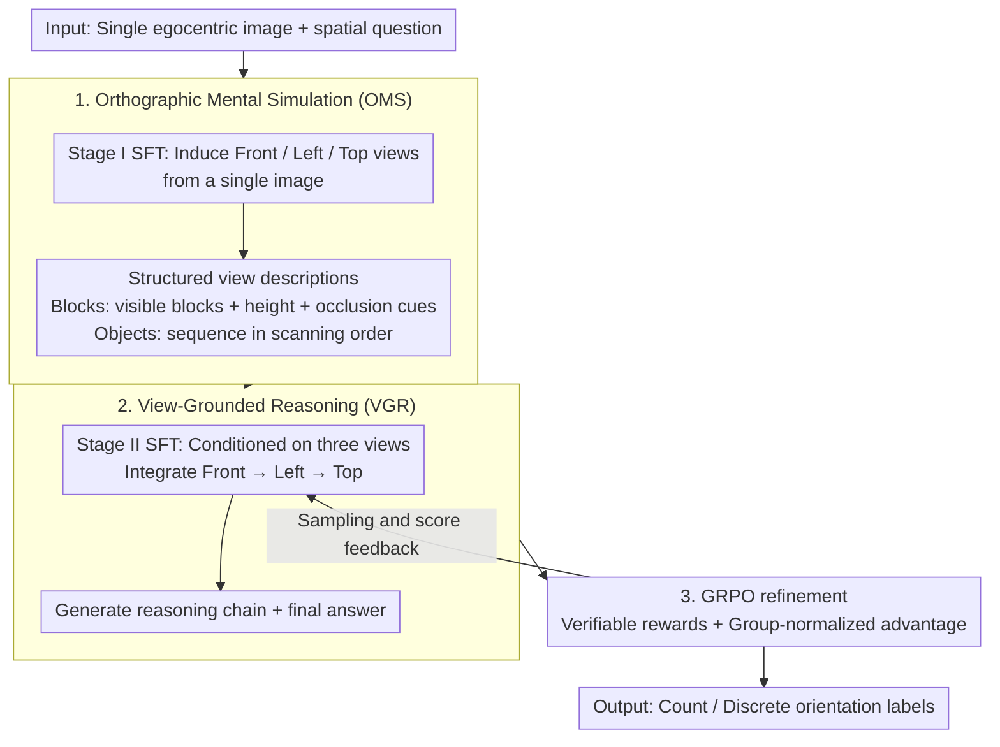

# 3ViewSense: Spatial and Mental Perspective Reasoning from Orthographic Views in Vision-Language Models

**Conference**: ICML 2026  
**arXiv**: [2603.07751](https://arxiv.org/abs/2603.07751)  
**Code**: https://github.com/Jasaxion/3ViewSense  
**Area**: Multi-modal VLM / Spatial Reasoning  
**Keywords**: Orthographic views, Spatial reasoning, Mental simulation, VLM, GRPO

## TL;DR
3ViewSense argues that the bottleneck in VLM spatial reasoning is not insufficient visual features or weak language reasoning, but the absence of a stable 3D intermediate representation. Consequently, it requires the model to first induce front, left, and top views from a single image, and then reason based on these orthographic views, significantly outperforming same-scale VLMs in occlusion counting and view-consistent spatial reasoning.

## Background & Motivation
**Background**: Large Vision-Language Models can handle complex visual QA, symbolic logic, and multi-step reasoning, yet they remain fragile in spatial understanding. A typical example is block stacking counting: while human children can count by imagining occluded parts, VLMs often struggle with repeated guesses under occlusion, perspective, and depth ambiguity.

**Limitations of Prior Work**: The paper conducts two diagnostics. First, by training a lightweight MLP probe on frozen VLM visual features, block counting accuracy reaches 55.8%, indicating that the image encoder retains significant geometric information. Second, if textual descriptions of front/left/top views are directly provided to the same model, spatial reasoning for models like Gemini-3-pro improves drastically. This suggests the problem is not just "failing to see" or "failing to reason," but that visual features are not organized into a spatial structure usable by the reasoner.

**Key Challenge**: A single egocentric image collapses 3D structure into a 2D projection, naturally introducing occlusion and depth ambiguity. When an end-to-end VLM directly models $P(a \mid I_{ego}, q)$, it must simultaneously perform 3D completion, perspective transformation, and answer reasoning within the latent space. Once the intermediate state becomes unstable, subsequent linguistic reasoning suffers from drift and hallucinations.

**Goal**: The authors aim to externalize the process of "recovering reason-able 3D mental representations from 2D images" by letting the model generate a set of canonical orthographic views before answering questions related to counting, position, and attributes.

**Key Insight**: Engineering drawings use orthographic projections to decompose 3D objects into front, left, and top views to reduce perspective ambiguity. This paper transfers this idea to VLMs, using three views as an interface between egocentric perception and allocentric spatial reasoning.

**Core Idea**: Use a "Simulate-and-Reason" pipeline to replace single-stage black-box VQA.

## Method
The key to 3ViewSense is not introducing extra 3D sensors but decomposing the internal VLM reasoning into two supervisable capabilities: Orthographic Mental Simulation (OMS) for converting single-view images into structured three views, and View-Grounded Reasoning (VGR) for integrating these views with the original question to form an answer. Formally, the answer distribution is written as a two-stage process via latent orthographic views $\mathcal{V}=\{v_{front}, v_{left}, v_{top}\}$: first estimate $\hat{\mathcal{V}}=\arg\max_{\mathcal{V}}P_{\theta_{sim}}(\mathcal{V}\mid I_{ego},q)$, then output the answer with $P_{\theta_{reason}}(a\mid \hat{\mathcal{V}},I_{ego},q)$.

### Overall Architecture
The input consists of a single egocentric image and a spatial question, and the output is a count or a discrete orientation label. The entire pipeline follows a "Simulate-and-Reason" approach: first, Orthographic Mental Simulation (OMS) induces the front, left, and top orthographic views from a single image, then View-Grounded Reasoning (VGR) integrates these views to derive the answer. Training follows three steps: first, Stage I SFT on procedural data from OrthoMind-3D to learn structured orthographic descriptions; second, Stage II SFT to enable the model to generate reasoning chains and answers conditioned on the three views; finally, reinforcement learning via GRPO starting from the Stage II model to enhance answer accuracy and reasoning stability under verifiable rewards.

### Key Designs
**1. Orthographic Mental Simulation (OMS): Reducing 3D completion to planar recognition.** This step addresses the upstream bottleneck where single egocentric images collapse 3D structures into 2D projections. OMS forces the model to induce front, left, and top views and represent them as structured descriptions: in block counting, each view encodes visible blocks, stacking height, and occlusion cues; in object reasoning, views are sequences of objects in scanning order (left-to-right or far-to-near). Stage I utilizes ~19.5k samples with orthographic annotations for sequence MLE training. This essentially converts implicit 3D completion into a 2D planar problem akin to symbolic pattern recognition, minimizing the "depth guessing" required in subsequent stages.

**2. View-Grounded Reasoning (VGR): Supervising the reasoning process instead of just the answer.** While orthographic views provide structural priors, complex tasks like occlusion counting still require integrating multiple projections into a consistent 3D mental model. Stage II requires the model to explicitly read the induced views and generate reasoning trajectories in a fixed "Front $\to$ Left $\to$ Top" order before providing an answer. 21k training trajectories are generated by Gemini-3-Flash and filtered by answer correctness. The model learns the process of "assembling multiple projections into a consistent structure" rather than a simple "image $\to$ label" shortcut.

**3. GRPO Refinement and Verifiable Rewards: Stability and elevation over VGR warm start.** To further improve counting and orientation accuracy while mitigating generalization decay from large-scale SFT, reinforcement learning is applied starting from the Stage II model. For each question, a group of answers is sampled and scored using verifiable rewards (integer counts or discrete orientation labels), optimized with a clipped GRPO objective based on group-normalized advantage $\hat{A}_i=(R_i-\mu_R)/(\sigma_R+\delta)$. Rewards are categorized as "strict" or "slack," with the latter offering tolerance for counting errors.

### Loss & Training
Both Stage I and Stage II utilize standard sequence maximum likelihood estimation to learn view generation and view-conditioned reasoning, respectively. The RL phase uses 30k instances, with 10k resampled from Stage II and 20k newly generated. The base model is Qwen3-VL-4B-Instruct. Rewards are configured as strict and slack, both employing automatic verification for integer counts or discrete labels.

## Key Experimental Results

### Main Results
Main results on OrthoMind-3D show that general VLMs are very weak at counting occluded blocks, whereas 3ViewSense pushes in-domain tasks to high accuracy after GRPO.

| Model | Block Count | Block Count (Attr.) | Object Count | Object Position | Object Count (Attr.) | Object Position (Attr.) |
|------|-------------|---------------------|--------------|-----------------|----------------------|-------------------------|
| GPT-4o | 15.8 | 53.2 | 68.3 | 39.3 | 71.2 | 47.2 |
| Gemini-3-pro | 13.8 | 80.2 | 83.3 | 71.6 | 93.2 | 93.6 |
| SpaceOm-4B | 10.4 | 47.2 | 63.6 | 17.6 | 60.2 | 25.4 |
| Qwen3-VL-4B-Instruct | 6.2 | 43.4 | 59.0 | 41.0 | 74.8 | 45.6 |
| 3ViewSense-4B-SFT | 33.4 | 63.1 | 97.0 | 91.0 | 95.4 | 91.8 |
| 3ViewSense-4B-RL-strict | 95.0 | 88.2 | 98.7 | 93.3 | 97.4 | 93.2 |
| 3ViewSense-4B-RL-slack | 94.4 | 88.6 | 98.7 | 92.3 | 98.4 | 93.4 |

On OOD and external benchmarks, the improvement is less dramatic but still shows transfer gains from orthographic reasoning. Using Qwen3-VL-4B-Instruct as a baseline, RL-slack improves OOD Block Count on OrthoMind-3D from 21.2 to 38.7 and on MindCube-Tiny from 27.2 to 38.9.

| Model | OOD Block Count | OOD Object Position | MindCube-Tiny | CV-Bench 2D | SPBench-SI | ViewSpatial |
|------|-----------------|--------------------|---------------|-------------|------------|-------------|
| Qwen3-VL-4B-Instruct | 21.2 | 46.7 | 27.2 | 77.9 | 22.2 | 35.5 |
| 3ViewSense-4B-SFT | 31.1 | 72.5 | 34.9 | 74.3 | 20.6 | 34.4 |
| 3ViewSense-4B-RL-strict | 33.2 | 74.3 | 36.7 | 78.1 | 23.2 | 36.6 |
| 3ViewSense-4B-RL-slack | 38.7 | 76.1 | 38.9 | 79.9 | 25.4 | 37.1 |

### Ablation Study
The ablation focus is to prove that gains stem from the "view-conditioned reasoning process" rather than just more supervision data.

| Configuration | OrthoMind-3D ID | OrthoMind-3D OOD | SPBench-SI | ViewSpatial | Description |
|------|----------------|-----------------|------------|-------------|------|
| Direct QA | 80.3 | 49.8 | 1.3 | 7.2 | Same input/hyperparams, but only supervises the final answer |
| 3ViewSense Reasoning | 70.3 | 46.6 | 21.2 | 34.1 | Supervises view-conditioned reasoning chains |

Direct QA scores higher on OrthoMind-3D ID, suggesting it fits the target dataset better; however, it collapses on SPBench-SI and ViewSpatial. 3ViewSense Reasoning preserves transferable spatial reasoning capabilities despite lower in-domain scores.

| Stage | OrthoMind-3D ID | OrthoMind-3D OOD | MindCube-Tiny | ViewSpatial | Description |
|-------|----------------|-----------------|---------------|-------------|------|
| OMS-SFT only | 48.7 | 41.3 | 29.6 | 33.4 | Can only induce views, insufficient for complex queries |
| VGR-SFT only | 70.3 | 46.6 | 32.4 | 34.1 | Directly learns view-conditioned reasoning |
| OMS→VGR two-stage | 78.6 | 49.5 | 34.9 | 34.4 | Learns view induction then reasoning; most stable overall |

### Key Findings
- Attribute-conditioned counting is significantly easier as salient attributes like color or size simplify 3D enumeration into local retrieval.
- ICL cannot stably teach orthographic reasoning; while strong closed-source models show limited improvement, most open-source models degrade, indicating it is not a simple prompt trick.
- Base models produce verbose reasoning exceeding 10k tokens for block counting, whereas 3ViewSense outputs are shorter and more stable due to the view sketches.
- GRPO shows stable reward curves when initialized from Stage II VGR-SFT, whereas starting from Stage I OMS-SFT leads to high-variance oscillation.

## Highlights & Insights
- The most valuable contribution is making VLM spatial failure a diagnosable issue: visual probes and explicit view prompts rule out "inability to see" or "inability to think," pinpointing the lack of an intermediate spatial interface.
- Orthographic projection is a simple yet effective inductive bias. It avoids heavy 3D modules while explicitly unfolding depth ambiguity, fitting well into existing VLM training pipelines.
- The Direct QA ablation is insightful: higher in-domain accuracy does not equate to better spatial ability. Truly transferable skill comes from supervising intermediate representations and reasoning processes.

## Limitations & Future Work
- Three fixed orthographic views do not cover all spatial problems. Tasks involving support relations, affordance, dynamics, or physical stability require richer intermediate representations.
- OMS relies on procedural synthesis and ground-truth orthographic data, which is difficult to obtain for open-world images.
- Gains on OOD and external benchmarks are moderate, suggesting view-based capabilities remain domain-constrained. Future work should estimate view-induction uncertainty and adaptively select spatial abstractions.
- The current method increases reasoning chain length and training complexity, necessitating a trade-off between latency and spatial performance.

## Related Work & Insights
- **vs Spatial-MLLM / External 3D Encoders**: These often rely on extra visual modules or 3D features. 3ViewSense learns interpretable spatial representations within the language interface, which is lower cost but limited by the expressiveness of orthographic views.
- **vs SpatialLadder / RL Self-Correction**: Curriculum learning or general RL strengthens training strategies; 3ViewSense changes the reasoning object to a view-consistent representation.
- **vs MindCube / Mental Imagery**: MindCube relies on implicit 3D imagining, whereas 3ViewSense constrains this with canonical projections, making the process more inspectable and supervisable.

## Rating
- Novelty: ⭐⭐⭐⭐⭐ 
- Experimental Thoroughness: ⭐⭐⭐⭐ 
- Writing Quality: ⭐⭐⭐⭐⭐ 
- Value: ⭐⭐⭐⭐⭐ 

<!-- RELATED:START -->

## Related Papers

- [\[ICML 2026\] Active Exploring like a Pigeon: Reinforcing Spatial Reasoning via Agentic Vision-Language Models](active_exploring_like_a_pigeon_reinforcing_spatial_reasoning_via_agentic_vision-.md)
- [\[ICCV 2025\] Perspective-Aware Reasoning in Vision-Language Models via Mental Imagery Simulation](../../ICCV2025/multimodal_vlm/perspective-aware_reasoning_in_vision-language_models_via_mental_imagery_simulat.md)
- [\[ICML 2026\] Learning GUI Grounding with Spatial Reasoning from Visual Feedback](learning_gui_grounding_with_spatial_reasoning_from_visual_feedback.md)
- [\[CVPR 2026\] Think with 3D: Geometric Imagination Grounded Spatial Reasoning from Limited Views](../../CVPR2026/multimodal_vlm/think_with_3d_geometric_imagination_grounded_spatial_reasoning_from_limited_view.md)
- [\[ICLR 2026\] SpinBench: Perspective and Rotation as a Lens on Spatial Reasoning in VLMs](../../ICLR2026/multimodal_vlm/spinbench_perspective_and_rotation_as_a_lens_on_spatial_reasoning_in_vlms.md)

<!-- RELATED:END -->
