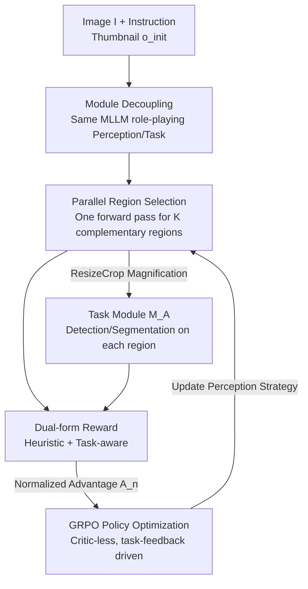

# ACTIVE-o3: Empowering MLLMs with Active Perception via Pure Reinforcement Learning

**Conference**: ICML 2026  
**arXiv**: [2505.21457](https://arxiv.org/abs/2505.21457)  
**Code**: To be confirmed  
**Area**: Multimodal VLM / Active Perception / Reinforcement Learning  
**Keywords**: Active Perception, MLLM, GRPO, Region Selection, Small Object Detection

## TL;DR
ACTIVE-o3 delegates the decision of "where and how to look" to an MLLM for autonomous learning. Using pure reinforcement learning (GRPO), the model is trained to parallelly select up to 3 sub-regions most worthy of magnification. A dual-form reward mechanism (task reward + heuristic reward) is employed to solve the sparsity of pure task rewards. The method consistently outperforms baselines in small/dense object detection, remote sensing, autonomous driving, and interactive segmentation, while simultaneously enhancing general understanding capabilities such as RealWorldQA and MME.

## Background & Motivation

**Background**: MLLMs are increasingly used as the "brains" of robotic/embodied systems for planning and decision-making. However, they remain **passive consumers** of visual input—processing whatever is provided in a fixed-resolution global image.

**Limitations of Prior Work**: Efficient perception in humans and embodied agents relies on **active perception**: actively choosing where and how to look to acquire task-relevant information. MLLMs lack this capability. The zoom-in search in GPT-o3 was a first attempt, but it suffered from inefficient region proposals and inaccurate target localization (especially in dense or fine-grained scenes), and operated **serially**, magnifying one region at a time with high overhead.

**Key Challenge**: Teaching an MLLM to select regions through supervised learning is hindered by the **unavailability of supervised labels**. The value of a candidate region $a^{\text{cam}}$ is only revealed after feeding it into a downstream task model to evaluate performance; there are no off-the-shelf annotations for "where to look." Furthermore, requiring the model to output multiple parallel region proposals while maintaining coherent reasoning makes direct supervision even more difficult.

**Goal**: (1) Provide a formal definition for "MLLM-based active perception"; (2) Train an efficient and stable perception strategy under a reproducible 2D setting using pure RL without region-selection supervision; (3) Build an evaluation benchmark covering open-world and domain-specific scenarios.

**Key Insight**: The authors observe that while task rewards are sparse, they are the only "true signal," whereas heuristic constraints (format, non-overlap, reasonable area, coverage) are cheap but potentially biased. **Binding them together** creates a dense, stable signal that aligns with downstream objectives.

**Core Idea**: Decouple a single MLLM into a "Perception Module (deciding where to look) + Task Module (deciding what to do)." Using GRPO and dual-form rewards, the perception module learns to propose multiple complementary regions in a single forward pass, driven end-to-end by downstream task performance.

## Method

### Overall Architecture
ACTIVE-o3 treats a shared MLLM as a unified policy $\pi(y\mid o,\mathcal{I})$, switching between two roles via different prompts: the Perception Module $\mathcal{M}_O$ (using instruction $\mathcal{I}_O$ to propose regions for magnification) and the Task Module $\mathcal{M}_A$ (using instruction $\mathcal{I}_A$ to perform detection/segmentation on a specific region). Given an image $I$ and instruction $\mathcal{I}$, $I$ is first resized into a low-resolution global thumbnail $o_{\text{init}}$ as a coarse prior. $\mathcal{M}_O$ **parallelly** outputs $K$ candidate regions $\{a_k^{\text{cam}}\}$ in one forward pass (including `<think>` reasoning + `<answer>` boxes). Each region undergoes ResizeCrop to obtain a magnified observation $o_k$, which is then passed to a fixed $\mathcal{M}_A$ to produce the final task output $a_k^{\text{env}}$.

The authors model this as a **single-step decision** ($T=1$) on 2D static images: since the image remains unchanged by interactive actions and the environment state is constant, the task module $\mathcal{M}_A$ is fixed while only the perception strategy $\mathcal{M}_O$ is learned. The objective is to maximize downstream task performance under a fixed "perception budget" $K$:

$$\max_{\mathcal{M}_O}\ \mathbb{E}_{I,\mathcal{I}}\Big[\sum_{k=1}^{K} R\big(\mathcal{M}_A(o_k),\ \mathcal{I}\big)\Big],\quad \{a_k^{\text{cam}}\}=\mathcal{M}_O(o_{\text{init}},\mathcal{I}),\ o_k=\text{ResizeCrop}(I,a_k^{\text{cam}})$$

Training is conducted in two stages: zero-shot initialization of the MLLM into a functional perception strategy via prompting, followed by refinement using GRPO with dual-form rewards.

### Key Designs

**1. Module Decoupling: Splitting one MLLM into "Perception $\mathcal{M}_O$ + Task $\mathcal{M}_A$"**

The essence of active perception is the synergy between "looking" and "doing." However, using two separate expert models sacrifices the MLLM's instruction-following and generalization capabilities. The authors use a **single** MLLM for both roles, distinguished by prompts: $\mathcal{M}_O(o_{\text{init}},\mathcal{I}_O):=\text{Parse}_{\text{cam}}(\pi(y\mid o_{\text{init}},\mathcal{I}_O))$ proposes $K$ candidate regions from the global thumbnail, while $\mathcal{M}_A(o_k,\mathcal{I}_A):=\text{Parse}_{\text{env}}(\pi(y\mid o_k,\mathcal{I}_A))$ produces the task output for the $k$-th crop. This ensures clear responsibilities while allowing components to be evaluated or replaced independently (e.g., using a stronger specialized model for $\mathcal{M}_A$ during testing), while reusing MLLM weights and open-semantic understanding. Note that in detection, both $a_k^{\text{cam}}$ and $a_k^{\text{env}}$ are bboxes, but with different roles: the former is "where to look," and the latter is the "final localization prediction."

**2. Parallel Region Selection: One forward pass for $K$ complementary regions instead of serial zoom-in**

Serial magnification, as seen in GPT-o3, requires repeated forward passes and is prone to error accumulation if early regions are poorly chosen. ACTIVE-o3 models it as a single-step decision ($T=1$), where the perception strategy outputs $\{a_k^{\text{cam}}\}_{k=1}^{K}$ simultaneously (with $K \le 3$). Parallel production naturally encourages the set of regions to be **diverse and complementary**, ensuring better coverage and higher efficiency under a fixed budget. Compared to search methods like V* that require 10+ forward passes per image, ACTIVE-o3 achieves results in one pass, ensuring speed and accuracy.

**3. Dual-form Reward: Heuristic Reward + Task-aware Reward for sparse reward mitigation**

This is the core innovation. Using only task rewards leads to sparse signals and dominance by the task module, failing to teach diverse region selection. Using only heuristic rewards may decouple the strategy from the downstream goal. The authors use a weighted sum. **Heuristic rewards** evaluate a single response independently of the task, focusing on four aspects: format validity (JSON, `bbox_2d` field, `<think>`/`<answer>` tags), non-overlap (rewarding low IoU between regions), reasonable area (e.g., 1%–50% of the image), and coverage (rewarding alignment with GT masks/boxes if available). **Task-aware rewards** feed each selected region $o_k$ into the task module $\mathcal{M}_A$ and score based on task metrics (AP/AR for detection; mIoU for interactive segmentation using SAM). This combination provides stability (heuristic) and alignment (task-aware). A batch inference system evaluates these rewards in parallel.

**4. GRPO Optimization: Critic-less strategy refinement via downstream task feedback**

Since region values lack supervised labels and must be inferred from downstream performance, the authors use GRPO—a lightweight policy optimization that eliminates the critic, making it ideal for LLMs. Given $(o_{\text{init}},\mathcal{I}_O)$, the policy samples $N$ responses, each containing $K$ regions. The objective is:

$$\mathcal{J}_{\text{GRPO}}(\theta)=\mathbb{E}\Big[\tfrac{1}{N}\sum_{n=1}^{N}\min\big(w_n A_n,\hat{w}_n A_n\big)-\beta D_{\mathrm{KL}}(\pi_\theta\|\pi_{\text{ref}})\Big]$$

Where $w_n$ is the importance ratio and $\pi_{\text{ref}}$ is a frozen reference policy for regularization. Advantages are computed using group-relative reward normalization: $A_n=\frac{r_n-\mathrm{mean}(\{r\})}{\mathrm{std}(\{r\})}$. The perception strategy is driven end-to-end by the dual-form reward $r_n$ without any region-selection supervision.

## Key Experimental Results

### Main Results
The base model is Qwen2.5-VL-7B. Benchmarks for small objects (<100 pixels) and dense (>15 instances) grounding were built on LVIS, comparing against GDINO, Qwen2.5-VL, CoT variants, and V*+GDINO.

| Dataset | Metric | Qwen2.5-VL | ACTIVE-o3 | Gain |
|--------|------|-----------|-----------|------|
| LVIS_small | AP_s / AR_s | 1.2 / 1.8 | 2.2 / 4.6 | +1.0 / +2.8 |
| LVIS_dense | AP_s / AR_s | 1.6 / 2.0 | 4.3 / 5.5 | +2.7 / +3.5 |
| LVIS_dense | AR_l | 18.7 | 33.3 | +14.6 |
| SODA-A (Remote) | AP_s / AR_s | 0.7 / 1.5 | 9.2 / 10.4 | +8.5 / +8.9 |
| SODA-D (Driving) | AP_s / AR_s | 2.1 / 4.5 | 15.1 / 22.0 | +13.0 / +17.5 |

Connecting ACTIVE-o3's perception strategy to a stronger GDINO (ACTIVE-o3+GDINO) yields 7.0 AP_s / 7.9 AR_s on LVIS_small (+1.3/+1.6 over pure GDINO), proving the learned $\mathcal{M}_O$ is a transferable general perception strategy.

### Interactive Segmentation & General Understanding

| Experiment | Configuration | Key Metric | Description |
|------|------|---------|------|
| ThinObjects Seg (Budget 3) | Qwen2.5-VL-CoT | mIoU 0.561 | Degrades with budget (zooming into wrong areas) |
| ThinObjects Seg (Budget 3) | ACTIVE-o3 | mIoU 0.863 | Improves with budget (learns to fix errors) |
| General RealWorldQA | Qwen2.5-VL-7B-Instruct | 67.9 | Initial model |
| General RealWorldQA | ACTIVE-o3 | 69.7 | Improvement without task-specific training |
| General MME | Init → ACTIVE-o3 | 2308 → 2316 | Maintained/Slightly improved |

### Key Findings
- **Dual-form reward is the source of stability**: Pure task rewards are too sparse; the heuristic component provides dense, interpretable signals to stabilize training.
- **Budget scaling**: While the CoT baseline degrades with a budget of 3 (due to magnifying wrong regions), ACTIVE-o3 scales to 0.863 mIoU, highlighting the value of selecting "hard regions" to correct errors.
- **Active perception as a proxy task**: Despite no training on reasoning/QA data, ACTIVE-o3 shows no degradation on MMBench/MME and actually improves on RealWorldQA, suggesting active perception training indirectly bolsters visual understanding.
- **Robustness across domains**: Significant gains in SODA-A and SODA-D prove the strategy transfers across domains rather than simply overfitting LVIS.

## Highlights & Insights
- **Reframing region selection as an RL problem**: Since region value is revealed downstream and lacks labels, the authors use GRPO to treat delayed task feedback as a reward, bypassing the need for manual "where to look" annotations.
- **Transferable reward recipe**: Binding cheap heuristics (scaffolding) with true task metrics (alignment) is a robust framework applicable to any agentic RL scenario with sparse rewards.
- **Parallel vs. Serial Efficiency**: Compressed multiple-step search into a single-step parallel decision, providing a realistic foundation for real-time robotic loops.
- **Decoupled perception strategy**: $\mathcal{M}_O$ can be combined with GDINO and still provide gains, indicating it learns a general "where to look" ability rather than being overfitted to a specific task model.

## Limitations & Future Work
- **Reduction to 2D static single-step**: While the formalization covers 3D embodied scenes, the current implementation is limited to 2D static images and $T=1$. Sequential viewpoint changes and environmental interactions are not yet included.
- **Training overhead**: Calculating task-aware rewards requires running $\mathcal{M}_A$ for every candidate region, which is significantly more expensive than heuristic-only training despite the implementation of batch inference.
- **Reliance on Task Models/Oracles**: Some experiments (interactive segmentation) use an oracle to isolate the effect of the perception strategy; end-to-end performance with imperfect task models remains to be fully explored.
- **Fixed perception budget**: The budget $K \le 3$ is simplified; adaptive budgets for ultra-dense scenes are left for future work.

## Related Work & Insights
- **vs. GPT-o3 zoom-in**: GPT-o3 is serial, heuristic-based, and inaccurate in localization; ACTIVE-o3 improves this by using a parallel, RL-learned strategy.
- **vs. Visual CoT / ReFocus**: These focus on grounded reasoning on **fixed images** via prompting/SFT. ACTIVE-o3 targets **exploratory region selection** under uncertainty (when targets are unclear or not visible), focusing on perception-centric tasks without requiring region supervision.
- **vs. Search-based methods (V*, ZoomEye)**: These use heuristic tree searches or high-frequency forward passes. ACTIVE-o3 learns a **general perception strategy** $\mathcal{M}_O$ that is single-step and parallel.

## Rating
- Novelty: ⭐⭐⭐⭐⭐ First pure RL framework for MLLM active perception with decoupling and dual-form rewards.
- Experimental Thoroughness: ⭐⭐⭐⭐ Covers various domains; however, some segmentation tests rely on oracle models.
- Writing Quality: ⭐⭐⭐⭐ Clear formalization and reward design; honest about 2D limitations.
- Value: ⭐⭐⭐⭐⭐ Fills the gap in MLLM active perception; the transferable perception strategy is highly valuable for embodied AI.

<!-- RELATED:START -->

## Related Papers

- [\[CVPR 2026\] SaPaVe: Towards Active Perception and Manipulation in Vision-Language-Action Models for Robotics](../../CVPR2026/multimodal_vlm/sapave_active_perception_manipulation_vla_roboti.md)
- [\[ICML 2026\] Injecting Distributional Awareness into MLLMs via Reinforcement Learning for Deep Imbalanced Regression](injecting_distributional_awareness_into_mllms_via_reinforcement_learning_for_dee.md)
- [\[CVPR 2026\] Label What Matters: Modality-Balanced and Difficulty-Aware Multimodal Active Learning](../../CVPR2026/multimodal_vlm/label_what_matters_modality-balanced_and_difficulty-aware_multimodal_active_lear.md)
- [\[ICLR 2026\] PSP: Prompt-Guided Self-Training Sampling Policy for Active Prompt Learning](../../ICLR2026/multimodal_vlm/psp_prompt-guided_self-training_sampling_policy_for_active_prompt_learning.md)
- [\[ICML 2026\] Med-Scout: Curing MLLMs' Geometric Blindness in Medical Perception via Geometry-Aware RL Post-Training](med-scout_curing_mllms_geometric_blindness_in_medical_perception_via_geometry-aw.md)

<!-- RELATED:END -->
## Related Papers

- [\[CVPR 2026\] SaPaVe: Towards Active Perception and Manipulation in Vision-Language-Action Models for Robotics](../../CVPR2026/multimodal_vlm/sapave_active_perception_manipulation_vla_roboti.md)
- [\[CVPR 2026\] Label What Matters: Modality-Balanced and Difficulty-Aware Multimodal Active Learning](../../CVPR2026/multimodal_vlm/label_what_matters_modality-balanced_and_difficulty-aware_multimodal_active_lear.md)
- [\[CVPR 2026\] Similarity-as-Evidence: Calibrating Overconfident VLMs for Interpretable and Label-Efficient Medical Active Learning](../../CVPR2026/multimodal_vlm/similarity-as-evidence_calibrating_overconfident_vlms_for_interpretable_and_labe.md)
- [\[ICML 2026\] Injecting Distributional Awareness into MLLMs via Reinforcement Learning for Deep Imbalanced Regression](injecting_distributional_awareness_into_mllms_via_reinforcement_learning_for_dee.md)
- [\[ICML 2026\] CVSearch: Empowering Multimodal LLMs with Cognitive Visual Search for High-Resolution Image Perception](cvsearch_empowering_multimodal_llms_with_cognitive_visual_search_for_high-resolu.md)

<!-- RELATED:END -->
