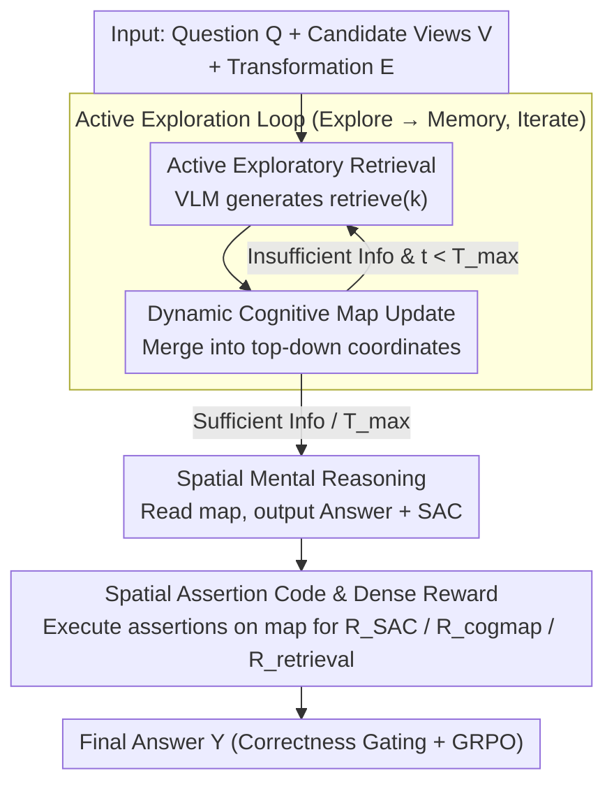

# Active Exploring like a Pigeon: Reinforcing Spatial Reasoning via Agentic Vision-Language Models

**Conference**: ICML 2026  
**arXiv**: [2606.02459](https://arxiv.org/abs/2606.02459)  
**Code**: https://github.com/dw-dengwei/active-spatial-reasoning.git  
**Area**: Multimodal VLM / Spatial Reasoning  
**Keywords**: Active Visual Exploration, Spatial Reasoning, Dynamic Cognitive Map, Spatial Assertion Code, GRPO  

## TL;DR
This paper transforms VLM spatial reasoning from a passive process of "viewing all perspectives before answering" into an agentic workflow of "active framing based on the question, updating cognitive maps, and verifying reasoning with executable spatial assertions." By fine-tuning Qwen2.5-VL-3B with dense rewards, it achieves 80.5% overall accuracy on MindCube-Tiny, notably improving the Rotation subset to 85.0%.

## Background & Motivation
**Background**: Multimodal VLMs are already capable of image-text understanding, visual question answering, and specific spatial relationship problems. However, most methods still feed all images into the context at once, forcing the model to reason over static inputs. Spatial VLMs like MindCube and 3DThinker further introduce cognitive maps or 3D reconstruction auxiliary tasks, but their perception remains passive.

**Limitations of Prior Work**: In real embodied scenarios, an agent rarely sees the entire environment at once. It needs to select views based on the question and assemble fragmented observations into continuous spatial memory. Passive input of all perspectives is not only costly but also risks the model getting lost in irrelevant visual information. Furthermore, existing RLVR/GRPO training typically rewards only the final answer correctness, providing rewards that are too sparse to inform the model which specific spatial relationship step was incorrect.

**Key Challenge**: Spatial reasoning requires verifiable intermediate processes, but VLM natural language reasoning is open-ended text, making it difficult to directly judge the correctness of each intermediate relationship. If only final answer rewards are used, models might learn superficial patterns; if LLM judges are used, hallucinations and overconfidence may be introduced into the rewards.

**Goal**: The authors aim to solve three sub-problems simultaneously: enabling VLMs to actively select relevant views; allowing multiple observations to form an updatable spatial memory; and making intermediate spatial relationships programmatically checkable to provide finer feedback for RL training than simple 0/1 binary rewards.

**Key Insight**: Drawing inspiration from biological cognitive maps in navigation, the paper integrates observed objects, camera positions, and orientations into a unified top-down coordinate system. It then translates natural language relationships such as "object A is to the left/front of view B" into Python expressions, which are executed on the cognitive map.

**Core Idea**: Use dynamic cognitive maps to carry spatial memory and Spatial Assertion Code (SAC) to turn intermediate reasoning into executable assertions. Combine retrieval, map updates, and SAC correctness into a dense reward system to reinforce active spatial reasoning.

## Method
The key to this paper is not just adding a memory module, but reframing spatial QA as a sequential decision-making process. At each step, the model exists within the current cognitive map state, determines the next view to observe based on the question and transformation relationships, updates the map after observation, and stops to answer once sufficient information is gathered. During training, the model is required to output SAC alongside natural language explanations, allowing the system to check if intermediate relationships are consistent with the current map.

### Overall Architecture
Input includes the question $\mathcal{Q}$, a set of candidate views $V=\{v_n\}$, and descriptions of view transformations $E$. The system state $s_t$ is the dynamic cognitive map, and the action $a_{t+1}$ is retrieval code generated by the VLM, such as `retrieve(3)`. After executing the action, the model observes the corresponding view $v_{t+1}$ and updates the map $s_{t+1}=\mathcal{P}_\theta(s_t,v_{t+1},a_{t+1})$. This loop continues until the model decides to stop, finally outputting an answer based on the accumulated map.

The dynamic cognitive map maintains two sets in a unified top-down coordinate system: the object set $\mathcal{O}_t=\{(o_i,\mathbf{p}_i,\mathbf{d}_i)\}$, recording object categories, positions, and orientations; and the view set $\mathcal{V}_t=\{(v_j,\mathbf{c}_j,\mathbf{f}_j)\}$, recording camera positions and orientations. This ensures that new views are integrated into a single spatial coordinate system rather than just being appended to the text context.

Training follows two stages. Stage one (SFT) uses three types of cold-start data to teach the model to retrieve relevant views, update cognitive maps, and generate spatial reasoning with SAC. Stage two (RFT) performs reinforcement fine-tuning using GRPO on the SFT model, where rewards are gated by final correctness and supplemented by intermediate terms for retrieval, cognitive map accuracy, and SAC.

### Key Designs
1. **Active Exploratory View Retrieval**: Framing based on the question instead of viewing all images at once. Passive input is costly, and in tasks like Rotation where views share few visual anchors, models easily get lost. This paper formulates retrieval as a parsable Python-like action (e.g., `retrieve(k)`), allowing the VLM to actively select the next most relevant view. This breaks the difficult task of "aligning all views at once" into manageable steps along an egocentric reference frame.

2. **Dynamic Cognitive Map as Structured Long-term Memory**: Structured coordinates replace text history. Spatial reasoning's hardest part is view transformation and alignment, which pure text context often loses. The map state $s_t=\{\mathcal{O}_t,\mathcal{V}_t\}$ serves as memory, where each new observation is merged into the coordinate system ($s_{t+1}=\mathcal{P}_\theta(s_t,v_{t+1},a_{t+1})$). Subsequent reasoning reads directly from coordinates rather than re-processing a long multimodal history.

3. **Spatial Assertion Code (SAC) and Dense Reward**: Turning intermediate reasoning into executable verification. Sparse rewards only tell the model "the result is wrong" without pinpointing failures in retrieval, mapping, or logic. SAC translates natural language spatial relations into boolean Python expressions—e.g., "From view 4, object 1 is to the left of object 0" becomes `obj1 in obj0.left(view=v4)`. Correctness is calculated as $R_{SAC}=\frac{1}{M}\sum_i \mathbb{1}(\text{eval}(\text{code}_i,s_t)=\texttt{True})$. Combined with map correctness $R_{cogmap}$ and retrieval relevance $R_{retrieval}$, it is gated by final accuracy to prevent reward hacking, turning uncontrollable intermediate natural language into computable signals.

### Loss & Training
The SFT stage uses standard autoregressive cross-entropy: $\mathcal{L}_{SFT}=-\mathbb{E}_{(x,y)\sim\mathcal{D}_{SFT}}[\log p_\theta(y|x)]$, where training data consists of retrieval, cognitive map updates, and SAC reasoning.

The RFT stage uses GRPO. The reward function is gated by final answer correctness: if the final answer is wrong, the total reward is 0 to prevent the model from optimizing intermediate formats without solving the task. If correct, intermediate dense terms $R_{retrieval}$, $R_{cogmap}$, and $R_{SAC}$ are added. The formula is summarized as $R=\mathbb{1}_{correct}[\mathbb{1}_{correct}+w(R_{retrieval}+R_{cogmap}+R_{SAC})]$.

## Key Experimental Results

### Main Results
On MindCube-Tiny, the method based on Qwen2.5-VL-3B-Instruct was compared against random baselines, general VLMs, and specialized spatial VLMs. The most significant improvement occurred in the Rotation subset, which is closest to embodied spatial reasoning involving continuous turns within a limited field of view.

| Method | Perception/Memory Mode | Overall ↑ | Rotation ↑ | Among ↑ | Around ↑ |
|------|---------------|-----------|------------|---------|----------|
| Qwen2.5-VL-3B-Instruct | Passive Input | 33.21 | 37.37 | 33.26 | 30.34 |
| GPT-4o | Passive Input | 38.81 | 32.65 | 40.17 | 29.16 |
| MindCube-Qwen2.5-VL-3B | Passive + Static Map | 70.7 | 48.0 | 79.2 | 68.4 |
| 3DThinker-Qwen2.5-VL-3B | Passive + 3D Recon | 75.2 | 55.5 | 81.8 | 75.2 |
| **Ours** | **Active + Dynamic Map** | **80.5** | **85.0** | **81.0** | **75.6** |

### Ablation Study
The paper analyzes perception paradigms, reward components, memory formats, and training stages. The gains mainly come from the combination of SAC dense rewards and SFT+RL.

| Configuration | Key Metrics | Description |
|------|---------|------|
| Passive RFT | Rotation Acc. 27.5 | No active framing, direct processing of views |
| Active RFT | Rotation Acc. 38.5 | RFT from base checkpoint; active perception adds +11.0 |
| Full reward | Overall Acc. 80.4 | Full dense reward combination |
| w/o $R_{retrieval}$ | Overall Acc. 72.5 | Removal of retrieval relevance reward (down 7.9) |
| w/o $R_{cogmap}$ | Overall Acc. 72.6 | Map correctness no longer supervised (down 7.8) |
| w/o $R_{SAC}$ | Overall Acc. 70.2 | Intermediate assertion reward is most critical (down 10.2) |
| Context memory | Acc. 50.9 | Accumulating history as plain text context |
| Cognitive map | Acc. 54.2 | Structured map provides +3.3 |

### Key Findings
- **Rotation is the most persuasive subset**: The best prior method reached 55.5, while ours reached 85.0, proving that active exploration and dynamic coordinate memory effectively alleviate view alignment issues.
- **SAC reward ablation showed the largest drop**, indicating that making intermediate spatial reasoning executable is more valuable than simple natural language explanations.
- **SFT is a prerequisite for RL**. The base model pass@1 was only 25.4, SFT reached 67.2, and Base+SFT+RL reached 80.5, showing that RL primarily reinforces existing agentic behavior rather than teaching formats and tool use from scratch.

## Highlights & Insights
- Decoupling spatial reasoning into "Exploration-Memory-Verification" interfaces is very clear. Instead of just claiming "better 3D reasoning," this paper defines actionable steps, states, and rewards.
- SAC is a practical design: it doesn't require the model to output full programs, only critical spatial relations via boolean expressions, making it closer to spatial QA than general program-of-thought.
- Final correctness gating prevents common dense reward side effects. Models only get the intermediate bonus if they answer correctly, reducing the risk of reward hacking SAC or map scores while deviating from the task.
- The dynamic cognitive map concept can transition to robot navigation, indoor QA, and multi-view video understanding by treating observations as objects and camera states in a unified coordinate system.

## Limitations & Future Work
- The method relies on available view transformations and map supervision in MindCube. In real robot scenarios, pose estimation, occlusion, and detection errors would make map updates harder.
- SAC's expressive power covers explicit spatial relations; for tasks involving continuous geometry, deformation, or fuzzy semantics, hand-written APIs may be insufficient.
- Training costs are high: SFT takes ~22 hours, RL ~1 day using 8 A100s. Scaling to larger VLMs or real-world data requires more efficient reward computation and rollout strategies.
- Verification was primarily on MindCube-Tiny, lacking real-world embodied benchmarks or closed-loop robot execution experiments.

## Related Work & Insights
- **vs MindCube**: MindCube use cognitive maps but in a passive, static way. This work puts maps into a sequential decision loop and uses SAC for dense rewards, leading to a significant advantage in Rotation.
- **vs 3DThinker**: 3DThinker uses 3D reconstruction but still processes input at once. This work emphasizes active retrieval and intermediate verification, suitable for incremental information acquisition.
- **vs RLVR/GRPO Spatial Methods**: Prior methods mostly use final answers as verifiable rewards. This work pushes verifiability into intermediate steps, showing that "structural design of reward" is more critical than just increasing rollouts.
- **Insight**: For VLM tasks requiring multi-step visual tool use, consider designing intermediate states as structured memory and translating model explanations into executable assertions rather than relying solely on the final answer.

## Rating
- **Novelty**: ⭐⭐⭐⭐⭐ Using SAC + Dynamic Cognitive Maps to turn intermediate spatial reasoning into verifiable RL signals is a distinct design.
- **Experimental Thoroughness**: ⭐⭐⭐⭐ Main experiments and ablations on MindCube are complete, but real embodied validation is lacking.
- **Writing Quality**: ⭐⭐⭐⭐ Methodological flow, reward design, and ablation logic are clear, though some formulas and tables are slightly crowded.
- **Value**: ⭐⭐⭐⭐⭐ High reuse value for agentic VLMs, spatial reasoning, and verifiable reward design.

<!-- RELATED:START -->

## Related Papers

- [\[ICML 2026\] 3ViewSense: Spatial and Mental Perspective Reasoning from Orthographic Views in Vision-Language Models](3viewsense_spatial_and_mental_perspective_reasoning_from_orthographic_views_in_v.md)
- [\[CVPR 2026\] ARM-Thinker: Reinforcing Multimodal Generative Reward Models with Agentic Tool Use and Visual Reasoning](../../CVPR2026/multimodal_vlm/arm-thinker_reinforcing_multimodal_generative_reward_models_with_agentic_tool_us.md)
- [\[ICML 2026\] Learning GUI Grounding with Spatial Reasoning from Visual Feedback](learning_gui_grounding_with_spatial_reasoning_from_visual_feedback.md)
- [\[ICML 2026\] Circle-RoPE: Cone-like Decoupled Rotary Positional Embedding for Vision-Language Models](circle-rope_cone-like_decoupled_rotary_positional_embedding_for_large_vision-lan.md)
- [\[ICML 2026\] The Perceptual Bandwidth Bottleneck in Vision-Language Models: Active Visual Reasoning via Sequential Experimental Design](the_perceptual_bandwidth_bottleneck_in_vision-language_models_active_visual_reas.md)

<!-- RELATED:END -->
