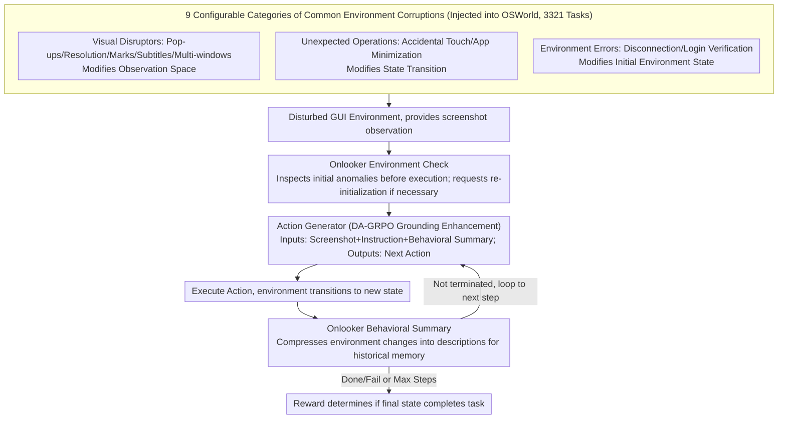

# AgentHijack: Benchmarking Computer Use Agent Robustness to Common Environment Corruptions

**Conference**: ICML2026  
**arXiv**: [2605.25707](https://arxiv.org/abs/2605.25707)  
**Code**: https://AgentHijack.github.io  
**Area**: LLM Agent / Multimodal Robustness  
**Keywords**: computer-use agent, GUI Agent, environment corruption, robustness evaluation, DA-GRPO  

## TL;DR
This paper proposes AgentHijack, a benchmark that evaluates the robustness of computer-use agents using 9 categories of configurable everyday environment corruptions. Furthermore, it introduces DA-GRPO to strengthen grounding and an onlooker for behavioral summarization and environment checking, improving the average success rate of UI-TARS-1.5-7B from 18.74% to 22.89%.

## Background & Motivation

**Background**: Computer-use agents driven by multimodal large models can already complete complex workflows such as office tasks, system operations, and browser tasks across virtual machines, web pages, and mobile devices. Benchmarks like OSWorld, WebArena, and AndroidWorld primarily focus on task success rates in clean environments, evaluating whether an agent can understand screenshots, plan steps, and execute clicks or inputs.

**Limitations of Prior Work**: Real-world desktop environments rarely remain "clean." Pop-ups, resolution changes, subtitle occlusions, other application windows, accidental touches, window minimizations, network disconnections, and login authentications often interrupt the execution flow. Existing agents exhibit localization drift, incorrect attribution, and meaningless repetitive attempts under these common corruptions. However, existing robustness benchmarks either focus on adversarial attacks or use QA formats, lacking real executable GUI environments and configurable corruptions.

**Key Challenge**: The deployment risk of computer-use agents stems from everyday environmental uncertainties rather than just malicious attacks; however, mainstream evaluations still assume ideal states. This leads to a systematic failure to measure the most common failure modes models encounter in the real world.

**Goal**: The authors aim to construct a benchmark capable of injecting common corruptions into OSWorld-like virtual machine environments to systematically evaluate the corruption robustness of agents and propose an agent framework to mitigate the impact of these corruptions.

**Key Insight**: The paper does not categorize these disturbances as adversarial robustness but defines them as corruption robustness: the corruptions do not change the user task itself and have no direct malicious intent; instead, they alter the observation space, state transitions, or environment states, causing the agent's closed-loop execution to deviate from the original plan.

**Core Idea**: Use configurable real-world GUI corruptions to expose weaknesses in agent grounding, memory, and environment checking, then improve robustness using a combined "grounding-enhanced action generator + onlooker."

## Method

### Overall Architecture

AgentHijack first models the computer-use agent as a POMDP. At each step, the agent outputs an action $a_t$ based on the screenshot observation $o_t$, and the environment transitions to a new state $s_{t+1}$. Upon reaching the maximum number of steps or outputting Done/Fail, a task reward is used to judge whether the final state satisfies the goal. While standard benchmarks evaluate the average success rate in clean environments, AgentHijack evaluates success rates under observations, states, or transitions altered by the corruption function $\mathcal{C}_i$.

The benchmark is built upon OSWorld, consisting of 3321 tasks with 9 categories of common corruptions injected, providing YAML configurations to adjust position, intensity, and content. Corruptions are divided into three groups: visual disruptors that change screenshot observations (e.g., pop-ups, resolution changes, screen marks, subtitles, multi-app windows); unexpected operations that interfere with state transitions (e.g., accidental touches and app minimization); and environment errors that alter the initial environment state (e.g., network errors and login verification).

On the methodology side, the AgentHijack-Agent consists of two roles. The action generator is the GUI agent executing the task, based on UI-TARS-1.5-7B and trained via DA-GRPO in different corrupted environments to enhance grounding. The onlooker is an environment observer that checks for initial environment anomalies before execution and continuously summarizes environment changes during execution, compressing historical screenshots and actions into behavioral descriptions to help the action generator determine whether "this change was caused by the agent itself or an external environmental disturbance."

### Key Designs

**1. Configurable 9 categories of common environment corruptions: Systematically injecting non-ideal real-world desktop scenarios into the benchmark.**

Existing GUI benchmarks assume clean environments by default, whereas real desktops are full of daily disturbances like pop-ups, resolution changes, accidental touches, and network disconnections. These do not change the task goal nor are they malicious, yet they are sufficient to break the agent's closed-loop execution. AgentHijack categorizes 9 types of corruptions into three groups based on the "level of disturbance effect," corresponding to observations, transitions, and states in the POMDP: visual disruptors (pop-ups, resolution changes, marks, subtitles, multi-app windows) alter the screenshot observation $\mathcal{O}$; unexpected operations (accidental touch, app minimization) interfere with the state transition $\mathcal{T}$; and environment errors (network error, login verification) change the initial environment state $\mathcal{S}$. Each corruption has specific injection methods: pop-ups draw deceptive text in coverable areas, resolution changes resize screenshots directly, marks/subtitles draw visual interference in random or specified areas, multi-apps launch unrelated applications, accidental touch clicks random buttons at specified steps, app minimization triggers Win+D, network error blocks external access via firewall rules, and verification uses Win+L for screen locking. Crucially, each corruption uses YAML to expose parameters such as intensity, content, and timing, allowing researchers to create different variants to avoid benchmarks testing only fixed failures and to separately investigate the effects of "intensity / content / location" on robustness.

**2. DA-GRPO: Rollout in varied corrupted environments to reinforce grounding.**

Using SFT to strengthen grounding requires large amounts of trajectories and fails to learn self-correction; while standard GRPO allows end-to-end optimization, it only rolls out in a single (clean) environment, failing to learn robustness across corruptions. The key modification of DA-GRPO (Data-Augmented GRPO) is to have the same instruction rollout a set of responses $\{o_i^c\}$ under randomly sampled corrupted environments $c\in\mathcal{C}$, and then use the group relative advantage $\hat{A}_{i,j}=(r_i-\mu)/\sigma$ for normalization. This intra-group comparison naturally covers various visual and state disturbances. When $c$ is consistently a clean environment, it reverts to standard GRPO. The reward is the sum of task success and format rewards $r_i=r_i^{success}+r_i^{format}$ (1 for completion, -1 for schema non-compliance). Since current agent success trajectories are sparse, a batch of rollouts might all fail, resulting in zero group advantage and no positive learning signal; DA-GRPO adopts the experience replay buffer from ARPO to cache historical successful trajectories, replacing one response in a failed batch with a successful one to ensure at least one non-zero reward signal per batch for imitation.

**3. Onlooker: A perspective for pre-execution checks and in-execution behavioral summarization.**

The historical context of GUI agents is usually a pure "screenshot+action" sequence $\{o_1,a_1,\dots\}$, which leads to two issues: first, the agent only focuses on changes caused by its own actions and ignores external unexpected operations, thus misattributing accidental touches or window minimizations to its own operations; second, screenshots contain too many UI elements, causing the agent to lose track of key elements when triggered by irrelevant content. The Onlooker is a specialized auxiliary agent (also using a fine-tuned UI-TARS-1.5-7B by default) that performs two tasks: before execution, it checks the initial environment against an external error database for anomalies like network errors or login verifications, reporting errors and requesting re-initialization to avoid wasting resources on non-executable environments; during execution, it records each environmental change and compresses it into a short description $d_t$, rewriting the context as $\{o_1,d_1,\dots,o_t,d_t\}$. This allows the action generator to distinguish "changes caused by me versus external disturbances," thereby recovering the original task thread.

### Loss & Training

AgentHijack-Agent uses UI-TARS-1.5-7B as the base model, trained on 128 AgentHijack tasks for 15 epochs. Training utilizes VERL with a batch size of 1, rollout count of 4, learning rate of $1\times10^{-6}$, gradient accumulation of 4, and KL loss disabled to encourage exploration. The default onlooker also uses a fine-tuned UI-TARS-1.5-7B; screenshot resolution is $1920\times1080$, and the maximum execution steps are set to 10.

Evaluation covers 9 representative agents, including GLM-4.5V, Llama-3.2-90B-Vision-Instruct, Qwen2.5-VL-72B-Instruct, GPT-4o, Claude-3.7-Sonnet, Gemini-2.5-Pro, UI-TARS-7B-DPO, UI-TARS-72B-DPO, and UI-TARS-1.5-7B. All models are set to a temperature of 0.6, top-p of 0.9, maximum output of 1500 tokens, and the historical context contains up to 15 GUI screenshots.

## Key Experimental Results

### Main Results

| Agent | Clean | Pop ups | Resolution | Accidental Touch | Network Error | Verification | Average |
|-------|-------|---------|------------|------------------|---------------|--------------|---------|
| Qwen2.5-VL-72B-Instruct | 10.99% | 1.86% | 6.38% | 7.48% | 7.48% | 6.63% | 7.47% |
| GPT-4o | 5.38% | 1.44% | 4.82% | 3.12% | 4.24% | 3.25% | 3.69% |
| Gemini-2.5-Pro | 8.11% | 5.20% | 6.98% | 4.61% | 7.02% | 7.81% | 5.82% |
| UI-TARS-72B-DPO | 22.38% | 15.51% | 14.32% | 14.44% | 19.76% | 9.42% | 16.96% |
| UI-TARS-1.5-7B | 24.21% | 10.28% | 11.69% | 22.54% | 22.02% | 10.48% | 18.74% |
| AgentHijack-Agent | 27.80% | 21.51% | 12.53% | 24.37% | 23.09% | 20.15% | 22.89% |

### Ablation Study

| Analysis Item | Setting | Key Metric | Description |
|------|------|---------|------|
| Strongest Baseline Comparison | AgentHijack-Agent vs UI-TARS-1.5-7B | Average +4.15 pts, Clean +3.59, Pop ups +11.23, Verification +9.67 | Onlooker helps most with pop-ups and verification issues |
| Corruption Intensity | Resolution scaling, mark count, accidental touch/min frequency | Higher intensity leads to lower performance, but AgentHijack-Agent remains consistently higher | DA-GRPO training does not just adapt to default intensities |
| Corruption Content | Different pop-up/subtitle text, mark shapes and colors | Performance fluctuates with content, but the framework maintains stable gains | The method learns anti-interference strategies rather than memorizing patterns |
| Corruption Position | Subtitle position, accidental touch/minimization timing | Gains observed across different spatial and temporal positions | Onlooker's behavioral summary mitigates timing-based variations |
| Module Necessity | Removing RL or onlooker | Both lead to significant performance drops | Grounding reinforcement and onlooker perspectives are complementary |

### Key Findings
- Current general MLLMs, even very large ones, have very low success rates in real GUI execution. GPT-4o averages 3.69% and Gemini-2.5-Pro 5.82%, indicating GUI agent capabilities cannot be directly extrapolated from VLM QA performance.
- The UI-TARS series is stronger in clean environments but still drops significantly facing corruption. UI-TARS-1.5-7B drops from 24.21% in clean to an average of 18.74%, with verification and pop-ups being the most vulnerable categories.
- AgentHijack-Agent shows positive gains across all corruption types, especially in pop-ups and verification, proving that environment checks and behavioral summaries reduce meaningless clicks and blind attempts in non-executable environments.
- Gain in resolution is the smallest (+0.84 points), suggesting coordinate/scaling-related grounding remains a hard problem for GUI agents that DA-GRPO and onlookers alone cannot solve completely.

## Highlights & Insights
- Distinguishing "everyday corruptions" from security attacks is highly valuable. Real-world deployment failures are often not due to malicious user induction but due to a pop-up, a login page, or a change in window state; such issues deserve an independent evaluation axis.
- The 9 categories of corruption in the benchmark cover observation space, state transitions, and initial environments, which is more comprehensive than simple visual occlusion. Specifically, accidental touch and app minimization can test whether agents misattribute external causes.
- The design of the onlooker is simple yet effective, acting as an "environment logger" for the execution agent. For long GUI trajectories, compressing historical screenshots into environment change summaries is more consistent with how humans debug than simply stacking more screenshots.
- The implementation details of DA-GRPO with a replay buffer are practical. Successful trajectories in GUI tasks are sparse; if a batch of rollouts all fail, group relative advantages lack positive learning signals. Caching successful trajectories allows the training to continuously see recoverable paths to imitate.

## Limitations & Future Work
- AgentHijack is based on OSWorld and virtual machine desktops, primarily covering desktop GUIs; corruptions in mobile, web browsers, remote desktops, and enterprise software may manifest differently.
- Overall success rates remain low, with AgentHijack-Agent averaging only 22.89%. This indicates the framework mitigates the problem but is still far from deployable robustness.
- The onlooker increases inference costs and defaults to using the same fine-tuned model; if the onlooker itself misjudges, it might pass incorrect summaries to the action generator.
- The corruptions are the 9 categories pre-defined by the authors; while configurable, they still cannot cover all real-world desktop anomalies. Future work could introduce automatically mined corruptions, user log replays, or real system event streams.
- DA-GRPO training utilizes only 128 tasks, which is relatively limited in scale. Future research could explore larger-scale corruption curricula and separate optimizations for visual grounding, coordinate calibration, and environment state recovery.

## Related Work & Insights
- **vs OSWorld / WebArena / AndroidWorld**: These benchmarks primarily evaluate task completion in clean environments; AgentHijack injects common anomalies directly into real interaction environments to evaluate deployment robustness.
- **vs Agent-SafetyBench / SafeArena**: These works focus on high-risk or malicious task tendencies; AgentHijack focuses on non-malicious, daily occurring corruptions that do not change the task goal.
- **vs GUI-Robust / Env. Distractions**: These also focus on common interference but often adopt QA formats or lack flexible configurations; AgentHijack executes tasks in virtual machines, testing closed-loop operation failures.
- **vs UI-TARS**: UI-TARS is a strong GUI agent baseline. AgentHijack shows it is strong in clean environments but remains susceptible to pop-ups, resolution, and verification errors; this paper improves robustness through DA-GRPO and onlooker on top of it.
- **vs Standard GRPO GUI Agent Training**: Standard GRPO mostly rolls out in a single environment; DA-GRPO treats corruption as environmental data augmentation, allowing the same task to generate intra-group comparisons across various anomalies.

## Rating
- Novelty: ⭐⭐⭐⭐☆ The definition of corruption robustness and the executable benchmark are highly practical; the framework is intuitive but targets key failure modes.
- Experimental Thoroughness: ⭐⭐⭐⭐☆ Covers 9 corruption types, 9 agents, and ablations on intensity/content/location/onlooker; the main limitation is the small scale of training tasks, and some ablation figures are mostly presented in charts.
- Writing Quality: ⭐⭐⭐⭐☆ Motivation and cases are clear; the benchmark construction is specific. Math formulas and experimental charts are somewhat dispersed and require the appendix to fully grasp DA-GRPO details.
- Value: ⭐⭐⭐⭐⭐ Highly valuable for real-world GUI agent deployment, particularly in reminding researchers to evaluate recovery capabilities under environment anomalies rather than just clean task success.

<!-- RELATED:START -->

## Related Papers

- [\[AAAI 2026\] "Are We Done Yet?": A Vision-Based Judge for Autonomous Task Completion of Computer Use Agents](../../AAAI2026/multimodal_vlm/are_we_done_yet_a_vision-based_judge_for_autonomous_task_completion_of_computer_.md)
- [\[AAAI 2026\] VipAct: Visual-Perception Enhancement via Specialized VLM Agent Collaboration and Tool-use](../../AAAI2026/multimodal_vlm/vipact_visual-perception_enhancement_via_specialized_vlm_age.md)
- [\[NeurIPS 2025\] Mint: A Simple Test-Time Adaptation of Vision-Language Models against Common Corruptions](../../NeurIPS2025/multimodal_vlm/mint_a_simple_testtime_adaptation_of_visionlanguage_models_a.md)
- [\[ICML 2026\] Contrastive Spectral Rectification: Test-Time Defense towards Zero-shot Adversarial Robustness of CLIP](contrastive_spectral_rectification_test-time_defense_towards_zero-shot_adversari.md)
- [\[ACL 2026\] AdaTooler-V: Adaptive Tool-Use for Images and Videos](../../ACL2026/multimodal_vlm/adatooler-v_adaptive_tool-use_for_images_and_videos.md)

<!-- RELATED:END -->
