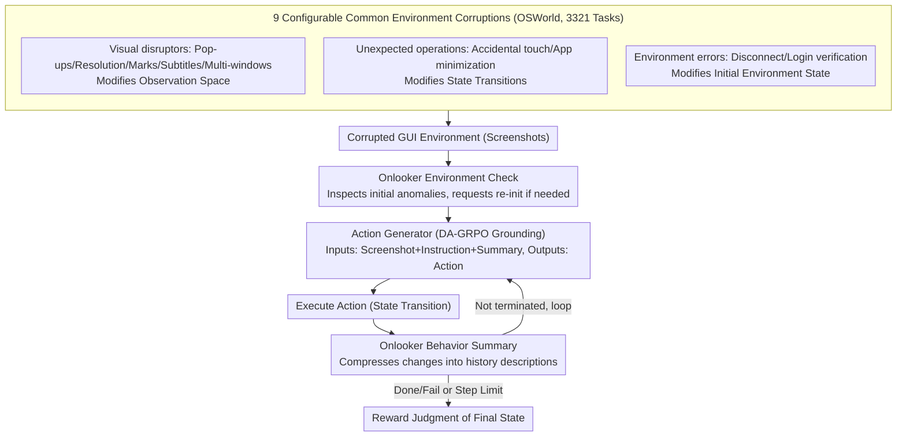

# AgentHijack: Benchmarking Computer Use Agent Robustness to Common Environment Corruptions

**Conference**: ICML2026  
**arXiv**: [2605.25707](https://arxiv.org/abs/2605.25707)  
**Code**: https://AgentHijack.github.io  
**Area**: LLM Agent / Multimodal Robustness  
**Keywords**: computer-use agent, GUI Agent, environment corruption, robustness benchmarking, DA-GRPO  

## TL;DR
This paper introduces AgentHijack, which evaluates the robustness of computer-use agents using 9 types of configurable common environment corruptions. It further enhances grounding through DA-GRPO and introduces an "onlooker" for behavior summarization and environment inspection, improving the average success rate of UI-TARS-1.5-7B from 18.74% to 22.89%.

## Background & Motivation

**Background**: Multimodal Large Model (MLLM)-driven computer-use agents can already complete complex workflows such as office tasks, system operations, and browser tasks in virtual machines, web pages, and mobile environments. Benchmarks like OSWorld, WebArena, and AndroidWorld primarily focus on task success rates in clean environments, evaluating whether agents can understand screenshots, plan steps, and execute clicks or inputs.

**Limitations of Prior Work**: Real-world desktop environments rarely stay "clean." Pop-ups, resolution changes, subtitle overlays, other application windows, accidental touches, window minimizations, network disconnections, and login verifications can interrupt the execution flow. Existing agents exhibit localization drift, incorrect attribution, and meaningless repetitive attempts under these common corruptions. However, existing robustness benchmarks focus either on adversarial attacks or use QA formats, lacking real executable GUI environments and configurable corruptions.

**Key Challenge**: Deployment risks for computer-use agents stem from daily environment uncertainty rather than just malicious attacks. However, mainstream evaluations still assume ideal states, leaving the failure modes that models are most likely to expose in the real world unsystematically measured.

**Goal**: The authors aim to build a benchmark capable of injecting common corruptions into OSWorld-style virtual machine environments to systematically evaluate the corruption robustness of agents and propose an agent framework to mitigate the impact of these corruptions.

**Key Insight**: Instead of calling these perturbations adversarial robustness, the paper defines them as "corruption robustness." Corruptions do not change the user task itself nor possess malicious intent; instead, they alter the observation space, state transitions, or environment states, causing the agent's closed-loop execution to deviate from the original plan.

**Core Idea**: Use configurable real-world GUI corruptions to expose weaknesses in agent grounding, memory, and environment inspection, then use a "grounding-enhanced action generator + onlooker" to collectively improve robustness.

## Method

### Overall Architecture

AgentHijack models the computer-use agent as a POMDP. At each step, the agent outputs an action $a_t$ based on a screenshot observation $o_t$, and the environment transitions to a new state $s_{t+1}$. After reaching the maximum steps or outputting Done/Fail, a task reward is used to determine if the final state satisfies the goal. Standard benchmarks evaluate the average success rate in clean environments, while AgentHijack evaluates success under observations, states, or transitions modified by a corruption function $\mathcal{C}_i$.

Constructed based on OSWorld with a total of 3,321 tasks, the benchmark injects 9 types of common corruptions and provides YAML configurations to adjust position, intensity, and content. Corruptions are divided into three groups: visual disruptors (pop-ups, resolution changes, screen marks, subtitles, multi-app windows); unexpected operations (accidental touches, app minimization); and environment errors (network errors, login verification).

On the methodology side, the AgentHijack-Agent consists of two roles. The **action generator** is the GUI agent executing tasks, based on UI-TARS-1.5-7B and trained via DA-GRPO in different corrupted environments to enhance grounding. The **onlooker** acts as an environment observer that checks for initial environment anomalies before execution and continuously summarizes environment changes during execution, compressing history into behavioral descriptions to help the action generator determine if a change was self-caused or an external perturbation.

### Key Designs

**1. Nine Configurable Common Environment Corruptions: Systematically injecting non-ideal conditions into the benchmark**

Existing GUI benchmarks assume clean environments, whereas real desktops are full of daily perturbations like pop-ups and network drops that interrupt agents without changing task goals. AgentHijack categorizes these 9 corruptions by the POMDP layer they affect: visual disruptors (pop-ups, resolution, marks, subtitles, multi-apps) affect observations $\mathcal{O}$; unexpected operations (accidental touch, app minimization) affect transitions $\mathcal{T}$; and environment errors (network, verification) affect initial states $\mathcal{S}$. Each corruption has specific injection mechanisms: pop-ups draw misleading text, resolution changes resize screenshots, accidental touches click random buttons at specific steps, etc. Parameters like intensity and timing are exposed via YAML, allowing researchers to isolate the effects of different variables.

**2. DA-GRPO: Rollout in diverse corrupted environments to strengthen grounding**

SFT-based grounding requires massive trajectories and lacks self-correction. While standard GRPO allows end-to-end optimization, it rollouts in clean environments and fails to learn cross-corruption robustness. Data-Augmented GRPO (DA-GRPO) modifies this by rolling out multiple responses $\{o_i^c\}$ for the same instruction under randomly sampled corruptions $c\in\mathcal{C}$. Group-relative advantage $\hat{A}_{i,j}=(r_i-\mu)/\sigma$ normalization then naturally covers visual and state perturbations. The reward combines task success and format compliance $r_i=r_i^{success}+r_i^{format}$. To address the sparse success signals in early training, DA-GRPO uses an experience replay buffer to replace failed trajectories in a batch with historical successes, ensuring at least one non-zero learning signal per batch.

**3. Onlooker: Pre-execution environment check + In-execution behavior summarization**

GUI agent history typically consists of pure "screenshot + action" sequences $\{o_1,a_1,\dots\}$, which leads to two issues: ignoring external unexpected operations (misattributing accidental touches to their own actions) and being distracted by irrelevant UI elements. The Onlooker is an auxiliary agent (also based on UI-TARS-1.5-7B) that handles two tasks: Before execution, it checks the environment against an error database for initial anomalies (e.g., lock screens), requesting re-initialization if necessary. During execution, it records environment changes as short descriptions $d_t$, rewriting the context as $\{o_1,d_1,\dots,o_t,d_t\}$ so the action generator can distinguish between self-induced changes and external perturbations.

### Loss & Training

AgentHijack-Agent uses UI-TARS-1.5-7B as the base model, trained on 128 AgentHijack tasks for 15 epochs. Training utilizes VERL with a batch size of 1, rollout count of 4, learning rate of $1\times10^{-6}$, gradient accumulation of 4, and kl-loss disabled to encourage exploration. The default onlooker is also a fine-tuned UI-TARS-1.5-7B. Screenshots are at $1920\times1080$, and the maximum execution limit is 10 steps.

The evaluation covers 9 representative agents: GLM-4.5V, Llama-3.2-90B-Vision-Instruct, Qwen2.5-VL-72B-Instruct, GPT-4o, Claude-3.7-Sonnet, Gemini-2.5-Pro, UI-TARS-7B-DPO, UI-TARS-72B-DPO, and UI-TARS-1.5-7B. All models use temperature 0.6, top-p 0.9, max output 1500 tokens, and a history of up to 15 screenshots.

## Key Experimental Results

### Main Results

| Agent | Clean | Pop ups | Resolution | Accidental Touch | Network Error | Verification | Average |
|-------|-------|---------|------------|------------------|---------------|--------------|---------|
| Qwen2.5-VL-72B-Instruct | 10.99% | 1.86% | 6.38% | 7.48% | 7.48% | 6.63% | 7.47% |
| GPT-4o | 5.38% | 1.44% | 4.82% | 3.12% | 4.24% | 3.25% | 3.69% |
| Gemini-2.5-Pro | 8.11% | 5.20% | 6.98% | 4.61% | 7.02% | 7.81% | 5.82% |
| UI-TARS-72B-DPO | 22.38% | 15.51% | 14.32% | 14.44% | 19.76% | 9.42% | 16.96% |
| UI-TARS-1.5-7B | 24.21% | 10.28% | 11.69% | 22.54% | 22.02% | 10.48% | 18.74% |
| Ours (AgentHijack) | 27.80% | 21.51% | 12.53% | 24.37% | 23.09% | 20.15% | 22.89% |

### Ablation Study

| Analysis | Setting | Key Metric | Description |
|------|------|---------|------|
| Strongest Baseline Comparison | Ours vs UI-TARS-1.5-7B | Avg +4.15 pts, Clean +3.59, Pop ups +11.23, Verification +9.67 | Onlooker helps most with pop-ups and verification |
| Corruption Intensity | Resolution scale, mark count, touch frequency | Perf. drops as intensity increases, but Ours stays above base | DA-GRPO generalizes beyond default intensities |
| Corruption Content | Varied pop-up text, subtitles, mark shapes/colors | Perf. fluctuates with content, but framework remains stable | The model learns robust strategies, not fixed patterns |
| Corruption Position | Subtitle position, timing of touch (early/mid/late) | Consistent gains across different spatial and temporal positions | Onlooker's history summary mitigates timing changes |
| Module Necessity | Remove RL or remove Onlooker | Both lead to significant performance drops | Grounding reinforcement and observation perspective are complementary |

### Key Findings
- Current general-purpose MLLMs have very low success rates in real GUI execution environments, even when large. GPT-4o averages only 3.69%, suggesting GUI agent capabilities cannot be directly extrapolated from VLM QA performance.
- The UI-TARS series is stronger in clean environments but drops significantly under corruption. UI-TARS-1.5-7B drops from 24.21% (clean) to 18.74% (avg), with verification and pop-ups being the most vulnerable categories.
- AgentHijack-Agent provides positive gains across all corruption types, especially in pop-ups and verification, proving that environment checks and behavior summarization effectively reduce meaningless clicks.
- Resolution shows the smallest gain (+0.84 pts), suggesting that coordinate/scaling-based grounding remains a hard problem for GUI agents that DA-GRPO and onlookers alone cannot fully solve.

## Highlights & Insights
- Distinguishing "daily corruption" from "security attacks" is valuable. Real-world failures often stem from mundane pop-ups or state changes; these warrant an independent evaluation axis.
- The 9 corruption types cover observation, transition, and state layers of the POMDP, which is more comprehensive than simple visual occlusion. Accidental touch and app minimization specifically test for incorrect attribution.
- The onlooker design is simple but effective, acting as an "env log recorder." Compressing long GUI trajectories into brief change summaries is more aligned with human debugging than stacking raw screenshots.
- DA-GRPO with a replay buffer is a practical detail. Success signals are sparse in GUI tasks; caching successes ensures the trainer always sees recoverable paths even when the current rollout fails.

## Limitations & Future Work
- AgentHijack is based on OSWorld and desktop VMs; corruptions in mobile, web browsers, and remote enterprise software may manifest differently.
- Overall success rates remain low (avg 22.89%), indicating the framework mitigates but does not yet solve the robustness challenge for deployment.
- The onlooker increases inference costs and relies on the same fine-tuned model; if the onlooker misjudges, it may pass incorrect summaries to the action generator.
- Corruptions are currently limited to 9 predefined types. Future work could include automatically mined corruptions or replays from user logs and system event streams.
- The DA-GRPO training used only 128 tasks. Scaling the corruption curriculum and disentangling visual grounding, coordinate calibration, and state recovery optimization are future research directions.

## Related Work & Insights
- **vs OSWorld / WebArena / AndroidWorld**: These focus on clean task completion; AgentHijack injects anomalies into real interactions to evaluate deployment robustness.
- **vs Agent-SafetyBench / SafeArena**: These focus on high-risk or malicious intent; AgentHijack focuses on non-malicious, daily corruptions that do not change the task goal.
- **vs GUI-Robust / Env. Distractions**: These also study distractions but often use QA formats; AgentHijack measures closed-loop task execution failures in VMs.
- **vs UI-TARS**: UI-TARS is a strong baseline that still struggles with pop-ups and verification; this work improves its robustness via DA-GRPO and onlookers.
- **vs Standard GRPO Training**: Standard GRPO rollouts in single environments; DA-GRPO treats corruption as data augmentation for environment-invariant learning.

## Rating
- Novelty: ⭐⭐⭐⭐☆ The definition of "corruption robustness" and the executable benchmark are highly relevant for real-world application.
- Experimental Thoroughness: ⭐⭐⭐⭐☆ Covers 9 corruptions, 9 agents, and various ablations; however, the training task scale for the main method is relatively small.
- Writing Quality: ⭐⭐⭐⭐☆ Clear motivation and construction; some method details and experimental figures require careful reading across the appendix.
- Value: ⭐⭐⭐⭐⭐ Extremely valuable for real GUI agent deployment, emphasizing recovery capabilities over simple clean-task success.

<!-- RELATED:START -->

## Related Papers

- [\[AAAI 2026\] "Are We Done Yet?": A Vision-Based Judge for Autonomous Task Completion of Computer Use Agents](../../AAAI2026/multimodal_vlm/are_we_done_yet_a_vision-based_judge_for_autonomous_task_completion_of_computer_.md)
- [\[AAAI 2026\] VipAct: Visual-Perception Enhancement via Specialized VLM Agent Collaboration and Tool-use](../../AAAI2026/multimodal_vlm/vipact_visual-perception_enhancement_via_specialized_vlm_age.md)
- [\[NeurIPS 2025\] Mint: A Simple Test-Time Adaptation of Vision-Language Models against Common Corruptions](../../NeurIPS2025/multimodal_vlm/mint_a_simple_testtime_adaptation_of_visionlanguage_models_a.md)
- [\[ICML 2026\] Any3D-VLA: Enhancing VLA Robustness via Diverse Point Clouds](any3d-vla_enhancing_vla_robustness_via_diverse_point_clouds.md)
- [\[ICML 2026\] Certified Robustness under Heterogeneous Perturbations via Hybrid Randomized Smoothing](certified_robustness_under_heterogeneous_perturbations_via_hybrid_randomized_smo.md)

<!-- RELATED:END -->
