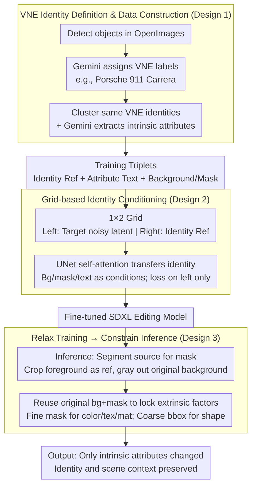

# Alterbute: Editing Intrinsic Attributes of Objects in Images

**Conference**: ICML 2026  
**arXiv**: [2601.10714](https://arxiv.org/abs/2601.10714)  
**Code**: No public code (Project page: https://talreiss.github.io/alterbute/)  
**Area**: Image Generation / Image Editing  
**Keywords**: Image Editing, Intrinsic Attribute Editing, Diffusion Models, Visual Named Entities, Identity Preservation  

## TL;DR
Alterbute utilizes VLMs to automatically mine Visual Named Entity (VNE) identity clusters and jointly conditions a diffusion model on identity references, attribute text, background, and masks. This approach provides a unified framework for editing object color, texture, material, and shape while preserving object identity and scene context.

## Background & Motivation
**Background**: Image editing models can now perform large-scale text-guided modifications, local inpainting, style transfer, and subject-driven generation. While many methods maintain coarse categories or instance appearances, tasks requiring the modification of intrinsic attributes—such as "turning this car red," "changing the table material to wood," or "altering object shape"—remain significantly more challenging because they require changing intrinsic properties while strictly preserving identity.

**Limitations of Prior Work**: General image editors often modify the wrong object, change the identity, or ignore target attributes. Subject personalization methods define identity too strictly, allowing almost no variation in color, material, texture, or shape. Attribute-specific methods usually only address a single property like material or texture and fail to cover all intrinsic attributes.

**Key Challenge**: There is a natural tension between identity preservation and attribute editing. If the identity definition is too coarse (e.g., just "car"), the editing space is large, but the object is easily replaced by another car. If the identity definition is too fine (e.g., a specific instance), the model treats color and texture as part of the identity, making meaningful intrinsic editing impossible.

**Goal**: The authors aim to train a single model that supports editing four types of intrinsic attributes—color, texture, material, and shape—while maintaining user-perceived object identity, background, lighting, and composition.

**Key Insight**: Instead of attempting to collect nearly non-existent paired data of "the same object in the same scene with only intrinsic attributes changed," the paper relaxes the training task. It allows both intrinsic and extrinsic attributes to vary during training, then fixes extrinsic factors during inference by reusing the original background and mask.

**Core Idea**: Using Visual Named Entities (VNE) as an identity definition intermediate between coarse categories and specific instances. VLMs are used to automatically construct supervised data consisting of "the same VNE, with different attributes and scenes," allowing the diffusion model to learn intrinsic attribute variations that preserve identity.

## Method
The Alterbute method can be understood as "redefining identity first, then making the supervision problem collectable." Using categories is too loose, while instances are too tight. VNE allows the model to see natural variations of the same nameable object across different colors, materials, textures, shapes, and scenes, thereby learning which changes do not destroy the identity.

### Overall Architecture
Training data is derived from OpenImages. The authors first use Gemini to assign VNE labels to detected objects, such as "Porsche 911 Carrera" or "IKEA LACK table," filtering out generic or unnameable objects. Objects with the same VNE form identity clusters. Gemini then extracts structured intrinsic attribute descriptions for each object, including color, texture, material, and shape.

The diffusion model is fine-tuned based on SDXL. During training, inputs are organized into a $1\times2$ image grid: the left half contains the noisy latent of the target image, and the right half contains an identity reference image from the same VNE cluster. The model also receives target attribute text, a background image, and an object mask. In the background image, the target area is grayed out, and the mask specifies the object's location. The loss is applied only to the left half, forcing the model to learn to generate an object with target attributes in a specific scene while maintaining the identity.

During inference, given a source image and a single attribute prompt, the system extracts the object mask using a segmentation model, crops the foreground as an identity reference, and uses the original background and mask as extrinsic conditions. For color, texture, and material editing, fine masks are used; for shape editing, since the target geometry is unknown, a coarse bounding-box mask is used to provide the model with more deformation space.

### Key Designs
**1. VNE Identity Definition & Data Construction: Cutting identity to a "nameable" intermediate granularity for automated supervision**

Identity preservation and attribute editing are inherently contradictory—if identity is defined too coarsely (e.g., "car"), the editing space is large, but the identity is easily lost; if defined too finely (specific instance), the model treats color and texture as part of the identity. Visual Named Entity (VNE) is a fine-grained nameable label (e.g., "Porsche 911 Carrera") that lies between coarse categories and instances. Objects under the same VNE share identity features but allow for natural variations in intrinsic attributes, aligning with human intuition for object reference. The authors used Gemini to assign VNE labels to OpenImages objects and cluster them, then extracted structured attributes (color/texture/material/shape) to build "identity reference + attribute text + background/mask" training triplets. Without manual labeling, they obtained 69,744 VNE clusters and ~1.08 million annotated images. Unlike DINOv2 similarity (which confuses visually similar but different identities) or instance retrieval (which is too strict), VNE provides the "same identity but variable attributes" sample clusters necessary for the model to learn which changes are permissible.

**2. Grid-based Identity Conditioning: Using spatial self-attention to transfer identity across images**

The method of feeding identity references into the diffusion UNet determines whether the model actually uses them. Alterbute concatenates the target noisy latent and the background-removed identity reference into a $1\times2$ image grid (each $512\times512$, totaling $512\times1024$). The left half is the target to be generated, and the right half is a reference object from the same VNE cluster. The background image (with the target area grayed out) and binary mask are concatenated along the channel dimension for the left half only, with zeros for the right. Attribute text is injected via cross-attention. This allows the UNet’s built-in self-attention layers to propagate fine-grained identity features across both halves, while the loss is calculated only on the left target area. Ablations prove this grid is not just an engineering choice: switching to channel-wise concatenation causes the model to produce identity mappings that "barely edit," as the reference signal fails to reach the target without cross-image self-attention.

**3. Relaxed Training, Constrained Inference: Turning uncollectible tasks into supervised ones**

Strictly paired samples of "same object, same scene, only intrinsic attribute change" are virtually non-existent in natural data. The authors resolve this by relaxing the training objective—requiring only that the target and reference images belong to the same VNE, while allowing intrinsic and extrinsic attributes (pose, background) to differ. During inference, they reuse the source image’s original background and mask to lock extrinsic factors, forcing the variation into the object’s intrinsic attributes. While this seems to "over-generalize" the task, the key advantage is that "same VNE, different scene/attribute" samples can be automatically mined at scale. Mask granularity is also adjusted: fine masks for color, texture, and material, and coarse bounding-box masks for shape editing to provide more deformation space.

### Loss & Training
The model uses standard diffusion L2 denoising loss, calculated only on the left target region. It was trained for 100,000 steps with a learning rate of $10^{-5}$, batch size of 128, and resolution of $512\times1024$. Based on the 7B parameter SDXL architecture, training took approximately 24 hours on 128 v4 TPUs. To improve robustness, 10% of training samples randomly dropped the identity reference, and another 10% dropped the prompt. Inference used a text CFG of 7.5 and an image CFG of 2.0.

## Key Experimental Results

### Main Results
The authors built an evaluation set of 30 objects and 100 attribute-editing samples covering color, texture, material, and shape. A user study involved 166 participants (5 independent judgments per sample), alongside VLM pairwise evaluations using Gemini, GPT-4o, and Claude.

| Evaluator | vs MimicBrush | vs MaterialFusion | vs FlowEdit | vs InstructPix2Pix | vs OmniGen | vs UltraEdit | vs Diptych |
|-----------|---------------|-------------------|-------------|--------------------|------------|--------------|------------|
| User      | 85.0%         | 79.7%             | 89.3%       | 85.0%              | 81.2%      | 80.0%        | 76.2%      |
| Gemini    | 94.3%         | 87.0%             | 89.6%       | 88.8%              | 80.2%      | 86.0%        | 76.8%      |
| GPT-4o    | 89.8%         | 77.6%             | 88.6%       | 87.0%              | 77.4%      | 78.6%        | 74.8%      |
| Claude    | 92.6%         | 81.3%             | 92.6%       | 85.4%              | 78.8%      | 85.6%        | 77.8%      |

### Ablation Study
The analysis focused on identity definition, conditioning methods, and training budget. While DINO/CLIP metrics were reported, the authors noted they are not entirely reliable for intrinsic editing, as "not editing" can result in high identity scores.

| Analysis Item              | Key Metric                               | Description                                                                 |
|----------------------------|------------------------------------------|-----------------------------------------------------------------------------|
| Standard Metrics (Ours)    | DINO 0.815 / CLIP-I 0.914 / CLIP-T 0.321 | Highest CLIP-T, indicating best attribute alignment.                         |
| Standard Metrics (UltraEdit)| DINO 0.841 / CLIP-I 0.922 / CLIP-T 0.303 | High identity scores but weaker attribute alignment than Alterbute.         |
| VNE Data Scale             | 69,744 VNE clusters / 1,079,442 images   | Automatically constructed from OpenImages and Gemini.                       |
| Channel-wise conditioning  | Qualitative results near no-op           | Identity reference fails to transfer; model outputs original image.        |
| 50K Training Steps         | Gemini/GPT-4o/Claude Win: 78.0/75.7/76.3 | Significantly stronger than baselines even at half budget.                  |
| 100K Training Steps        | Gemini/GPT-4o/Claude Win: 86.1/82.0/84.9 | Full training improves win rate by ~7 percentage points.                    |
| 100K vs 50K                | VLM preference for 100K: 58.2/57.1/60.6  | Extended training is beneficial but not the sole factor.                    |

### Key Findings
- Both users and VLMs significantly prefer Alterbute; p-values from binomial tests were $<0.05$ across all major comparisons, indicating the advantage is not due to evaluator bias.
- When split by attribute, shape editing showed the highest win rate, suggesting Alterbute excels in the most difficult category of geometric change.
- VNE is the core of the supervision: it provides "same identity but variable attribute" clusters, preventing the model from freezing intrinsic attributes as part of the identity.

## Highlights & Insights
- The most innovative aspect is the redefinition of "identity." Instead of an abstract concept, VNE provides an automatically annotatable, scalable data structure aligned with human naming conventions.
- The relaxation of the training objective is clever. Allowing variation during training makes data acquisition feasible, while locking extrinsic factors during inference through backgrounds and masks is more realistic than searching for scarce paired data.
- The grid input demonstrates that the conditioning method in diffusion models determines if the reference image is truly utilized. For identity-preserving editing, spatial self-attention appears more critical than simple channel concatenation.

## Limitations & Future Work
- VNE labeling depends on Gemini and may inherit VLM biases regarding brands, categories, and long-tail cultural entities.
- The evaluation set is relatively small (30 objects, 100 samples), which may not fully represent open-world diversity.
- Coarse bounding-box masks for shape editing can introduce background artifacts; changing the shape of rigid objects may result in unrealistic geometries.
- Currently focused on single-object editing; multi-object interactions, occlusions, reflections, and physical consistency require more robust scene modeling.

## Related Work & Insights
- **vs InstructPix2Pix / UltraEdit / OmniGen**: These universal editors cover many tasks but lack stable joint constraints for intrinsic attributes and identity; Alterbute addresses this via VNE supervision.
- **vs DreamBooth / subject-driven generation**: Personalization focuses on instance preservation but often binds color/texture to the instance identity; Alterbute allows variation within a VNE.
- **vs MaterialFusion / MimicBrush**: These look at single attributes like material/texture; Alterbute handles color, texture, material, and shape in a unified model.
- **Insight**: Many bottlenecks in generative tasks lie in the semantic granularity of supervision rather than model architecture. Finding the right intermediate labels can turn "impossible data" into "automatically constructable data."

## Rating
- Novelty: ⭐⭐⭐⭐☆ The VNE definition and relaxed training objective are highly creative.
- Experimental Thoroughness: ⭐⭐⭐⭐☆ Includes user/VLM studies and ablation, though the benchmark scale is limited.
- Writing Quality: ⭐⭐⭐⭐☆ Strong motivation and a clear explanation of the identity spectrum.
- Value: ⭐⭐⭐⭐☆ Highly insightful for controllable image editing and supervised data construction, especially for product-level attribute editing.

<!-- RELATED:START -->

## Related Papers

- [\[CVPR 2026\] Enhancing Descriptive Captions with Visual Attributes for Multimodal Perception](../../CVPR2026/multimodal_vlm/enhancing_descriptive_captions_with_visual_attributes_for_multimodal_perception.md)
- [\[CVPR 2026\] Unified Personalized Understanding, Generating and Editing](../../CVPR2026/multimodal_vlm/unified_personalized_understanding_generating_and_editing.md)
- [\[ICLR 2026\] UniLIP: Revamping CLIP to Unify Multimodal Understanding, Generation, and Editing](../../ICLR2026/multimodal_vlm/unilip_adapting_clip_for_unified_multimodal_understanding_generation_and_editing.md)
- [\[ICML 2026\] Debate with Images: Detecting Deceptive Behaviors in Multimodal Large Language Models](debate_with_images_detecting_deceptive_behaviors_in_multimodal_large_language_mo.md)
- [\[ICCV 2025\] Advancing Textual Prompt Learning with Anchored Attributes](../../ICCV2025/multimodal_vlm/advancing_textual_prompt_learning_with_anchored_attributes.md)

<!-- RELATED:END -->
