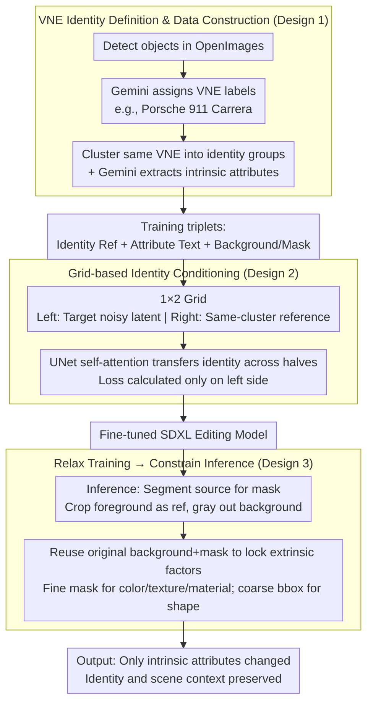

# Alterbute: Editing Intrinsic Attributes of Objects in Images

**Conference**: ICML 2026  
**arXiv**: [2601.10714](https://arxiv.org/abs/2601.10714)  
**Code**: No public code (Project page: https://talreiss.github.io/alterbute/)  
**Area**: Image Generation / Image Editing  
**Keywords**: Image Editing, Intrinsic Attribute Editing, Diffusion Models, Visual Named Entities, Identity Preservation  

## TL;DR
Alterbute uses VLMs to automatically mine Visual Named Entity (VNE) identity clusters and jointly conditions on identity references, attribute text, background, and masks within a diffusion model. This unifies the editing of object color, texture, material, and shape while maximizing preservation of object identity and scene context.

## Background & Motivation
**Background**: Image editing models can now perform large-scale text-guided modifications, local inpainting, style transfer, and subject-driven generation. While many methods maintain coarse categories or instance appearances, tasks like "change this car to red," "change the table to wood," or "modify the object shape" require changing intrinsic attributes while preserving identity, which is significantly more difficult.

**Limitations of Prior Work**: General image editors often target the wrong object, alter the identity, or ignore intended attributes. Subject personalization methods define identity too strictly, rarely allowing changes in color, material, texture, or shape. Attribute-specific methods usually only solve a single attribute like material or texture and fail to cover all intrinsic properties.

**Key Challenge**: A natural tension exists between identity preservation and attribute editing. If identity is defined too coarsely (e.g., just "car"), the editing space is large, but the object may be replaced by a different car. If defined too finely (e.g., a specific instance), the model treats color and texture as part of the identity, making meaningful intrinsic editing impossible.

**Goal**: The authors aim to train a single model that supports four types of intrinsic attribute editing—color, texture, material, and shape—while maintaining the user-perceived identity, background, lighting, and composition after editing.

**Key Insight**: Instead of trying to collect nearly non-existent paired data of "same scene, same object, only changed intrinsic attributes," the paper relaxes the training task. It allows both intrinsic and extrinsic attributes to vary during training and subsequently fixes extrinsic factors during inference by reusing the original background and mask.

**Core Idea**: Use Visual Named Entities (VNE) as an identity definition situated between coarse categories and specific instances. VLMs are used to automatically construct supervised data of "same VNE, different attributes and scenes," allowing the diffusion model to learn intrinsic attribute changes that preserve identity.

## Method
The Alterbute mechanism can be understood as "redefining identity first, then making the supervision problem collectible." If identity uses categories, supervision is too loose; if it uses instances, it is too tight. VNE allows the model to see natural variations of the same nameable object across different colors, materials, textures, shapes, and scenes, thereby learning which changes do not destroy identity.

### Overall Architecture
Training data is sourced from OpenImages. The authors first use Gemini to assign VNE labels to detected objects, such as "Porsche 911 Carrera" or "IKEA LACK table," filtering out generic or unnamable objects. Objects with the same VNE form identity clusters. Gemini then extracts structured intrinsic attribute descriptions for each object, including color, texture, material, and shape.

The diffusion model is fine-tuned based on SDXL. During training, inputs are organized into a $1\times2$ image grid: the left half is the noisy latent of the target image, and the right half is an identity reference image from the same VNE cluster. The model also receives target attribute text, a background image, and an object mask. The target area in the background image is masked with gray, and the mask specifies the object location. The loss is applied only to the left half, forcing the model to learn to generate an object with target attributes that preserves identity within a specific scene.

During inference, given a source image and a single attribute prompt, the system extracts the object mask using a segmentation model, crops the foreground as an identity reference, and uses the original background and mask as extrinsic conditions. Fine-grained masks are used for color, texture, and material editing; for shape editing, where the target geometry is unknown, a coarse bounding-box mask provides more deformation space.

### Key Designs
**1. Visual Named Entity Identity & Data: Cutting identity to a "namable" intermediate granularity for automatic supervision.**

Identity preservation and attribute editing are inherently contradictory. If the identity definition is too coarse (e.g., "car"), the editing space is large but the specific car may change. If it is too fine (e.g., a specific instance), the model treats color and texture as part of the identity. Visual Named Entities (VNE) are fine-grained, namable labels (e.g., "Porsche 911 Carrera", "iPhone 16 Pro") between categories and instances. Objects under the same VNE share identity features but allow for natural intrinsic variations, aligning with human intuition. The authors use Gemini to assign VNE labels and cluster them, then extract structured attribute descriptions, creating a "Ref + Text + Background/Mask" triplet without manual labeling. This yielded 69,744 clusters and ~1.08M images.

**2. Grid-based Identity Conditioning: Using spatial self-attention across images for identity transfer.**

How the identity reference is fed to the UNet determines if the model actually uses it. Alterbute concatenates the target noisy latent and the background-removed reference into a 1×2 image grid ($512\times1024$ total). The background (with the target area grayed out) and binary mask are concatenated along the channel dimension for the left half only. This allows the UNet's self-attention layers to propagate fine-grained identity features across the two halves, while the loss is calculated only on the target area of the left half. Ablations show that replacing this with channel-wise concatenation leads to an identity mapping where the model fails to edit, proving the grid is a structural necessity.

**3. Relax Training, Constrain Inference: Turning uncollectible tasks into supervised ones.**

Strictly paired samples of "same object, same scene, only intrinsic change" barely exist in nature. The authors break this by relaxing the training goal: the target and reference only need to belong to the same VNE, while poses and backgrounds can differ. At inference, extrinsic factors are locked by reusing the original background and mask. This strategy allows the use of large-scale automated data. Mask granularity is also adjusted: fine masks for color/texture/material, and coarse bounding boxes for shape to allow for geometric deformation.

### Loss & Training
The model uses standard L2 denoising loss, calculated only for the target region on the left half of the grid. It was trained for 100,000 steps with a learning rate of $10^{-5}$, batch size of 128, and $512\times1024$ resolution. The architecture is based on the 7B parameter SDXL, trained on 128 v4 TPUs for approximately 24 hours. To improve robustness, 10% of samples randomly drop the identity reference and 10% drop the text prompt. Inference uses a text CFG of 7.5 and an image CFG of 2.0.

## Key Experimental Results

### Main Results
An evaluation set of 30 objects and 100 attribute editing samples was constructed, covering color, texture, material, and shape. The user study involved 166 participants with 5 independent judgments per sample. VLM pairwise evaluations were conducted using Gemini, GPT-4o, and Claude.

| Evaluator | vs MimicBrush | vs MaterialFusion | vs FlowEdit | vs InstructPix2Pix | vs OmniGen | vs UltraEdit | vs Diptych |
|-----------|---------------|-------------------|-------------|--------------------|------------|--------------|------------|
| User      | 85.0%         | 79.7%             | 89.3%       | 85.0%              | 81.2%      | 80.0%        | 76.2%      |
| Gemini    | 94.3%         | 87.0%             | 89.6%       | 88.8%              | 80.2%      | 86.0%        | 76.8%      |
| GPT-4o    | 89.8%         | 77.6%             | 88.6%       | 87.0%              | 77.4%      | 78.6%        | 74.8%      |
| Claude    | 92.6%         | 81.3%             | 92.6%       | 85.4%              | 78.8%      | 85.6%        | 77.8%      |

### Ablation Study
The analysis focused on identity definitions, conditioning methods, and training budgets. Standard metrics were reported, but the authors emphasize they are not fully reliable for intrinsic editing as "not editing at all" can result in high identity scores.

| Analysis Item | Key Metric | Description |
|---------------|------------|-------------|
| Ours (Metrics)| DINO 0.815 / CLIP-I 0.914 / CLIP-T 0.321 | Highest CLIP-T, indicating best attribute matching |
| UltraEdit     | DINO 0.841 / CLIP-I 0.922 / CLIP-T 0.303 | High identity but weaker attribute matching |
| VNE Data Scale| 69,744 clusters / 1,079,442 images | Automatically constructed via Gemini |
| Channel-wise  | Qualitative results near no-op | Identity fails to transfer, model outputs original image |
| 50K Steps     | VLM Win Rate ~76-78% | Still significantly stronger than baselines |
| 100K Steps    | VLM Win Rate ~82-86% | Full training yields ~7% gain |

### Key Findings
- Users and VLMs significantly prefer Alterbute (p-value < 0.05 in binomial tests), indicating the advantage is not due to evaluator bias.
- When split by attribute, shape editing shows the highest win rate, suggesting Alterbute excels at difficult geometric changes.
- VNE is the core of the supervision: it provides samples where attributes vary while identity remains constant, preventing the model from over-fitting attributes as part of the identity.

## Highlights & Insights
- The redefinition of "identity" is the most compelling aspect. It moves away from abstract concepts toward VNE, which is automatically labelable, scalable, and close to human naming conventions.
- The relaxation of training targets is clever. It makes data available during training while the inference-time constraints (background/mask) prevent extrinsic drift, which is more practical than finding rare paired data.
- The grid input underscores that the conditioning method determines how effectively a reference image is used. For identity-preserving editing, spatial self-attention appears more critical than channel concatenation.

## Limitations & Future Work
- VNE labeling relies on Gemini and may inherit biases regarding brands or long-tail entities.
- The evaluation set is small (30 objects/100 samples), which may not represent open-world diversity.
- Coarse bounding boxes for shape editing can introduce background artifacts or unrealistic geometries for rigid objects.
- Currently lacks support for complex multi-object interactions, occlusions, and physical consistency (reflections).

## Related Work & Insights
- **vs InstructPix2Pix / UltraEdit / OmniGen**: These general editors lack stable joint constraints for intrinsic attributes and identity; Alterbute addresses this via VNE supervision.
- **vs DreamBooth / subject-driven generation**: Personalization methods bind color/texture to the identity; Alterbute allows these to vary within the same VNE.
- **vs MaterialFusion / MimicBrush**: These are restricted to single attributes (material or texture); Alterbute provides a unified model.
- **Insight**: Many generative tasks are bottlenecked by the semantic granularity of supervision rather than model architecture. Finding the right intermediate labels can turn "impossible data" into "constructible data."

## Rating
- Novelty: ⭐⭐⭐⭐☆ (Creative VNE definition and training relaxation)
- Experimental Thoroughness: ⭐⭐⭐⭐☆ (Strong human/VLM evaluations, but small benchmark)
- Writing Quality: ⭐⭐⭐⭐☆ (Clear motivation and excellent explanation of the identity spectrum)
- Value: ⭐⭐⭐⭐☆ (Highly insightful for controllable image editing and data construction)

<!-- RELATED:START -->

## Related Papers

- [\[CVPR 2026\] Unified Personalized Understanding, Generating and Editing](../../CVPR2026/multimodal_vlm/unified_personalized_understanding_generating_and_editing.md)
- [\[CVPR 2026\] Enhancing Descriptive Captions with Visual Attributes for Multimodal Perception](../../CVPR2026/multimodal_vlm/enhancing_descriptive_captions_with_visual_attributes_for_multimodal_perception.md)
- [\[ICML 2026\] Debate with Images: Detecting Deceptive Behaviors in Multimodal Large Language Models](debate_with_images_detecting_deceptive_behaviors_in_multimodal_large_language_mo.md)
- [\[ICCV 2025\] Advancing Textual Prompt Learning with Anchored Attributes](../../ICCV2025/multimodal_vlm/advancing_textual_prompt_learning_with_anchored_attributes.md)
- [\[NeurIPS 2025\] Learning Skill-Attributes for Transferable Assessment in Video](../../NeurIPS2025/multimodal_vlm/learning_skill-attributes_for_transferable_assessment_in_video.md)

<!-- RELATED:END -->
