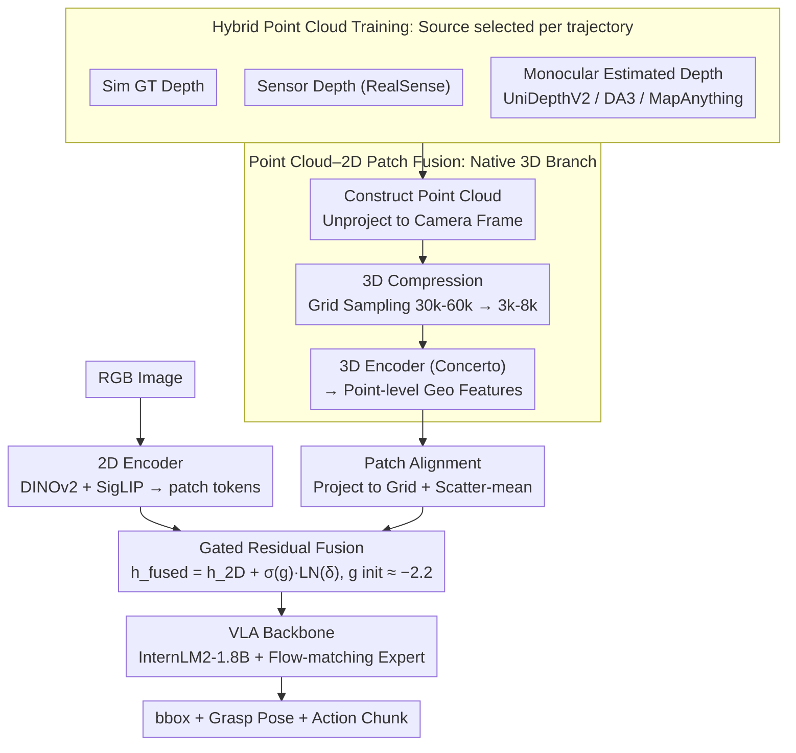

# Any3D-VLA: Enhancing VLA Robustness via Diverse Point Clouds

**Conference**: ICML 2026  
**arXiv**: [2602.00807](https://arxiv.org/abs/2602.00807)  
**Code**: https://xianzhefan.github.io/Any3D-VLA.github.io  
**Area**: Robotics / VLA / Multimodal 3D Representation  
**Keywords**: Point Cloud Fusion, sim-to-real, Domain Generalization, Data Augmentation, Grasping

## TL;DR
Through a pilot study, the authors discovered that "explicitly lifting vision to point clouds and fusing them with 2D patches" is the most effective way to inject 3D information into VLA models. To address 3D data scarcity and domain gaps across different point cloud sources (simulation, sensor, or monocular estimation), Any3D-VLA is proposed. By employing hybrid point cloud training to learn source-agnostic geometric representations, it achieves a 29.2% zero-shot improvement over the strongest baseline (62.5% vs 33.3%) in real-world grasping tasks.

## Background & Motivation
**Background**: Current mainstream VLAs (e.g., $\pi_{0.5}$, GraspVLA) use 2D images as visual inputs, leveraging VLM backbones for unified language-vision-action modeling. The community has attempted to inject 3D information via depth-pretrained encoders (DepthVLA), spatial foundation models (VGGT), depth-as-channel (3D-CAVLA), or point cloud branches (PointVLA / 3DS-VLA).

**Limitations of Prior Work**: (1) Pure 2D VLAs are fragile in scenarios involving small objects, viewpoint shifts, or occlusions. (2) Existing 3D injection methods have distinct drawbacks: implicit depth/3D methods (like VGGT) rely on reconstruction loss for geometry and lack metric precision, leading to "spatial hallucinations"; depth-as-channel treatments destroy 3D topology; and point cloud branches often use non-pretrained encoders or fail to align point clouds with 2D features. (3) 3D data scarcity and domain gaps (noise, scale, geometric bias) between simulation, sensors, and estimations hinder sim-to-real transfer for 3D VLAs.

**Key Challenge**: To obtain precise 3D geometric signals, one must rely either on expensive metric depth hardware (high dependency, high cross-environment variance) or model-estimated depth (suffering from noise and scale drift). A truly "deployment-ready VLA" must function effectively regardless of the depth source—this is a robustness problem, not merely an accuracy problem.

**Goal**: (1) Select the optimal 3D injection paradigm through a pilot study; (2) Design a plug-in module to integrate 3D information into existing VLA backbones; (3) Explicitly model depth source heterogeneity through "hybrid point cloud training" to make the model source-agnostic during deployment.

**Key Insight**: The authors first conducted a clean pilot study to fairly compare five paradigms: 2D-only, implicit-depth RGB, implicit-3D RGB, RGBD-image-plane, and point-cloud+2D-patch fusion (under the same simulation benchmark and ground-truth metric depth). They found that point-cloud+2D-patch fusion significantly outperformed others, forming the basis for Any3D-VLA.

**Core Idea**: RGB+depth is lifted into a point cloud. After 3D grid compression and encoding with a pretrained point cloud encoder, features are aligned with ViT patches using scatter-mean and fused back into 2D representations via gated residuals. During training, the model is exposed to a mixture of simulator, sensor, and model-estimated point cloud sources to learn source-agnostic geometric features.

## Method
Any3D-VLA is a plug-in visual observation module that can be attached to any VLA backbone. The pipeline follows: RGB+optional depth $\rightarrow$ lift to point cloud $\rightarrow$ 3D compression $\rightarrow$ point cloud encoder $\rightarrow$ patch alignment $\rightarrow$ 2D-3D gated fusion $\rightarrow$ VLA backbone.

### Overall Architecture
- **Data Preparation**: Synthetic RGBD datasets were generated in Isaac Sim (Objaverse LVIS subset, 290 classes, 10,680 instances, single-view, matched to RealSense D435 parameters). Each timestep exports: (1) ground-truth metric depth from the Isaac renderer, and (2) metric depth estimated by monocular depth models. Both are used.
- **VLA Backbone**: InternLM2-1.8B serves as the VLM backbone, combined with a conditional flow-matching action expert, linked via PAG (Progressive Action Generation). The visual observation module is the core contribution.
- **Visual Module Steps**: (1) Point Cloud Construction: Unprojecting valid depth pixels to the camera coordinate system using intrinsic parameters. (2) 3D Compression: Reducing point clouds from 30k-60k to 3k-8k using Sonata-style grid sampling. (3) Vision Encoder: 2D uses DINOv2+SigLIP; 3D uses Concerto (a point cloud encoder pretrained on 2D+3D data). (4) Patch-Wise Alignment + 2D-3D Fusion: Projecting 3D points back to the image patch grid, aggregating into patch-level 3D features via scatter-mean, and fusing with 2D patch tokens using gated residuals.
- **Output**: Fused token sequence $\rightarrow$ fed into VLA backbone with language and proprioception tokens $\rightarrow$ autoregressive generation of bbox tokens + grasp pose tokens $\rightarrow$ flow-matching expert generates continuous end-effector action chunks.

### Key Designs

**1. Point-cloud–2D patch fusion: The optimal 3D injection paradigm**

Methods for injecting 3D are diverse. The authors argue that "how geometry is represented" matters more than "whether geometry exists." Their pilot study compared five paradigms under identical conditions. Only the point cloud fusion path showed stable improvements (Single-Trial SR increased from 45.3 to 61.1) because it preserves native 3D topology while allowing explicit spatial alignment with 2D patches. In contrast, implicit methods like VGGT often suffer "spatial hallucinations" during fine-grained manipulation, and depth-as-channel methods lose topology by flattening 3D into 2D. Any3D-VLA commits to point cloud + 2D patch fusion to obtain geometric precision while retaining semantic priors from 2D backbones.

**2. Patch-Wise Alignment + Gated Residual Fusion: Aligning unordered clouds to patch grids as "fine-grained corrections"**

Point clouds are unordered, while 2D backbone tokens reside on a regular ViT patch grid. Alignment is necessary for fusion. Each 3D point $\mathbf{x}_i$ is projected back to the image plane via $(u_i,v_i)=\pi(\mathbf{x}_i)$ to find its patch index $a_i$. Points within the same patch are aggregated into $\mathbf{g}_j^\text{3D}$ via scatter-mean; empty patches use a learnable token $\mathbf{e}^\text{3D}$. These are linearly projected to $\mathbf{h}_j^\text{3D}=W_\text{3D}\mathbf{g}_j^\text{3D}$ and combined with $\mathbf{h}_j^\text{2D}$ via an MLP to generate a residual $\delta_j$. Fusion uses gated residuals: $\mathbf{h}_j^\text{fused}=\mathbf{h}_j^\text{2D}+\sigma(g)\cdot\text{LayerNorm}(\delta_j)$. The gating $g$ is initialized to $-2.1972$ so that $\sigma(g)$ is very small initially, preventing the new modality from destroying pretrained 2D representations in early training stages.

**3. Hybrid Point Cloud Training: Optimizing for robustness across depth sources**

The biggest barrier to 3D VLA deployment is the discrepancy between depth sources across environments. Any3D-VLA incorporates this heterogeneity into training. Setting 2 (Hybrid) selects a source for each trajectory with fixed probabilities (30% RealSense + 20% each for UniDepthV2, DA3, and MapAnything). By exposing the model to multiple point cloud sources, the 3D encoder and fusion layers are forced to learn source-agnostic geometric features. This transforms "robustness" into an optimization objective. Experiments show that hybrid training yields performance $\geq$ single-source training regardless of the inference depth source, proving it learns general geometry rather than multi-task overfit.

### Loss & Training
The model jointly trains the VLM head and flow-matching action expert. Grounding data from GRIT supervises the VLM's autoregressive bbox prediction. Synthetic RGBD data supervises grasp pose tokens and end-effector actions (flow matching loss). **No depth/point cloud reconstruction loss is added**, confirming that improvements stem from representation design rather than auxiliary supervision.

## Key Experimental Results

### Main Results (Real-world Zero-shot)
Evaluated across 4 challenges (Standard / Scale&Shape / Viewpoint / Appearance-Deprived) against $\pi_{0.5}$, GraspVLA (2D baseline), and SpatialVLA (3D baseline). Includes 47 real objects and 120 trials.

| Method | Training Setting | Inference Point Cloud | Overall SR (%) |
|------|----------|----------|----------------|
| $\pi_{0.5}$ (2D) | – | – | ≈ 26 |
| GraspVLA (2D) | – | – | ≈ 30 |
| SpatialVLA (3D) | – | – | 33.3 (Prev. SOTA) |
| Any3D-VLA | Setting 1 (sim only) | RealSense | Gain |
| Any3D-VLA | Setting 2 (hybrid) | RealSense | Further Gain |
| **Any3D-VLA** | **Setting 2 (hybrid)** | **DA3 estimated** | **62.5 (+29.2)** |

### Post-training (Fine-tuning with few real demos)
Two challenge tasks: Task 1 (Pink tulip in vase) and Task 2 (Transparent cup in slot). 100 real demonstrations each.

| Model | Training Setting | Inference Point Cloud | Task 1 SR (%) | Task 2 SR (%) |
|------|----------|----------|--------------|--------------|
| $\pi_{0.5}$ | – | – | 33.3 | 26.7 |
| GraspVLA | – | – | 33.3 | 53.3 |
| SpatialVLA | – | – | 13.3 | 6.7 |
| Any3D-VLA | RealSense only | RealSense | 73.3 | 60.0 |
| Any3D-VLA | RealSense only | DA3 | 80.0 | 60.0 |
| Any3D-VLA | Hybrid | RealSense | 80.0 | 66.7 |
| **Any3D-VLA** | **Hybrid** | **DA3** | **93.3** | **86.7** |

### Key Findings
- Hybrid training outperforms single-source training across all inference sources, proving it learns source-agnostic geometry.
- Point clouds estimated by DA3 often yield better inference results than RealSense sensor data, suggesting modern monocular depth models can surpass consumer-grade depth cameras and potentially eliminate the need for specialized 3D hardware.
- Pilot study data was counter-inductive: in perfect simulation depth, depth-as-channel only gave an 11-point boost (45.3 $\rightarrow$ 56.8), whereas point-cloud fusion gave a 16-point boost (45.3 $\rightarrow$ 61.1).
- Inference latency is 1.7~2.0 FPS; using action chunking (size=4) makes it viable for tabletop manipulation.

## Highlights & Insights
- **Clean Pilot Study Design**: By controlling variables (backbone, strategy, sim depth), the authors proved "how to represent geometry" is the critical factor.
- **Gated Residual Fusion Initialization**: Initializing gating to be nearly zero allows new modalities to be "warmed up" without catastrophic forgetting of 2D pretrained knowledge.
- **Hybrid Training as a Sim-to-Real Panacea**: Rather than refining a single depth source's accuracy, exposing the model to all sources ensures robustness—a philosophy frequently proven in LLM and autonomous driving fields, here applied to VLA 3D injection.

## Limitations & Future Work
- Object categories are capped at 290; still far from open-vocabulary capability.
- Relies on single-view input; multi-view fusion might improve occlusion handling but would increase latency.
- Inference depends on an estimated depth model (DA3), shifting the bottleneck from the 3D encoder to the depth estimator.
- Primarily validated on tabletop manipulation; performance on mobile platforms or long-horizon tasks (loco-manipulation) remains untested.

## Related Work & Insights
- **vs PointVLA (Li et al. 2025a)**: PointVLA injects features into the action expert but handles point clouds separately; Any3D-VLA uses patch-level alignment for more fine-grained 3D-2D token correspondence.
- **vs SpatialVLA**: SpatialVLA remains primarily image-plane based; Any3D-VLA utilizes native 3D topology and hybrid training to nearly double the Success Rate (SR).
- **vs VGGT / Spatial Forcing**: While those use implicit 3D priors, this work demonstrates that explicit 3D geometry is more reliable for fine-grained manipulation.

## Rating
- Novelty: ⭐⭐⭐⭐ The combination of pilot study, gated patch fusion, and hybrid training is robust.
- Experimental Thoroughness: ⭐⭐⭐⭐⭐ Sim + Real + Zero-shot + Post-training + multiple depth sources; a textbook experimental design.
- Writing Quality: ⭐⭐⭐⭐ The logical chain from pilot study to hybrid training is clear and cohesive.
- Value: ⭐⭐⭐⭐⭐ Addresses a critical need; the hybrid training paradigm is transferable to any heterogeneous sensor fusion scenario.

<!-- RELATED:START -->

## Related Papers

- [\[AAAI 2026\] Phantom Menace: Exploring and Enhancing the Robustness of VLA Models Against Physical Sensor Attacks](../../AAAI2026/multimodal_vlm/phantom_menace_exploring_and_enhancing_the_robustness_of_vla_models_against_phys.md)
- [\[ICML 2026\] VLANeXt: A Recipe for Building Robust VLA Models](vlanext_recipes_for_building_strong_vla_models.md)
- [\[ICML 2026\] TRAP: Hijacking CoT Reasoning of VLA for Targeted Behavior Attacks via Adversarial Patches](trap_hijacking_vla_cot-reasoning_via_adversarial_patches.md)
- [\[ICML 2026\] VLA-Arena: An Open-Source Framework for Evaluating Vision-Language-Action Models](vla-arena_an_open-source_framework_for_benchmarking_vision-language-action_model.md)
- [\[AAAI 2026\] FT-NCFM: An Influence-Aware Data Distillation Framework for Efficient VLA Models](../../AAAI2026/multimodal_vlm/ft-ncfm_an_influence-aware_data_distillation_framework_for_efficient_vla_models.md)

<!-- RELATED:END -->
