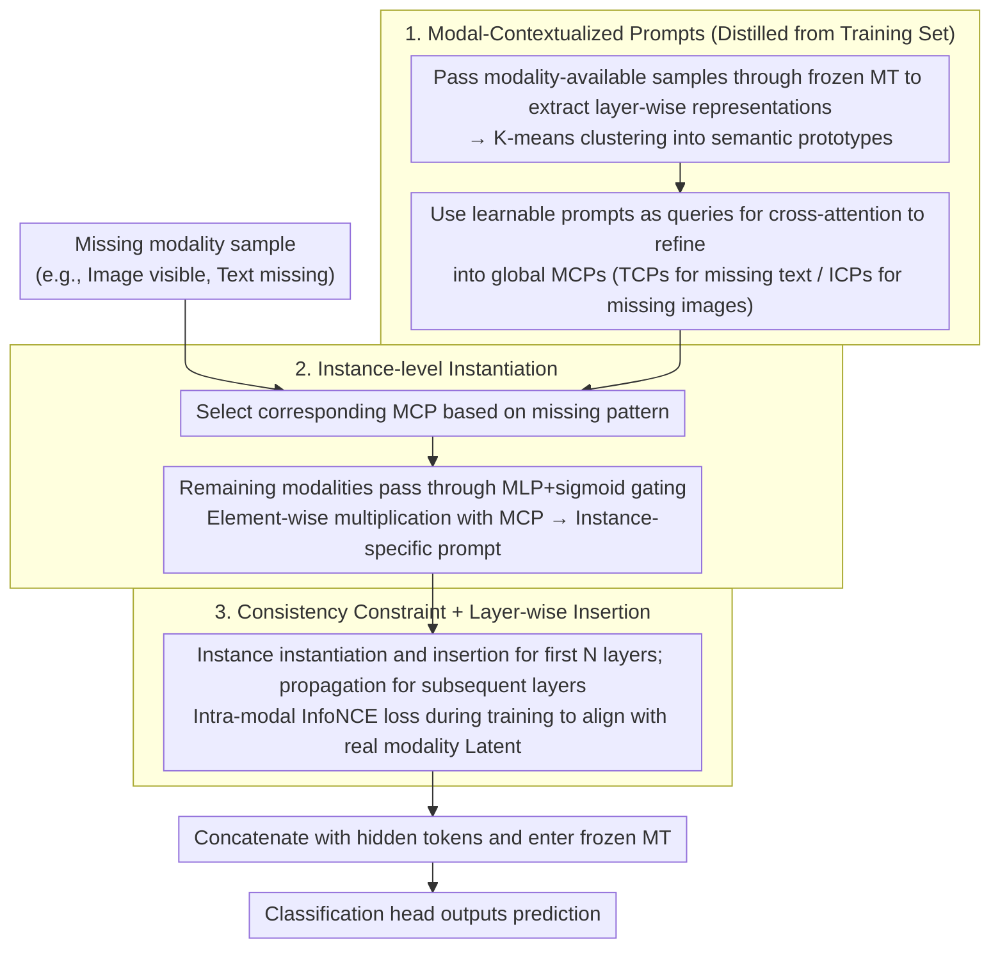

# AOEPT: Breaking the Implicit Modality-Reduction Bottleneck in Modality-Missing Prompt Tuning

**Conference**: ICML 2026  
**arXiv**: [2605.24816](https://arxiv.org/abs/2605.24816)  
**Code**: https://github.com/Jian-Lang/AOEPT  
**Area**: Multimodal VLM / Missing Modality Learning  
**Keywords**: Missing Modality, Multimodal Transformer, Prompt Tuning, Modal-Contextualized Prompt, NM2I  

## TL;DR
AOEPT identifies that existing missing-modality prompt tuning compresses the reasoning scope of multimodal Transformers into a visible modality subspace. By utilizing Modal-Contextualized Prompts (MCPs) distilled from the training set as retrievable implicit information sources to compensate for missing modalities, AOEPT consistently outperforms existing methods across multiple datasets, missing rates, and backbones.

## Background & Motivation
**Background**: Multimodal systems typically rely on multi-source signals such as images, text, and audio to perform classification, understanding, or QA tasks. As multimodal Transformers (MT) like CLIP, ViLT, and MulT become universal backbones, recent research on missing modalities has shifted from customized networks to lightweight prompt tuning: freezing the pre-trained MT and learning only a few prompts and task heads to adapt the model to scenarios with missing images, text, or incomplete modalities at deployment.

**Limitations of Prior Work**: While methods like MAPs, DCP, MemPrompt, and SyP are more robust than vanilla MT, their prompts are often determined solely by the missing pattern or currently visible modalities. For instance, when an image is missing, the conditional signal for the prompt comes mainly from text. Although seemingly reasonable, this forces the model to reason based only on the remaining single-modality evidence.

**Key Challenge**: Pre-trained MTs originally possess cross-modal modeling capabilities, but missing-modality prompt tuning degrades the problem to a "visible modality to label" mapping. The authors term this the Implicit Modality-Reduction (IMR) bottleneck: prompts lack explicit access to potential information sources of the missing modality, implicitly restricting the MT's reasoning scope to the reduced modality subspace.

**Goal**: This paper aims to solve three specific problems: explaining why existing prompt tuning fails to fully release the multimodal capability of MT in missing scenarios, designing a lightweight prompt mechanism that functions as an implicit information base for missing modalities without external retrieval or reconstruction modules, and providing a diagnostic metric for the IMR bottleneck beyond final classification scores.

**Key Insight**: The authors conducted a pilot experiment: replacing the randomly initialized prompts in MAPs with global priors obtained by clustering modality tokens from the training set. This minor change improved performance on MM-IMDb, suggesting that global context for the missing modality can indeed break the single-modality reasoning bottleneck.

**Core Idea**: AOEPT replaces "generating prompts based only on visible modalities" with "modality-level global information base + instance-level conditional activation." This allows the prompts not just to adapt to the degraded input structure but to actively supplement the current sample with implicit context of the missing modality.

## Method
The methodology follows a clear pipeline: first, extract layer-wise representations of a modality from the training set and compress them into lightweight Modal-Contextualized Prompts (MCPs); then, instantiate these global MCPs into instance-specific prompts based on the remaining modalities of the current sample; finally, insert these prompts into layers of a frozen MT for training prompts and classification heads. For example, if the text is missing, AOEPT constructs Text-Contextualized Prompts (TCPs) to allow the image sample to access an implicit semantic library of the text modality during inference.

### Overall Architecture
The input consists of multimodal samples with potentially missing modalities, such as $(t, v)$, $(t, \varnothing)$, or $(v, \varnothing)$. AOEPT does not alter the main MT structure but inserts prompt tokens between layers of the pre-trained Transformer. During training, representations for each layer are extracted by forward-passing "modality-available" samples through the frozen MT. These are clustered and compressed into semantic prototypes to construct the corresponding MCPs.

When text is missing, the model retrieves TCPs; when images are missing, it retrieves ICPs. Since MCPs are global, they are gated using the remaining modality representations of the current sample to generate instance-aware prompts. These prompts are concatenated with original hidden tokens and fed into MT layers.

### Key Designs
1.  **MCP as Missing Modality Information Base**:
    - **Function**: Compresses the global context of a modality from the training set into prompt tokens, acting as an implicit information source for that modality when it is missing.
    - **Mechanism**: For TCPs, text-available samples are fed into the frozen MT to obtain text token representations $C_t^l$. These are clustered into $N_t'$ semantic prototypes via K-means. The default construction uses learnable prompts as queries to perform cross-attention over these prototypes.
    - **Design Motivation**: Random prompts only signal "a modality is missing" but provide no information on what it could have contained. MCPs explicitly store the distribution context, effectively giving the MT internalized modal memory.

2.  **Instance-aware Instantiation**:
    - **Function**: Converts global MCPs into prompts specific to the current sample, preventing all missing samples from sharing the same coarse compensation.
    - **Mechanism**: For image-visible, text-missing samples, the image representation passes through an MLP and sigmoid to generate a gating vector, which is element-wise multiplied with TCPs: $P_{TCP,i}^l = P_{TCP}^l \odot \sigma(MLP(\bar{V}_i^{l-1}))$.
    - **Design Motivation**: MCPs are modality-level; instantiation projects the "global text distribution" onto the "local text semantics likely corresponding to this image."

3.  **Consistency Constraint and Adaptive Insertion**:
    - **Function**: Ensures instantiated prompts resemble real missing modality latent representations and controls prompt propagation.
    - **Mechanism**: An intra-modal latent consistency regularization is used on modality-available training samples. The instance-aware prompt and the real modality representation are treated as positive pairs in an InfoNCE loss. Prompts are re-instantiated and inserted in the first $N$ layers, then propagated in subsequent layers.
    - **Design Motivation**: Classification loss alone might lead prompts to learn label-related info that doesn't represent the missing modality. Consistency loss pulls prompts toward the real modality latent space.

### Loss & Training
AOEPT freezes the pre-trained MT and only trains MCPs and the classification head. The total objective is the classification loss $L_{CE}$ plus the consistency regularization $L_{CR}$. $L_{CR}$ constrains instantiation quality using similarity between prompts and real latent representations.

The main experiments use CLIP ViT-B/16 as a dual-stream backbone, with extensions to ViLT and MulT. The compressed modality prototype capacity is 256, prompt length $M=16$, and insertion depth $N=6$.

## Key Experimental Results

### Main Results
Evaluated on MM-IMDb, HateMemes, and Food101 with 70% or 90% missing rates. AOEPT outperforms baselines like MAPs, DCP, and SyP across all metrics.

| Missing Rate | Dataset | Metric | AOEPT Avg. | Prev. SOTA Avg. | Gain |
|--------------|---------|--------|------------|-----------------|------|
| 70%          | MM-IMDb | F1-M   | 53.22      | 51.88 (SyP)     | +1.34|
| 70%          | HateMemes| AUC   | 69.63      | 68.11 (SyP)     | +1.52|
| 70%          | Food101 | ACC    | 84.29      | 83.56 (SyP)     | +0.73|
| 90%          | MM-IMDb | F1-M   | 51.45      | 49.58 (SyP)     | +1.87|
| 90%          | HateMemes| AUC   | 68.57      | 67.72 (SyP)     | +0.85|
| 90%          | Food101 | ACC    | 82.06      | 81.26 (SyP)     | +0.80|

### Ablation Study
Validated on MM-IMDb with 70% text missing. Removing MCP, instantiation, or consistency leads to performance drops.

| Config | MM-IMDb F1-M | HateMemes AUC | Food101 ACC | Note |
|--------|--------------|---------------|-------------|------|
| w/o MCP | 48.93 | 68.63 | 78.78 | Random prompt replacement |
| w/o Instantiation | 49.17 | 69.42 | 79.13 | Global MCP without gating |
| w/o Consistency | 50.56 | 69.85 | 79.59 | No latent regularization |
| Ours (AOEPT) | 51.50 | 71.12 | 80.77 | Full method |

### Key Findings
- **MCP is the core** for breaking the IMR bottleneck. Without it, the model reverts to merely adapting structures, with F1-M dropping from 51.50 to 48.93 on MM-IMDb.
- **NM2I serves as a diagnostic tool**. While baseline NM2I scores are near 0 (indicating prompts share little info with missing latents), AOEPT scores are significantly higher, proving prompts carry missing modality information.
- **Reconstruction is not a substitute**. Lightweight reconstruction networks perform worse than MCPs (76.81 vs 80.77 on Food101), likely due to the difficulty of fitting complex cross-modal mappings with limited parameters.

## Highlights & Insights
- Success comes from shifting the perspective from "adapting to degraded input" to "restoring reasoning range."
- The design of MCP is restrained; it avoids external retrieval/large generators by distilling modality-level context internally from the training set.
- NM2I provides a mechanistic diagnostic for whether prompts actually carry the missing modality's information, facilitating deeper analysis beyond accuracy.

## Limitations & Future Work
- NM2I is not always monotonically correlated with task performance, especially when the visible modality is already sufficient for classification.
- AOEPT relies on the training set distribution; severe domain shifts at deployment might render the distilled modal context inaccurate.
- Future work could integrate uncertainty estimation to adjust compensation intensity based on the reliability of the activated MCP.

## Related Work & Insights
- **vs MAPs**: MAPs introduced missing-aware prompts as structural markers. AOEPT argues this remains trapped in the IMR bottleneck and uses MCPs to provide explicit content.
- **vs RAGPT**: Retrieval-based methods use external samples for evidence. AOEPT "internalizes" retrieval into prompt parameters, offering global context without the overhead of external queries.
- **Insight**: AOEPT suggests that for multimodal robustness, maintaining a lightweight modal prior library that can be dynamically activated is superior to simply training the model to guess from partial inputs.

## Rating
- Novelty: ⭐⭐⭐⭐⭐ 
- Experimental Thoroughness: ⭐⭐⭐⭐ 
- Writing Quality: ⭐⭐⭐⭐ 
- Value: ⭐⭐⭐⭐⭐ 

<!-- RELATED:START -->

- Missing Modality Prompt Tuning for Multimodal Learning (MAPs)
- Learning with Missing Modalities via Decoupled Prompting (DCP)
- Prompting with Memory for Missing Modality (MemPrompt)

<!-- RELATED:END -->

## Related Papers

- [\[CVPR 2026\] Parameter-Efficient Adaptation for MLLMs via Implicit Modality Decomposition](../../CVPR2026/multimodal_vlm/parameter-efficient_adaptation_for_mllms_via_implicit_modality_decomposition.md)
- [\[CVPR 2026\] Dual-Modality Anchor-Guided Filtering for Test-time Prompt Tuning](../../CVPR2026/multimodal_vlm/dual-modality_anchor-guided_filtering_for_test-time_prompt_tuning.md)
- [\[ICML 2026\] Calibrated Multimodal Representation Learning with Missing Modalities](calibrated_multimodal_representation_learning_with_missing_modalities.md)
- [\[ICML 2026\] Jailbreaking Vision-Language Models Through the Visual Modality](jailbreaking_vision-language_models_through_the_visual_modality.md)
- [\[CVPR 2026\] DeepAlign: Mitigating Modality Conflict through Modality-Specific Alignment](../../CVPR2026/multimodal_vlm/deepalign_mitigating_modality_conflict_through_modality-specific_alignment.md)

<!-- RELATED:END -->
