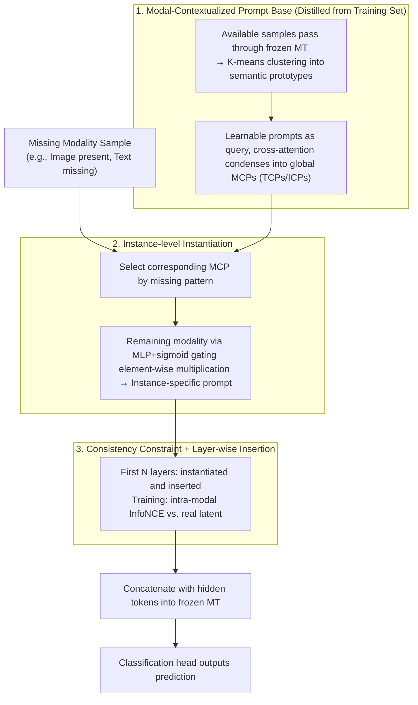

# AOEPT: Breaking the Implicit Modality-Reduction Bottleneck in Modality-Missing Prompt Tuning

**Conference**: ICML 2026  
**arXiv**: [2605.24816](https://arxiv.org/abs/2605.24816)  
**Code**: https://github.com/Jian-Lang/AOEPT  
**Area**: Multimodal VLM / Missing Modality Learning  
**Keywords**: Missing Modality, Multimodal Transformer, Prompt Tuning, Modal-Contextualized Prompt, NM2I  

## TL;DR
AOEPT points out that existing missing-modality prompt tuning compresses the inference scope of Multimodal Transformers into visible modality subspaces. It utilizes Modal-Contextualized Prompts (MCPs) distilled from the training set as a retrievable implicit information source for missing modalities, consistently outperforming existing methods across multiple datasets, missing rates, and backbones.

## Background & Motivation
**Background**: Multimodal systems typically rely on multi-source signals such as images, text, and audio to complete classification, understanding, or QA tasks. As Multimodal Transformers (MTs) like CLIP, ViLT, and MulT become general backbones, recent research on missing modalities has shifted from custom networks to lightweight prompt tuning: freezing the pre-trained MT and learning a small number of prompts and task heads to adapt to scenarios of missing images, missing text, or incomplete modalities during deployment.

**Limitations of Prior Work**: Methods like MAPs, DCP, MemPrompt, and SyP are more robust than vanilla MTs, but their prompts are often determined solely by the missing pattern or currently visible modalities. For example, when images are missing, the conditional signals for the prompt mainly come from text. This makes the model reason only around the remaining single-modality evidence.

**Key Challenge**: While pre-trained MTs inherently possess cross-modal modeling capabilities, missing-modality prompt tuning degrades the problem into a "visible modality to label" mapping. The authors term this the Implicit Modality-Reduction (IMR) bottleneck: prompts lack explicit access to latent information sources of the missing modality, implicitly restricting the MT's inference range to the reduced modality subspace.

**Goal**: This paper aims to solve three specific problems. First, to explain why existing prompt tuning still fails to fully release the multimodal capabilities of MTs in missing-modality scenarios. Second, to design a prompt mechanism that remains lightweight and avoids external retrieval or large reconstruction modules, allowing missing modalities to enter inference as implicit information bases. Third, to provide a metric to diagnose the IMR bottleneck rather than just reporting final classification metrics.

**Key Insight**: The authors conducted a pilot experiment: replacing the randomly initialized prompts in MAPs with global priors obtained by clustering modality token representations from the training set. This small change improved performance on MM-IMDb, indicating that global context from the missing modality can indeed break the single-modal inference bottleneck.

**Core Idea**: AOEPT replaces "generating prompts based only on visible modalities" with "modality-level global information base + instance-level conditional activation." This allows prompts to actively supplement the missing modality's implicit context for the current sample rather than just adapting to the degraded input structure.

## Method
The main pipeline of AOEPT is clear: first, collect layer-wise representations of a modality from the training set and compress them into lightweight Modal-Contextualized Prompts (MCPs); then, instantiate these global MCPs into instance-specific prompts based on the remaining modalities of the current sample; finally, insert these prompts into several layers of the frozen MT and train only the prompts and the classification head.

### Overall Architecture
Input consists of multimodal samples with potential modality missingness, such as $(t, v)$, $(t, \varnothing)$, or $(v, \varnothing)$. AOEPT keeps the MT main structure unchanged and inserts prompt tokens between layers of the pre-trained Transformer. During training, representations are extracted from samples where the modality is available; these are clustered and compressed to construct corresponding MCPs.

When a test sample lacks text, the model retrieves Text-Contextualized Prompts (TCPs); when it lacks images, it retrieves Image-Contextualized Prompts (ICPs). These global MCPs are then gated by representations from the remaining modalities to produce instance-aware prompts.

### Key Designs
1. **Modal-Contextualized Prompt (MCP) as Missing Information Base**:
	- **Function**: Compresses global context of a modality from the training set into prompt tokens, acting as an implicit information source.
	- **Mechanism**: Taking TCP as an example, text tokens $C_t^l$ from each layer are extracted; K-means compresses these into $N_t'$ semantic prototypes. In the default attention-based construction, learnable prompts act as queries to perform cross-attention over these prototypes.
	- **Design Motivation**: Random prompts only signal "a modality is missing" but do not provide information about what might be there. MCPs explicitly store the context of the training distribution, effectively reconnecting a lightweight modality memory to the frozen MT.

2. **Instance-aware Instantiation**:
	- **Function**: Converts global MCPs into prompts specific to the current sample to avoid sharing coarse-grained information.
	- **Mechanism**: For image-visible samples, image representations generate a gating vector via MLP and sigmoid: $P_{TCP,i}^l = P_{TCP}^l \odot \sigma(MLP(\bar{V}_i^{l-1}))$.
	- **Design Motivation**: Global MCPs are too averaged. Instantiation projects the "global text distribution" onto the local space of "what text might correspond to this specific image."

3. **Consistency Regularization and Adaptive Insertion**:
	- **Function**: Ensures instantiated prompts resemble real missing modality latent representations and controls propagation.
	- **Mechanism**: Intra-modal latent consistency regularization uses InfoNCE-style objectives to pull instance-aware prompts toward the real modality latents of the same sample. Prompts are re-instantiated in the first $N$ layers and inherited in subsequent layers.
	- **Design Motivation**: Classification loss alone might lead prompts to learn label-related info that isn't representative of the missing modality. Consistency constraints ground the prompts in the latent space.

### Loss & Training
AOEPT freezes the pre-trained MT and trains only the MCPs and the classification head. The total objective is classification loss $L_{CE}$ plus consistency regularization $L_{CR}$. Experiments use CLIP ViT-B/16, ViLT, and MulT. Default hyper-parameters include a modality set capacity of 256, prompt length $M=16$, and prompt tuning depth $N=6$.

## Key Experimental Results

### Main Results
The method was evaluated on MM-IMDb, HateMemes, and Food101 benchmarks with 70% and 90% missing rates.

| Missing Rate | Dataset | Metric | AOEPT Avg. | Prev. SOTA Avg. | Gain |
|--------------|---------|--------|------------|-----------------|------|
| 70%          | MM-IMDb | F1-M   | 53.22      | 51.88 (SyP)     | +1.34|
| 70%          | HateMemes| AUC   | 69.63      | 68.11 (SyP)     | +1.52|
| 70%          | Food101 | ACC    | 84.29      | 83.56 (SyP)     | +0.73|
| 90%          | MM-IMDb | F1-M   | 51.45      | 49.58 (SyP)     | +1.87|
| 90%          | HateMemes| AUC   | 68.57      | 67.72 (SyP)     | +0.85|
| 90%          | Food101 | ACC    | 82.06      | 81.26 (SyP)     | +0.80|

### Ablation Study
Ablation on 70% text missing scenario in MM-IMDb:

| Config | MM-IMDb F1-M | HateMemes AUC | Food101 ACC | Description |
|--------|--------------|---------------|-------------|-------------|
| w/o MCP| 48.93        | 68.63         | 78.78       | Replace MCP with random prompts |
| w/o Instantiation| 49.17 | 69.42       | 79.13       | Direct MCP insertion without gating |
| w/o Consistency| 50.56 | 69.85         | 79.59       | Remove latent consistency reg |
| AOEPT  | 51.50        | 71.12         | 80.77       | Complete Method |

### Key Findings
- MCP is the core of breaking the IMR bottleneck. Without MCP, performance drops significantly (e.g., from 51.50 to 48.93 on MM-IMDb).
- Instance-level instantiation is crucial; global modality bases must be selectively activated based on visible inputs.
- NM2I diagnosis supports the central thesis: baseline prompts share almost no information with missing modality latents (NM2I $\approx 0$), while AOEPT's NM2I is significantly higher.
- AOEPT generalizes well to single-stream backbones like ViLT, outperforming MemPrompt by 1.79 points in average F1-M.

## Highlights & Insights
- The key highlight is redefining the missing modality problem from "adapting to degraded input" to "restoring inference scope."
- MCP design is restrained: it avoids external retrieval and heavy generative modules, distilling modality-level context from the training set instead.
- NM2I (Normalized Mutual Information) serves as a valuable diagnostic tool to verify if prompts truly carry missing modality information.
- Layer-wise analysis suggests that missing modality compensation requires intervention in early layers ($N=6$) and sufficient token capacity ($M=16$).

## Limitations & Future Work
- NM2I is not always monotonically correlated with task performance; visible modalities alone might be sufficient for some tasks.
- MCPs rely on the training distribution; severe domain shifts at deployment may cause activation of mismatched priors.
- Future work could integrate uncertainty estimation to adjust compensation strength when the missing modality prior is unreliable.

## Related Work & Insights
- **vs MAPs**: MAPs introduced missing-aware prompts as structural markers. AOEPT argues this remains stuck in the IMR bottleneck and provides explicit context.
- **vs RAGPT**: Retrieval-based methods are more explicit but have higher overhead and sensitivity to retrieval noise. AOEPT "internalizes" retrieval into prompt parameters.
- **vs Reconstruction**: Reconstruction methods often require heavy networks. AOEPT supplements the latent prompt space, which is more parameter-efficient for frozen MTs.

## Rating
- Novelty: ⭐⭐⭐⭐⭐ 
- Experimental Thoroughness: ⭐⭐⭐⭐ 
- Writing Quality: ⭐⭐⭐⭐ 
- Value: ⭐⭐⭐⭐⭐ 

<!-- RELATED:START -->

## Related Papers

- [\[ICLR 2026\] MoRA: Missing Modality Low-Rank Adaptation for Visual Recognition](../../ICLR2026/multimodal_vlm/mora_missing_modality_low-rank_adaptation_for_visual_recognition.md)
- [\[CVPR 2026\] Parameter-Efficient Adaptation for MLLMs via Implicit Modality Decomposition](../../CVPR2026/multimodal_vlm/parameter-efficient_adaptation_for_mllms_via_implicit_modality_decomposition.md)
- [\[ICML 2026\] Jailbreaking Vision-Language Models Through the Visual Modality](jailbreaking_vision-language_models_through_the_visual_modality.md)
- [\[ICML 2026\] Calibrated Multimodal Representation Learning with Missing Modalities](calibrated_multimodal_representation_learning_with_missing_modalities.md)
- [\[CVPR 2026\] DeepAlign: Mitigating Modality Conflict through Modality-Specific Alignment](../../CVPR2026/multimodal_vlm/deepalign_mitigating_modality_conflict_through_modality-specific_alignment.md)

<!-- RELATED:END -->
## Related Papers

- [\[CVPR 2026\] Parameter-Efficient Adaptation for MLLMs via Implicit Modality Decomposition](../../CVPR2026/multimodal_vlm/parameter-efficient_adaptation_for_mllms_via_implicit_modality_decomposition.md)
- [\[ICML 2026\] Jailbreaking Vision-Language Models Through the Visual Modality](jailbreaking_vision-language_models_through_the_visual_modality.md)
- [\[ICML 2026\] Calibrated Multimodal Representation Learning with Missing Modalities](calibrated_multimodal_representation_learning_with_missing_modalities.md)
- [\[CVPR 2026\] DeepAlign: Mitigating Modality Conflict through Modality-Specific Alignment](../../CVPR2026/multimodal_vlm/deepalign_mitigating_modality_conflict_through_modality-specific_alignment.md)
- [\[ICML 2026\] Seeing is Understanding: Unlocking Causal Attention into Modality-Mutual Attention for Multimodal LLMs](seeing_is_understanding_unlocking_causal_attention_into_modality-mutual_attentio.md)

<!-- RELATED:END -->
