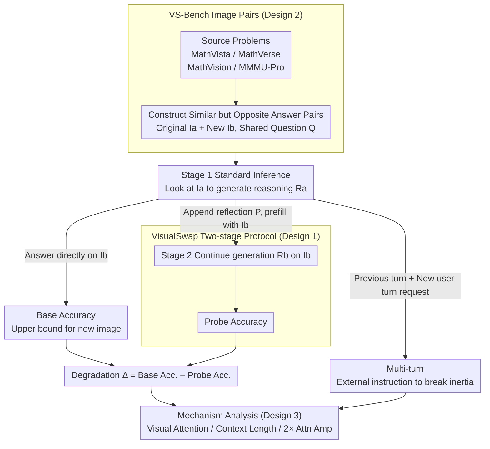

# Are VLMs Seeing or Just Saying? Uncovering the Illusion of Visual Re-examination

**Conference**: ICML2026 Oral  
**arXiv**: [2605.15864](https://arxiv.org/abs/2605.15864)  
**Code**: https://visualswap.github.io/  
**Area**: Multimodal VLM  
**Keywords**: Visual Re-examination, Multimodal Reasoning, Self-reflection, Attention Analysis, Evaluation Benchmark  

## TL;DR
This paper introduces VisualSwap and VS-Bench to examine true visual re-examination capabilities by replacing the image after a VLM claims to "look again." Findings reveal that current reasoning VLMs often follow previous textual inertia; only explicit multi-turn user instructions or enhanced visual attention significantly restore grounding.

## Background & Motivation
**Background**: Multimodal Large Language Models (VLMs) can now generate long reasoning chains for tasks like mathematical charts, geometry, and professional VQA. Next-generation reasoning VLMs output self-reflective sentences like "Let me check the image again" within their Chain-of-Thought (CoT), appearing to actively verify visual evidence.

**Limitations of Prior Work**: Whether these self-reflective sentences trigger actual visual re-reading or are merely reasoning tropes learned by the language model has not been systematically measured. Standard VQA accuracy only tests if a model understands an image in one go, failing to distinguish between "actual re-examination" and "filling in a check-up catchphrase on the old reasoning trajectory."

**Key Challenge**: The longer the VLM's reasoning chain, the stronger the textual context. If visual tokens do not regain sufficient attention during subsequent generation, the model might trust its previously written text over the current image. In other words, the linguistic form of self-reflection may be decoupled from the execution of visual re-examination.

**Goal**: The authors transform this problem into an observable diagnostic task: have the model generate reasoning based on an original image, then swap it with a visually similar but answer-distinct new image at the moment of "checking the image" to observe if the model detects the conflict, corrects its reasoning, and provides the answer for the new image.

**Key Insight**: Image replacement is a clean intervention. An ideal model that truly re-reads the visual input should abandon the old reasoning and pivot to the new answer; if it fails to look at the image, it will continue to recount details from the original image.

**Core Idea**: Use controlled image swapping to turn "claiming to look" into a verifiable behavior, directly exposing textual inertia and attention loss in spontaneous VLM visual re-examination.

## Method
This paper does not propose a new model but rather a diagnostic framework, a specially constructed benchmark, and a set of mechanistic analyses. It addresses whether VLM models actually re-read image tokens when self-reflection triggers appear during generation.

### Overall Architecture
The workflow consists of three layers.

The first layer is the VisualSwap evaluation protocol. Each sample contains an original image $I_a$, a replacement image $I_b$, and the same question $Q$. The two images are similar in layout, style, and semantic scene but differ in key details, resulting in answers $A_a$ and $A_b$ respectively.

The second layer is the VS-Bench dataset. The authors selected problems requiring fine-grained visual understanding from MathVista, MathVerse, MathVision, and MMMU-Pro, constructing 800 pairs (200 per source). The criteria require the question to be natural for both images, with overall visual similarity while key details change the answer.

The third layer involves behavior and mechanism analysis. The authors compare standard single-turn, self-reflection probes within the same assistant turn, and multi-turn explicit user requests. Analysis includes visual token attention, context length, prompt rewriting, natural trigger points, and attention amplification.

In standard inference, the model answers directly based on $I_b$ and $Q$, yielding Base Accuracy, representing the upper bound of its ability to solve the new image.

In the Probe setup, the model first generates an initial reasoning $R_a$ based on $I_a$. Then, researchers swap the image to $I_b$ and append a reflection prompt $P$ within the same assistant response. If the model re-reads the image, it should output $A_b$.

In the Multi-turn setup, $R_a$ is treated as the previous assistant turn. The user then explicitly asks to "re-check the image" in a new turn. This shares the same new image and history as the Probe but adds a clear turn boundary to test if external instructions can break textual inertia.

### Key Designs
**1. VisualSwap Protocol: Verifying Reflection Claims**

Simply checking for phrases like "let me look again" does not confirm re-examination. The core "Probe" branch treats this as a counterfactual test. Stage 1 involves normal generation $R_a=\mathcal{M}(I_a,Q)$. In Stage 2, a reflection prompt $P$ (e.g., "Wait, let me check the image again") is appended, **simultaneously** swapping the image to $I_b$. The system then prefills the entire context to generate $R_b=\mathcal{M}(I_b,Q,R_a\oplus P)$. Since the model is prefilled with $I_b$'s visual representation, failure to provide $A_b$ is attributed to "seeing but not looking," measured by the degradation $\Delta=Acc_{base}-Acc_{probe}$.

**2. VS-Bench: High Similarity, Divergent Answers**

The image pairs must be finely balanced. The authors constructed pairs where $Q$ is valid for both $I_a$ and $I_b$, overall layouts are similar, but key visual details diverge. Quality was verified via CLIP (0.95), SSIM (0.86), and LPIPS (0.14) scores, along with human distinguishability tests. High visual similarity prevents the model from detecting the swap through global layout changes, forcing it to rely on fine-grained re-observation.

**3. Attention and Multi-turn Mechanism Analysis**

To distinguish between the model's inability to understand the image versus its failure to utilize attention, the authors defined a visual attention score $S_{vis}^{(l)}(t)$. They found that while Multi-turn setups significantly increased visual attention and restored accuracy (e.g., Qwen3-VL-235B-Thinking from 34.1 to 85.4), the self-reflection Probe showed minimal attention gain. Doubling the visual attention weight during the Probe also improved results, pinpointing the issue as **autonomous attention control failure**.

### Loss & Training
Ours does not involve training. Standard chat templates and default configurations were used. Standard and probe temperatures were set to 0.1, with standardized evaluation via VLMEvalKit.

The Probe is implemented by re-prefilling the context with the swapped image rather than KV cache injection, ensuring the model technically has access to $I_b$'s visual tokens.

Attention amplification experiments were performed without parameter updates by simply multiplying image token attention weights by 2 during the probe generation of $R_b$.

## Key Experimental Results

### Main Results
The main experiment covers 15 VLMs, including instruct/thinking variants of Qwen3-VL, Qwen2.5-VL, OpenVLThinker, VL-Rethinker, Kimi-VL, and ERNIE-4.5-VL. A critical observation: all models showed significant drops under VisualSwap; "thinking" versions typically suffered more, and scaling did not solve the issue.

| Model | Variant | Avg. Base | Avg. Probe | Degradation $\Delta$ |
|------|-----------|-----------|-------------|---------------|
| Qwen3-VL-8B | Instruct | 69.1 | 46.6 | 22.5 |
| Qwen3-VL-8B | Thinking | 76.0 | 36.6 | 39.4 |
| Qwen3-VL-32B | Instruct | 79.6 | 61.8 | 17.9 |
| Qwen3-VL-32B | Thinking | 84.9 | 36.6 | 48.3 |
| Qwen3-VL-235B-A22B | Instruct | 81.1 | 61.3 | 19.9 |
| Qwen3-VL-235B-A22B | Thinking | 88.8 | 34.1 | 54.6 |
| ERNIE-4.5-VL-28B-A3B | Instruct | 63.3 | 29.0 | 34.3 |
| ERNIE-4.5-VL-28B-A3B | Thinking | 79.9 | 19.6 | 60.3 |
| Kimi-VL-A3B | Thinking | 69.8 | 27.4 | 42.4 |

The failure of "thinking" models is stark. Qwen3-VL-235B-A22B-Thinking drops from 88.8% to 34.1%. Long reasoning chains improve standard performance but reinforce textual trajectories.

### Ablation Study
Ablations were conducted to rule out alternative explanations like image difficulty or context length.

| Setup | Key Metric | Explanation |
|----------|----------|------|
| $I_a$ vs $I_b$ Independent | Avg. Diff 0.1~6.3% | $I_b$ is not inherently harder; drop is due to $R_a$ interference |
| Multi-turn User Re-check | Qwen3-235B Think: 34.1 $\to$ 85.4 | External turns re-activate grounding; capability exists |
| Context Length (0%~100%) | Qwen3-235B Think: 88.8 $\to$ 34.1 | More $R_a$ tokens increase inertia; most visible in thinking models |
| 10 Prompt Variations | Std Dev $\approx$ 4.9 | Failure is not sensitive to specific prompt phrasing |
| Natural Trigger Swaps | Qwen3-8B Inst: 46.6 $\to$ 34.9 | Swapping at model-generated "wait" points shows similar failure |
| 2× Attention Amp | Qwen3-8B Think: 36.6 $\to$ 54.8 | Directly boosting image attention mitigates failure |

### Key Findings
- VS-Bench pairs are "distinguishable but lazy-prone": CLIP similarity 0.95, SSIM 0.86. Humans easily find differences.
- There is a fundamental difference between explicit multi-turn instructions and internal self-reflection. The former boosts visual attention; the latter usually follows the linguistic path.
- Attention analysis shows minimal boost in the Probe; visual attention increment in Qwen3-VL-235B-Thinking is 1.07 for Probe vs. 2.21 for Multi-turn.
- Closed-source APIs were limited to Multi-turn verification due to mid-response insertion restrictions.

## Highlights & Insights
- The evaluation design is incisive: instead of asking if models *can* reflect, it creates a conflict between old text and new images. This transforms "authenticity of self-reflection" into a behavioral test.
- "Thinking" models being worse is a major insight. Long CoT is often assumed to be more reliable, but in multimodal tasks, it acts as a strong prior that anchors the model away from visual evidence.
- Multi-turn recovery suggests the problem is not "blindness." The model can see the new image but lacks the internal control to re-allocate attention; user turn boundaries likely correlate with "re-input response" in training.
- Attention amplification provides a path forward: future VLM training should explicitly reward visual token re-engagement during reflection phases.

## Limitations & Future Work
- Main probes require mid-response insertion, which is restricted in closed-source APIs.
- The 800-pair VS-Bench dataset focuses on math and charts; coverage of open-world images, video, and multi-image dialogues is needed.
- Attention scores are proxies for grounding; future work could use activation patching or causal interventions.
- Simple attention amplification is a proof-of-concept, not a deployment solution, as it might introduce noise in other tasks.
- A natural next step is constructing multi-turn verification data to incorporate "detecting text-image conflict" into SFT/RL rewards.

## Related Work & Insights
- **vs. VQA/MMMU**: Traditional benchmarks measure single-input perception; ours measures multi-turn reliability and the ability to re-bind images under conflict.
- **vs. Textual Self-Refine**: Multimodal reflection requires re-visiting pixels. This work shows that purely textual reflection paradigms overlook grounding execution.
- **vs. Reasoning VLMs**: Models like OpenVLThinker improve reasoning forms, but VisualSwap reveals a side effect: longer reasoning may anchor the model to its own history.
- **Insights**: For VLM agents, "visual re-examination" should be an explicit external step (e.g., forced new user turn or re-encoding) rather than relying on self-reminders within a single CoT.

## Rating
- Novelty: ⭐⭐⭐⭐⭐ Direct behavior test for reflection authenticity.
- Experimental Thoroughness: ⭐⭐⭐⭐⭐ Broad model coverage and detailed mechanism analysis.
- Writing Quality: ⭐⭐⭐⭐☆ Clear logic, though dense with appendix-level detail.
- Value: ⭐⭐⭐⭐⭐ Vital warning for high-stakes VLM applications like medical auditing or autonomous sensing.

<!-- RELATED:START -->

## Related Papers

- [\[CVPR 2026\] Illusion-Aware Visual Preprocessing and Anti-Illusion Prompting for Classic Illusion Understanding in Vision-Language Models](../../CVPR2026/multimodal_vlm/illusion-aware_visual_preprocessing_and_anti-illusion_prompting_for_classic_illu.md)
- [\[CVPR 2026\] VisRes Bench: On Evaluating the Visual Reasoning Capabilities of VLMs](../../CVPR2026/multimodal_vlm/visres_bench_on_evaluating_the_visual_reasoning_capabilities_of_vlms.md)
- [\[CVPR 2026\] Seeing Through Touch: Tactile-Driven Visual Localization of Material Regions](../../CVPR2026/multimodal_vlm/seeing_through_touch_tactile_localization.md)
- [\[ICLR 2026\] ICYM2I: The Illusion of Multimodal Informativeness under Missingness](../../ICLR2026/multimodal_vlm/icym2i_the_illusion_of_multimodal_informativeness_under_missingness.md)
- [\[CVPR 2026\] What Do Visual Tokens Really Encode? Uncovering Sparsity and Redundancy in Multimodal Large Language Models](../../CVPR2026/multimodal_vlm/what_do_visual_tokens_really_encode_uncovering_sparsity_and_redundancy_in_multim.md)

<!-- RELATED:END -->
