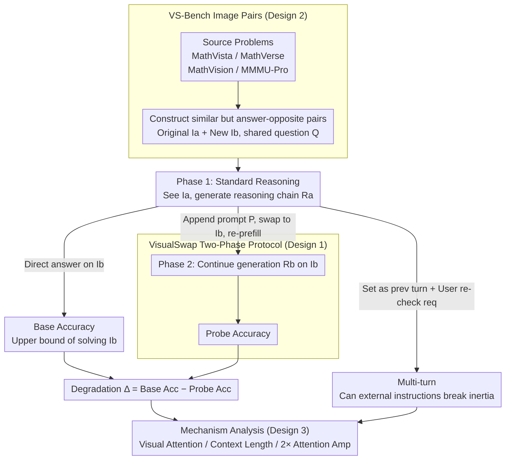

# Are VLMs Seeing or Just Saying? Uncovering the Illusion of Visual Re-examination

**Conference**: ICML2026 Oral  
**arXiv**: [2605.15864](https://arxiv.org/abs/2605.15864)  
**Code**: https://visualswap.github.io/  
**Area**: Multimodal VLM  
**Keywords**: Visual re-examination, multimodal reasoning, self-reflection, attention analysis, benchmark  

## TL;DR
This paper introduces VisualSwap and VS-Bench to test real visual re-examination capabilities by replacing the image after a VLM claims to "take another look." The study finds that current reasoning-heavy VLMs often follow the inertia of previous text, with only explicit multi-turn user instructions or enhanced visual attention significantly restoring grounding.

## Background & Motivation
**Background**: Multimodal Large Language Models (VLMs) can now generate long reasoning chains for tasks like mathematical charts, geometry problems, and professional VQA. A new generation of reasoning VLMs includes self-reflective phrases such as "let me check the image again" within their Chain-of-Thought (CoT), appearing to actively verify visual evidence.

**Limitations of Prior Work**: It has not been systematically measured whether these self-reflection sentences trigger actual visual re-reading or are merely reasoning tropes learned by the language model. Standard VQA accuracy only tests if a model understands an image in one go, failing to distinguish between genuine visual re-examination and the model simply appending a checking "catchphrase" to its previous reasoning trajectory.

**Key Challenge**: The longer the reasoning chain of a VLM, the stronger the textual context becomes. If visual tokens do not receive sufficient renewed attention during subsequent generation, the model may trust its own generated text rather than the current image. In other words, the linguistic form of self-reflection and the execution of visual re-examination may be decoupled.

**Goal**: The authors aim to transform this issue into an observable diagnostic task: allowing the model to generate reasoning based on an initial image, then replacing it with a visually similar but answer-different new image at the moment of "checking the image," to observe if the model can detect the conflict, correct its reasoning, and provide the answer corresponding to the new image.

**Key Insight**: Image replacement serves as a clean intervention. An ideal model, upon truly re-reading the current visual input, should break away from the old reasoning and pivot to the new answer; if the model fails to look at the image, it will continue to parrot details from the original image.

**Core Idea**: Use controlled image swapping to turn "the model says it is looking" into a verifiable behavior, directly exposing textual inertia and attention loss in spontaneous visual re-examination.

## Method
This paper does not propose a new model but rather a diagnostic framework, a specifically constructed benchmark, and a set of mechanistic analyses. It addresses a specific question: do visual tokens actually get re-read when self-reflection triggers appear during generation?

### Overall Architecture
The framework consists of three layers.

The first layer is the VisualSwap evaluation protocol. Each sample contains an original image $I_a$, a swapped image $I_b$, and a common question $Q$. The two images are similar in layout, style, and semantic scene but differ in key details, leading to different answers $A_a$ and $A_b$.

The second layer is the VS-Bench dataset. The authors selected problems requiring fine-grained visual understanding from MathVista, MathVerse, MathVision, and MMMU-Pro, constructing 200 image pairs from each source for a total of 800 pairs. Construction required that the question remain natural for both images, the overall visuals be similar, and key details be sufficient to change the answer.

The third layer comprises behavior and mechanism analysis. The authors compare standard single-turn, self-reflection probes within the same assistant turn, and multi-turn explicit user requests for re-examination. They explain failure causes using visual token attention, context length, prompt paraphrasing, natural trigger points, and attention amplification.

In standard reasoning, the model answers directly based on $I_b$ and $Q$, yielding Base Accuracy. This value represents the model's inherent capacity to solve the new image.

In the Probe setup, the model first sees $I_a$ and generates initial reasoning $R_a$. Subsequently, the image is swapped to $I_b$, and a reflection prompt $P$ is appended within the same assistant response, prompting the model to continue generating $R_b$. If the model truly re-examines the image, it should answer $A_b$.

In the Multi-turn setup, $R_a$ is treated as the previous assistant output, followed by an explicit user turn saying "re-check the image." This shares the same new image and history as the Probe but adds a clear user-turn boundary to test if external instructions can break textual inertia.

### Key Designs
**1. VisualSwap Two-Phase Protocol: Verifying "Saying vs. Doing"**

Detecting reflection phrases in model output cannot determine if it actually re-read the image. The authors design a counterfactual test: Phase 1 generates a reasoning chain $R_a=\mathcal{M}(I_a,Q)$ containing reflection triggers; Phase 2 appends a reflection prompt $P$ (e.g., "Wait, let me check the image again") while **simultaneously** swapping the image to $I_b$. The system re-prefills the entire context before generating $R_b=\mathcal{M}(I_b,Q,R_a\oplus P)$. Since Phase 2 uses a full re-prefill with the new image rather than KV cache injection, the model **technically possesses** the visual representation of $I_b$. Failure is thus precisely attributed to "seeing but not looking." The degradation $\Delta=Acc_{base}-Acc_{probe}$ measures this lack of re-examination.

**2. VS-Bench: Similar but Answer-Conflicting Image Pairs**

For the protocol to be valid, image pair difficulty must be calibrated. The authors use human-in-the-loop annotation and generation tools (Nano Banana Pro) to create 800 pairs where the question $Q$ remains valid for both, overall visuals are similar, but key details diverge. Quality is verified via CLIP (0.95), SSIM (0.86), LPIPS (0.14), and human differentiation experiments. High visual similarity prevents the model from detecting the swap through simple global changes, forcing a focus on fine-grained re-observation.

**3. Attention and Multi-turn Comparative Analysis: Incapacity vs. Reluctance**

To distinguish whether the model cannot understand the new image or simply fails to invoke visual attention, the authors define a visual attention score $S_{vis}^{(l)}(t)$. They compare the attention shifts in the Probe vs. Multi-turn settings and introduce a training-free intervention: doubling the attention weights assigned to image tokens during Probe generation. Results showing that Multi-turn instructions significantly raise visual attention and restore accuracy suggest that the root cause is **failure in autonomous attention control**, not an absence of image understanding capability.

### Loss & Training
Ours involves no new training. Experiments use official chat templates and default generation settings, with temperature set to 0.1. VLMEvalKit is used for standardized evaluation and answer extraction. 

The attention amplification experiment is also parameter-free, doubling image token attention during $R_b$ generation as a causal probe to verify if insufficient visual attention is the primary cause of failure.

## Key Experimental Results

### Main Results
The main experiment covers 15 VLMs, including instruct/thinking variants of Qwen3-VL, Qwen2.5-VL, OpenVLThinker, VL-Rethinker, Kimi-VL, and ERNIE-4.5-VL. All models show significant drops under VisualSwap, with thinking versions generally degrading more severely.

| Model | Variant | Average Base | Average Probe | Degradation $\Delta$ |
|------|------|-----------|-------------|---------------|
| Qwen3-VL-8B | Instruct | 69.1 | 46.6 | 22.5 |
| Qwen3-VL-8B | Thinking | 76.0 | 36.6 | 39.4 |
| Qwen3-VL-32B | Instruct | 79.6 | 61.8 | 17.9 |
| Qwen3-VL-32B | Thinking | 84.9 | 36.6 | 48.3 |
| Qwen3-VL-235B-A22B | Instruct | 81.1 | 61.3 | 19.9 |
| Qwen3-VL-235B-A22B | Thinking | 88.8 | 34.1 | 54.6 |
| ERNIE-4.5-VL-28B-A3B | Instruct | 63.3 | 29.0 | 34.3 |
| ERNIE-4.5-VL-28B-A3B | Thinking | 79.9 | 19.6 | 60.3 |
| Kimi-VL-A3B | Thinking | 69.8 | 27.4 | 42.4 |

The anomaly is that thinking models fail more significantly. Qwen3-VL-235B-A22B-Thinking drops from 88.8% to 34.1%; ERNIE thinking degrades by 60.3 points. While long reasoning improves general performance, it also strengthens the old textual trajectory.

### Ablation Study
Several analyses were conducted to rule out alternative explanations like image difficulty or context length.

| Setup | Key Metric | Description |
|----------|----------|------|
| $I_a$ vs $I_b$ Independent | Mean gap 0.1 to 6.3 pts | $I_b$ is not inherently harder; degradation stems from $R_a$ interference. |
| Multi-turn Instruction | Probe 34.1 $\to$ 85.4 (Qwen3-235B) | User turns successfully reactivate grounding. |
| Context Length (0% to 100%) | Acc 88.8 $\to$ 34.1 | More $R_a$ preserved leads to stronger textual inertia. |
| Prompt Paraphrasing | Std dev $\approx$ 4.9 | Failure is not caused by specific phrasing of the trigger. |
| Natural Trigger Point Swap | 46.6 $\to$ 34.9 (Qwen3-8B) | Swapping at model-generated "wait" points shows similar failure. |
| 2× Attention Amp | Probe 36.6 $\to$ 54.8 (Qwen3-8B) | Direct boosting of image tokens mitigates the failure. |

### Key Findings
- VS-Bench pairs are "distinguishable but prone to laziness": Humans can easily find key differences, but models tend to skip re-examination.
- Explicit multi-turn user instructions differ fundamentally from self-reflection phrases in the same turn. The former significantly increases visual attention, whereas the latter often just continues the linguistic trajectory.
- Attention analysis shows that the visual attention increment in Probes is minimal (e.g., 1.07 for Qwen3-235B vs. 2.21 in Multi-turn).
- Closed-source APIs do not support mid-response insertion or reveal attention, thus main experiments focus on open-source models; Gemini experiments only verify the Multi-turn recovery phenomenon.

## Highlights & Insights
- The evaluation design is incisive: instead of asking if models *say* they are checking, it creates a conflict. This converts abstract "authenticity of self-reflection" into a behavioral test.
- The discovery that thinking models perform worse is highly insightful. Long CoT is usually seen as more reliable, but in multimodal tasks, long text becomes a strong prior that prevents the model from returning to visual evidence.
- The Multi-turn recovery suggests the problem is not a lack of vision-language capability but a lack of control: self-generated reflection lacks a strong signal to re-allocate attention compared to a user-turn boundary.
- Attention amplification provides a future direction: Multimodal RL or SFT should explicitly reward visual token re-engagement during reflection phases.
- Caution is advised: "I've re-checked the image" in model output is not reliable evidence of grounding, which is critical in high-stakes fields like medicine or auditing.

## Limitations & Future Work
- The Probe protocol requires mid-response insertion, which is limited by closed-source APIs. Verifying these findings on models like GPT-4o requires different interfaces.
- VS-Bench (800 pairs) focuses on vision-heavy math and charts. Future work should cover open-ended scenes and video.
- Attention scores provide mechanistic evidence but not a full causal explanation; activation patching could provide deeper insights.
- Attention amplification is a proof-of-concept; a dynamic, triggered mechanism is needed for actual deployment to avoid over-reliance on visual noise.
- Future SFT/RL should include "detecting conflicts between old reasoning and new images" as a training objective.

## Related Work & Insights
- **vs. Traditional VQA**: While standard benchmarks test one-off perception, VisualSwap tests the reliability of re-binding images amidst conflicting textual history.
- **vs. Textual Self-Reflection (Self-Refine)**: In VLMs, self-reflection must involve re-accessing visual evidence; textual paradigms alone fail to capture grounding issues.
- **vs. Reasoning VLMs (OpenVLThinker)**: These models enhance reasoning forms, but Ours exposes a side effect: longer reasoning anchors models to their own historical text.
- **Insight**: For VLM agents, "visual re-examination" should perhaps be an explicit external step (e.g., a new user turn or re-encoding) rather than relying on internal CoT reminders.

## Rating
- Novelty: ⭐⭐⭐⭐⭐ Uses image swapping to test the reality of reflection; the diagnostic signal is immediate.
- Experimental Thoroughness: ⭐⭐⭐⭐⭐ Covers 15 models across 4 sources with extensive mechanism analysis.
- Writing Quality: ⭐⭐⭐⭐☆ Clear main line of argument, though appendices are dense.
- Value: ⭐⭐⭐⭐⭐ Provides a crucial reliability check for reasoning VLMs, warning against trusting "verbal" reflection.

<!-- RELATED:START -->

## Related Papers

- [\[CVPR 2026\] Seeing Through Touch: Tactile-Driven Visual Localization of Material Regions](../../CVPR2026/multimodal_vlm/seeing_through_touch_tactile_localization.md)
- [\[ICLR 2026\] ICYM2I: The Illusion of Multimodal Informativeness under Missingness](../../ICLR2026/multimodal_vlm/icym2i_the_illusion_of_multimodal_informativeness_under_missingness.md)
- [\[ICCV 2025\] Generalizable Object Re-Identification via Visual In-Context Prompting](../../ICCV2025/multimodal_vlm/generalizable_object_re-identification_via_visual_in-context_prompting.md)
- [\[NeurIPS 2025\] Don't Just Chase "Highlighted Tokens" in MLLMs: Revisiting Visual Holistic Context Retention](../../NeurIPS2025/multimodal_vlm/dont_just_chase_highlighted_tokens_in_mllms_revisiting_visual_holistic_context_r.md)
- [\[ICML 2026\] Seeing is Understanding: Unlocking Causal Attention into Modality-Mutual Attention for Multimodal LLMs](seeing_is_understanding_unlocking_causal_attention_into_modality-mutual_attentio.md)

<!-- RELATED:END -->
