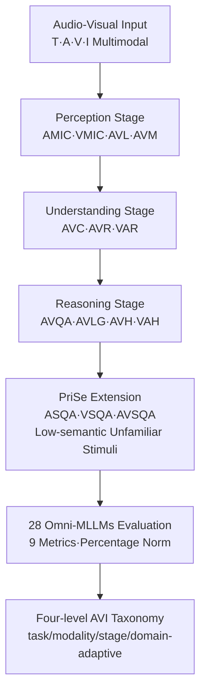

# AVI-Bench: Toward Human-like Audio-Visual Intelligence of Omni-MLLMs

**Conference**: ICML2026  
**arXiv**: [2606.07643](https://arxiv.org/abs/2606.07643)  
**Code**: [Project Homepage](https://fudancvl.github.io/AVI-Bench/)  
**Area**: Multimodal VLM / Audio-Visual Benchmark  
**Keywords**: Audio-Visual Intelligence, Omni-MLLM, Cognitive Hierarchical Benchmark, Cross-modal grounding, Primitive Sensation

## TL;DR
AVI-Bench is an audio-visual benchmark inspired by human cognition. It organizes the evaluation of Omni-MLLMs into three stages: "Perception → Understanding → Reasoning," supplemented by a "Primitive Sensation" (PriSe) extension. Using 14 tasks, 5,864 samples, and 9 metrics, it systematically diagnoses the Audio-Visual Intelligence (AVI) of 28 open-source/closed-source Omni-MLLMs and proposes a four-level AVI taxonomy.

## Background & Motivation
**Background**: Omni-MLLMs (e.g., GPT-4o, Gemini, Qwen2.5-Omni) can simultaneously process text, vision, and audio, and are regarded as a key step toward human-like Audio-Visual Intelligence (AVI) and AGI. Measuring this progress requires rigorous, structured benchmarks.

**Limitations of Prior Work**: Most existing benchmarks are **single-modality specialized** (MMMU/SEED for vision-language, MMAU for audio-language), failing to reflect real-world cross-modal scenarios. Even audio-visual benchmarks like OmniBench, DailyOmni, and AV-Odyssey merely **stack task diversity** without a unified, structured framework to evaluate "multi-level" AVI. This results in fragmented evidence of model capabilities, making it difficult to diagnose failure modes or assess alignment with human audio-visual cognition. Crucially, **achieving high scores on isolated tasks does not equate to progress in general intelligence**.

**Key Challenge**: Evaluation requires "cognitive alignment"—testing models hierarchically like humans (perception, integration, reasoning). Existing benchmarks are flat task sets that lack stratification and generally overlook two critical capabilities: **audio-visual grounding** (localizing sounding objects) and **cross-modal entity localization referenced by language**, which are core to testing spatialized perception and reasoning.

**Goal**: To build a benchmark that is both broad and systematic, aligning tasks with different stages of human cognition to enable fine-grained diagnosis of Omni-MLLM capabilities and failure modes.

**Key Insight**: Approaching from the hierarchical perspective of cognitive science—human audio-visual processing progresses through "Perception → Understanding → Reasoning." Additionally, questioning a neglected fundamental problem: can models demonstrate the "primitive sensation" (distinguishing color, volume, texture, etc.) that humans perform effortlessly under **unfamiliar, low-semantic** stimuli, or are they merely fitting patterns from the training distribution?

**Core Idea**: Reconstruct audio-visual evaluation using three cognitive stages (plus a PriSe extension). Each stage deliberately balances audio-dominant, vision-dominant, and audio-visual collaborative tasks, incorporating neglected grounding tasks to eventually derive a four-level taxonomy for guiding future research.

## Method

### Overall Architecture
AVI-Bench is not a model but a **comprehensive evaluation protocol + dataset + taxonomy**. It organizes 14 tasks into four stages: **Perception → Understanding → Reasoning → Primitive Sensation (PriSe)**. The first three stages correspond to the progressive levels of human cognition, while PriSe serves as an extension to test out-of-distribution generalization. Within each stage, audio-dominant, vision-dominant, and audio-visual collaborative tasks are balanced to prevent scores from being dominated by a single modality. Finally, data from testing 28 Omni-MLLMs is used to summarize a four-level AVI taxonomy.

### Key Designs

**1. Hierarchical Evaluation via Three Cognitive Stages: Decomposing AVI Capabilities**
Existing benchmarks present tasks in a flat structure, failing to reveal capability hierarchies. AVI-Bench categorizes tasks into three layers: **Perception** tests detection and cross-modal alignment of basic semantic entities, including Audio/Visual Multi-Instance Classification (AMIC/VMIC), Audio-Visual Localization (AVL, spatial localization of sound sources), and Audio-Visual Matching (AVM); **Understanding** tests the integration of temporal and semantic dependencies, including Audio-Visual Captioning (AVC) and bidirectional Cross-modal Retrieval (AVR/VAR); **Reasoning** tests higher-order inference, including Audio-Visual QA (AVQA), Audio-Visual Language Grounding (AVLG, precise localization via natural language), and Audio/Visual Reference Hallucination (AVH/VAH) to test robustness against cross-modal conflicts. The value of stratification is that scores are no longer vague numbers but can pinpoint exactly at which cognitive level a model fails.

**2. PriSe Extension: Using Low-semantic Stimuli to Distinguish "Pattern Fitting vs. True Perception"**
Most Omni-MLLMs are trained on large-scale, semantically rich data, which does not prove they possess human-like "primitive sensation" (e.g., distinguishing brightness, volume, texture, geometry) in the absence of semantic context. PriSe uses **simple, unfamiliar, low-semantic** audio-visual stimuli to test three tasks: Audio Sensation QA (ASQA), Visual Sensation QA (VSQA), and Audio-Visual Sensation QA (AVSQA). If a model succeeds after removing semantic shortcuts, it possesses primitive sensation; if it collapses, previous high scores likely stemmed from pattern fitting within the training distribution. This stage, containing 2,090 samples, is the largest in the benchmark.

**3. Modality Balancing & Grounding: Ensuring Fairness and Spatial Coverage**
To prevent a stage score from reflecting only a dominant modality, AVI-Bench explicitly balances three task types: audio-dominant (AMIC, VAR, AVH, ASQA), vision-dominant (VMIC, AVR, VAH, VSQA), and collaborative tasks requiring heavy interaction. Furthermore, it incorporates **grounding tasks** often ignored by existing benchmarks: AVL (spatial localization of sound sources) and AVLG (localization of audio-visual entities via language). These require converting dense mask annotations into normalized bounding boxes (708 samples), which is crucial for testing spatialized perception. All 14 tasks comprise 62% **fully manually constructed** samples (3,657), while the rest come from mask-to-bbox conversion (708) or restructuring existing datasets (1,499).

### Mechanism: Diagnosing a Sample Through Four Stages
Consider an audio-visual clip of "a person playing guitar on a street while a car passes by": The **Perception** stage asks AMIC/VMIC "which instances are in the video/audio" (guitar sound, engine sound, person, car), AVL requires bounding the sound source (the guitar), and AVM judges if the audio matches the video. The **Understanding** stage requires AVC to generate a coherent narrative and AVR/VAR to perform cross-modal retrieval. The **Reasoning** stage asks AVQA "why did the passerby stop" (requires global understanding), AVLG requires precisely localizing "the guitar currently making sound," and AVH/VAH provides conflicting signals to test for hallucinations. Finally, **PriSe** replaces the content with low-semantic stimuli (e.g., pure color blocks and sine tones) and asks which is brighter or louder.

## Key Experimental Results

### Main Results
AVI-Bench evaluates **28 Omni-MLLMs** (including closed-source GPT-4o, Gemini series, and open-source Qwen2.5-Omni, Ola, Baichuan-Omni-1.5, ranging from 0.5B to 7B+ parameters). All scores are normalized to a 100-point scale.

| Benchmark | Modality | #Task | #Sample | #Metric | #Stage | Grounding |
| :--- | :--- | :--- | :--- | :--- | :--- | :--- |
| AV-Odyssey | T,A,V,I | 7 | 4,555 | 2 | 1 | ✗ |
| OmniBench | T,A,I | 8 | 1,142 | 1 | 1 | ✗ |
| AVHBench | T,A,V | 4 | 5,302 | 7 | 1 | ✗ |
| **AVI-Bench** | T,A,V,I | **14** | **5,864** | **9** | **4** | **✓** |

Representative model scores by stage (percentage, higher is better):

| Model | Perception Avg | Understanding Avg | Reasoning Avg | PriSe Avg | Total Avg |
| :--- | :---: | :---: | :---: | :---: | :---: |
| Gemini-2.5-pro | 54.58 | 68.97 | 69.06 | 36.22 | 57.21 |

### Ablation Study (Sample Distribution)
The four stages are balanced across modalities, with PriSe containing the largest sample size:

| Stage | Task (#Samples) | Stage Total |
| :--- | :--- | :--- |
| Perception | AMIC(518), VMIC(521), AVL(205), AVM(250) | 1,494 |
| Understanding | VAR(264), AVR(264), AVC(280) | 808 |
| Reasoning | AVH(250), VAH(250), AVQA(469), AVLG(503) | 1,472 |
| PriSe | ASQA(502), VSQA-img(620), VSQA-vid(580), AVSQA(388) | 2,090 |

### Key Findings
- **Primitive Sensation is a universal weakness**: Even the top-performing Gemini-2.5-pro scored only 36.22 in PriSe, significantly lower than other stages (54~69), confirming that high performance often relies on semantic context rather than core perception.
- **Grounding is a major hurdle**: Tasks like AVL/AVLG requiring spatial localization are significant weaknesses for current Omni-MLLMs and represent a unique contribution of AVI-Bench.
- **Hierarchical diagnosis clarifies failure modes**: Decomposing scores into cognitive stages allows identification of whether a model fails at perception, understanding, or reasoning levels.

## Highlights & Insights
- **Dual constraints of cognitive hierarchy and modality balancing**: This ensures evaluations follow human cognitive levels while preventing single-modality dominance, resulting in more interpretable scores.
- **PriSe as a "semantic-free" probe is novel**: Separating "pattern fitting" from "true perception" using low-semantic stimuli is an effective probe for verifying AVI authenticity.
- **Inclusion of grounding in audio-visual evaluation** fills a gap in spatialized perception/reasoning evaluation, with unified mask-to-bbox annotations facilitating reuse.
- **Four-level taxonomy** provides a structured coordinate system (task/modality/stage/domain-adaptive) for diagnosing Omni-MLLM capabilities.

## Limitations & Future Work
- **Lack of improvement methodology**: AVI-Bench diagnoses shortcomings (especially in PriSe and grounding) but does not provide a training solution to address them.
- **Moderate sample size**: With 5,864 samples across 14 tasks, the sample size per task (e.g., 205 for AVL) is relatively small, which may affect statistical robustness.
- **Metric dependency**: Scoring for open-ended tasks (AVC, some QA) relies on automated metrics or LLM-as-a-judge, which may deviate from human judgment.

## Related Work & Insights
- **Vs. OmniBench / DailyOmni / AV-Odyssey**: These expand task/domain diversity but lack a hierarchical structure; AVI-Bench uses four cognitive stages and adds PriSe to create a diagnostic capability map.
- **Vs. AVHBench / AVTrustBench**: These focus exclusively on hallucinations; AVI-Bench treats hallucination (AVH/VAH) as a sub-dimension within the larger Perception → Reasoning framework.
- **Vs. MMMU / SEED / MMAU**: These focus on vision-language or audio-language; AVI-Bench emphasizes joint processing and cross-modal synergy, closer to real human perception.

## Rating
- Novelty: ⭐⭐⭐⭐ (Cognitive stages + PriSe probe + grounding inclusion)
- Experimental Thoroughness: ⭐⭐⭐⭐ (28 models × 14 tasks × 9 metrics)
- Writing Quality: ⭐⭐⭐⭐ (Clear motivation and stage definitions)
- Value: ⭐⭐⭐⭐ (Provides a structured, human-aligned diagnostic framework for the community)

<!-- RELATED:START -->

## Related Papers

- [\[ICLR 2026\] OmniVideoBench: Towards Audio-Visual Understanding Evaluation for Omni MLLMs](../../ICLR2026/multimodal_vlm/omnivideobench_towards_audio-visual_understanding_evaluation_for_omni_mllms.md)
- [\[CVPR 2026\] HAVE-Bench: Hierarchical Audio-Visual Evaluation from Perception to Interaction](../../CVPR2026/multimodal_vlm/have-bench_hierarchical_audio-visual_evaluation_from_perception_to_interaction.md)
- [\[ICLR 2026\] MMSI-Bench: A Benchmark for Multi-Image Spatial Intelligence](../../ICLR2026/multimodal_vlm/mmsi-bench_a_benchmark_for_multi-image_spatial_intelligence.md)
- [\[CVPR 2026\] A More Word-like Image Tokenization for MLLMs](../../CVPR2026/multimodal_vlm/a_more_word-like_image_tokenization_for_mllms.md)
- [\[ICML 2026\] FutureOmni: Evaluating Future Forecasting from Omni-Modal Context for Multimodal LLMs](futureomni_evaluating_future_forecasting_from_omni-modal_context_for_multimodal_.md)

<!-- RELATED:END -->
