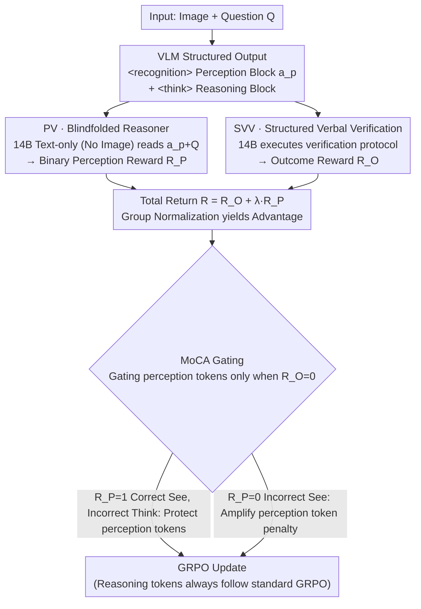

# Bad Seeing or Bad Thinking? Rewarding Perception for Vision-Language Reasoning

**Conference**: ICML 2026 Oral  
**arXiv**: [2605.14054](https://arxiv.org/abs/2605.14054)  
**Code**: To be open-sourced (Authors promise to release data/code/models)  
**Area**: Multimodal VLM / Vision-Language Reasoning / Reinforcement Learning  
**Keywords**: VLM, RL, Modal Credit Assignment, GRPO, Structured Verbal Verification

## TL;DR
This paper explicitly splits VLM output into `<recognition>` perception blocks and `<think>` reasoning blocks. It introduces a "blindfolded" text reasoning agent (which has no access to images and only sees the perception text written by the VLM) to determine a perception reward $R_P$ based on its ability to answer correctly. Combined with Structured Verbal Verification (SVV) for output reward $R_O$, the proposed MoCA uses $R_P$ as a gate for modal-level credit assignment. This allows a 7B model to improve across 9 perception/reasoning/rich-modality benchmarks simultaneously, surpassing GPT-4o on multiple metrics.

## Background & Motivation

**Background**: Advanced VLMs aiming for "perception-reasoning synergy" typically follow two paths: (a) implicit fusion of visual tokens and text embeddings in latent space (e.g., Qwen-VL), handled by static text reasoning; (b) agentic "thinking with images" workflows (e.g., Pixel Reasoner, DeepEyes) using multi-turn function-calling to invoke external tools for active re-observation.

**Limitations of Prior Work**: (a) Static reasoning methods fail when encountering fine-grained details; (b) Agentic methods are computationally heavy—requiring multi-round RL, asynchronous long-tail episodes, and external tool integration—and often suffer from the "seesaw effect," where perception metrics improve at the cost of reasoning, or vice versa. High investment yields marginal gains due to inter-modal competition.

**Key Challenge**: The authors attribute the core issue to a neglected root problem—**ambiguity in modal credit assignment**. When a VLM fails, is it due to "bad seeing" (inaccurate visual evidence) or "bad thinking" (logical chain errors)? Existing training paradigms only provide outcome rewards, distributing penalties uniformly across the entire trajectory. Consequently, a model might "unlearn" correct perception behaviors due to reasoning failures, and vice versa.

**Goal**: (1) Extract "perception" from the latent black box into supervisable explicit tokens; (2) Design a perception reward independent of human labels and ground-truth captions; (3) Provide a low-variance, high-fidelity outcome verifier for free-form answers; (4) Separate penalties for "seeing wrong" and "thinking wrong" using modal-level credit assignment.

**Key Insight**: In explicit visual reasoning, the product of perception is the set of "discrete premises" required for logical deduction. Thus, the "sufficiency" of perception does not require a ground-truth caption; it only requires testing whether "the VLM's perception text + the question" allows a blindfolded text-only reasoner to answer correctly. If it can, perception is sufficient; otherwise, it is "bad seeing." This bypasses the bottleneck of missing perception labels.

**Core Idea**: Replace holistic outcome supervision with a **"Blindfolded Reasoner + Structured Verbal Verification (SVV) + Modal Credit Assignment (MoCA)"** framework, upgrading VLM training from vague end-to-end supervision to precise module-level credit assignment.

## Method

### Overall Architecture
The training objective is based on GRPO (Group Relative Policy Optimization). Under system prompt instructions, the VLM alternately outputs `<recognition>...</recognition>` (perception action $a_p$) and `<think>...</think>` (reasoning action). For each trajectory $\tau$, two rewards are calculated: (i) **Perception Verification (PV)**: All $\{a_p\} +$ question $Q$ are fed to a strong text-only reasoner (e.g., Qwen2.5-Instruct-14B, without the image) to check for the correct answer, yielding a binary $R_P \in \{0, 1\}$; (ii) **Structured Verbal Verification (SVV)**: The same LLM follows a universal "verification protocol" (identify answer type → extract content → reconstruct reference → semantic comparison by type) to output an outcome reward $R_O$. Total return is $R(\tau) = R_O(\tau) + \lambda R_P(\tau)$, and the advantage is calculated via group normalization $A_{\tau,t} = R(\tau) - \frac{1}{k} \sum R(\tau_j)$. **MoCA** reroutes advantages based on $R_P$ for failed trajectories ($R_O = 0$), precisely delivering gradients to the corresponding tokens.

### Key Designs

**1. Perception Verification via "Blindfolded Reasoner" (PV): Binary Reward for Perception Blocks without Caption Labels**

The greatest challenge in perception is the lack of ground truth. The authors' breakthrough observation is that perception products are "discrete premises" for downstream reasoning. Therefore, whether a blindfolded agent can answer a question using only the VLM's perception text serves as a natural functional metric for perception sufficiency. All perception text $\{a_p\}$ and the original question $Q$ are fed to a text-only reasoner; if it answers correctly, $R_P=1$, else $R_P=0$. Theoretically, this functional proxy is equivalent to an Information Bottleneck objective:

$$\min_{p(A_p|V)} I(V;A_p) - \beta I(A_p;Y),$$

rewarding perception that is "most informative for the answer and least redundant regarding the image." To enforce minimalism, a explicit penalty is applied to perception blocks exceeding 800 tokens. Advantages include zero dependence on human labels and zero tolerance for "hallucinated captions"—no matter how eloquent, if the information is wrong and the agent fails, no reward is granted. Human evaluation (N=979) shows PV consistency with majority voting at 86.31% (Cohen's κ=0.707), with failure modes biased toward "conservative False Negatives" (9.19% FN vs 4.49% FP), which are mitigated by MoCA's protection mechanism.

**2. Structured Verbal Verification (SVV): Transforming Correctness into Step-by-Step Execution**

Free-form answers (numbers, sets, expressions, text) are difficult to judge. Rigid regex lacks semantic recall, while direct LLM judgment ("Are these equivalent?") is subjective—consistency is only 78.6% over five trials at $T=0.7$. Such high-variance rewards invite reward hacking. SVV provides the judge with a linguistic verification algorithm to **execute step-by-step**: identify answer type → extract content → reconstruct reference form → semantic comparison by type. By decomposing subjective judgment into deterministic execution, consistency rises to 92.3%, with accuracy 91.9% and F1 92.7% (VP-Challenge-Set, N=273), producing low-variance outcome rewards $R_O$.

**3. MoCA: Precision Penalty Rerouting for Failed Trajectories**

While rewards address signal accuracy, MoCA addresses gradient assignment. Standard GRPO applies negative advantage uniformly across a failed trajectory, causing the "seesaw effect"—if a model "sees correctly but thinks incorrectly," uniform negative gradients unlearn correct visual grounding. MoCA uses $R_P$ as a gate when $R_O=0$:
- **Case 1 (Bad Thinking)**: $R_O=0$ but $R_P=1$ (perception correct, reasoning wrong). A positive protection term $A_{\tau,t} + \alpha_{\text{protect}} \cdot |A_{\tau,t}|$ is added to perception tokens to prevent unlearning.
- **Case 2 (Bad Seeing)**: $R_O=0$ and $R_P=0$ (perception also wrong). The penalty for perception tokens is amplified to $A_{\tau,t} - \alpha_{\text{punish}} \cdot |A_{\tau,t}|$.
Reasoning tokens always follow standard GRPO. This gating reduces trajectory-level signals to precise segment-level signals, mechanically eliminating the seesaw effect.

### Loss & Training
The objective is GRPO with group baselines and modal-level advantage modifications. Qwen2.5-VL-Instruct-7B serves as the base model. Both the PV reasoner and SVV judge utilize Qwen2.5-Instruct-14B. Training data is a mixture of ViRL39K (STEM reasoning), VisualWebInstruct-Verified (general visual instructions), Pixel Reasoner data (perception-intensive), and rich-modality data crawled from arXiv, newspapers, and infographics.

## Key Experimental Results

### Main Results
Across 9 benchmarks (perception-intensive / rich-modality / reasoning-intensive), MoCA-7B achieves universal improvements, surpassing GPT-4o on multiple metrics.

| Model | V* | HRBench | DUDE | MMLong | MMMU | EMMA | MathVista |
|------|-----|---------|------|--------|------|------|-----------|
| GPT-4o | 45.0 | 65.0 | 52.7 | 42.3 | 51.9 | 32.7 | 63.4 |
| Qwen2.5-VL-Instruct 72B | 81.2 | 73.4 | 44.5 | 24.9 | 67.0 | 38.5 | 74.8 |
| Qwen2.5-VL-Instruct 7B (Base) | 71.4 | 69.2 | 41.8 | 21.2 | 54.3 | 21.5 | 68.2 |
| Pixel Reasoner 7B | 84.3 | 72.8 | 44.5 | 22.0 | 50.8 | 19.8 | 65.3 |
| DeepEyes 7B | 88.9 | 73.1 | 35.2 | 17.5 | 45.2 | 18.1 | 64.9 |
| **Ours (MoCA 7B)** | **86.6** | **74.2** | **45.1** | **33.1** | **54.8** | **31.3** | **73.8** |

Relative to the base model, Gains include: V* +15.2, HRBench +5.0, DUDE +3.3, MMLong +11.9, EMMA +9.8—improving across all 9 benchmarks without a seesaw effect.

### Ablation Study

| Configuration | V* | HRBench | DUDE | MMMU | MathVista | Notes |
|------|-----|---------|------|------|-----------|------|
| Full MoCA | 86.6 | 74.2 | 45.1 | 54.8 | 73.8 | Complete Model |
| Instruction-Only (No RL) | 68.3 | 66.5 | 37.7 | 49.9 | 65.7 | Forced decomposition via prompt alone drops performance |
| w/o PV (Only $R_O$) | 79.7 | 70.1 | 42.5 | 55.3 | 74.4 | Perception tasks drop significantly (V* -6.9) |
| w/o MoCA ($R_O + \lambda R_P$ naive) | 83.1 | 72.5 | 43.7 | 54.6 | 74.1 | Gating mechanism is essential (approx. -3) |
| w/o SVV+PV (Standard LLM Judge) | 78.4 | 69.7 | 38.9 | 52.3 | 72.1 | High-variance rewards lead to hacking |

### Key Findings
- **PV is the primary source of perception gains**: Removing $R_P$ significantly degrades perception-intensive benchmarks (V* -6.9) while reasoning tasks remain stable, showing the reward signal is accurately targeted.
- **The MoCA gate is not optional**: Naive reward summation still sees a ~3 point drop in perception because negative gradients from reasoning tokens pollute perception tokens on failed trajectories.
- **Structured Execution > Subjective Judgment**: SVV increases consistency from 78.6% to 92.3% compared to standard LLM Judges, preventing unstable reward hacking.
- **MoCA 7B surpasses GPT-4o and Qwen2.5-VL-72B on multiple metrics**: It outperforms the 72B model on DUDE (45.1 vs 44.5) and HRBench (74.2 vs 73.4), proving that paradigm superiority can compensate for model scale.

## Highlights & Insights
- The "Blindfolded Reasoner" solves the zero-label perception supervision problem: functional sufficiency testing requires no captions or external tools, just a text LLM. It is cheap and theoretically grounded in IB.
- It transforms perception-reasoning synergy from an "external agentic workflow" into "single-pass autoregressive block alternation," avoiding multi-round RL and asynchronous engineering complexities—a rare simplification of complex capabilities.
- The MoCA gate mechanism reduces "trajectory-level coarse signals" to "segment-level precise signals." This decoupled credit assignment can be extended to any modular policy training (e.g., code, tools, memory).

## Limitations & Future Work
- Text reasoners are "near-sighted": certain visual features (e.g., full mazes, complex geometric relations) are difficult to compress into text, exceeding the System-2 assumptions of this work.
- The 9.19% False Negative rate of the PV oracle "wrongly accuses good perception." While MoCA's protection mitigates this, it still relies on a non-perfect oracle.
- The 800-token limit for perception blocks is empirical and may be too tight for complex scenarios like multi-page documents.
- Training and inference depend on a secondary 14B reasoner, nearly doubling deployment costs compared to a standalone 7B VLM.

## Related Work & Insights
- **vs Pixel Reasoner / DeepEyes (Agentic)**: These rely on external tools for active perception through multi-round RL; MoCA internalizes this "see-think" loop into a single autoregressive generation, increasing efficiency by an order of magnitude.
- **vs VL-Rethinker / R1-VL (RL-based VLM)**: These use single outcome rewards + GRPO and suffer from the seesaw effect; MoCA resolves credit assignment ambiguity through modular rewards and gating.
- **vs RLHF / DPO**: Traditional alignment is outcome-only; MoCA adopts process supervision concepts but solves the "process label scarcity" via a functional proxy, applicable to code or agent tasks.

## Rating
- Novelty: ⭐⭐⭐⭐⭐ "Blindfolded reasoner" as a functional proxy for perception sufficiency is highly ingenious.
- Experimental Thoroughness: ⭐⭐⭐⭐⭐ 9 benchmarks, component ablations, human validation, and verifier comparisons.
- Writing Quality: ⭐⭐⭐⭐ The logic chain from problem definition to IB theory to MoCA gating is smooth and clear.
- Value: ⭐⭐⭐⭐⭐ Provides a universal recipe for "internalizing agentic behavior + modal-level RL," significantly refining VLM training paradigms.

<!-- RELATED:START -->

## Related Papers

- [\[ICML 2026\] From Seeing to Thinking: Decoupling Perception and Reasoning Improves Post-Training of Vision-Language Models](from_seeing_to_thinking_decoupling_perception_and_reasoning_improves_post-traini.md)
- [\[ICML 2026\] 3ViewSense: Spatial and Mental Perspective Reasoning from Orthographic Views in Vision-Language Models](3viewsense_spatial_and_mental_perspective_reasoning_from_orthographic_views_in_v.md)
- [\[ICML 2026\] Efficient Reasoning with Hidden Thinking](efficient_reasoning_with_hidden_thinking.md)
- [\[ECCV 2024\] Bad Students Make Great Teachers: Active Learning Accelerates Large-Scale Visual Understanding](../../ECCV2024/multimodal_vlm/bad_students_make_great_teachers_active_learning_accelerates_large-scale_visual_.md)
- [\[CVPR 2026\] All Roads Lead to Rome: Incentivizing Divergent Thinking in Vision-Language Models](../../CVPR2026/multimodal_vlm/all_roads_lead_to_rome_incentivizing_divergent_thinking_in_vision-language_model.md)

<!-- RELATED:END -->
