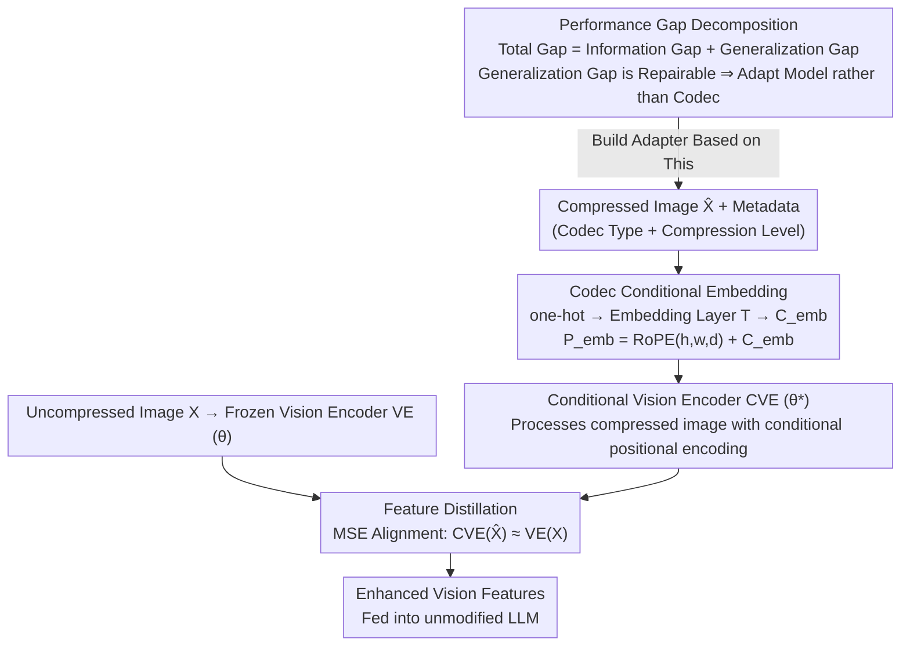

# Benchmarking and Enhancing VLM for Compressed Image Understanding

**Conference**: ICML 2026  
**arXiv**: [2512.20901](https://arxiv.org/abs/2512.20901)  
**Code**: https://github.com/bblgbr/CompressVLMBench  
**Area**: Multimodal VLM  
**Keywords**: Vision-Language Models, Image Compression, Compression Artifacts, Generalization Gap, Vision Encoder Adapter  

## TL;DR

This paper constructs the first large-scale benchmark (11 codecs, 9 VLMs, 1M+ compressed images) to evaluate VLM understanding of compressed images. Performance degradation is decomposed into an irrecoverable "information gap" and a remediable "generalization gap." A lightweight conditional vision encoder adapter is proposed, which utilizes codec type and compression level as conditional embeddings + distillation training to improve VLM performance by 10%–30% across various encoders and bitrates.

## Background & Motivation

**Background**: With the explosion of multimedia services and VLM applications, images inevitably undergo compression during transmission and storage. Existing VLM evaluation benchmarks (SEEDBench, MMBench, OCRBench, etc.) primarily utilize high-quality clear images, while current image coding standards (JPEG, VVC, learned codecs, generative codecs) are optimized for human perception.

**Limitations of Prior Work**: VLMs in practical deployment often receive compressed images, yet a systematic benchmark for evaluating VLM capability on compressed images is lacking. Existing Image Coding for Machines (ICM) methods typically target specific codecs and vision tasks (e.g., object detection), resulting in limited generalization.

**Key Challenge**: In the performance decline of VLMs, how much is due to irreversible information loss from compression (unfixable), and how much is due to the VLM's insufficient generalization to compression artifacts (fixable through adaptation)? Distinguishing these two sources is crucial for deciding whether to "adapt the codec" or "adapt the model."

**Goal**: (1) Build a comprehensive VLM evaluation benchmark for compressed images; (2) Decompose the performance gap into an information gap and a generalization gap; (3) Propose a universal adapter to narrow the generalization gap.

**Key Insight**: The authors observe that VLM performance drops sharply at low bitrates, but a significant portion of the performance can be recovered by fine-tuning on compressed images. This indicates that a substantial proportion of the performance decline stems from generalization failure rather than information loss.

**Core Idea**: By injecting codec type and compression level as conditions into the positional encodings of the VLM vision encoder, a unified conditional vision encoder is trained via distillation loss. This allows the VLM to adapt to multiple compression artifacts without modifying the LLM.

## Method

### Overall Architecture

The proposed method follows a two-step process: first, a **performance gap decomposition framework** diagnoses how much of the compression-induced drop is repairable, confirming that the generalization gap (rather than the information gap) is the primary factor that can be recovered by model modification. Based on this, a lightweight adapter is designed to bridge the generalization gap. The adapter takes the compressed image $\hat{X}$ and its codec type/compression level metadata as input, outputting enhanced vision features aligned with original uncompressed image features. The mechanism only fine-tunes the VLM vision encoder (ViT) by integrating codec condition information into the positional encodings and using distillation loss to force compressed image features to approximate uncompressed ones. The entire framework keeps the LLM frozen, ensuring low computational overhead and high versatility.

### Key Designs

**1. Performance Gap Decomposition Framework: Distinguishing "Information Loss" from "Lack of Adaptation"**

Does VLM performance degradation require adapting the codec or the model? The authors provide a quantifiable diagnostic tool: the total performance gap $\mathcal{L}(X, \theta) - \mathcal{L}(\hat{X}, \theta)$ is split into an information gap $\mathcal{L}(X, \theta) - \mathcal{L}(\hat{X}, \theta^*)$ and a generalization gap $\mathcal{L}(\hat{X}, \theta^*) - \mathcal{L}(\hat{X}, \theta)$, where $\theta^*$ represents the optimal parameters after sufficient fine-tuning on compressed images. The information gap corresponds to irrecoverable loss, while the generalization gap reflects the VLM's adaptation failure. Empirical results on POPE shows the generalization gap for JPEG is as high as 29.48 (81% of the total gap 36.29), justifying the adapter approach.

**2. Codec Conditional Embedding: Informing the Encoder of "What Codec and How Much Compression"**

Distortion patterns vary significantly across codecs and bitrates. If the encoder is unaware of these, learning is dominated by low-bitrate samples. The authors explicitly encode the codec type and compression level into positional encodings: assuming $m$ codecs with $n$ levels each, a one-hot vector is passed through an embedding layer $T(\cdot)$ to a $d$-dimensional latent space to get $C_{\mathrm{emb}}$. This is added to RoPE to form the conditional positional encoding $P_{\mathrm{emb}} = \mathrm{RoPE}(h, w, d) + C_{\mathrm{emb}}$. This additive fusion allows the encoder to treat vision tokens differently based on distortion characteristics without changing the ViT structure.

**3. Feature Distillation Training: Pulling Compressed Features Back to Uncompressed Features**

The objective is to make compressed image features approximate original features. Aligning at the output layer would couple the adapter to specific tasks. Instead, alignment is performed in the feature space: freezing parameters $\theta$ of the original vision encoder VE and training parameters $\theta^*$ of the conditional vision encoder CVE to minimize the MSE distillation loss:
$$\mathcal{L}_d = \| \mathrm{CVE}(\hat{X}, P_{\mathrm{emb}}, \theta^*) - \mathrm{VE}(X, \theta) \|_2^2$$
The training uses 110k+ COCO images compressed with JPEG, ELIC, and ILLM at 4 bitrates. Feature-level alignment decouples the adapter from downstream tasks, allowing a single adapter to serve VQA, OCR, and Captioning.

## Key Experimental Results

### Benchmark Five Findings

| Finding | Core Conclusion |
|------|---------|
| Finding 1 | VLM semantic understanding drops significantly when bitrate < 0.1 bpp. |
| Finding 2 | Stronger VLMs usually perform better on compressed images, but Janus-pro shows the strongest robustness. |
| Finding 3 | Generative codecs (especially diffusion) show better semantic reconstruction at low bitrates but fail in fine-grained tasks like OCR. |
| Finding 4 | Scaling law does not hold for compressed images: larger models do not necessarily reduce compression degradation. |
| Finding 5 | VLM tasks correlate with human perception metrics; PSNR correlates with OCR, while DISTS/FID correlate with coarse-grained tasks. |

### Main Results (BD-Metric, QwenVL2.5-3B)

| Codec | POPE | SEEDBench | GQA | MMBench | OCRBench | MME |
|---------|------|-----------|-----|---------|----------|-----|
| JPEG | +12.62 | +12.88 | +11.63 | +14.91 | +52.51 | +285.4 |
| ELIC | +3.42 | +0.69 | +3.88 | +2.45 | +10.51 | +75.97 |
| ILLM | +3.52 | +1.23 | +2.38 | +0.86 | +14.34 | +19.72 |
| StableCodec | +2.87 | +0.63 | +1.34 | +0.09 | +1.30 | +3.18 |

### Generalization to Unseen Codecs and Different VLMs

| VLM | Unseen Codec | POPE | SEEDBench | MME | OCRBench | GQA | MMBench |
|-----|-------------|------|-----------|-----|----------|-----|---------|
| QwenVL2.5-3B | HM | +2.98 | +3.12 | +130.6 | +2.10 | +5.48 | +1.25 |
| QwenVL2.5-3B | MLICpp | +3.32 | +1.22 | +50.0 | +5.73 | +2.01 | +2.52 |
| InternVL3-1B | JPEG | +8.36 | +5.62 | +133.1 | +3.93 | +8.58 | +1.40 |
| InternVL3-1B | ELIC | +2.19 | +1.19 | +25.6 | +6.75 | +4.17 | +0.86 |

### Ablation Study (Condition Design Comparison)

| Condition Setting | JPEG-POPE | JPEG-SEEDB | ELIC-POPE | ILLM-POPE |
|---------|-----------|------------|-----------|-----------|
| No Condition | 11.86 | 11.01 | 2.91 | 3.16 |
| Compression Level Only | 12.22 | 11.41 | 3.07 | 3.19 |
| Codec Type Only | 12.43 | 12.54 | 3.28 | 3.41 |
| Full Conditions (**Ours**) | **12.62** | **12.88** | **3.42** | **3.52** |

## Highlights & Insights

1. **Diagnostic value of Gap Decomposition**: Quantifying the drop via information vs. generalization gaps provides a decision basis for "adapting the codec vs. model." In POPE, the generalization gap of JPEG (29.48) accounts for 81% of the total drop, proving the feasibility of model adaptation.
2. **Clever Condition Injection**: Merging codec metadata with RoPE positional encodings via additive fusion adapts the diffusion model condition mechanism without altering the ViT architecture.
3. **Strong Generalization**: The adapter trained on only 3 codecs generalizes to unseen codecs (HM, MLICpp, DiffEIC) and different VLMs (InternVL3), indicating the learning of universal distortion-resilient representations.

## Limitations & Future Work

1. Current experiments do not cover recent closed-source VLMs (e.g., GPT-4V), limiting generalization verification.
2. The adapter requires codec type and compression level metadata; such info might not always be available in deployment (though the unconditional version still performs decently).
3. Generalization to diffusion-based codecs (DiffEIC) is less effective than traditional/learned codecs due to distinct distortion patterns.
4. Training is based on COCO; generalization to specialized domains like medical or remote sensing is not yet verified.

## Related Work & Insights

- **Image Coding for Machines (ICM/VCM/FCM)**: Comparison with the ICM method TransTIC shows that repairing both information and generalization gaps provides additive gains (BD-POPE increased from 0.18 to 3.02).
- **VLM Robustness**: The study reveals the counter-intuitive phenomenon that scaling laws do not hold under compression artifacts, providing critical insights for model deployment.
- **Conditional Feature Alignment**: The paradigm of distillation loss + conditional encoding can be extended to other domain adaptation scenarios such as noise, blur, or adversarial attacks.

## Rating

- Novelty: ⭐⭐⭐⭐
- Experimental Thoroughness: ⭐⭐⭐⭐⭐
- Writing Quality: ⭐⭐⭐⭐
- Value: ⭐⭐⭐⭐

<!-- RELATED:START -->

## Related Papers

- [\[ICLR 2026\] Enhancing Multi-Image Understanding through Delimiter Token Scaling](../../ICLR2026/multimodal_vlm/enhancing_multi-image_understanding_through_delimiter_token_scaling.md)
- [\[CVPR 2026\] GaussianVision: Vision-Language Alignment from Compressed Image Representations using 2D Gaussian Splatting](../../CVPR2026/multimodal_vlm/gaussianvision_vision-language_alignment_from_compressed_image_representations_u.md)
- [\[ICML 2026\] TimeSpot: Benchmarking Geo-Temporal Understanding in Vision-Language Models in Real-World Settings](timespot_benchmarking_geo-temporal_understanding_in_vision-language_models_in_re.md)
- [\[ICCV 2025\] GEOBench-VLM: Benchmarking Vision-Language Models for Geospatial Tasks](../../ICCV2025/multimodal_vlm/geobench-vlm_benchmarking_vision-language_models_for_geospatial_tasks.md)
- [\[CVPR 2026\] RetFormer: Multimodal Retrieval for Enhancing Image Recognition](../../CVPR2026/multimodal_vlm/retformer_multimodal_retrieval_for_enhancing_image_recognition.md)

<!-- RELATED:END -->
