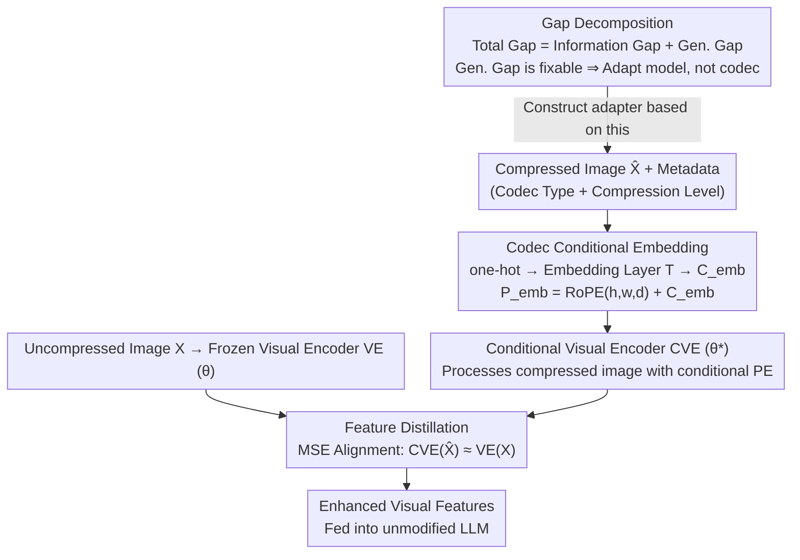

# Benchmarking and Enhancing VLM for Compressed Image Understanding

**Conference**: ICML 2026  
**arXiv**: [2512.20901](https://arxiv.org/abs/2512.20901)  
**Code**: https://github.com/bblgbr/CompressVLMBench  
**Area**: Multimodal VLM  
**Keywords**: Vision-Language Models, Image Compression, Compression Artifacts, Generalization Gap, Visual Encoder Adapter  

## TL;DR

This paper constructs the first large-scale benchmark (11 codecs, 9 VLMs, 1M+ compressed images) to evaluate VLM performance on compressed images. It decomposes the performance drop into an irreparable "information gap" and a reparable "generalization gap." Furthermore, a lightweight conditional visual encoder adapter is proposed, utilizing codec-type and compression-level condition embeddings with distillation training, enhancing VLM performance by 10%–30% across different encoders and bitrates.

## Background & Motivation

**Background**: With the explosive growth of multimedia services and VLM applications, images inevitably undergo compression during transmission and storage. Existing VLM evaluation benchmarks (SEEDBench, MMBench, OCRBench, etc.) primarily use high-quality, clear images, while current image coding standards (JPEG, VVC, learned codecs, generative codecs) are optimized for human perception.

**Limitations of Prior Work**: VLMs in actual deployment often receive compressed images, yet there is a lack of systematic benchmarks for assessing their understanding of such data. Existing Image Coding for Machines (ICM) methods generally target specific codecs and visual tasks (e.g., object detection), offering limited generalization.

**Key Challenge**: In the performance decline of VLMs, how much is due to irreversible information loss from compression (irreparable), and how much is due to the VLM's own lack of generalization to compression artifacts (reparable through adaptation)? Distinguishing these two sources is crucial for deciding whether to "adapt the codec" or "adapt the model."

**Goal**: (1) Construct a comprehensive compressed image VLM evaluation benchmark; (2) Decompose the performance gap into information and generalization gaps; (3) Propose a universal adapter to bridge the generalization gap.

**Key Insight**: The authors observe that VLM performance drops sharply at low bitrates, but a significant portion can be recovered by fine-tuning on compressed images, indicating that a substantial percentage of the decline stems from generalization failure rather than information loss.

**Core Idea**: By injecting codec type and compression level as conditions into the positional encoding of the VLM's visual encoder, a unified conditional visual encoder is trained via distillation. This allows the VLM to adapt to various compression artifacts without modifying the LLM.

## Method

### Overall Architecture

The method follows a two-step approach: first, a **performance gap decomposition framework** diagnoses how much of the performance drop caused by compression is fixable, confirming that the generalization gap (rather than the information gap) is the primary factor. Based on this, a lightweight adapter is designed. The adapter takes a compressed image $\hat{X}$ along with its codec type and compression level metadata as input, outputting enhanced visual features aligned with the original uncompressed image. The Mechanism involves fine-tuning only the VLM's visual encoder (ViT) by integrating codec condition information into the positional encoding and using distillation loss to pull compressed image features toward uncompressed ones. The LLM remains unchanged, ensuring low computational overhead and high versatility.

### Key Designs

**1. Gap Decomposition Framework: Distinguishing "Information Loss" from "Model Misadaptation"**

When compression causes VLM performance to drop, should the codec or the model be adapted? The authors provide a quantifiable diagnostic tool: the total performance gap $\mathcal{L}(X, \theta) - \mathcal{L}(\hat{X}, \theta)$ is split into an information gap $\mathcal{L}(X, \theta) - \mathcal{L}(\hat{X}, \theta^*)$ and a generalization gap $\mathcal{L}(\hat{X}, \theta^*) - \mathcal{L}(\hat{X}, \theta)$, where $\theta^*$ represents optimal parameters after fine-tuning on compressed images. The information gap corresponds to irreversible loss, solvable only by better codecs; the generalization gap reflects the VLM's lack of adaptation to artifacts, solvable via adapters. Empirically, for JPEG on POPE, the generalization gap accounts for 29.48 (81% of the 36.29 total gap), justifying the adapter approach.

**2. Codec Conditional Embedding: Informing the Encoder of "Codec and Severity"**

Distortion patterns vary significantly between codecs and bitrates. If the encoder is unaware of these, learning is dominated by low-bitrate samples. The authors explicitly encode codec type and compression level into the positional encoding: for $m$ codecs with $n$ levels, a one-hot vector is mapped via an embedding layer $T(\cdot)$ to a $d$ -dimensional latent space to obtain the condition embedding $C_{\mathrm{emb}}$. This is added to RoPE to form the conditional positional encoding $P_{\mathrm{emb}} = \mathrm{RoPE}(h, w, d) + C_{\mathrm{emb}}$, ensuring all spatial visual tokens carry compression metadata. This additive fusion draws inspiration from condition embeddings in diffusion models.

**3. Feature Distillation Training: Pulling Compressed Features back to Clear Features**

The goal is to align compressed image features with original ones. To ensure task-agnosticism, alignment occurs in the feature space rather than the output layer. The original visual encoder VE (parameters $\theta$) is frozen, while the conditional visual encoder CVE (parameters $\theta^*$) is trained by minimizing the MSE distillation loss: $\mathcal{L}_d = \| \mathrm{CVE}(\hat{X}, P_{\mathrm{emb}}, \theta^*) - \mathrm{VE}(X, \theta) \|_2^2$. Training involves 110k+ COCO images compressed using JPEG, ELIC, and ILLM across 4 bitrates (a 12-dimensional condition space). Aligning at the feature level allows the adapter to serve various VLM tasks like VQA, OCR, and Captioning without being tied to a single codec as in prior ICM methods.

## Key Experimental Results

### Benchmark Findings

| Finding | Key Conclusion |
|------|---------|
| Finding 1 | VLM semantic understanding drops significantly when bitrate < 0.1 bpp. |
| Finding 2 | Stronger VLMs generally perform better on compressed images, but Janus-pro is the most robust. |
| Finding 3 | Generative codecs (especially diffusion-based) provide better semantic reconstruction at low bitrates but fail in fine-grained tasks like OCR. |
| Finding 4 | Scaling laws do not hold for compressed images: larger models do not necessarily reduce compression degradation. |
| Finding 5 | VLM tasks correlate with human perceptual metrics, but PSNR relates mainly to OCR, while DISTS/FID relate more to coarse-grained tasks. |

### Main Results (BD-Metric, QwenVL2.5-3B)

| Codec | POPE | SEEDBench | GQA | MMBench | OCRBench | MME |
|---------|------|-----------|-----|---------|----------|-----|
| JPEG | +12.62 | +12.88 | +11.63 | +14.91 | +52.51 | +285.4 |
| ELIC | +3.42 | +0.69 | +3.88 | +2.45 | +10.51 | +75.97 |
| ILLM | +3.52 | +1.23 | +2.38 | +0.86 | +14.34 | +19.72 |
| StableCodec | +2.87 | +0.63 | +1.34 | +0.09 | +1.30 | +3.18 |

### Generalization to Unseen Codecs and VLMs

| VLM | Unseen Codec | POPE | SEEDBench | MME | OCRBench | GQA | MMBench |
|-----|-------------|------|-----------|-----|----------|-----|---------|
| QwenVL2.5-3B | HM | +2.98 | +3.12 | +130.6 | +2.10 | +5.48 | +1.25 |
| QwenVL2.5-3B | MLICpp | +3.32 | +1.22 | +50.0 | +5.73 | +2.01 | +2.52 |
| InternVL3-1B | JPEG | +8.36 | +5.62 | +133.1 | +3.93 | +8.58 | +1.40 |
| InternVL3-1B | ELIC | +2.19 | +1.19 | +25.6 | +6.75 | +4.17 | +0.86 |

### Ablation Study (Condition Comparison)

| Condition Setting | JPEG-POPE | JPEG-SEEDB | ELIC-POPE | ILLM-POPE |
|---------|-----------|------------|-----------|-----------|
| None | 11.86 | 11.01 | 2.91 | 3.16 |
| Level Only | 12.22 | 11.41 | 3.07 | 3.19 |
| Codec Only | 12.43 | 12.54 | 3.28 | 3.41 |
| Full Conditions (Ours) | **12.62** | **12.88** | **3.42** | **3.52** |

## Highlights & Insights

1. **Practical Value of Gap Decomposition**: Quantifying the drop into information and generalization gaps provides a basis for deciding between "codec adaptation" and "model adaptation." In POPE, 81% of the JPEG degradation is reparable generalization gap.
2. **Clever Conditional Injection**: Incorporating codec metadata into RoPE positional encoding via additive fusion allows conditionality without changing the ViT architecture.
3. **Strong Generalization**: The adapter trained on only 3 codecs generalizes to unseen codecs (HM, MLICpp, DiffEIC) and different VLMs (InternVL3), indicating the learning of universal distortion-robust representations.

## Limitations & Future Work

1. Currently lacks evaluation on the latest closed-source VLMs (e.g., GPT-4V), limiting generalization verification.
2. The adapter requires metadata (codec type and level), which might not always be available in deployment (though the unconditional version still provides gains).
3. Generalization to diffusion-based codecs (DiffEIC) is weaker than to traditional or learned codecs due to different distortion patterns.
4. Training is based only on the COCO dataset; generalization to specific domains like medical or remote sensing remains unverified.

## Related Work & Insights

- **Image Coding for Machines (ICM/VCM/FCM)**: While MPEG focuses on standardization, this work shows that repairing the generalization gap via adapters can be stacked with ICM benefits (BD-POPE increased from 0.18 to 3.02 compared to TransTIC).
- **VLM Robustness**: The work reveals the counter-intuitive failure of scaling laws under compression, providing critical insights for model deployment.
- **Conditional Feature Alignment**: The paradigm of distillation loss + conditional encoding can be extended to other domain adaptation scenarios (noise, blur, adversarial attacks).

## Rating

- Novelty: ⭐⭐⭐⭐ (First systematic benchmark + gap decomposition framework are novel contributions)
- Experimental Thoroughness: ⭐⭐⭐⭐⭐ (Extremely comprehensive: 11 codecs × 9 VLMs × 7 tasks × 4 bitrates, 1M+ images)
- Writing Quality: ⭐⭐⭐⭐ (Clear structure, five major findings are well-organized)
- Value: ⭐⭐⭐⭐ (Directly informs VLM deployment strategies)

<!-- RELATED:START -->

## Related Papers

- [\[ICLR 2026\] Enhancing Multi-Image Understanding through Delimiter Token Scaling](../../ICLR2026/multimodal_vlm/enhancing_multi-image_understanding_through_delimiter_token_scaling.md)
- [\[CVPR 2026\] GaussianVision: Vision-Language Alignment from Compressed Image Representations using 2D Gaussian Splatting](../../CVPR2026/multimodal_vlm/gaussianvision_vision-language_alignment_from_compressed_image_representations_u.md)
- [\[ICML 2026\] TimeSpot: Benchmarking Geo-Temporal Understanding in Vision-Language Models in Real-World Settings](timespot_benchmarking_geo-temporal_understanding_in_vision-language_models_in_re.md)
- [\[CVPR 2026\] RetFormer: Multimodal Retrieval for Enhancing Image Recognition](../../CVPR2026/multimodal_vlm/retformer_multimodal_retrieval_for_enhancing_image_recognition.md)
- [\[CVPR 2026\] EgoSound: Benchmarking Sound Understanding in Egocentric Videos](../../CVPR2026/multimodal_vlm/egosound_benchmarking_sound_understanding_in_egocentric_videos.md)

<!-- RELATED:END -->
