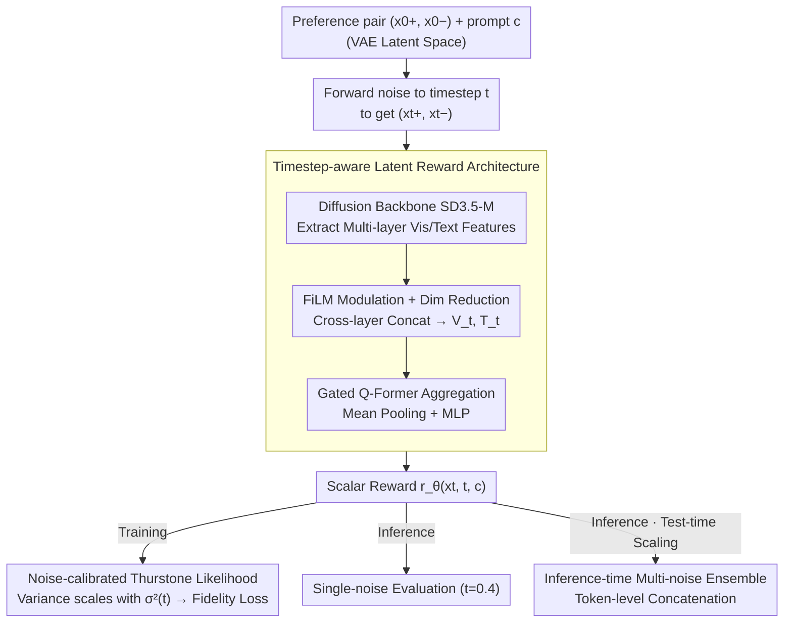

# Beyond VLM-Based Rewards: Diffusion-Native Latent Reward Modeling

**Conference**: ICML2026  
**arXiv**: [2602.11146](https://arxiv.org/abs/2602.11146)  
**Code**: https://github.com/HKUST-C4G/diffusion-rm  
**Area**: Image Generation  
**Keywords**: Diffusion Reward Modeling, Preference Alignment, Noise-Calibrated Thurstone, Latent Reward, Test-Time Noise Ensemble

## TL;DR
DiNa-LRM is proposed to establish preference learning directly on the noisy latent space of diffusion models. Through noise-calibrated Thurstone likelihood and inference-time multi-noise ensembles, it achieves preference prediction accuracy close to SOTA with significantly lower computational overhead than VLM-based reward models.

## Background & Motivation

**Background**: Preference alignment for Diffusion/Flow-Matching models (e.g., ReFL, DPO, GRPO) relies on reward models to provide supervision signals. Current mainstream practices utilize VLMs (e.g., Qwen2VL-7B) as reward backbones to score generated images in pixel space.

**Limitations of Prior Work**: VLM-based reward models face two core issues. First, the computational and memory costs are prohibitive, as reward evaluation is repeatedly invoked during alignment training. Second, there is a **latent-to-pixel mismatch** between latent-space diffusion generators and pixel-space VLM rewards, necessitating extra VAE decoding steps and complicating reward-gradient-based alignment methods.

**Key Challenge**: While pre-training of diffusion models captures rich discriminative representations (proven transferable to classification and adversarial discrimination), existing works have not fully exploited their potential as general-purpose reward models—especially in "scoring clean samples" scenarios identical to VLMs.

**Goal**: Construct a reward model operating directly in the diffusion latent space that (1) achieves preference prediction accuracy close to VLMs, (2) is more memory and computation efficient during alignment training, and (3) provides a robust scoring mechanism scalable at inference time.

**Key Insight**: The authors observe that diffusion models provide multiple "views" of the same sample at different noise levels. Explicitly introducing noise uncertainty calibration into preference modeling allows these complementary views to be leveraged for enhanced robustness.

**Core Idea**: Extend the Thurstone preference model from clean samples to noisy diffusion states, calibrating preference likelihood with comparison uncertainty proportional to the noise level, and achieving test-time scaling through multi-noise integration during inference.

## Method

### Overall Architecture
The input consists of a preference pair $(\bm{x}_0^+, \bm{x}_0^-)$ with a text prompt $\bm{c}$ (in VAE latent space), which is transformed into noisy states $(\bm{x}_t^+, \bm{x}_t^-)$ via forward diffusion. A pre-trained diffusion backbone (SD3.5-Medium) extracts multi-layer visual/textual features, which are modulated by timestep embeddings via FiLM and fed into a gated Q-Former scoring head to output a scalar reward $r_\theta(\bm{x}_t, t, \bm{c})$. This "noising → backbone feature extraction → Q-Former scoring" pipeline serves as the **timestep-aware latent reward architecture**. The resulting rewards are used with a **noise-calibrated Thurstone likelihood** and Fidelity Loss during training, while inference supports single-noise evaluation or **inference-time multi-noise ensembles** for test-time scaling.

### Key Designs

**1. Noise-Calibrated Thurstone Preference Modeling: Aligning RM Input with Diffusion Pre-training**

Diffusion backbones are pre-trained on noisy states, whereas standard preference modeling learns from clean samples $\bm{x}_0$, leading to distribution shift. This work extends the Thurstone model to noisy states: the comparison uncertainty of perceived quality $u = r_\theta(\bm{x}_0, \bm{c}) + \eta$ is no longer constant but defined as a function of the noise level $\sigma_u^2(t) = k \cdot \sigma^2(t) + \sigma_u^2$ (with $k=2, \sigma_u=0.1$). Thus, the preference probability becomes:

$$\mathbb{P}(\bm{x}_t^+ \succ \bm{x}_t^-) = \Phi\Big(\frac{r_\theta(\bm{x}_t^+, t, \bm{c}) - r_\theta(\bm{x}_t^-, t, \bm{c})}{\sqrt{2\sigma_u^2(t)}}\Big)$$

Higher noise increases the denominator, making the likelihood more conservative to prevent uninformative gradients from destabilizing training. This step not only aligns the input distribution but also enables the model to learn diverse features across noise levels—ablations show this noise-calibrated variance is a core contribution (HPDv2 78.72 → 82.13) and a prerequisite for ensemble gains.

**2. Timestep-aware Latent Reward Architecture: Aggregating Multi-layer Features**

The reward head must perceive noise levels and support variable-length inputs for ensembles. Visual and text token features are extracted from selected backbone layers $\mathcal{S}$. Each layer undergoes FiLM modulation based on timestep embeddings $t_{\text{emb}}$ to make the noise level explicit. After projection into a low-dimensional subspace, features are concatenated into sequences $\mathbf{V}_t$ and $\mathbf{T}_t$. $N_q$ learnable query tokens aggregate these via value-gated cross-attention, followed by an FFN, mean pooling, and an MLP to output $r_\theta = \text{MLP}(\text{Pool}(\tilde{\mathbf{Q}}))$. This query-based architecture inherently accommodates variable input lengths, facilitating token-level ensembles.

**3. Inference-time Multi-noise Ensemble: Diffusion Multi-noise Views as Test-time Scaling**

Diffusion models offer different "views" at various noise levels: low noise preserves details, while high noise captures global semantics. During inference, the clean sample $\bm{x}_0$ is noised at $K$ timesteps $\{t_k\}_{k=1}^K$. Features from all timesteps are concatenated into $\mathbf{V}_{\text{ensemble}} \in \mathbb{R}^{(K \times N_v) \times C}$ and processed by the Q-Former in a single pass (default $t \in \{0.2, 0.5, 0.7\}$). Performing **token-level concatenation** rather than score averaging allows the Q-Former to learn cross-noise attention weights, which is more flexible than fixed averaging and contributes to higher accuracy (HPDv2 84.31). This serves as a test-time scaling knob to exchange computation for scoring stability.

### Training Strategy
Optimization uses the Fidelity Loss $\mathcal{L}_{\text{fid}} = \mathbb{E}[1 - \sqrt{y\hat{p}_\theta + (1-y)(1-\hat{p}_\theta)}]$ with timesteps sampled from $\mathcal{U}(0,1)$. Training is performed for 1 epoch on the HPDv3 dataset (~0.8M pairs) using 8 GPUs, AdamW (lr=$5 \times 10^{-5}$), and EMA decay of 0.995. The backbone is fine-tuned using LoRA.

## Key Experimental Results

### Main Results

| Category | Model | Backbone | ImageReward | HPDv2 | HPDv3 | GenAI-Bench | Average |
|---------|------|------|-------------|-------|-------|-------------|------|
| CLIP-based | MPS | CLIP | 66.37 | 83.27 | 64.33 | 68.08 | 70.51 |
| VLM-based | HPSv3 | Qwen2VL-7B | 67.03 | **85.36** | **76.03** | **70.95** | **74.84** |
| VLM-based | UnifiedReward | LLaVA-OV-7B | 63.82 | 83.10 | 71.96 | 72.38 | 72.81 |
| Diffusion-based | LRM-SDXL | SDXL | 60.35 | 71.19 | 53.80 | 61.58 | 61.73 |
| Diffusion-based | **DiNa-LRM** | SD3.5-M-2B | 60.34 | 82.13 | 75.04 | 68.43 | 71.49 |
| Diffusion-based | **DiNa-LRM*** | SD3.5-M-2B | 61.75 | 84.31 | 74.86 | 68.98 | **72.48** |

DiNa-LRM improves the average accuracy by **+9.76%** over the previous diffusion reward baseline (LRM-SDXL) and approaches the strongest VLM reward, HPSv3 (72.48 vs 74.84).

### Ablation Study

| Configuration | HPDv2 | HPDv3 | GenAI-Bench | Average |
|------|-------|-------|-------------|------|
| Uniform + Noise-Calibrated (Full) | 82.13 | 75.04 | 68.43 | 71.49 |
| Uniform + Fixed variance | 78.72 | 75.11 | 68.01 | 70.68 |
| Const $t=0$ + Fixed | 59.20 | 74.37 | 67.55 | 64.93 |
| Uniform + Noise-Calibrated + Ensemble | **84.31** | 74.86 | **68.98** | **72.48** |
| Freeze backbone (No LoRA) | — | 73.52 | 67.09 | 70.27 |

### Efficiency Analysis (ReFL on SD3.5-M, 1024×1024)

| Metric | HPSv3 (VLM) | DiNa-LRM | Gain |
|------|-------------|----------|------|
| Peak Memory | ~40 GB | ~19.4 GB | **51.4%** |
| Reward TFLOPS | ~8.5 | ~2.5 | **71.1%** |
| Optimization TFLOPS | ~14 | ~7.5 | **46.4%** |

### Key Findings
- **Noise-calibrated variance is critical**: Accuracy increases from 78.72 to 82.13 (+3.4%) on HPDv2, and reaches 84.31 (+6.2%) after ensemble, suggesting that noise-aware uncertainty modeling forces the model to learn complementary features across timesteps.
- Optimal inference noise levels are within $t \in [0.3, 0.7]$. Accuracy drops if samples are too clean ($t=0$) or too noisy ($t=0.8$).
- Distributed timestep sampling (Uniform/LogitNormal) significantly outperforms fixed-timestep training, raising average accuracy from ~65% to ~71%.
- During ReFL alignment, DiNa-LRM proxy scores converge faster and correlate well with gold-standard metrics (PickScore) without obvious reward hacking.

## Highlights & Insights
- **Feasibility of Diffusion as General Reward Backbones**: Demonstrates that diffusion pre-trained representations are highly capable of preference discrimination, enabling a "one backbone, two tasks" paradigm where the alignment pipeline remains entirely within the latent space.
- **Elegance of Noise-Calibrated Thurstone**: Unifies diffusion noise scheduling and preference uncertainty modeling through a simple linear relationship $\sigma_u^2(t) = k\sigma^2(t) + \sigma_u^2$.
- **Token-level Ensemble Superiority**: Aggregating features via Q-Former attention rather than simple score averaging is more effective and can be transferred to other multi-view discriminative tasks.

## Limitations & Future Work
- Rewards are learned and evaluated in specific latent spaces, limiting cross-backbone transferability (e.g., SD3.5 to FLUX requires retraining).
- Latent modeling may overlook certain pixel-level artifacts (e.g., texture distortion), potentially leading to reward hacking (style drift or hallucination) during long-range optimization.
- Accuracy on the ImageReward dataset (~61%) remains lower than VLM methods (~67%), suggesting gaps in certain semantic understanding capabilities.
- Future work: (1) Training on stronger unified backbones, (2) adding lightweight pixel-space regularization, (3) exploring generative or dense reward modeling.

## Related Work & Insights
- **CLIP-based RM** (ImageReward, PickScore): Computationally efficient but capped by CLIP's representation limits.
- **VLM-based RM** (HPSv3, UnifiedReward): High accuracy but expensive and limited to pixel-space.
- **Diffusion Discriminative Representations**: Prior works prove diffusion features are transferable to tasks like classification.
- **LRM (Zhang et al., 2025)**: Concurrent work focusing on step-level rewards for trajectory optimization, whereas DiNa-LRM targets clean sample scoring for general preference alignment.

<!-- RELATED:START -->

## Related Papers

- [\[ICML 2026\] Mitigating Perceptual Judgment Bias in Multimodal LLM-as-a-Judge via Perceptual Perturbation and Reward Modeling](mitigating_perceptual_judgment_bias_in_multimodal_llm-as-a-judge_via_perceptual_.md)
- [\[ICLR 2026\] GLYPH-SR: Can We Achieve Both High-Quality Image Super-Resolution and High-Fidelity Text Recovery via VLM-Guided Latent Diffusion Model?](../../ICLR2026/multimodal_vlm/glyph-sr_can_we_achieve_both_high-quality_image_super-resolution_and_high-fideli.md)
- [\[CVPR 2026\] Beyond Missing Modalities: Hypergraph Guided Diffusion for Uncertainty-Aware Multimodal Emotion Recognition](../../CVPR2026/multimodal_vlm/beyond_missing_modalities_hypergraph_conditioned_diffusion_for_uncertainty-aware.md)
- [\[CVPR 2026\] VLM-Guided Group Preference Alignment for Diffusion-based Human Mesh Recovery](../../CVPR2026/multimodal_vlm/vlm-guided_group_preference_alignment_for_diffusion-based_human_mesh_recovery.md)
- [\[ICML 2026\] Conditional Diffusion Sampling](conditional_diffusion_sampling.md)

<!-- RELATED:END -->
