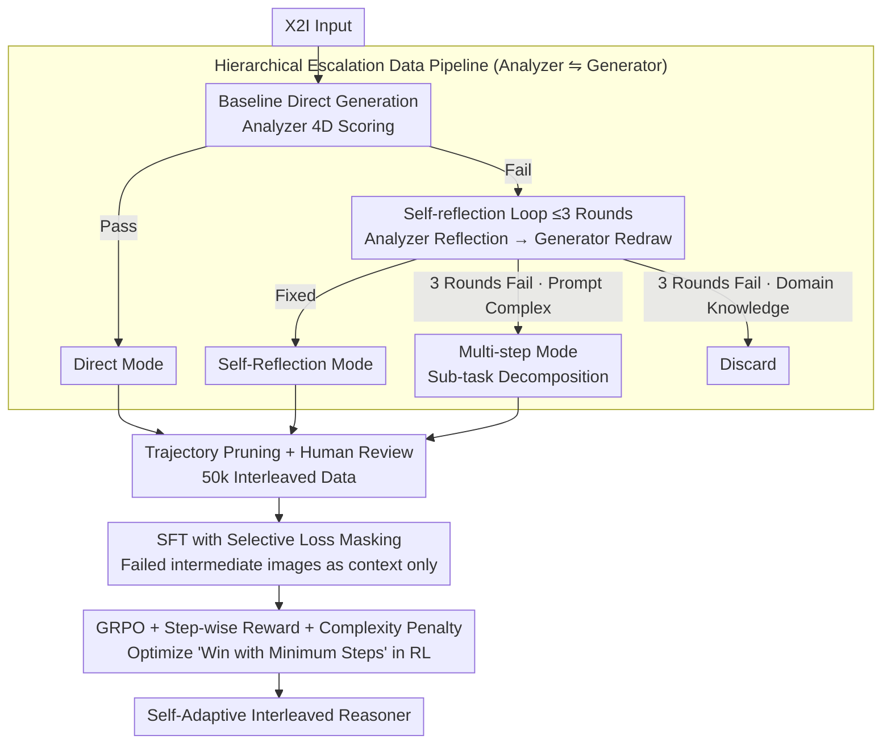

# Breaking Dual Bottlenecks: Evolving Unified Multimodal Models into Self-Adaptive Interleaved Visual Reasoners

**Conference**: ICML 2026  
**arXiv**: [2605.14709](https://arxiv.org/abs/2605.14709)  
**Code**: GitHub (Available, noted as "released at GitHub" in the paper but no specific URL provided)  
**Area**: Multimodal VLM / Unified Models / Reinforcement Learning  
**Keywords**: Unified Multimodal Models, X2I, Interleaved Reasoning, GRPO, Self-adaptive Planning  

## TL;DR
To address the "understanding–generation gap" (capable of understanding but failing to generate) in unified multimodal models for anything-to-image (X2I) tasks, this paper proposes the Self-Adaptive Interleaved Reasoner. Using a hierarchical data synthesis pipeline, 50,000 samples are diverted into three modes: direct generation, self-reflection, and multi-step planning. By employing SFT and GRPO training with step-wise reasoning rewards and intra-group complexity penalties, Emu3.5 outperforms closed-source models such as GPT-4o and Gemini 2.5 Flash on KRIS-Bench and OmniContext.

## Background & Motivation

**Background**: Unified multimodal models (e.g., Emu3.5, BAGEL, OmniGen) can perform both understanding and generation within a single framework and have begun incorporating CoT-style interleaved reasoning for X2I (arbitrary conditions → image) tasks.

**Limitations of Prior Work**: The authors attribute the failure of unified models in complex X2I tasks to an "understanding–generation gap," decomposed into two specific bottlenecks: (i) **attention entanglement bottleneck**—direct one-pass generation for complex prompts almost inevitably fails, necessitating a step-by-step approach. However, existing Plan-then-Generate methods perform "blind planning," where the planner is unaware of the generator's actual capabilities, often leading to infeasible plans. (ii) **visual refinement bottleneck**—single-pass pixel synthesis often contains flaws, requiring further reflection and repair. However, existing Generate-then-Reflect methods mix "what is wrong" and "how to fix it" in unstructured text, which is inefficient for composite errors and often relies on frequent switching between multiple models, causing inference costs to soar.

**Key Challenge**: Both strategies (Plan-then-Generate and Generate-then-Reflect) only solve one bottleneck and follow fixed workflows. Given the high variance in instruction complexity, applying a single mode leads to either over-reasoning for simple prompts or under-reasoning for complex ones. No existing method can "adaptively select the mode based on prompt complexity."

**Goal**: To train a unified model capable of autonomously switching between "direct generation, reflection-correction, and multi-step planning" based on instruction complexity and its own capabilities, maintaining efficiency without relying on external models.

**Key Insight**: First, a hierarchical escalation data pipeline automatically categorizes prompts of varying complexity into the three modes. Then, SFT teaches the model the syntax, and finally, RL teaches the strategy (when each mode is most cost-effective).

**Core Idea**: Formulate "when to think harder" as a reinforcement learning objective for autonomous model decision-making—using step-wise rewards to ensure logical reasoning and intra-group complexity penalties to suppress over-reasoning for marginal gains.

## Method

### Overall Architecture
A two-stage pipeline: **(A) Data Construction**—Given raw X2I inputs, the baseline unified model generates an initial result. Qwen3-VL-235B (Analyzer) scores it across four dimensions: "instruction, consistency, quality, and common sense." If it passes, it is categorized as *Direct*. If not, it enters a self-reflection loop (max 3 rounds), where the Analyzer writes reflection prompts and Gemini-3-Pro-Image acts as the Generator for redrawing. If it still fails after 3 rounds, the Analyzer diagnoses the cause; if the cause is "prompt too complex," it escalates to *Multi-step* mode (decomposing sub-tasks for step-by-step execution + intermediate evaluation); otherwise (e.g., lacking domain knowledge), it is discarded. After human review, 50,000 high-quality interleaved samples are obtained. **(B) Training**—SFT adapts to interleaved reasoning syntax with selective loss masking to skip failed intermediate images. GRPO strengthens strategy selection, with rewards weighted by Outcome, Format, and Step-wise reasoning, plus an intra-group complexity penalty to encourage "winning with fewer steps."

### Key Designs

**1. Hierarchical Escalation Data Pipeline (Analyzer ⇋ Generator): Demonstrating "Mode Selection by Complexity"**

For the model to learn adaptive mode selection, the training data must demonstrate the three modes categorized by difficulty. The authors built an automated escalation pipeline: Qwen3-VL-235B serves as "judge, diagnostician, and planner," while Gemini-3-Pro-Image acts as the generator. Each X2I sample is first generated directly and scored across dimensions (instruction, consistency, quality, common sense). Successful cases are marked as *Direct*. Failures enter up to 3 rounds of self-reflection; if fixed, they are categorized as *Self-Reflection*. For persistent failures, the Analyzer diagnoses the cause—if it is "prompt too complex," the sample escalates to *Multi-step* (sub-task decomposition + step-wise evaluation). Successful multi-step trajectories undergo pruning to remove failed reflection attempts, leaving clean "failed direct trial → sub-task decomposition → step-by-step execution" trajectories. This ensures the model learns to output directly for simple prompts, reflect for medium ones, and decompose for complex ones.

**2. SFT with Selective Loss Masking: Failed Intermediate Images as "Context" not "Targets"**

Multi-step trajectories contain numerous failed intermediate images. If standard SFT AR-NLL calculates loss on these, it teaches the model "how to generate low-quality images," harming fidelity. The authors apply loss only to selected subsequences $\mathcal{O}$: *Direct* mode calculates $\{G_1, E_1\}$; *Self-Reflection* mode calculates only the final diagnosis $E_{K-1}$, reflection prompt $R_{K-1}$, and final successful image $G_K, E_K$, masking all prior failures; *Multi-step* mode calculates $E_1$ plus the full planned sequence $\{S_i, G_i, E_i\}$. Consequently, failure information serves only as textual context for "reflection," while pixel-level artifacts are never imitated as generation goals.

**3. GRPO + Step-wise Reasoning Reward + Intra-group Complexity Penalty: Optimizing "Win with Minimum Steps"**

SFT teaches syntax, but "when to think more" is a strategic issue addressed via RL. The composite reward $\mathcal{R}_{\text{total}}=\alpha_1\mathcal{R}_o+\alpha_2\mathcal{R}_f+\alpha_3\mathcal{R}_s$ includes an outcome reward $\mathcal{R}_o$, a format binary reward $\mathcal{R}_f$, and a dense reasoning reward $\mathcal{R}_s=\frac{1}{T}\sum_t \text{Analyzer}(\text{text}_t)$ for each segment of intermediate text. To prevent over-reasoning induced by pure outcome rewards, the authors introduce the **intra-group complexity penalty**: within a set of sampled trajectories, a subset with "near-highest rewards" (within threshold $\epsilon$) is selected and scaled by the image count $N_{\text{img}}^*/N_{\text{img}}^i$. Trajectories achieving equivalent results with fewer images receive higher scores. This makes "winning the same score with minimum steps" an implicit optimization goal, naturally leaving simple prompts to *Direct* and reserved *Multi-step* for complex ones.

### Loss & Training
SFT: Standard AR-NLL on subset $\mathcal{O}$ (Eq. 1). RL: GRPO policy + composite rewards (Eq. 2–5). Backbone = Emu3.5; RL data = 50k samples from UnicEdit-10M / X2Edit / AnyEdit / Pick-a-Pic / UltraEdit.

## Key Experimental Results

### Main Results

| Benchmark | GPT-4o | Gemini 2.5 Flash | Emu3.5 (vanilla) | Ours |
|---|---|---|---|---|
| KRIS-Bench Overall | 80.09 | 77.29 | 73.75 | **80.18** |
| KRIS Procedural | 78.32 | 75.93 | 71.14 | **85.53** |
| KRIS Factual | 79.80 | 77.03 | 78.59 | **84.24** |
| OmniContext Avg. | 8.80 | 7.84 | 8.82 | **9.35** |
| GenEval | – | – | 0.86 | **0.89** |

### Ablation Study

| Configuration | GenEval | KRIS | Omni | Avg. Imgs |
|---|---|---|---|---|
| Direct Only | 0.86 | 75.16 | 8.89 | – |
| w/o Reflection | 0.86 | 75.21 | 9.03 | – |
| w/o Multi-step | 0.87 | 77.24 | 8.95 | – |
| Full Mix (SFT) | 0.88 | 78.24 | 9.15 | – |
| SFT Only (50k) | 0.86 | 79.16 | 9.12 | 2.45 |
| w/o Step-wise Reward | 0.88 | 79.65 | 9.25 | 1.62 |
| w/o Complexity Penalty | 0.89 | 80.25 | 9.38 | 2.73 |
| SFT + RL (Full) | **0.89** | **80.18** | **9.35** | **1.56** |

### Key Findings
- Removing Reflection drops KRIS by 3 points (78.24 → 75.21); removing Multi-step drops Omni by 0.2 (9.15 → 8.95). Each mode handles distinct issues (quality repair vs. complex multi-subject) and cannot replace the other.
- Removing the intra-group complexity penalty spikes the average image count from 1.56 to 2.73 (+75%), while Omni scores barely improve (9.38), confirming its role in suppressing over-reasoning.
- Moving from SFT to SFT+RL reduces avg. images from 2.45 to 1.56 while improving quality, proving RL learns "winning with fewer steps."
- Gain is most significant in complex multi-subject scenes like OmniContext’s Multiple/Scene (9.56/9.44 vs Emu3.5's 8.65/8.78), validating the planning mode against "attention entanglement."

## Highlights & Insights
- Upgrades "when to think more" to an optimizable strategy and uses an intra-group complexity penalty to integrate efficiency into RL signals—a rare explicit modeling of both quality and efficiency in generation reasoning.
- The data pipeline uses an Analyzer ⇋ Generator dual-LLM automated escalation, creating a scalable pipeline for complexity-based branching that does not rely on fixed templates.
- Selective loss masking is a critical trick; in multi-step tasks involving intermediate failures, including those steps in NLL directly determines whether the final model is contaminated by failure samples.

## Limitations & Future Work
- Heavy reliance on closed-source models (Qwen3-VL-235B and Gemini-3-Pro-Image) for data construction and step-wise rewards, making reproduction costly and potentially transferring Analyzer bias.
- Evaluated only on X2I editing/synthesis tasks; applicability to longer-horizon tasks like video or 3D generation is unverified.
- The hard 3-round threshold for escalating from reflection to multi-step might skip medium-complexity cases that could be fixed in 4-5 rounds; learned confidence could replace fixed thresholds.

## Related Work & Insights
- **vs. Plan-then-Generate (Uni-CoT / Echo-4o)**: These use static text planning; Ours performs both reflection and planning with RL-based mode selection, gaining +1.1–1.5 points on OmniContext.
- **vs. Generate-then-Reflect (VACoT)**: These use iterative reflection without explicit planning; Ours separates "analysis" and "improvement" and adds multi-step planning for complex prompts.
- **vs. Emu3.5**: Comparing vanilla Emu3.5 (0.86 / 73.75 / 8.82) to Ours (0.89 / 80.18 / 9.35) demonstrates that "adaptive strategy" is a valid next dimension for unified model gains.

## Rating
- Novelty: ⭐⭐⭐⭐ First to formulate "adaptive mode selection" as an explicit RL optimization goal with a clever complexity penalty; individual components are known but the synthesis is new.
- Experimental Thoroughness: ⭐⭐⭐⭐ Covers GenEval, KRIS-Bench, and OmniContext with detailed ablations on data modes and RL components, including efficiency metrics.
- Writing Quality: ⭐⭐⭐⭐ Clear narrative (gap → bottlenecks → adaptive solution) with effective figures for comparison, data, and RL structure.
- Value: ⭐⭐⭐⭐⭐ Surpasses GPT-4o on KRIS-Bench using the open-source Emu3.5, providing a clear "strategy learning via RL" path for the unified model community.

<!-- RELATED:START -->

## Related Papers

- [\[CVPR 2026\] VisPlay: Self-Evolving Vision-Language Models](../../CVPR2026/multimodal_vlm/visplay_self-evolving_vision-language_models.md)
- [\[ICML 2026\] DIVA: Harnessing the Representation Divergence in Unified Multimodal Models for Mutual Reinforcement](diva_harnessing_the_representation_divergence_in_unified_multimodal_models_for_m.md)
- [\[CVPR 2026\] EvoLMM: Self-Evolving Large Multimodal Models with Continuous Rewards](../../CVPR2026/multimodal_vlm/evolmm_self_evolving_lmm_continuous_rewards.md)
- [\[ICCV 2025\] Iris: Breaking GUI Complexity with Adaptive Focus and Self-Refining](../../ICCV2025/multimodal_vlm/iris_breaking_gui_complexity_with_adaptive_focus_and_self-refining.md)
- [\[CVPR 2026\] TUNA: Taming Unified Visual Representations for Native Unified Multimodal Models](../../CVPR2026/multimodal_vlm/tuna_taming_unified_visual_representations_for_native_unified_multimodal_models.md)

<!-- RELATED:END -->
