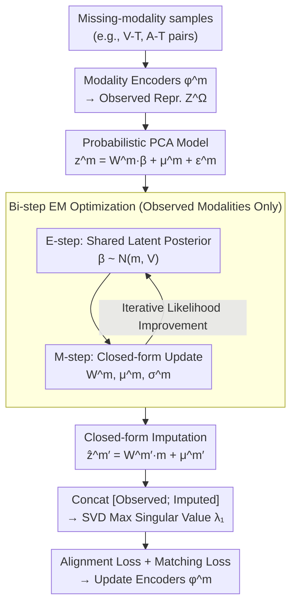

# Calibrated Multimodal Representation Learning with Missing Modalities

**Conference**: ICML 2026  
**arXiv**: [2511.12034](https://arxiv.org/abs/2511.12034)  
**Code**: https://github.com/Xiaohao-Liu/CalMRL (Available)  
**Area**: Multimodal VLM / Representation Learning / Missing Modalities  
**Keywords**: Multimodal Alignment, Missing Modality, anchor shift, Probabilistic PCA, EM Algorithm

## TL;DR
Addressing the practical scenario of "training unified multimodal alignment using partial modality data such as V-T and A-T," this paper derives theoretical upper and lower bounds for "anchor shift" caused by missing modalities using singular value perturbation theory. It proposes CalMRL: a Probabilistic PCA-style generative model performs closed-form EM imputation for missing modalities in the representation space. The observed and imputed representations are jointly fed into the SVD alignment objective of GRAM/PMRL. On the VAST benchmark, the cross-modal average Recall@1 is improved from 44.8 to 54.2 (+9.4).

## Background & Motivation

**Background**: Multimodal alignment, starting from CLIP, has evolved into systems like ImageBind / LanguageBind / VAST / GRAM / TRIANGLE / PMRL. These recent methods use geometric tools such as the "maximum singular value of the GRAM matrix" to align all modalities simultaneously to a virtual anchor, achieving stronger multimodal synergy than pair-wise alignment.

**Limitations of Prior Work**: Existing "simultaneous alignment" methods assume that **all modalities are present** in every training sample. However, in reality, most public datasets only contain two modalities: ImageNet has only vision+text, Audioset has only audio+text, and while VAST has four modalities, it only contains 150K samples. To utilize "incomplete data" like V-T or A-T, previous works often fix an anchor (vision or text) and bind other modalities to it, which limits the alignment performance to the capacity of the anchor modality.

**Key Challenge**: When all modalities are present, the alignment anchor acts as a "virtual center" in the modality space. When a modality is missing, the observed modalities can only align to a **local anchor**, leading to an inevitable offset from the full-modality anchor—termed **anchor shift** by the authors. This is essentially a "geometric center deviation caused by uneven sampling."

**Goal**: To find a **computationally inexpensive, theoretically guaranteed, and demonstrably convergent** way to impute reasonable representations for missing modalities in training data, minimizing the anchor shift.

**Key Insight**: Humans can associate missing information based on priors even when a modality is not perceived. This inspires the authors to use a generative model leveraging "observed modalities + intrinsic inter-modal relationships" for representation-level imputation, rather than complex pixel-level or token-level synthesis.

**Core Idea**: Modeling the probability distribution of missing modalities in the representation space as a shared latent variable $\beta$ plus modality-specific noise in a Probabilistic PCA form $\rightarrow$ Optimizing via a two-step iteration (closed-form posterior in E-step, closed-form parameters in M-step) $\rightarrow$ Performing closed-form completion during inference as $\widehat{\mathbf z}^{m'}=\mathbf W^{m'}\mathbf m+\boldsymbol\mu^{m'}$ $\rightarrow$ Concatenating completed and observed representations for the PMRL SVD alignment objective.

## Method

### Overall Architecture
The framework consists of a two-layer structure: **(1) Generative Model**: Assumes for each modality $m$ that $\mathbf{z}^m=\mathbf{W}^m\bm{\beta}+\bm{\mu}^m+\bm{\epsilon}^m$ ($\bm{\beta}\sim\mathcal{N}(\mathbf{0},\mathbf{I})$, $\bm{\epsilon}^m\sim\mathcal{N}(\mathbf{0},(\sigma^m)^2\mathbf{I})$), where all modalities share a latent variable $\bm{\beta}$, with parameters $\widehat{\bm\theta}=\{\mathbf{W}^m, \bm{\mu}^m, \sigma^m\}_{m\in\mathcal{M}}$; **(2) Representation Learning**: Observed modalities are encoded by their respective encoders $\phi^m_{\bm\theta}$, while missing modalities are completed via closed-form imputation $\widehat{\mathbf{z}}^{m'}=\mathbf{W}^{m'}\mathbf{m}+\bm{\mu}^{m'}$. The joint set $[\mathbf{Z}^\Omega;\widehat{\mathbf{Z}}^{\mathcal{M}/\Omega}]$ is fed into an SVD to extract the maximum singular value $\lambda_1$ as the alignment objective (PMRL style). The methodology is supported by Theorem 1, which characterizes anchor shift—explaining why imputation is necessary.

### Key Designs

**1. Theoretical Characterization of Anchor Shift (Theorem 1): Providing bounds for "how bad missing-modality alignment is"**

To justify why imputation is essential, the authors elevate "missing modality harm" from engineering intuition to mathematical fact. This is achieved using SVD perturbation theory: Let $\mathbf{u}_1, \mathbf{u}_1^\Omega$ be the maximum left singular vectors of the complete modality matrix $\mathbf{Z}$ and the observed sub-matrix $\mathbf{Z}^\Omega$, respectively. Defining $\eta=\sqrt{\sum_{m\in\bar\Omega}\langle\mathbf{u}_1^\Omega,\mathbf{z}^m\rangle^2}$, the anchor shift $\|\mathbf{\Delta}\|=\|\mathbf{u}_1-\mathbf{u}_1^\Omega\|$ is bounded between $\sqrt{2(1-(\sigma_1^\Omega+\eta^2)/\sigma_1)}$ and $\sqrt{2}\|\mathbf{Z}^{\bar\Omega}\|_2/(\sigma_1-\sigma_2)$. Crucially, Corollary 3 defines a sufficient condition where completion reduces shift: as long as the imputation error $\|\widehat{\mathbf{z}}^{m'}-\mathbf{z}^{m'}\|_2\le\varepsilon$ where $\varepsilon<(\sigma_1-\sigma_2)/\sqrt{|\bar\Omega|}\cdot\sqrt{1-(\sigma_1^\Omega+\eta^2)/\sigma_1}$. This threshold guarantees that as long as imputation is not poor, it is beneficial.

**2. Probabilistic PCA Shared Latent Generative Model: Imputing at the representation level with Gaussian models**

While one could use diffusion or flow models to synthesize missing modalities, the cost of retraining large models is prohibitive. The authors focus on representation-level imputation using a simple, analytical form: $\mathbf{z}^m=\mathbf{W}^m\bm{\beta}+\bm{\mu}^m+\bm{\epsilon}^m$. Here, $\bm{\beta}$ captures "inter-modal commonality" and $\bm{\mu}^m$ captures "modality-specific bias," with the independence assumption $\mathbf{x}^m\perp\mathbf{x}^{m'}|\bm{\beta}$. The parameter set $\{\mathbf{W}^m, \bm{\mu}^m, \sigma^m\}$ has negligible capacity compared to the encoders and can be trained concurrently. Its simplicity allows for closed-form EM steps and imputation formulas $\widehat{\mathbf{z}}^{m'}=\mathbf{W}^{m'}\mathbf{m}+\bm{\mu}^{m'}$.

**3. Bi-step (EM) Closed-form Optimization: Gradual solution under parameter coupling**

The shared latent variable $\bm{\beta}$ couples parameters across modalities, which standard Probabilistic PCA cannot handle. The authors use a variational lower bound and EM-style optimization. **E-step**: Fix $\widehat{\bm\theta}$ to find the posterior $p(\bm{\beta}\mid\mathbf{z},\widehat{\bm\theta})=\mathcal{N}(\mathbf{m},\mathbf{V})$, where $\mathbf{V}=[\mathbf{I}+\sum_{m\in\Omega}(\sigma^m)^{-2}\mathbf{W}^{m\top}\mathbf{W}^m]^{-1}$ and $\mathbf{m}=\mathbf{V}\sum_{m\in\Omega}(\sigma^m)^{-2}\mathbf{W}^{m\top}(\mathbf{z}^m-\bm{\mu}^m)$. The summation **only traverses observed modalities**, fitting the reality of incomplete training data. **M-step**: Updates $\bm{\mu}^m, \mathbf{W}^m, (\sigma^m)^2$ given the posterior. Corollary 4 proves convergence via EM monotonicity. Each step has a closed-form solution, ensuring minimal training overhead.

### Loss & Training
The final loss for the encoders (Eq. 9) is: $\mathcal{L}_{\text{rep}}=-\frac{1}{N}\sum_i[\text{exp}(\lambda_1/\tau)/\sum_j\text{exp}(\lambda_j/\tau)+\text{instance-uniformity}] +\alpha\cdot \text{BCE matching loss}$. The first term maximizes the maximum singular value of the GRAM matrix for "global alignment." The second term is an instance-level regularizer for $\mathbf{u}_1$. The matching loss ($\alpha=0.1$) is computed only on observed modalities. The backbone is VAST (vision+caption+audio+subtitle); training includes a VAST-150K warm-up followed by continual training on MSR-VTT (V-T) and AudioCaps (A-T).

## Key Experimental Results

### Main Results (Table 1, Recall@1, ↑ signifies continual training on missing data)

| Method | MSR-VTT (T→V/V→T) | AudioCaps (T→A/A→T) | Avg. |
|---|---|---|---|
| VAST (baseline) | 50.5 / 49.0 | 33.7 / 32.2 | 44.8 |
| GRAM↑ | 59.7 / 57.2 | 49.1 / 51.7 | 52.9 |
| TRIANGLE↑ | 57.6 / 58.4 | 48.3 / 51.7 | 51.6 |
| PMRL↑ | 60.1 / 59.2 | 50.4 / 52.0 | 53.8 |
| **CalMRL↑** | **61.1 / 61.1** | **50.1 / 51.0** | **54.2 (+9.4)** |

(Classification Results Table 2: CalMRL average 45.19, superior to PMRL 44.04 and ImageBind 42.08.)

### Ablation Study (Based on MSR-VTT V-T fine-tuning, simplified)

| Configuration | Key Metric | Description |
|---|---|---|
| Observed-only alignment (PMRL↑) | Avg 53.8 / High shift | No imputation, baseline |
| CalMRL Completion (Full) | **Avg 54.2 / Low shift** | Full method |
| Random Noise Completion (Random) | High MSE | Imputation effectiveness is not random |
| Complete Modality (oracle) | 5↑ | "Ideal" upper bound for reference |

Figure 4 visualizes anchor shift $\|\mathbf{\Delta}\|$ (w/o calibration vs. w/ calibration): CalMRL significantly reduces shift, and Figure 5 shows CalMRL performance approaches the ideal upper bound of full-modality training.

### Key Findings
- In settings where only one type of modality is supplemented (V-T or A-T), CalMRL significantly outperforms PMRL/GRAM/TRIANGLE, indicating that the gain from imputation for SVD alignment is genuine.
- Figure 3 (MSE between real and imputed): The MSE of imputed representations is significantly lower than the "random" baseline, verifying that the generative model learns inter-modal mappings.
- Figure 4 & 5: Anchor shift narrows significantly after calibration; calibrated performance nears the "full-modality ideal," confirming the validity of Corollary 3.

## Highlights & Insights
- This work is the first to rigorously define "why missing-modality alignment fails" using SVD perturbation theory (Davis–Kahan style), providing an analytical framework for future research.
- Utilizing "classical" Probabilistic PCA for imputation effectively serves the need for representation-level completion without heavy generative model training; closed-form EM steps ensure zero additional training overhead.
- The EM logic of "using observed to compute posterior, and posterior to impute missing" is transferable to any scenario where alignment anchors are polluted by sampling bias, such as imbalanced contrastive learning or multi-task representation learning.

## Limitations & Future Work
- Assuming Gaussian distributions for $\bm{\beta}$ and $\bm{\epsilon}^m$ is a strong simplification for high-dimensional semantic representations; imputation quality may be limited if inter-modal relationships are highly non-linear.
- Solving for the posterior $\mathbf{m}, \mathbf{V}$ requires summation over observed modalities and matrix inversion, which may become costly if the number of modalities $k$ or dimensionality $d$ increases significantly.
- Evaluation only covered V/T/A/Subtitle; its applicability to heterogeneous modalities like IMU or 3D point clouds remains unverified.
- The imputation error bound $\varepsilon$ is based on average MSE; there is no explicit protection against alignment collapse caused by specific "outlier prompt" imputation failures.

## Related Work & Insights
- **vs ImageBind / LanguageBind**: These methods fix an anchor modality and freeze its encoder, limited by that modality's capacity. CalMRL does not fix an anchor and completes missing modalities for global alignment.
- **vs PMRL / GRAM**: While these also use SVD-based alignment, they require full modalities. CalMRL extends this to missing-modality scenarios, achieving +0.4–2 Recall@1 in V-T fine-tuning.
- **vs CCA**: Traditional CCA uses SVD but is pair-wise. CalMRL performs joint multimodal alignment with completion, theoretically covering any $|\Omega|<k$.

## Rating
- Novelty: ⭐⭐⭐⭐ Singular value perturbation analysis for anchor shift is a fresh perspective; using Probabilistic PCA for imputation is simple yet effective.
- Experimental Thoroughness: ⭐⭐⭐⭐ Covers 6 retrieval and 4 classification datasets with single/dual modality fine-tuning; however, expansion to more modalities (e.g., IMU) is not tested.
- Writing Quality: ⭐⭐⭐⭐⭐ Logical progression from anchor shift intuition to theorems, EM optimization, and convergence proofs; Figure 1 clarifies the core problem excellently.
- Value: ⭐⭐⭐⭐ Enables simultaneous alignment methods to leverage vast "dual-modality only" datasets like ImageNet and AudioCaps, potentially scaling unified multimodal pre-training.

<!-- RELATED:START -->

## Related Papers

- [\[CVPR 2026\] DPL: Decoupled Prototype Learning for Enhancing Robustness of Vision-Language Transformers to Missing Modalities](../../CVPR2026/multimodal_vlm/dpl_decoupled_prototype_learning_for_enhancing_robustness_of_vision-language_tra.md)
- [\[CVPR 2026\] Beyond Missing Modalities: Hypergraph Guided Diffusion for Uncertainty-Aware Multimodal Emotion Recognition](../../CVPR2026/multimodal_vlm/beyond_missing_modalities_hypergraph_conditioned_diffusion_for_uncertainty-aware.md)
- [\[AAAI 2026\] MCMoE: Completing Missing Modalities with Mixture of Experts for Incomplete Multimodal Action Quality Assessment](../../AAAI2026/multimodal_vlm/mcmoe_completing_missing_modalities_with_mixture_of_experts_for_incomplete_multi.md)
- [\[ICML 2026\] AOEPT: Breaking the Implicit Modality-Reduction Bottleneck in Modality-Missing Prompt Tuning](aoept_breaking_the_implicit_modality-reduction_bottleneck_in_modality-missing_pr.md)
- [\[ICCV 2025\] Synergistic Prompting for Robust Visual Recognition with Missing Modalities](../../ICCV2025/multimodal_vlm/synergistic_prompting_for_robust_visual_recognition_with_missing_modalities.md)

<!-- RELATED:END -->
