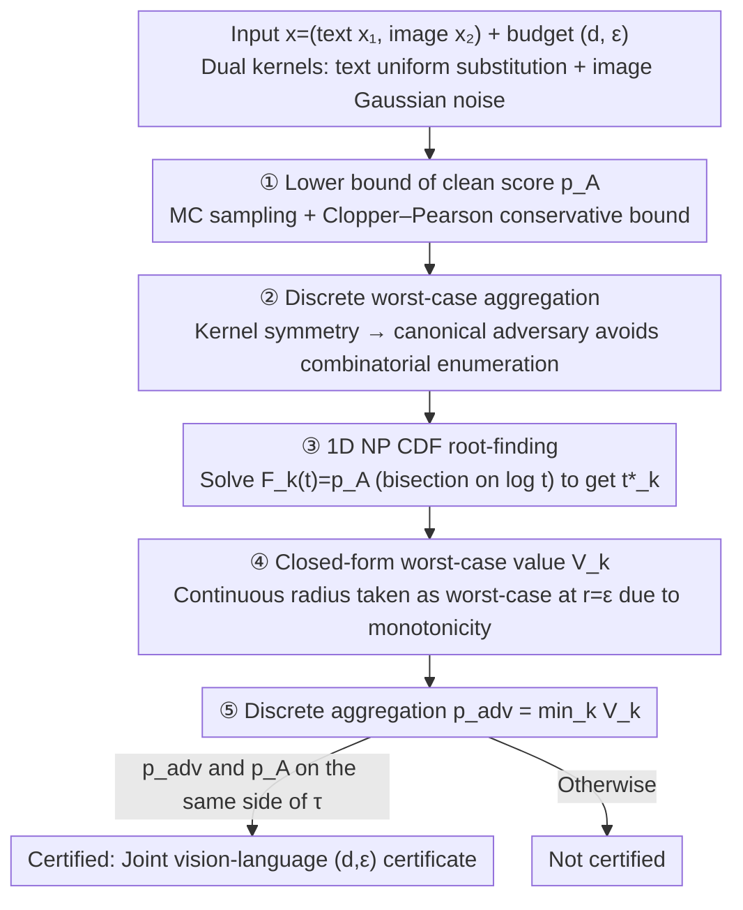

# Certified Robustness under Heterogeneous Perturbations via Hybrid Randomized Smoothing

**Conference**: ICML 2026  
**arXiv**: [2605.12876](https://arxiv.org/abs/2605.12876)  
**Code**: Not explicitly released  
**Area**: Multimodal VLM / Adversarial Robustness / Certified Robustness  
**Keywords**: Randomized Smoothing, Neyman–Pearson, Multimodal Safety Filtering, Hybrid Perturbation Certification, prompt injection

## TL;DR
This paper extends Randomized Smoothing (RS) from scenarios supporting only single continuous or discrete inputs to hybrid perturbation environments involving "discrete tokens + continuous images." By employing a hybrid Neyman–Pearson analysis, the authors derive a **one-dimensional, continuous, and invertible** likelihood ratio CDF. This transforms the combinatorial knapsack problem into a solvable root-finding problem. It provides the first model-agnostic certificate against "jointly unsafe vision-language" inputs on LLaVA-Guard multimodal safety filtering.

## Background & Motivation
**Background**: Randomized Smoothing is currently the most prominent model-agnostic method for robustness certification. In the continuous domain (Cohen 2019), it provides closed-form $\ell_2$ certificates for Gaussian noise. In the discrete domain (Ye 2020, Chen 2025), it requires solving fractional knapsack problems for worst-case likelihood ratios; these two systems have remained largely separate.

**Limitations of Prior Work**: Attacks on modern multimodal systems (VLMs, agents, robot safety) are **cross-modal**—images or text may appear safe in isolation but become unsafe when combined (e.g., Hateful Memes, prompt injection). Simply concatenating unimodal certificates is mathematically incorrect as it lacks a unified joint likelihood ratio framework.

**Key Challenge**: Discrete likelihood ratios are atomic, leading to non-invertible NP decision rules that fail to provide closed-form radii. Conversely, pure Gaussian NP only supports continuous inputs. The joint NP optimal rejection region of their product is fundamentally not a "Cartesian product of two unimodal thresholds" (disproven by the counter-example in Prop. 4.1).

**Goal**: (i) To provide strict NP closed-form certificates under mixed discrete + continuous perturbations; (ii) to offer a monotone, conservative engineering algorithm; (iii) to validate the utility of the certificate on interaction-level multimodal safety filtering tasks.

**Key Insight**: It is observed that as long as the joint likelihood ratio $\gamma(z_1,z_2)=\gamma_1(z_1)\cdot\gamma_2(z_2)$ contains a Gaussian factor, $\log\gamma$ is strictly monotonic in continuous coordinates. This essentially means the "continuous noise smooths out the atomic structure of the discrete likelihood ratio," collapsing the joint NP problem to one dimension.

**Core Idea**: Continuous Gaussian smoothing is used as a "regularizer" to fuse the discrete knapsack problem into a continuous, invertible 1-D CDF $F(t;r)$. The NP threshold $t^\star(r)$ is then solved via 1-D bisection, followed by a worst-case aggregation over the discrete attack space.

## Method

### Overall Architecture
Given input $x=(x_1,x_2)$ (text + image), two independent smoothing kernels are used: text $Z_1\sim p_1(\cdot\mid x_1)$ (uniform/absorbing substitution) and image $Z_2\sim\mathcal{N}(x_2,\sigma^2 I)$. The base classifier $f$ is transformed into a smoothed classifier $g(x)=\mathbb{E}[f(Z_1,Z_2)]$. Given a joint perturbation budget $(d,\epsilon)$ ($\ell_0$ + $\ell_2$), the mixed worst-case probability $p_{\mathrm{adv}}(d,\epsilon)$ is defined. Overall algorithm: ① Estimate the Clopper-Pearson lower bound of the clean $p_A$ via Monte Carlo → ② Enumerate/analyze the worst-case discrete adversary using kernel symmetry → ③ Solve the 1-D NP threshold $t^\star$ for each candidate $x_{1,\mathrm{adv}}$ → ④ Calculate $V_k$ → ⑤ Take the minimum as the final conservative certified value.

### Key Designs

**1. 1-D CDF $F(t;r)$ of Joint Likelihood Ratio: Collapsing Mixed NP Capacity Constraints into a Univariate Continuous Function**

The difficulty of pure discrete NP lies in the atomic nature of the likelihood ratio, where threshold rules cannot exactly match $p_A$, requiring fractional allocation—essentially a combinatorial search + fractional knapsack. The key observation here is that the joint $\log\gamma(z_1,z_2)=\log\gamma_1(z_1)+rz_2-r^2/2$ is additively decomposable. By taking the Gaussian expectation over the continuous dimension $z_2$, the discrete atomic structures are "smoothed" into a continuous scalar. Thus, the capacity constraint is expressed as $F(t;r)=\sum_{z_1} p_1(z_1\mid x_1)\,\Phi\!\big(\tfrac{r^2/2+\sigma^2(\log t-\log\gamma_1(z_1))}{\sigma r}\big)$ (where $\Phi$ is the standard Gaussian CDF and $r$ is the continuous perturbation radius). It is strictly increasing with respect to $t$, so for every $r>0$, there exists a unique $t^\star(r)$ such that $F(t^\star(r);r)=p_A$. The original "combinatorial search + fractional knapsack" collapses into a "bisection over $u=\log t$," solvable within one second on a CPU.

**2. Closed-form Worst-case Probability $V$ + $r=\epsilon$ Monotonicity: Folding Bi-level Infima into "Enumerate Discrete + Solve 1-D Equation"**

Given a discrete adversary $x_{1,\mathrm{adv}}$ and continuous radius $r$, the worst-case smoothed value has a closed form $V(x_{1,\mathrm{adv}};r)=\sum_{z_1} p_1(z_1\mid x_{1,\mathrm{adv}})\,\Phi\!\big(\tfrac{r^2/2+\sigma^2(\log t^\star(r)-\log\gamma_1(z_1))}{\sigma r}-\tfrac{r}{\sigma}\big)$. Since it can be proven that $V$ is monotonically non-increasing with respect to $r$, the continuous worst-case is automatically reached at $r=\epsilon$, resulting in $p_{\mathrm{adv}}(d,\epsilon)=\min_{D_1(x_1,x_{1,\mathrm{adv}})\le d}V(x_{1,\mathrm{adv}};\epsilon)$. This step collapses the bi-level infimum over all $(x_{1,\mathrm{adv}},x_{2,\mathrm{adv}})$ into an enumeration of discrete attacks plus a 1-D equation solution using monotonicity, avoiding any actual search in the continuous space $\mathbb{R}^D$. Monotonicity also provides a certification invariant in $d$, facilitating visualization.

**3. Structurally Symmetric Discrete Kernel + Conservative 1-D Root-finding: Making the Algorithm Only 3x Slower than Image-only RS**

Original NP formulas involve a discrete combinatorial space of $O(|\mathcal{V}|^d)$, which is a critical bottleneck for practicality. This is bypassed using kernel symmetry: under suffix attacks or $\ell_0$ attacks, the $p_1(\cdot\mid x_{1,\mathrm{adv}})$ of uniform/absorbing kernels depends only on the editing budget $d$ rather than specific token identities. Thus, a canonical adversarial input can represent the entire attack set, eliminating the need for combinatorial enumeration. The NP threshold is solved using monotone bisection on $u=\log t$, the clean $p_A$ uses a one-sided Clopper-Pearson conservative bound, and floating-point errors are suppressed by a numerical precision strategy detailed in Appendix A.7. The authors specifically chose the uniform kernel over the absorbing one—the latter degenerates into a two-point distribution with $\beta^d$ exponential decay under suffix attacks—to ensure the certificate is both conservative and non-trivial.

### Loss & Training
This is a **pure certification algorithm** that does not train a base classifier; it is applied directly to frozen models like LLaVA-Guard or linear SVMs. Hyperparameters include $\alpha=0.01$ (CP risk), $n=10^4$ (MC samples), $\beta=0.25$ (token replacement probability), $\sigma\in\{0.5,1.0\}$ (Gaussian variance), and the certification threshold $\tau=4.6\times 10^{-5}$ following Chen 2025a.

## Key Experimental Results

### Main Results

| Method | Image radius $\bar{r}$ | Text budget $\bar{d}$ |
|--------|----------------------|---------------------|
| Image-only RS | 3.99 | 0 |
| Text-only RS | 0 | 3.26 |
| **Hybrid RS (ours)** | **3.76** (at $d=1$) | **3.07** |

The Hybrid certificate yields an image radius only 5.8% lower than the pure image certificate when the text budget $d=1$, and a text budget only 5.8% lower than the pure text certificate, while **simultaneously** providing a joint vision-language guarantee. Unimodal certificates are mathematically unsound on interaction-only datasets. External validation on MM-SafetyBench (1680 samples, 7.5% passing interaction-only filter) yielded $\bar{d}=3.62$ / $\bar{r}=3.37$.

### Ablation Study

| $\beta$ (corruption rate) | Certified examples (%) | Mean $d_{\max}$ | Mean $r^\star(d_{\max})$ |
|--------------------------|-----------------------|-----------------|--------------------------|
| 0.1 | 82.35 | 2.29 | 4.99 |
| **0.25** | **70.59** | **3.07** | **3.21** |
| 0.5 | 58.82 | 4.00 | 3.24 |
| 1.0 | 41.18 | 8.00 | 4.57 |

| Setting | Time/datapoint | Effect |
|---------|---------------|------|
| Image-only RS | ≈156s | Single image radius |
| Hybrid RS, default | ≈500s | Complete $(d,\epsilon)$ frontier |
| Hybrid RS + FlashAttention/batching | ≈0.7× | Same certificate |
| One-shot suffix / $\ell_0$, $d_{\max}=8$ | ≈44s | Slightly lower radius (2.07→1.55) |

### Key Findings
- $\beta$ controls the coverage-budget trade-off: small $\beta$ certifies more samples but only up to a small $d$, while large $\beta$ broadens the text budget at the cost of coverage. $\beta=0.25$ is the default balance point.
- Increasing the Gaussian variance $\sigma$ (0.5→1.0) sacrifices certification precision at small $\epsilon$ but extends the upper bound of certifiable image radii. Certification almost entirely fails for high text budgets $d>3$ when $\sigma=1.0$.
- Adaptive attack experiments (Sec 5.3) show a gap between empirical attack success rates and the theoretical $p_{\mathrm{adv}}$ bound, indicating the certificate is not vacuous. MMCert-style subsampling provides **zero certification** on interaction-only data, further emphasizing the necessity of joint NP certificates.

## Highlights & Insights
- **"Continuous smoothing regularizing the discrete knapsack" is the core insight**: Gaussian noise not only provides $\ell_2$ radii but also smooths out the atomic ties of the discrete likelihood ratio, turning the non-invertible NP decision rule into a 1D invertible CDF. Here, $\sigma$ acts as both a continuous radius controller and a discrete regularizer.
- **The joint certificate strictly generalizes two special cases**: When $x_{1,\mathrm{adv}}=x_1$, it regresses to the classic Cohen Gaussian certificate. When $\sigma\to\infty$, it regresses to the fractional knapsack discrete certificate (Appendix A.3). Such "lossless generalization" is rare in multimodal certification literature.
- **Strong interaction-only evaluation design**: The authors constructed a 400-sample subset of Hateful Memes where images and text are safe individually but unsafe in combination. This transformed the qualitative assertion "unimodal certificates are unsound" into a measurable experimental fact, with MMCert producing zero certificates on this subset.

## Limitations & Future Work
- Only supports binary (safe/unsafe) outputs and $\ell_2$ + $\ell_0$ geometries. Multiclass, $\ell_\infty$, or semantic-level perturbations require renewed NP analysis.
- The text side uses a uniform kernel (avoiding the exponential decay of absorbing kernels), but uniform replacement significantly destroys semantics, leading to large clean accuracy losses for long prompts (Appendix A.9 Table 5).
- Certification is nearly impossible for large discrete budgets ($d\ge 5$ at $\sigma=1.0$), remaining ineffective against real long-suffix prompt injections. $\bar{d}_{\mathrm{hybrid}}=0.33$ under $\ell_0$ attacks is significantly lower than $\bar{d}_{\mathrm{txt}}=1.02$, suggesting the mixed certificate is conservative in $\ell_0$ scenarios.
- A single certification takes 500s ($10^4$ MC), which is acceptable offline but difficult for real-time deployment. Future work points toward confidence sequence early stopping and input-adaptive sampling.

## Related Work & Insights
- **vs Cohen 2019 / Salman 2019 (Gaussian RS)**: This work strictly generalizes their continuous certificates, exactly reproducing the $\Phi^{-1}(p_A)-\Phi^{-1}(\tau)$ formula when discrete perturbations are absent.
- **vs Chen 2025a (fractional knapsack for LLM safety)**: They solve only the discrete side of NP via 0-1/fractional knapsack solvers. This paper proves that adding Gaussian noise collapses the knapsack into a 1D equation, reducing combinatorial complexity to $O(\log\epsilon^{-1})$.
- **vs MMCert (Wang 2024)**: MMCert uses independent subsampling for each modality before aggregation, essentially an $\ell_0$-multimodal threshold. Its zero-certification on interaction-only data highlights the indispensability of the joint NP framework.
- **vs COMMIT / CertTA**: These ad-hoc multi-sensor/network certifications are not based on classic NP analysis. This paper provides the first principled joint Neyman-Pearson certificate for heterogeneous discrete-continuous threats.

## Rating
- Novelty: ⭐⭐⭐⭐⭐ First to provide a closed-form joint NP certificate for mixed discrete + continuous perturbations; the insight of collapsing combinatorial knapsacks into 1D equations is elegant.
- Experimental Thoroughness: ⭐⭐⭐⭐ Covers tabular data, multimodal safety, empirical attacks, external benchmarks, and multi-$\beta/\sigma$ ablations. Improvement could come from larger $d$ and broader base model coverage.
- Writing Quality: ⭐⭐⭐⭐ Theorems, propositions, and counter-examples are rigorous and self-consistent. Clearly identifies every limitation (absorbing degeneracy, numerical safety) with a clear structure.
- Value: ⭐⭐⭐⭐ Provides the first theoretically rigorous model-agnostic certificate for multimodal safety filtering and prompt injection, highly relevant for high-stakes deployments like medical VLMs and robotics.

<!-- RELATED:START -->

## Related Papers

- [\[ICML 2026\] Smoothing Slot Attention Iterations and Recurrences](smoothing_slot_attention_iterations_and_recurrences.md)
- [\[ICLR 2026\] Directional Embedding Smoothing for Robust Vision Language Models](../../ICLR2026/multimodal_vlm/directional_embedding_smoothing_for_robust_vision_language_models.md)
- [\[ICML 2026\] Hierarchical Synthetic Tabular Data Generation: A Hybrid Top-Down and Bottom-Up Framework](hierarchical_synthetic_tabular_data_generation_a_hybrid_top-down_and_bottom-up_f.md)
- [\[ICML 2026\] Any3D-VLA: Enhancing VLA Robustness via Diverse Point Clouds](any3d-vla_enhancing_vla_robustness_via_diverse_point_clouds.md)
- [\[ICLR 2026\] ICYM2I: The Illusion of Multimodal Informativeness under Missingness](../../ICLR2026/multimodal_vlm/icym2i_the_illusion_of_multimodal_informativeness_under_missingness.md)

<!-- RELATED:END -->
