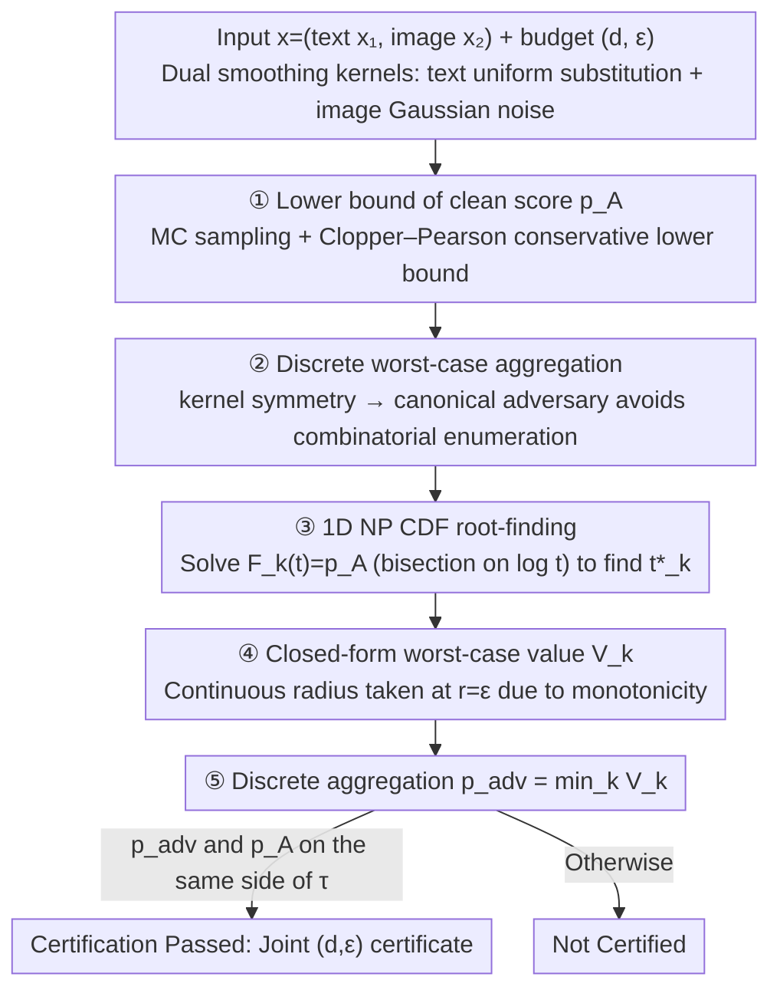

# Certified Robustness under Heterogeneous Perturbations via Hybrid Randomized Smoothing

**Conference**: ICML 2026  
**arXiv**: [2605.12876](https://arxiv.org/abs/2605.12876)  
**Code**: Not explicitly released  
**Area**: Multimodal VLM / Adversarial Robustness / Certified Robustness  
**Keywords**: Randomized Smoothing, Neyman–Pearson, Multimodal Safety Filtering, Hybrid Perturbation Certification, prompt injection

## TL;DR
This paper extends Randomized Smoothing (RS) from "supporting only single continuous or discrete inputs" to hybrid perturbation scenarios involving "discrete tokens + continuous images." By performing a hybrid Neyman–Pearson analysis, the authors derive a **one-dimensional, continuous, and invertible** likelihood ratio CDF. This transforms the originally combinatorial explosive discrete knapsack problem into a solvable root-finding problem. It provides the first model-agnostic certificate for "joint image-text unsafety" on LLaVA-Guard multimodal safety filtering.

## Background & Motivation
**Background**: Randomized Smoothing is currently the most mainstream model-agnostic robustness certification method. On the continuous side (Cohen 2019), there are closed-form $\ell_2$ certificates for Gaussian noise. On the discrete side (Ye 2020, Chen 2025), a fractional knapsack is required to find the worst-case likelihood ratio. These two systems have historically operated independently.

**Limitations of Prior Work**: Attacks on modern multimodal systems (VLM, agents, robot safety) are **cross-modal**—images might appear safe in isolation, and text might appear safe in isolation, but their combination is unsafe (e.g., Hateful Memes, prompt injection). Simply concatenating single-modality certificates is mathematically incorrect as it lacks a unified joint likelihood ratio framework.

**Key Challenge**: Purely discrete likelihood ratios are atomic, leading to irreversible NP decision rules that cannot provide closed-form radii. Pure Gaussian NP only supports continuous inputs. The optimal rejection region of the joint NP obtained by multiplying the two is not merely the "Cartesian product of two single-modality thresholds" (Prop. 4.1 provides a counterexample).

**Goal**: (i) Provide precise NP closed-form certificates under mixed discrete + continuous perturbations; (ii) Provide a monotone, conservative engineering algorithm; (iii) Validate the utility of the certificate on interaction-level unsafe multimodal safety filtering tasks.

**Key Insight**: It is observed that as long as the joint likelihood ratio $\gamma(z_1,z_2)=\gamma_1(z_1)\cdot\gamma_2(z_2)$ contains a Gaussian factor, $\log\gamma$ is strictly monotonic in continuous coordinates. This effectively means "continuous noise smoothes out the atomic structure of the discrete likelihood ratio," collapsing the joint NP problem into one dimension.

**Core Idea**: Use continuous Gaussian smoothing as a "regularizer" to fuse the discrete knapsack problem into a continuous, invertible 1D CDF $F(t;r)$. Then, solve for the NP threshold $t^\star(r)$ via 1D bisection and take the worst-case aggregation over the discrete attack space.

## Method

### Overall Architecture
Given input $x=(x_1,x_2)$ (text + image), two independent smoothing kernels are used: text $Z_1\sim p_1(\cdot\mid x_1)$ (uniform/absorbing substitution) and image $Z_2\sim\mathcal{N}(x_2,\sigma^2 I)$. The base classifier $f$ is smoothed into a smoothed classifier via $g(x)=\mathbb{E}[f(Z_1,Z_2)]$. For a joint perturbation budget $(d,\epsilon)$ ($\ell_0$ + $\ell_2$), the mixed worst-case probability $p_{\mathrm{adv}}(d,\epsilon)$ is defined. The overall algorithm: ① Estimate the Clopper-Pearson lower bound of clean $p_A$ via Monte Carlo → ② Enumerate/analyze the worst discrete adversary using kernel symmetry → ③ Solve the 1D NP threshold $t^\star$ for each candidate $x_{1,\mathrm{adv}}$ → ④ Calculate $V_k$ → ⑤ Take the minimum as the final conservative certified value.

### Key Designs

**1. 1D CDF $F(t;r)$ of the Joint Likelihood Ratio: Collapsing Mixed NP Capacity Constraints into a Univariate Continuous Function**

The difficulty of pure discrete NP lies in the atomic nature of the likelihood ratio, where threshold rules cannot match $p_A$ exactly, requiring fractional allocation (essentially a combinatorial search + fractional knapsack). The key observation here is that the joint $\log\gamma(z_1,z_2)=\log\gamma_1(z_1)+rz_2-r^2/2$ is additively decomposable. By taking the Gaussian expectation over the continuous dimension $z_2$, the discrete atomic structure is "smoothed" by the continuous noise into a continuous scalar. Thus, the capacity constraint is written as $F(t;r)=\sum_{z_1} p_1(z_1\mid x_1)\,\Phi\!\big(\tfrac{r^2/2+\sigma^2(\log t-\log\gamma_1(z_1))}{\sigma r}\big)$ (where $\Phi$ is the standard Gaussian CDF and $r$ is the continuous perturbation radius). Since it is strictly increasing with respect to $t$, for each $r>0$, there exists a unique $t^\star(r)$ such that $F(t^\star(r);r)=p_A$. The original "combinatorial search + fractional knapsack" collapses into "bisection on $u=\log t$," which is solved within seconds on a CPU.

**2. Closed-form Worst-case Probability $V$ + $r=\epsilon$ Monotonicity: Folding Nested inf into "Discrete Enumeration + 1D Equation Solving"**

Given a discrete adversary $x_{1,\mathrm{adv}}$ and a continuous radius $r$, the worst-case smoothed value has a closed form $V(x_{1,\mathrm{adv}};r)=\sum_{z_1} p_1(z_1\mid x_{1,\mathrm{adv}})\,\Phi\!\big(\tfrac{r^2/2+\sigma^2(\log t^\star(r)-\log\gamma_1(z_1))}{\sigma r}-\tfrac{r}{\sigma}\big)$. It is proved that $V$ is monotonically non-increasing with respect to $r$, so the continuous worst-case is automatically taken at $r=\epsilon$. Finally, $p_{\mathrm{adv}}(d,\epsilon)=\min_{D_1(x_1,x_{1,\mathrm{adv}})\le d}V(x_{1,\mathrm{adv}};\epsilon)$. This step uses monotonicity to fold the nested inf over all $(x_{1,\mathrm{adv}}, x_{2,\mathrm{adv}})$ into "enumeration over discrete attacks + solving 1D equations," eliminating the need for real searching in the continuous $\mathbb{R}^D$ space. Monotonicity also provides a certification invariant that is monotone in $d$, facilitating visualization.

**3. Structurally Symmetric Discrete Kernels + Conservative Implementation of 1D Root-finding: Algorithm Efficiency**

Original NP formulas involve a discrete combinatorial space of $O(|\mathcal{V}|^d)$, which is a major bottleneck. This is bypassed via kernel symmetry: under suffix attacks or $\ell_0$ attacks, the $p_1(\cdot\mid x_{1,\mathrm{adv}})$ of uniform/absorbing kernels depends only on the edit budget $d$ rather than specific token identities. Thus, a canonical adversarial input can represent the entire attack set, eliminating combinatorial enumeration for taking the worst-case over all discrete adversaries. The NP threshold is solved via monotone bisection on $u=\log t$. The clean $p_A$ uses a one-sided Clopper-Pearson interval for a conservative lower bound, and floating-point errors are managed by the numerical precision strategy in Appendix A.7. The authors specifically choose the uniform kernel over the absorbing kernel—since the latter degenerates into a two-point distribution with $\beta^d$ exponential decay under suffix attacks—ensuring the certificate is both conservative and non-trivial.

### Loss & Training
This is a **pure certification algorithm**; it does not train the base classifier and is applied directly to existing frozen models like LLaVA-Guard or linear SVMs. Hyperparameters: $\alpha=0.01$ (CP risk), $n=10^4$ (MC samples), $\beta=0.25$ (token substitution probability), $\sigma\in\{0.5, 1.0\}$ (Gaussian variance). The certification threshold $\tau=4.6\times 10^{-5}$ follows Chen 2025a.

## Key Experimental Results

### Main Results

| Method | Image radius $\bar{r}$ | Text budget $\bar{d}$ |
|--------|----------------------|---------------------|
| Image-only RS | 3.99 | 0 |
| Text-only RS | 0 | 3.26 |
| **Hybrid RS (ours)** | **3.76** (at $d=1$) | **3.07** |

When the text budget $d=1$, the Hybrid certificate's image radius is only 5.8% lower than the pure image certificate, and the text budget is only 5.8% lower than the pure text certificate. However, it **simultaneously** provides a joint image-text guarantee—whereas single-modality certificates are unsound on interaction-only datasets. In MM-SafetyBench external validation (1680 samples, 7.5% passing the interaction-only filter), it achieved $\bar{d}=3.62$ / $\bar{r}=3.37$.

### Ablation Study

| $\beta$ (corruption rate) | Certified examples (%) | Mean $d_{\max}$ | Mean $r^\star(d_{\max})$ |
|--------------------------|-----------------------|-----------------|--------------------------|
| 0.1 | 82.35 | 2.29 | 4.99 |
| **0.25** | **70.59** | **3.07** | **3.21** |
| 0.5 | 58.82 | 4.00 | 3.24 |
| 1.0 | 41.18 | 8.00 | 4.57 |

| Setting | Time/datapoint | Effect |
|---------|---------------|------|
| Image-only RS | ≈156s | Pure image radius |
| Hybrid RS, default | ≈500s | Complete $(d,\epsilon)$ frontier |
| Hybrid RS + FlashAttention/batching | ≈0.7× | Same certificate |
| One-shot suffix / $\ell_0$, $d_{\max}=8$ | ≈44s | Radius slightly dropped (2.07→1.55) |

### Key Findings
- $\beta$ controls the coverage-budget tradeoff: a small $\beta$ certifies more samples but only up to a small $d$, while a large $\beta$ broadens the text budget but coverage drops. $\beta=0.25$ is the default balance point.
- Increasing Gaussian variance $\sigma$ (0.5→1.0) sacrifices certification precision at small $\epsilon$ but expands the upper bound of the certifiable image radius; certification almost fails for $\sigma=1.0$ at high text budgets $d>3$.
- Adaptive attack experiments (Sec 5.3) show a gap between empirical attack success rates and the theoretical $p_{\mathrm{adv}}$ bound, indicating the certificate is not vacuous. MMCert-style subsampling provides **zero certification** on interaction-only data, further proving the necessity of joint NP certificates for this task.

## Highlights & Insights
- **"Continuous smoothing regularizing the discrete knapsack" is the core insight**: Gaussian noise not only provides the $\ell_2$ radius but also smoothes the atomic ties of the discrete likelihood ratio, turning the originally irreversible NP decision rule into a 1D invertible CDF—$\sigma$ here acts as both a "continuous radius controller" and a "discrete regularizer."
- **Joint certificates strictly generalize two special cases**: When $x_{1,\mathrm{adv}}=x_1$, it degenerates to the classic Cohen Gaussian certificate; when $\sigma\to\infty$, it degenerates to the fractional knapsack discrete certificate (Appendix A.3). This "lossless generalization" is rare in multimodal certification literature.
- **Interaction-only evaluation design is robust**: The authors constructed a 400-sample subset of Hateful Memes where "images are safe + text is safe but the combination is unsafe," transforming the qualitative claim that "single-modality certificates are unsound" into a measurable experimental fact—MMCert's zero certification on this subset serves as a strong baseline.

## Limitations & Future Work
- Only supports binary (safe/unsafe) outputs and two geometries ($\ell_2$ + $\ell_0$). NP analysis needs to be reworked for multi-classification, $\ell_\infty$, or semantic-level perturbations.
- The text side uses a uniform kernel (avoiding the exponential degradation of absorbing kernels), but uniform substitution significantly damages semantics, leading to large clean accuracy losses for long prompts (Appendix A.9 Table 5).
- Certification is nearly impossible when the discrete budget is large ($d\ge 5$ at $\sigma=1.0$); it remains weak against real long-suffix prompt injections. $\bar{d}_{\mathrm{hybrid}}=0.33$ under $\ell_0$ attacks is significantly lower than $\bar{d}_{\mathrm{txt}}=1.02$, suggesting the hybrid certificate is conservative in $\ell_0$ scenarios.
- A single certification takes 500s ($10^4$ MC samples). While acceptable offline, it is difficult to deploy in real-time. The authors look forward to confidence sequence early stopping + input-adaptive sampling.

## Related Work & Insights
- **vs Cohen 2019 / Salman 2019 (Gaussian RS)**: Ours strictly generalizes their continuous certificates, perfectly reproducing the $\Phi^{-1}(p_A)-\Phi^{-1}(\tau)$ formula when there is no discrete perturbation.
- **vs Chen 2025a (fractional knapsack for LLM safety)**: They only solve the discrete side NP using a 0-1/fractional knapsack solver; Ours proves that adding Gaussian noise collapses the knapsack into a 1D equation, reducing combinatorial complexity to $O(\log\epsilon^{-1})$.
- **vs MMCert (Wang 2024)**: MMCert uses independent subsampling for each modality and then aggregates, essentially a cross-modal $\ell_0$ threshold. Its zero certification on interaction-only data highlights the indispensability of the joint NP framework in Ours.
- **vs COMMIT / CertTA**: These ad-hoc multi-sensor/network certifications are not based on classic NP analysis; Ours provides the first principled joint Neyman-Pearson certificate for heterogeneous discrete-continuous threats.

## Rating
- Novelty: ⭐⭐⭐⭐⭐ First to provide a closed-form joint NP certificate for mixed discrete + continuous perturbations; the insight of collapsing the combinatorial knapsack into a 1D equation is elegant.
- Experimental Thoroughness: ⭐⭐⭐⭐ Covers tabular data + multimodal safety + empirical attacks + external benchmarks + multiple $\beta/\sigma$ ablations. Potential improvement: larger $d$ and more base model coverage.
- Writing Quality: ⭐⭐⭐⭐ Theorems, propositions, and counterexamples are rigorous and self-consistent. Limitations (absorbing degeneracy, numerical safety) are clearly identified.
- Value: ⭐⭐⭐⭐ Provides the first theoretically rigorous model-agnostic certificate for multimodal safety filtering and prompt injection, with direct significance for high-stakes deployment (medical VLM, robotics).

<!-- RELATED:START -->

## Related Papers

- [\[ICML 2026\] On the Adversarial Robustness of Large Vision-Language Models under Visual Token Compression](on_the_adversarial_robustness_of_large_vision-language_models_under_visual_token.md)
- [\[ICML 2026\] Smoothing Slot Attention Iterations and Recurrences](smoothing_slot_attention_iterations_and_recurrences.md)
- [\[ICLR 2026\] Directional Embedding Smoothing for Robust Vision Language Models](../../ICLR2026/multimodal_vlm/directional_embedding_smoothing_for_robust_vision_language_models.md)
- [\[ICML 2026\] Hierarchical Synthetic Tabular Data Generation: A Hybrid Top-Down and Bottom-Up Framework](hierarchical_synthetic_tabular_data_generation_a_hybrid_top-down_and_bottom-up_f.md)
- [\[ICML 2026\] Any3D-VLA: Enhancing VLA Robustness via Diverse Point Clouds](any3d-vla_enhancing_vla_robustness_via_diverse_point_clouds.md)

<!-- RELATED:END -->
