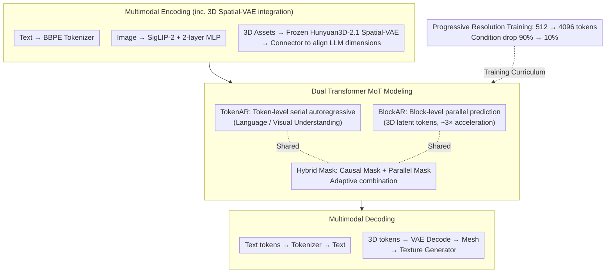

# CG-MLLM: Captioning and Generating 3D Content via Multi-modal Large Language Models

**Conference**: ICML 2026  
**arXiv**: [2601.21798](https://arxiv.org/abs/2601.21798)  
**Code**: To be confirmed  
**Area**: Multi-modal VLM / 3D Vision  
**Keywords**: 3D Generation, Multi-modal Large Language Model, Mixture-of-Transformer, Spatial Intelligence, 3D Understanding  

## TL;DR
CG-MLLM proposes a Mixture-of-Transformer-based multi-modal large language model that combines a pre-trained VLM backbone with a 3D VAE latent space via a dual Transformer architecture consisting of TokenAR (token-level autoregressive) and BlockAR (block-level parallel). It achieves end-to-end high-resolution 3D content generation and 3D captioning within a single MLLM framework for the first time, reaching SOTA among MLLM-based 3D generation methods.

## Background & Motivation

**Background**: Large language models have made breakthrough progress in modalities such as text, image, and video, with many MLLMs performing excellently in 2D vision-language understanding and generation tasks. However, progress in the field of 3D content generation has been slow, showing a significant gap compared to 2D multi-modal generation.

**Limitations of Prior Work**: Current MLLMs for 3D generation mainly follow two routes: (1) generating meshes in the form of text/discrete tokens, but token budgets limit mesh complexity and resolution; (2) using low-resolution voxel VAEs or Lego-like structures to generate coarse 3D proxy shapes, which still require additional 3D diffusion models for refined geometry. Neither can generate high-resolution 3D objects end-to-end at the LLM stage.

**Key Challenge**: 3D geometries essentially form long-range, highly interdependent sequences. Pure token-level autoregressive modeling leads to severe efficiency problems, while existing MoT methods bind Transformers by task (understanding vs. generation), which lacks flexibility.

**Goal**: Construct a unified language-image-3D multi-modal large language model that simultaneously achieves precise spatial understanding and high-fidelity spatial content generation within a single model.

**Key Insight**: The authors observe that token-level serial modeling and block-level parallel modeling can be decoupled into different Transformer branches and bound by generation mode (serial vs. parallel) rather than by task, allowing for flexible integration of different pre-trained encoders.

**Core Idea**: Integrate a pre-trained Qwen3-VL backbone with a Hunyuan3D-2.1 VAE latent space using a dual Transformer MoT architecture (TokenAR + BlockAR) to natively achieve high-resolution 3D generation within an MLLM.

## Method

### Overall Architecture
CG-MLLM adopts a decoder-only architecture consisting of three stages: (1) **Multimodal Encoding**—Text uses the BBPE tokenizer, images are compressed via SigLIP-2 encoder + 2-layer MLP, and 3D assets are encoded into latent representations via a frozen Hunyuan3D-2.1 Spatial-VAE; (2) **MoT Modeling**—The TokenAR Transformer handles token-level sequence modeling, while the BlockAR Transformer handles block-level parallel modeling, both sharing the attention mechanism; (3) **Multimodal Decoding**—Text tokens are decoded by the tokenizer, and 3D tokens are restored to meshes by the VAE decoder, then enhanced by a texture generator for visual quality. The entire pipeline is trained under a "Progressive Resolution Training" curriculum, moving from coarse structures of 512 tokens to fine geometries of 4096 tokens.

### Key Designs

**1. Dual Transformer MoT Architecture (TokenAR + BlockAR): Splitting branches by generation mode rather than task**

3D geometry is inherently a long-range, highly interdependent sequence. Pure token-level serial autoregression is both slow and difficult to model. Meanwhile, existing MoT approaches bind Transformers by task (understanding vs. generation), necessitating architectural changes when encoders are replaced. Here, both branches are initialized from pre-trained Qwen3-VL weights: TokenAR retains original token-level autoregressive capabilities for language/vision understanding, while BlockAR performs block-level parallel prediction for 3D latent tokens, sharing position indices within each block to maintain the permutation invariance of point features. The attention layer uses a hybrid mask—a causal mask for sequential tokens and a parallel mask for tokens within the same block—adaptively combined. The advantage of binding by "serial/parallel" generation mode is the flexibility to connect any pre-trained encoder, and block-level parallelism provides approximately 3x acceleration at 4096 token resolution.

**2. 3D Spatial-VAE Integration and Position Encoding Strategy: Reusing mature geometric priors while maintaining point cloud disorder**

Training a 3D encoder from scratch is costly. This work directly reuses the Spatial-VAE from Hunyuan3D-2.1 (downsampling factor 20, latent dimension 64): point clouds extracted from object surfaces are encoded as latent representations and aligned with LLM hidden dimensions through a Connector layer, with the VAE remains frozen throughout to preserve its geometric priors. The positional encoding design intentionally omits intra-block position embeddings for 3D tokens and only assigns block-level position indices. Since point cloud features are inherently unordered, forcing intra-token positions would destroy permutation invariance, whereas block-level indices still maintain global spatial structure. This aligns with the semantic space of the VLM without allowing position information to pollute the disorder of point features.

**3. Progressive Resolution Training Strategy: Refining from 512-token coarse structures to 4096**

Directly training 4096 3D tokens places excessive pressure on LLM sequence length and memory, leading to training instability. This process is divided into two stages: Stage 1 (Alignment Phase) drops 90% of conditional inputs to train unconditional generation and initial understanding at 512-token resolution, allowing the model to master coarse-grained structures first. Stage 2 (Progressive Resolution Phase) gradually increases resolution from 512 to 4096 while reducing the drop probability from 90% to 10%, with the learning rate adjusted from $1 \times 10^{-4}$ to $5 \times 10^{-5}$. This coarse-to-fine curriculum allows the model to refine geometric details after stably mastering the overall structure, avoiding the instability of direct high-resolution training.

### Loss & Training
Classifier-Free Guidance (CFG) is used, with a CFG scale of 7.5 and 50 sampling steps during inference. A logit-normal sampler is employed for time steps. Training is conducted on 16 NVIDIA H20 GPUs, with maximum sequence length increasing from 36,864 to 51,200.

## Key Experimental Results

### Main Results: Comparison of 3D Generation Quality

| Method | Type | p-FID↓ | p-KID↓ | CLIP-IQA+↑ | MUSIQ↑ | CLIP↑ | User Study↑ |
|------|------|--------|--------|------------|--------|-------|------------|
| Michelangelo | Non-MLLM | 17.96 | 0.56 | 0.45 | 71.42 | 84.08 | 2.60 |
| CraftsMan | Non-MLLM | 14.09 | 0.40 | 0.45 | 71.09 | 84.86 | 3.15 |
| TRELLIS | Non-MLLM | 7.36 | 0.12 | 0.44 | 66.97 | 84.13 | 3.28 |
| SAR3D | MLLM | 30.07 | 1.00 | 0.42 | 66.01 | 82.86 | 2.93 |
| ShapeLLM-Omni | MLLM | 13.11 | 0.29 | 0.37 | 55.71 | 84.18 | 2.30 |
| **CG-MLLM (Ours)** | MLLM | **12.55** | **0.27** | **0.45** | **71.65** | **84.47** | **3.32** |

CG-MLLM leads comprehensively among MLLM-based methods, with p-FID reduced by 58% and p-KID reduced by 73% compared to SAR3D.

### Ablation Study

| HY2.1-VAE | MoT | LLM Backbone | #Tokens | p-FID↓ | p-KID↓ |
|-----------|-----|----------|---------|--------|--------|
| ✗ | ✗ | Qwen2.5-0.5B | 512 | 53.66 | 1.76 |
| ✓ | ✗ | Qwen2.5-0.5B | 512 | 44.91 | 1.42 |
| ✓ | ✓ | Qwen2.5-0.5B | 512 | 30.60 | 0.77 |
| ✓ | ✓ | Qwen3VL-2B | 512 | 15.61 | 0.43 |
| ✓ | ✓ | Qwen2.5-0.5B | 4096 | 16.57 | 0.53 |
| ✓ | ✓ | Qwen3VL-2B | 4096 | **12.55** | **0.27** |

HY2.1-VAE, MoT architecture, larger token budgets, and stronger VLM backbones all bring consistent gains, aligning with scaling law trends.

### Main Results: Comparison of 3D Captioning Understanding

| Model | Input | BLEU-1↑ | ROUGE-L↑ | METEOR↑ |
|------|------|---------|----------|---------|
| 3D-LLM | 3D Latent | 16.91 | 19.48 | 19.73 |
| ShapeLLM-Omni-7B | 3D Latent | 18.51 | 21.37 | 19.89 |
| Qwen3-VL-2B | Image | 3.13 | 7.21 | 11.92 |
| **CG-MLLM-2B (Ours)** | **Image** | **13.51** | **19.13** | **14.28** |

Under the condition of using only image input, CG-MLLM's captioning ability significantly outperforms Qwen3-VL of the same scale (BLEU-1 increased by 4.3x), proving that 3D generation training can benefit perceptual capabilities.

## Highlights & Insights
- **Generation Feeds Understanding**: Joint 3D generation training not only imparts generative capabilities to the model but also significantly enhances 3D structural reasoning based on 2D images, validating the hypothesis that "learning to generate helps to understand."
- **Mode-based Binding vs. Task-based Binding**: Binding Transformers by generation mode (serial/parallel) rather than by task (understanding/generation) is a simple but key design choice that maintains architectural scalability.
- **Failure of AdaLN in MLLM**: The authors found that introducing extra scaling factors via AdaLN in a shared causal-parallel attention mechanism disrupts training stability, providing a reference for future MLLM+Diffusion work.

## Limitations & Future Work
- Overall quality still does not surpass top non-MLLM methods (e.g., TRELLIS); narrowing this gap remains an open problem.
- The quality of 3D captioning datasets is limited (usually < 20 words), restricting 3D understanding capabilities.
- The watertight preprocessing of Hunyuan3D-2.1 VAE causes loss of data precision, and the token count is only 4K (while high-quality methods can reach 40K+).
- Hallucinations may occur when input is ambiguous or semantically confusing (e.g., generating a rabbit from a sheep input).

## Related Work & Insights
- **SAR3D / ShapeLLM-Omni**: Previous MLLM 3D generation methods using token and voxel VAEs respectively; CG-MLLM surpasses them in all metrics.
- **TRELLIS**: SOTA for non-MLLM 3D generation; its p-FID of 7.36 is still lower than CG-MLLM, indicating a gap in 3D precision for pure LLM paradigms.
- **Mixture-of-Transformers**: The MoT concept is reinterpreted as mode-based binding rather than task-based binding.

## Rating
- Novelty: ★★★★☆ — The design of dual Transformers bound by generation mode is novel, and the exploration of 3D MLLM is valuable.
- Experimental Thoroughness: ★★★★☆ — Comprehensive ablation (5 groups), but a gap still exists with non-MLLM SOTA.
- Writing Quality: ★★★☆☆ — Method description is clear but some paragraphs are lengthy.
- Value: ★★★★☆ — The first end-to-end high-resolution 3D generation MLLM, opening up a new direction.

<!-- RELATED:START -->

## Related Papers

- [\[ICCV 2025\] Large Multi-modal Models Can Interpret Features in Large Multi-modal Models](../../ICCV2025/multimodal_vlm/large_multi-modal_models_can_interpret_features_in_large_multi-modal_models.md)
- [\[CVPR 2026\] Multi-SpatialMLLM: Multi-Frame Spatial Understanding with Multi-Modal Large Language Models](../../CVPR2026/multimodal_vlm/multi-spatialmllm_multi-frame_spatial_understanding_with_multi-modal_large_langu.md)
- [\[CVPR 2026\] M3DocDep: Multi-modal, Multi-page, Multi-document Dependency Chunking with Large Vision-Language Models](../../CVPR2026/multimodal_vlm/m3docdep_multi-modal_multi-page_multi-document_dependency_chunking_with_large_vi.md)
- [\[ACL 2026\] Leave My Images Alone: Preventing Multi-Modal Large Language Models from Analyzing Unauthorized Images](../../ACL2026/multimodal_vlm/leave_my_images_alone_preventing_multi-modal_large_language_models_from_analyzin.md)
- [\[ICML 2026\] Self-Captioning Multimodal Interaction Tuning: Amplifying Exploitable Redundancies for Robust Vision Language Models](self-captioning_multimodal_interaction_tuning_amplifying_exploitable_redundancie.md)

<!-- RELATED:END -->
