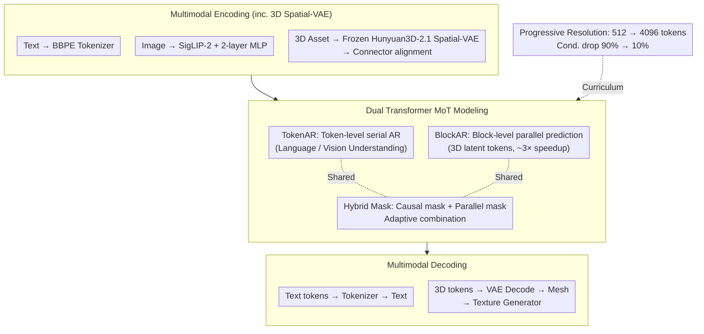

# CG-MLLM: Captioning and Generating 3D Content via Multi-modal Large Language Models

**Conference**: ICML 2026  
**arXiv**: [2601.21798](https://arxiv.org/abs/2601.21798)  
**Code**: TBD  
**Area**: Multi-modal VLM / 3D Vision  
**Keywords**: 3D Generation, Multi-modal Large Language Model, Mixture-of-Transformer, Spatial Intelligence, 3D Understanding  

## TL;DR
CG-MLLM proposes a multi-modal large language model based on Mixture-of-Transformer. Using a dual Transformer architecture of TokenAR (token-level autoregressive) and BlockAR (block-level parallel), combined with a pre-trained VLM backbone and 3D VAE latent space, it achieves end-to-end high-resolution 3D content generation and 3D captioning/understanding within a single MLLM framework for the first time, reaching SOTA among MLLM-based 3D generation methods.

## Background & Motivation

**Background**: Large language models have made breakthrough progress in modalities such as text, image, and video. Numerous MLLMs perform excellently in 2D vision-language understanding and generation tasks. However, progress in the field of 3D content generation has been slow, with a significant gap compared to 2D multi-modal generation.

**Limitations of Prior Work**: Current MLLMs for 3D generation primarily follow two routes: (1) Generating meshes in the form of text/discrete tokens, but token budgets limit mesh complexity and resolution; (2) Using low-resolution voxel VAEs or Lego-like structures to generate coarse 3D proxy shapes, still requiring additional 3D diffusion models to obtain refined geometry. Neither can generate high-resolution 3D objects end-to-end during the LLM stage.

**Key Challenge**: 3D geometry inherently forms long-range, highly interdependent sequences. Pure token-level autoregressive modeling leads to severe efficiency issues, while existing MoT methods bind Transformers by task (understanding vs. generation), which lacks flexibility.

**Goal**: Construct a unified language-image-3D multi-modal large language model to achieve precise spatial understanding and high-fidelity spatial content generation simultaneously within a single model.

**Key Insight**: The authors observe that token-level serial modeling and block-level parallel modeling can be decoupled into different Transformer branches, bound by generation mode (serial vs. parallel) rather than by task, allowing flexible integration of different pre-trained encoders.

**Core Idea**: Use a dual-Transformer MoT architecture (TokenAR + BlockAR) to integrate a pre-trained Qwen3-VL backbone with the Hunyuan3D-2.1 VAE latent space, achieving native high-resolution 3D generation within an MLLM.

## Method

### Overall Architecture
CG-MLLM adopts a decoder-only architecture consisting of three stages: (1) **Multimodal Encoding**—Text uses the BBPE tokenizer, images are compressed via the SigLIP-2 encoder + 2-layer MLP, and 3D assets are encoded into latent representations via a frozen Hunyuan3D-2.1 Spatial-VAE; (2) **MoT Modeling**—The TokenAR Transformer handles token-level sequence modeling, while the BlockAR Transformer handles block-level parallel modeling, with both sharing an attention mechanism; (3) **Multimodal Decoding**—Text tokens are decoded via the tokenizer, and 3D tokens are restored to meshes via the VAE decoder, then enhanced by a texture generator for visual quality. The entire pipeline follows a "progressive resolution training" curriculum, scaling from 512 tokens for coarse structure to 4096 tokens for fine geometry.

### Key Designs

**1. Dual Transformer MoT Architecture: Branching by Generation Mode rather than Task**

3D geometry consists of long-range, highly interdependent sequences; pure token-level serial autoregression is both slow and difficult to model. Existing MoT methods bind Transformers by task (understanding vs. generation), requiring architectural changes when switching encoders. Here, both branches are initialized from pre-trained Qwen3-VL weights: TokenAR retains original token-level autoregressive capabilities for language/vision understanding, while BlockAR performs block-level parallel prediction for 3D latent tokens, sharing position indices within each block to maintain permutation invariance of point features. The attention layers use a hybrid mask—causal masking for sequential tokens and parallel masking for tokens within the same block—adaptively combined. The advantage of binding by "serial/parallel" generation mode is the flexibility to connect any pre-trained encoder, and block-level parallelism provides approximately 3x speedup at 4096-token resolution.

**2. 3D Spatial-VAE Integration & Positional Encoding Strategy: Reusing Geometric Priors and Maintaining Unorderedness**

Training a 3D encoder from scratch is costly; thus, the Spatial-VAE from Hunyuan3D-2.1 (downsampling factor 20, latent dimension 64) is directly reused. Latent representations are encoded from point clouds extracted from object surfaces and aligned with LLM hidden dimensions via a Connector layer, with the VAE remains frozen to preserve its geometric priors. A deliberate design choice in positional encoding involves omitting intra-block position embeddings for 3D tokens, assigning only block-level indices. Since point cloud features are inherently unordered, forcing intra-token positions would destroy permutation invariance, while block-level indices still maintain global spatial structure. This aligns with the VLM semantic space without contaminating point features with positional noise.

**3. Progressive Resolution Training Strategy: Refining from 512 to 4096 Tokens**

Directly training 4096 3D tokens places excessive pressure on LLM sequence length and VRAM, leading to training instability. This is handled in two stages: Stage One (Alignment) involves dropping 90% of conditional inputs and training unconditional generation and initial understanding at a 512-token resolution to master coarse structures. Stage Two (Progressive Resolution) gradually increases resolution from 512 to 4096 while reducing the drop probability from 90% to 10%, accompanied by a learning rate adjustment from $1 \times 10^{-4}$ to $5 \times 10^{-5}$. This coarse-to-fine curriculum allows the model to stabilize global structures before sculpting geometric details.

### Loss & Training
Classifier-Free Guidance (CFG) is employed with a CFG scale of 7.5 and 50 sampling steps during inference. A logit-normal sampler is used for timesteps. Training is conducted on 16 NVIDIA H20 GPUs, with the maximum sequence length increasing from 36,864 to 51,200.

## Key Experimental Results

### Main Results: 3D Generation Quality Comparison

| Method | Type | p-FID↓ | p-KID↓ | CLIP-IQA+↑ | MUSIQ↑ | CLIP↑ | User Study↑ |
|------|------|--------|--------|------------|--------|-------|------------|
| Michelangelo | Non-MLLM | 17.96 | 0.56 | 0.45 | 71.42 | 84.08 | 2.60 |
| CraftsMan | Non-MLLM | 14.09 | 0.40 | 0.45 | 71.09 | 84.86 | 3.15 |
| TRELLIS | Non-MLLM | 7.36 | 0.12 | 0.44 | 66.97 | 84.13 | 3.28 |
| SAR3D | MLLM | 30.07 | 1.00 | 0.42 | 66.01 | 82.86 | 2.93 |
| ShapeLLM-Omni | MLLM | 13.11 | 0.29 | 0.37 | 55.71 | 84.18 | 2.30 |
| **CG-MLLM (Ours)** | MLLM | **12.55** | **0.27** | **0.45** | **71.65** | **84.47** | **3.32** |

CG-MLLM leads among MLLM-based methods across the board, with p-FID reduced by 58% and p-KID reduced by 73% compared to SAR3D.

### Ablation Study

| HY2.1-VAE | MoT | LLM Backbone | #Tokens | p-FID↓ | p-KID↓ |
|-----------|-----|----------|---------|--------|--------|
| ✗ | ✗ | Qwen2.5-0.5B | 512 | 53.66 | 1.76 |
| ✓ | ✗ | Qwen2.5-0.5B | 512 | 44.91 | 1.42 |
| ✓ | ✓ | Qwen2.5-0.5B | 512 | 30.60 | 0.77 |
| ✓ | ✓ | Qwen3VL-2B | 512 | 15.61 | 0.43 |
| ✓ | ✓ | Qwen2.5-0.5B | 4096 | 16.57 | 0.53 |
| ✓ | ✓ | Qwen3VL-2B | 4096 | **12.55** | **0.27** |

HY2.1-VAE, the MoT architecture, larger token budgets, and stronger VLM backbones all bring consistent gains, aligning with scaling law trends.

### 3D Captioning Comparison

| Model | Input | BLEU-1↑ | ROUGE-L↑ | METEOR↑ |
|------|------|---------|----------|---------|
| 3D-LLM | 3D Latent | 16.91 | 19.48 | 19.73 |
| ShapeLLM-Omni-7B | 3D Latent | 18.51 | 21.37 | 19.89 |
| Qwen3-VL-2B | Image | 3.13 | 7.21 | 11.92 |
| **CG-MLLM-2B (Ours)** | **Image** | **13.51** | **19.13** | **14.28** |

Under image-only input conditions, CG-MLLM's captioning ability significantly exceeds the same-scale Qwen3-VL (BLEU-1 increased 4.3x), proving that 3D generation training can feed back into perception capabilities.

## Highlights & Insights
- **Generation Aids Understanding**: Joint 3D generation training not only grants the model generative capabilities but also significantly improves 3D structural reasoning based on 2D images, validating the hypothesis that "learning to generate helps understanding."
- **Binding by Mode vs. Binding by Task**: Binding Transformers by generation mode (serial/parallel) rather than task (understanding/generation) is a simple but critical design choice that maintains architectural scalability.
- **Failure of AdaLN in MLLM**: The authors found that AdaLN introduces additional scaling factors in shared causal-parallel attention mechanisms that disrupt training stability. This provides a reference for future MLLM+Diffusion work.

## Limitations & Future Work
- Overall quality still does not surpass top non-MLLM methods (e.g., TRELLIS); closing this gap remains an open problem.
- 3D captioning dataset quality is limited (typically < 20 words), restricting 3D understanding capabilities.
- Watertight preprocessing for Hunyuan3D-2.1 VAE results in data precision loss; the token count is only 4K (high-quality methods can reach 40K+).
- Hallucinations may occur during input ambiguity or semantic confusion (e.g., generating a rabbit from a sheep input).

## Related Work & Insights
- **SAR3D / ShapeLLM-Omni**: Previous MLLM 3D generation methods using token and voxel VAEs respectively; CG-MLLM surpasses them on all metrics.
- **TRELLIS**: Non-MLLM 3D generation SOTA; its p-FID of 7.36 remains lower than CG-MLLM, indicating that the pure LLM paradigm still lags in 3D precision.
- **Mixture-of-Transformers**: The MoT concept is reinterpreted as mode-binding rather than task-binding.

## Rating
- Novelty: ★★★★☆ — The dual Transformer design bound by generation mode is novel; the 3D MLLM exploration is valuable.
- Experimental Thoroughness: ★★★★☆ — Comprehensive ablation (5 groups), though a gap remains with non-MLLM SOTA.
- Writing Quality: ★★★☆☆ — Method description is clear but some paragraphs are lengthy.
- Value: ★★★★☆ — The first end-to-end high-resolution 3D generation MLLM, opening a new direction.

<!-- RELATED:START -->

## Related Papers

- [\[ICML 2026\] Vision-aligned Latent Reasoning for Multi-modal Large Language Model](vision-aligned_latent_reasoning_for_multi-modal_large_language_model.md)
- [\[ICCV 2025\] Large Multi-modal Models Can Interpret Features in Large Multi-modal Models](../../ICCV2025/multimodal_vlm/large_multi-modal_models_can_interpret_features_in_large_multi-modal_models.md)
- [\[ACL 2026\] Leave My Images Alone: Preventing Multi-Modal Large Language Models from Analyzing Unauthorized Images](../../ACL2026/multimodal_vlm/leave_my_images_alone_preventing_multi-modal_large_language_models_from_analyzin.md)
- [\[ICML 2026\] Self-Captioning Multimodal Interaction Tuning: Amplifying Exploitable Redundancies for Robust Vision Language Models](self-captioning_multimodal_interaction_tuning_amplifying_exploitable_redundancie.md)
- [\[AAAI 2026\] Large Language Models Meet Extreme Multi-label Classification: Scaling and Multi-modal Framework](../../AAAI2026/multimodal_vlm/large_language_models_meet_extreme_multi-label_classification_scaling_and_multi-.md)

<!-- RELATED:END -->
