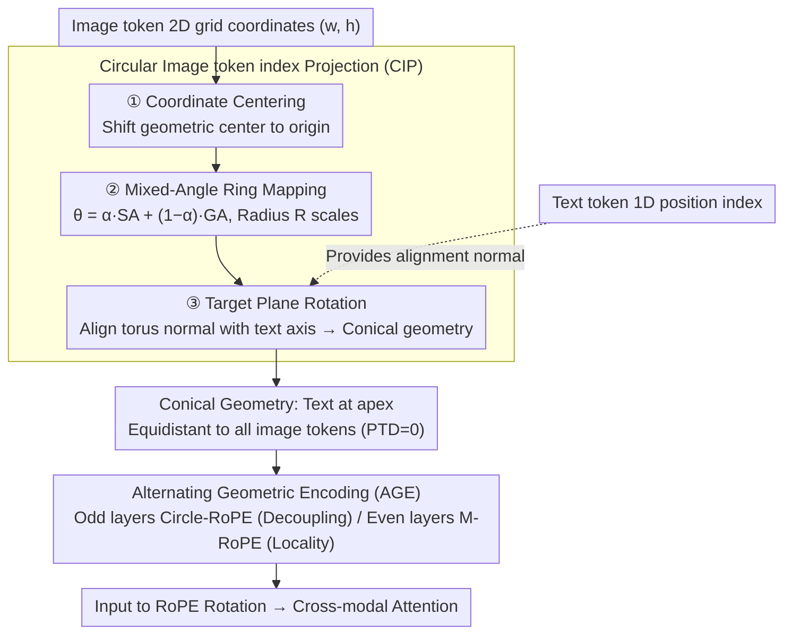

# Circle-RoPE: Cone-like Decoupled Rotary Positional Embedding for Vision-Language Models

**Conference**: ICML 2026  
**arXiv**: [2505.16416](https://arxiv.org/abs/2505.16416)  
**Code**: https://github.com/lose4578/CircleRoPE  
**Area**: Multimodal VLM  
**Keywords**: Positional Encoding, RoPE, Vision-Language Models, Cross-modal Decoupling, Spatial Reasoning  

## TL;DR
The authors propose Circle-RoPE, which maps the 2D coordinates of image tokens onto a torus orthogonal to the text position axis. This forms a conical geometry where the RoPE distance from each text token to all image tokens is equal (PTD=0), eliminating cross-modal pseudo-positional biases while preserving internal image spatial structure through Alternating Geometric Encoding (AGE).

## Background & Motivation

**Background**: Rotary Positional Embedding (RoPE) is widely used in Large Language Models. Mainstream approaches to extending it to Vision-Language Models (VLMs) include: (1) flattening image tokens into a 1D sequence for concatenation with text (LLaVA / InternLM-VL); (2) assigning the same position index to all image tokens (mPLUG-Owl3); (3) preserving 2D spatial indices during concatenation (M-RoPE in Qwen2-VL).

**Limitations of Prior Work**: Existing methods embed image and text tokens in a shared index space, causing cross-modal relative positions to be determined by concatenation order rather than semantic relevance. For instance, in VQA, "high on the clock tower" should align with the top of the tower, but due to index ordering, the closest patches may be irrelevant, leading to semantic misalignment and multi-token distance inconsistency.

**Key Challenge**: Schemes (1) and (3) preserve image spatial information but introduce cross-modal coupling bias; scheme (2) eliminates bias but loses the internal spatial structure of the image. No existing solution achieves both cross-modal decoupling and preservation of image spatial relationships.

**Goal**: Design a positional encoding where each text token is equidistant to all image tokens (eliminating cross-modal bias) while maintaining relative spatial structures between image tokens.

**Key Insight**: From geometric first principles, if text tokens are considered "observers" and image tokens form a 2D plane, the observer should be positioned in the normal direction of the plane rather than being coplanar. This avoids "perspective distortion."

**Core Idea**: Map image token coordinates to a torus orthogonal to the text position axis, forming a right circular cone geometry. This places the text tokens at the apex, making them equidistant to all torus points, achieving PTD=0 in the RoPE index space.

## Method

### Overall Architecture
Building upon M-RoPE, Circle-RoPE applies a geometric transformation to image token $(w, h)$ indices before RoPE rotation. The inputs are 2D grid coordinates for images and 1D position indices for text. The outputs are transformed 3D coordinates (for images) and original 1D indices (for text). The PTD metric quantifies "cross-modal positional coupling" to set the optimization goal of "PTD=0," implemented via two modules: Circular Image token index Projection (CIP) to project image indices onto a cone orthogonal to the text axis, and Alternating Geometric Encoding (AGE) to alternate between Circle-RoPE and M-RoPE across layers.

### Key Designs

**1. Per-Token Distance (PTD) Metric and Theoretical Guarantee**

The authors define PTD to quantify cross-modal positional coupling. For each text token $t$, the average RoPE distance to all image tokens is $\bar{D}_t = \frac{1}{N_{\text{image}}}\sum_{i \in I} d(t, i)$, and PTD is the mean absolute deviation: $\text{PTD} = \frac{1}{N_{\text{image}} N_{\text{text}}} \sum_{t \in T} \sum_{i \in I} |d(t,i) - \bar{D}_t|$. PTD=0 implies each text token is equidistant to all image tokens, ensuring that the attention bias introduced by RoPE does not favor any specific image token. It is theoretically proven that the attention logit bias is bounded by PTD. Measurements show PTD=2.22 for Hard embedding and 0.64 for Spatial embedding.

**2. Circular Image token index Projection (CIP)**

CIP positions text tokens as "observers" on the normal of the image canvas. Since any point on the canvas is naturally equidistant to an observer on the normal, PTD becomes 0. The process involves: **Coordinate Centering** to shift the origin; **Mixed-Angle Ring Mapping** to project coordinates onto a 2D torus with weighted angles $\theta^{\text{mix}}_{ij} = \alpha \cdot \theta^{\text{SA}}_{ij} + (1-\alpha) \cdot \theta^{\text{GA}}_{ij}$, where Spatial Angle (SA) preserves structure and Grid Angle (GA) restores discriminability; and **Target Plane Rotation** to align the torus normal with the text position vector $V_{\text{text}}$. Optimal parameters are $\alpha=0.5$ and $R=10$.

**3. Alternating Geometric Encoding (AGE)**

While Circle-RoPE decouples cross-modal positions, it relaxes the 2D locality prior within images, which is detrimental to tasks like chart reading. Conversely, M-RoPE provides a convolution-like local inductive bias. AGE defines a layer-wise schedule $s(\ell) \in \{\text{Circle-RoPE}, \text{M-RoPE}\}$, using Circle-RoPE in odd layers for unbiased alignment and M-RoPE in even layers for local spatial perception. This alternation acts as geometric regularization.

## Key Experimental Results

### Main Results

Based on Qwen2.5-VL-3B with SFT (MAmmoTH-VL-Sub 1M data), replacing only the positional encoding module:

| Dataset | Qwen2.5-VL (SFT) | Circle-RoPE | Gain |
|--------|:-:|:-:|:-:|
| MMMU (val) | 51.56 | **52.11** | +0.55 |
| MMMU-Pro | 28.01 | **28.44** | +0.43 |
| MathVista (mini) | 62.40 | **63.40** | +1.00 |
| AI2D | 79.22 | **81.80** | +2.58 |
| RealWorldQA | 66.10 | **66.54** | +0.44 |
| Average | 57.46 | **58.46** | +1.00 |

Func-IoU on the TAM benchmark improved by +3.45 (71.19→74.64), validating the effectiveness of cross-modal decoupling.

### Ablation Study

| Configuration | MMMU | MMMU-Pro | MathVista | Average |
|------|:-:|:-:|:-:|:-:|
| Baseline (M-RoPE) | 50.22 | 27.92 | 62.40 | 46.85 |
| CIP α=0, R=auto | 52.38 | 28.12 | 61.70 | 47.40 |
| CIP α=0.5, R=10 (Optimal) | 52.11 | 28.44 | 63.40 | 47.98 |
| CIP α=0.5, R=auto | 50.04 | 26.64 | 62.20 | 46.29 |
| Unordered (PTD=0) | 48.55 | 25.50 | 59.50 | — |
| Circle-RoPE (PTD=0) | 51.11 | 27.94 | 62.40 | — |

### Key Findings
- **PTD=0 does not guarantee performance**: Unordered embeddings satisfy PTD=0 but drop significantly due to loss of internal spatial structure, proving that internal geometry is necessary.
- **AGE outperforms single encoding**: Strategy 1 (all Circle-RoPE) averaged 58.33, while AGE reached 58.46, showing complementary geometric priors.
- **Cross-architecture generalization**: Circle-RoPE outperformed alternatives on LLaVA-0.5B using the same hyperparameters ($\alpha=0.5, R=10$) without tuning.
- **Fixed radius is superior to adaptive**: $R=10$ consistently outperformed $R=\text{auto}$, likely because adaptive radii create excessive variance across different image resolutions.

## Highlights & Insights
- **Geometric First Principles**: Derived cone geometry from the "observer-canvas orthogonality" intuition. The PTD metric provides a formal verification framework, tightly coupling theory and engineering.
- **Balanced Mixed-Angle Mapping**: SA preserves spatial structure but risks angular collapse; GA maintains discriminability but lacks spatial semantics. The 50/50 mixture captures the advantages of both.
- **AGE as a Geometric Regularizer**: Instead of forcing one geometry to serve all needs, AGE allows different layers to specialize, similar to how different experts handle different patterns in MoE.

## Limitations & Future Work
- Evaluation was limited to 3B and 0.5B scales; performance on 7B+ models or during large-scale pre-training remains unknown.
- Gains on some benchmarks (e.g., RealWorldQA +0.44) are relatively modest.
- Adaptation to video understanding (temporal + spatial) was not addressed; extending Circle-RoPE to 3D+temporal indices is a potential direction.
- Selection of $\alpha$ and $R$ relies on manual ablation rather than adaptive learning mechanisms.

## Related Work & Insights
- M-RoPE (Qwen2-VL) preserves 2D indices but suffers cross-modal coupling; Circle-RoPE decouples this via orthogonal projection.
- mPLUG-Owl3 achieves PTD=0 via shared indices but loses 2D structure; this work proves that both PTD=0 and spatial preservation are essential.
- **Insight**: Positional encoding design should distinguish between intra-modal and inter-modal requirements, using distinct geometric priors for each.

<!-- RELATED:START -->

## Related Papers

- [\[ICLR 2026\] Revisiting Multimodal Positional Encoding in Vision-Language Models](../../ICLR2026/multimodal_vlm/revisiting_multimodal_positional_encoding_in_visionlanguage_models.md)
- [\[CVPR 2026\] MODIX: A Training-Free Multimodal Information-Driven Positional Index Scaling for Vision-Language Models](../../CVPR2026/multimodal_vlm/modix_a_training-free_multimodal_information-driven_positional_index_scaling_for.md)
- [\[AAAI 2026\] Positional Bias in Multimodal Embedding Models: Do They Favor the Beginning, the Middle, or the End?](../../AAAI2026/multimodal_vlm/positional_bias_in_multimodal_embedding_models_do_they_favor_the_beginning_the_m.md)
- [\[CVPR 2026\] Ego: Embedding-Guided Personalization of Vision-Language Models](../../CVPR2026/multimodal_vlm/ego_embedding-guided_personalization_of_vision-language_models.md)
- [\[ICLR 2026\] Reading Images Like Texts: Sequential Image Understanding in Vision-Language Models](../../ICLR2026/multimodal_vlm/reading_images_like_texts_sequential_image_understanding_in_vision-language_mode.md)

<!-- RELATED:END -->
