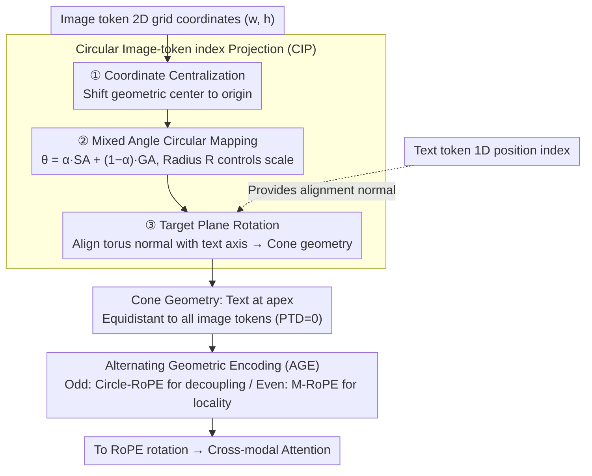

# Circle-RoPE: Cone-like Decoupled Rotary Positional Embedding for Vision-Language Models

**Conference**: ICML 2026  
**arXiv**: [2505.16416](https://arxiv.org/abs/2505.16416)  
**Code**: https://github.com/lose4578/CircleRoPE  
**Area**: Multimodal VLM  
**Keywords**: Positional Encoding, RoPE, Vision-Language Models, Cross-modal Decoupling, Spatial Reasoning  

## TL;DR
Circle-RoPE is proposed to map the 2D coordinates of image tokens onto a torus orthogonal to the text position axis, forming a cone-like geometry. This ensures equal RoPE distances from each text token to all image tokens (PTD=0), eliminating cross-modal pseudo-positional bias while preserving internal image spatial structures through Alternating Geometric Encoding (AGE).

## Background & Motivation

**Background**: RoPE (Rotary Positional Embedding) is widely used in Large Language Models. When extended to Vision-Language Models (VLM), mainstream approaches include: (1) flattening image tokens into a 1D sequence for direct 1D RoPE (LLaVA / InternLM-VL, etc.); (2) assigning the same position index to all image tokens (mPLUG-Owl3); (3) retaining 2D spatial indices concatenated with text (M-RoPE in Qwen2-VL).

**Limitations of Prior Work**: The aforementioned methods embed image and text tokens in a shared index space, causing cross-modal relative positions to be determined by concatenation order rather than semantic association. For instance, in VQA, "high on the clock tower" should align with the top of the tower, but due to index arrangement, the closest patches may be irrelevant, leading to semantic misalignment and inconsistent multi-token distances.

**Key Challenge**: Schemes (1)(3) preserve image spatial information but introduce cross-modal coupling bias; scheme (2) eliminates bias but loses internal image spatial structures. No existing scheme achieves both cross-modal decoupling and preservation of image spatial relationships.

**Goal**: Design a positional encoding where each text token is equidistant to all image tokens (eliminating cross-modal bias) while maintaining relative spatial structures between image tokens.

**Key Insight**: Grounded in geometric first principles—if text tokens are viewed as "observers" and image tokens form a 2D plane, the observer should stand in the normal direction of the plane rather than being coplanar to avoid "perspective distortion."

**Core Idea**: Map image token coordinates to a torus orthogonal to the text position axis, forming a geometry similar to a right circular cone. This places text tokens at the apex, equidistant to all points on the torus, achieving PTD=0 in the RoPE index space.

## Method

### Overall Architecture
Building on M-RoPE, Circle-RoPE performs geometric transformations on image token $(w, h)$ indices before RoPE rotation. The inputs are 2D grid coordinates for image tokens and 1D position indices for text tokens; the outputs are transformed 3D coordinates (for images) and original 1D indices (for text). The PTD metric quantifies "cross-modal positional coupling" to set the "PTD=0" optimization goal. Two major modules implement this: CIP (Circular Image-token index Projection) projects image indices onto a cone orthogonal to the text axis to reach PTD=0, and AGE (Alternating Geometric Encoding) alternates between Circle-RoPE and M-RoPE across layers to balance cross-modal decoupling with internal image locality.

### Key Designs

**1. Per-Token Distance (PTD) Metric and Theoretical Guarantee: Quantifying cross-modal decoupling.**

Existing schemes lack a quantitative metric for cross-modal coupling. The authors define PTD: for each text token $t$, the mean RoPE index distance to all image tokens is calculated as $\bar{D}_t = \frac{1}{N_{\text{image}}}\sum_{i \in I} d(t, i)$, followed by the mean absolute deviation of all distances from this mean: $\text{PTD} = \frac{1}{N_{\text{image}} N_{\text{text}}} \sum_{t \in T} \sum_{i \in I} |d(t,i) - \bar{D}_t|$. PTD=0 implies each text token is equidistant to all image tokens, meaning RoPE-induced attention bias treats all image tokens equally. The authors also prove that the bias in RoPE attention logits is bounded by the PTD. Measured values are: Hard embedding PTD=2.22, Spatial embedding=0.64, Unordered=0 (but loses spatial info). The goal is to compress PTD to 0 while preserving spatial structure.

**2. Circular Image-token index Projection (CIP): Placing image tokens on a torus orthogonal to the text axis.**

CIP's geometric intuition treats the text token as an "observer" in the normal direction of the canvas; any point on the canvas is naturally equidistant to the observer, making PTD=0. Three steps: **Coordinate Centralization** shifts all image coordinates to the origin; **Mixed Angle Circular Mapping** projects centralized coordinates to a 2D torus, where the angle is a weighted sum of spatial polar angle SA and grid index angle GA: $\theta^{\text{mix}}_{ij} = \alpha \cdot \theta^{\text{SA}}_{ij} + (1-\alpha) \cdot \theta^{\text{GA}}_{ij}$, with radius $R$ controlling the scale. SA preserves spatial structure but collapses for tokens in similar radial directions; GA compensates with uniform angle distribution. **Target Plane Rotation** lifts the 2D torus to 3D and rotates it so the normal vector aligns with the text position direction $V_{\text{text}}$, forming a cone. Optimal parameters: $\alpha=0.5, R=10$.

**3. Alternating Geometric Encoding (AGE): Managing geometric priors per layer.**

Pure Circle-RoPE decouples cross-modal positions but relaxes the 2D locality prior within images, which is detrimental to tasks like chart reading or fine-grained layout analysis. Conversely, M-RoPE provides convolution-like inductive bias for internal image attention. AGE defines a layer schedule $s(\ell) \in \{\text{Circle-RoPE}, \text{M-RoPE}\}$, using Circle-RoPE in odd layers for unbiased cross-modal alignment and M-RoPE in even layers for grid-like local spatial perception. This alternation acts as a geometric regularizer, preventing the model from overfitting to a single geometric perspective.

## Key Experimental Results

### Main Results

SFT based on Qwen2.5-VL-3B (MAmmoTH-VL-Sub 1M data), replacing only the positional encoding module:

| Dataset | Qwen2.5-VL (SFT) | Circle-RoPE | Gain |
|--------|:-:|:-:|:-:|
| MMMU (val) | 51.56 | **52.11** | +0.55 |
| MMMU-Pro | 28.01 | **28.44** | +0.43 |
| MathVista (mini) | 62.40 | **63.40** | +1.00 |
| AI2D | 79.22 | **81.80** | +2.58 |
| RealWorldQA | 66.10 | **66.54** | +0.44 |
| Average | 57.46 | **58.46** | +1.00 |

On the TAM benchmark, Func-IoU improved by +3.45 (71.19→74.64), verifying the effectiveness of cross-modal decoupling.

### Ablation Study

| Configuration | MMMU | MMMU-Pro | MathVista | Average |
|------|:-:|:-:|:-:|:-:|
| Baseline (M-RoPE) | 50.22 | 27.92 | 62.40 | 46.85 |
| CIP α=0, R=auto | 52.38 | 28.12 | 61.70 | 47.40 |
| CIP α=0.5, R=10 (Best) | 52.11 | 28.44 | 63.40 | 47.98 |
| CIP α=0.5, R=auto | 50.04 | 26.64 | 62.20 | 46.29 |
| Unordered (PTD=0) | 48.55 | 25.50 | 59.50 | — |
| Circle-RoPE (PTD=0) | 51.11 | 27.94 | 62.40 | — |

### Key Findings
- **PTD=0 $\neq$ Success**: Unordered embedding satisfies PTD=0 but drops significantly (avg 54.67 vs M-RoPE 56.76) due to loss of spatial structure, proving internal image geometry is a necessary condition.
- **AGE Outperforms Single Encoding**: Using only Circle-RoPE (Strategy 1) yields 58.33, while AGE reaches 58.46, showing that the two geometric priors are complementary.
- **Cross-architecture Generalization**: Directly reusing Qwen2.5-VL hyperparameters ($\alpha=0.5, R=10$) on LLaVA-0.5B outperformed 1D-RoPE and M-RoPE without tuning.
- **Fixed Radius vs. Adaptive Radius**: A fixed $R=10$ significantly outperformed $R=\text{auto}$. Adaptive radius may hurt performance due to excessive $R$ variance across resolutions.

## Highlights & Insights
- **First Principles Driven**: The cone geometry is derived from the "observer-canvas orthogonality" intuition, with the PTD metric providing a formal verification framework. This approach of designing positional encoding based on geometric invariance is transferable to other cross-modal scenarios like audio-text or 3D-text.
- **Elegant Balance in Mixed Mapping**: SA preserves spatial structure but risks angular collapse; GA maintains discriminability but loses spatial semantics. A 50/50 mix captures the strengths of both.
- **AGE as a Geometric Regularizer**: Instead of forcing one geometry to serve all needs, specific layers are allowed to specialize, similar to how different experts handle different patterns in MoE.

## Limitations & Future Work
- Evaluation restricted to 3B and 0.5B scales; performance on 7B+ models is unknown. Gains from Circle-RoPE might differ during large-scale pre-training compared to SFT.
- The magnitude of improvement in main results is relatively modest (avg +1.0), with minimal gains on benchmarks like RealWorldQA (+0.44).
- Adaptation for video understanding (multi-frame temporal + spatial) is not covered. Extending Circle-RoPE to 3D+temporal dimensions is worth exploring.
- Selection of $\alpha$ and $R$ relies on ablation; lacks an adaptive learning mechanism.

## Related Work & Insights
- M-RoPE (Qwen2-VL) preserves 2D spatial indices but suffers from cross-modal coupling; Circle-RoPE decouples this via orthogonal projection.
- mPLUG-Owl3 achieves PTD=0 via shared indices but loses spatial info; this work proves "PTD=0 + Spatial Preservation" are both essential.
- Insight: Positional encoding design should distinguish between "intra-modal" and "inter-modal" requirements, using different geometric priors respectively rather than a one-size-fits-all approach.

<!-- RELATED:START -->

## Related Papers

- [\[CVPR 2026\] SoPE: Spherical Coordinate-Based Positional Embedding for 3D LVLMs](../../CVPR2026/multimodal_vlm/sope_spherical_positional_encoding_3d_lvlm.md)
- [\[ICLR 2026\] PPE: Positional Preservation Embedding for Token Compression in Multimodal Large Language Models](../../ICLR2026/multimodal_vlm/ppe_positional_preservation_embedding_for_token_compression_in_multimodal_large_.md)
- [\[ICML 2026\] Active Exploring like a Pigeon: Reinforcing Spatial Reasoning via Agentic Vision-Language Models](active_exploring_like_a_pigeon_reinforcing_spatial_reasoning_via_agentic_vision-.md)
- [\[CVPR 2026\] MODIX: Training-Free Multimodal Information-Driven Positional Index Scaling for VLMs](../../CVPR2026/multimodal_vlm/modix_positional_index_scaling.md)
- [\[ICML 2026\] Vision Language Models 无法推理物理变换](vision_language_models_cannot_reason_about_physical_transformation.md)

<!-- RELATED:END -->
