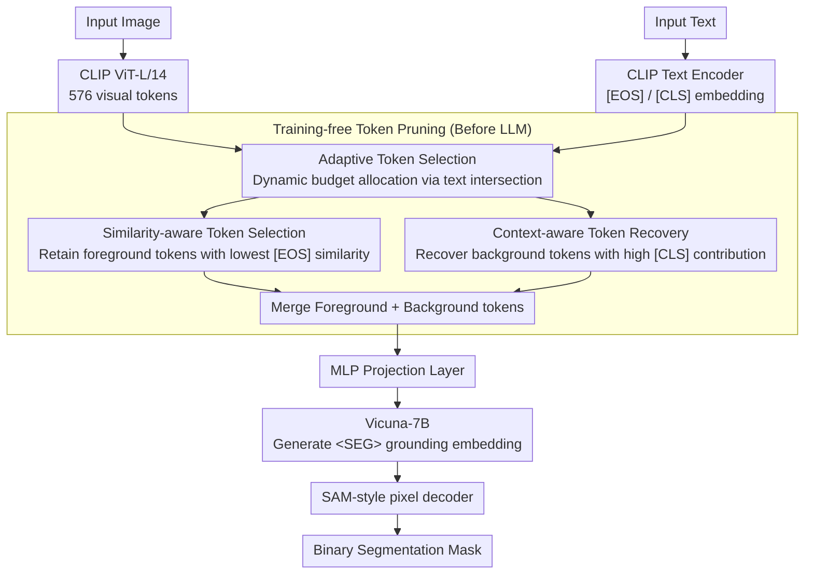

# CLIP Tricks You: Training-free Token Pruning for Efficient Pixel Grounding in Large Vision-Language Models

**Conference**: ICML2024  
**arXiv**: [2404.13178](https://arxiv.org/abs/2404.13178)  
**Code**: https://github.com/sejong-rcv/LiteLVLM  
**Area**: Multimodal VLM  
**Keywords**: Visual token pruning, CLIP similarity reversal, Pixel-level grounding, Training-free inference acceleration, Large Vision-Language Models  

## TL;DR

This work identifies a counter-intuitive "similarity reversal" phenomenon where visual tokens in referred regions exhibit low similarity with text [EOS] tokens in CLIP. Based on this, it proposes LiteLVLM—a training-free, text-guided visual token pruning method. It retains 90.3% of original pixel grounding performance while pruning 66.7% of tokens, achieving 22% inference acceleration and 2.3× memory savings.

## Background & Motivation

**Background**: The inference overhead of Large Vision-Language Models (LVLMs) primarily stems from visual tokens—LLaVA generates 576 visual tokens, while text tokens typically do not exceed 100; high-resolution versions like LLaVA-NeXT can reach 2880. Visual token pruning is thus a critical approach for improving inference efficiency.

**Limitations of Prior Work**: Existing pruning methods (LLaVA-PruMerge, VisionZip, FastV) rely on text-agnostic global importance metrics, which are effective for image understanding but perform poorly in pixel-level grounding tasks. In grounding, token importance highly depends on the input text (e.g., "player" vs. "ball" requires preserving distinct spatial regions), which global metrics fail to capture.

**Key Challenge**: The only method utilizing text information, TRIM, retains tokens based on high CLIP vision-text similarity. However, the authors discover a **similarity reversal** in CLIP—visual tokens of referred regions actually show the lowest similarity with [EOS] text tokens. Consequently, TRIM retains tokens irrelevant to the referred object, leading to performance 10-20% worse than random pruning.

**Goal**: Design a text-guided, training-free token pruning strategy that significantly reduces visual tokens while maintaining segmentation accuracy in pixel-level grounding tasks.

**Key Insight**: The authors analyze the attention distribution of the CLIP [EOS] token and identify a **text attention sink** phenomenon—68% of the [EOS] token's attention is concentrated on the non-semantic [SOS] token, with only 14% allocated to the actual semantic referring word ([RES] token). This results in an [EOS] embedding lacking rich semantics, leading to abnormally low similarity with visual tokens of refers regions.

**Core Idea**: Reverse the ranking of CLIP vision-text similarity—retain low-similarity tokens (covering the referred regions) + recover high [CLS] contribution tokens (providing background context) to achieve a clear foreground-background separation.

## Method

### Overall Architecture

LiteLVLM is built upon the GLaMM architecture: an input image is encoded into 576 visual tokens by CLIP ViT-L/14, and the input text's [EOS] embedding is extracted via the CLIP text encoder. LiteLVLM executes pruning before visual tokens enter the LLM, coordinated by three key designs: Adaptive Token Selection dynamically allocates foreground/background budgets based on text intersections; Similarity-aware Token Selection retains foreground tokens with the lowest similarity to [EOS]; and Context-aware Token Recovery reclaims background tokens with high contributions to [CLS]. The merged tokens are projected via an MLP layer into Vicuna-7B to generate a <SEG> grounding embedding, which a SAM-style pixel decoder uses to output a binary mask. Since pruning occurs before the LLM, it is fully compatible with efficient mechanisms like FlashAttention.

### Key Designs

**1. Similarity-aware Token Selection: Retaining tokens with the lowest similarity to [EOS]**

Intuitively, "high similarity = importance," but TRIM's use of high CLIP vision-text similarity performed worse than random. The root cause is that CLIP contrastive learning only aligns the global [CLS] and [EOS] tokens; local tokens in referred regions receive weak gradients and thus show the lowest similarity with [EOS] (similarity reversal). This work reverses the ranking: calculating the dot-product similarity $s_{i,j} = E_i^{\mathcal{T}} \cdot E_j^{v\top}$ between each visual token $E_j^v$ and the [EOS] embedding $E_i^{\mathcal{T}}$, and selecting the $k$ tokens with the **lowest** similarity. These tokens are weakly aligned with global semantics but retain rich local referral information.

**2. Context-aware Token Recovery: Recovering background tokens for boundary determination**

Retaining only foreground tokens lacks background reference, leading to blurred segmentation boundaries. For the unselected token set $S$, the context contribution score for each token relative to [CLS] is calculated as $s_i' = \| \frac{\exp(Q^{\mathcal{I}} K_i^\top / \sqrt{d})}{\sum_{j \in S} \exp(Q^{\mathcal{I}} K_j^\top / \sqrt{d})} \cdot V_i \|_2$. Tokens with the highest scores are recovered. This score considers both attention weights and the information content of Value vectors ($L2$ norm), picking background tokens that carry global semantics and spatial references.

**3. Adaptive Token Selection: Dynamic foreground/background ratio via text intersection**

Fixed ratios (e.g., 75%/25%) perform inconsistently across scenarios. Given a budget $\mathcal{B}$ and $N$ input text queries, a candidate set $\mathcal{S}_i$ of $\mathcal{B}$ low-similarity tokens is first selected for each query. The intersection $\mathcal{S} = \bigcap_{i=1}^{N} \mathcal{S}_i$ is used as similarity-aware tokens (for $N=1$, it is empirically set to 50% of the budget), and the remaining budget $\mathcal{B} - |\mathcal{S}|$ is filled via context recovery. The intersection size varies naturally with text input—regions focused on by multiple queries are more reliable—allowing the ratio to adjust dynamically.

## Key Experimental Results

### Main Results: Referring Expression Segmentation (Retaining 192/576 tokens, ↓66.7%)

| Method | RefCOCO-val | RefCOCO-testA | RefCOCO+-val | RefCOCOg-val | Avg. | Rel. |
|------|------------|---------------|-------------|-------------|------|------|
| GLaMM (Upper Bound) | 79.5 | 83.2 | 72.6 | 74.2 | 75.5 | 100% |
| TRIM | 55.5 | 58.5 | 40.6 | 45.2 | 47.3 | 62.6% |
| FastV | 69.5 | 73.9 | 57.9 | 61.5 | 62.6 | 82.9% |
| LLaVA-PruMerge | 68.8 | 74.6 | 58.2 | 61.2 | 63.1 | 83.5% |
| VisionZip | 71.1 | 76.4 | 59.7 | 64.7 | 65.5 | 86.7% |
| VisPruner | 72.4 | 75.5 | 61.5 | 65.4 | 66.0 | 87.4% |
| **LiteLVLM** | **74.4** | **78.7** | **64.1** | **66.0** | **68.1** | **90.3%** |

### Ablation Study (RefCOCO-val, different token budgets)

| Configuration | 29 token | 58 token | 144 token | 288 token | Avg. | Description |
|------|----------|----------|-----------|-----------|------|------|
| Random Pruning | 57.2 | 62.7 | 68.2 | 72.0 | 65.0 | Baseline |
| Context Recov. only | 54.5 | 59.9 | 67.4 | 71.6 | 63.3 | Worse than Random |
| High Sim. Selection (↑) | 48.1 | 49.4 | 53.8 | 59.5 | 52.7 | Severe degradation |
| Low Sim. Selection (↓) | 59.8 | 63.6 | 68.4 | 72.8 | 66.1 | Verification of reversal |
| **LiteLVLM (↓ + Recov.)** | **62.5** | **65.2** | **72.9** | **75.2** | **68.9** | Complementary |

### Efficiency Analysis (192 tokens / 64 tokens)

| Method | FLOPs (TB) | Prefill (ms) | CUDA Time (ms) | Memory (GB) |
|------|-----------|-------------|----------------|----------|
| GLaMM (Upper Bound) | 4.66 | 166.25 | 340.89 | 0.81 |
| FastV (192) | 2.65 | 162.88 | 340.25 | 0.81 |
| VisPruner (192) | 2.17 | 75.65 | 276.09 | 0.37 |
| **LiteLVLM (192)** | **2.11** | **74.88** | **265.83** | **0.35** |
| **LiteLVLM (64)** | **1.27** | **54.02** | **237.35** | **0.21** |

### Key Findings

- TRIM (high similarity selection) is consistently the worst method across all budgets, confirming the ubiquity of the CLIP similarity reversal phenomenon.
- Adaptive token selection yields a 2.0% Gain over the best fixed ratio (50/50), highlighting the importance of content-aware dynamic allocation.
- In video grounding (Ref-DAVIS-17 / Refer-YouTube-VOS), retaining 196/576 tokens results in only a 0.5% performance drop, outperforming VisPruner by 4.9-6.7%.
- Pruning before the LLM reduces prefilling time from 166ms to 75ms and is compatible with FlashAttention, unlike FastV.

## Highlights & Insights

- **Discovery of CLIP similarity reversal**: The finding that contrastive learning aligns only global tokens while local tokens are inversely correlated with global representations is highly insightful. This explains TRIM's failure and provides a new perspective on CLIP internal representations.
- **Text attention sink phenomenon**: [EOS] focuses 68% of its attention on the non-semantic [SOS] token, paralleling attention sinks in LLMs and suggesting a universal impact of positional bias on Transformers' special tokens.
- **Inverse thinking methodology**: When intuition (high similarity = importance) fails, reversing the logic transforms a CLIP "flaw" into a precise tool for foreground localization.

## Limitations & Future Work

- The method depends heavily on LVLM architectures using CLIP; it remains to be verified if similarity reversal persists in models using SigLIP or non-contrastive encoders.
- Validation is currently limited to GLaMM/VideoGLaMM; generalization to other grounding architectures like LISA or PixelLM has not been tested.
- The 50% empirical ratio for $N=1$ in adaptive strategy lacks theoretical grounding; more refined budget allocation might further improve performance.
- Optimization is limited to the inference stage; the potential of token pruning during training has not been explored.

## Related Work & Insights

- **LLaVA-PruMerge (ICCV25)**: Text-agnostic pruning based on [CLS] token similarity; effective for image understanding but fails in grounding.
- **TRIM (COLING25)**: Utilizes text information but erroneously chooses high-similarity tokens.
- **VisPruner (ICCV25)**: Prev. SOTA token pruning method; LiteLVLM exceeds it by 2.9-10.2% across settings.
- **FastV (ECCV24)**: Pruning inside the LLM based on attention; incompatible with FlashAttention.

<!-- RELATED:START -->

## Related Papers

- [\[CVPR 2026\] TransPrune: Token Transition Pruning for Efficient Large Vision-Language Model](../../CVPR2026/multimodal_vlm/transprune_token_transition_pruning_for_efficient_large_vision-language_model.md)
- [\[ACL 2026\] HiPrune: Hierarchical Attention for Efficient Token Pruning in Vision-Language Models](../../ACL2026/multimodal_vlm/hiprune_hierarchical_attention_for_efficient_token_pruning_in_vision-language_mo.md)
- [\[CVPR 2026\] ZOO-Prune: Training-Free Token Pruning via Zeroth-Order Gradient Estimation in Vision-Language Models](../../CVPR2026/multimodal_vlm/zoo-prune_training-free_token_pruning_via_zeroth-order_gradient_estimation_in_vi.md)
- [\[ICCV 2025\] METEOR: Multi-Encoder Collaborative Token Pruning for Efficient Vision Language Models](../../ICCV2025/multimodal_vlm/meteor_multi-encoder_collaborative_token_pruning_for_efficient_vision_language_m.md)
- [\[ECCV 2024\] IVTP: Instruction-Guided Visual Token Pruning for Large Vision-Language Models](../../ECCV2024/multimodal_vlm/ivtp_instruction-guided_visual_token_pruning_for_large_vision-language_models.md)

<!-- RELATED:END -->
