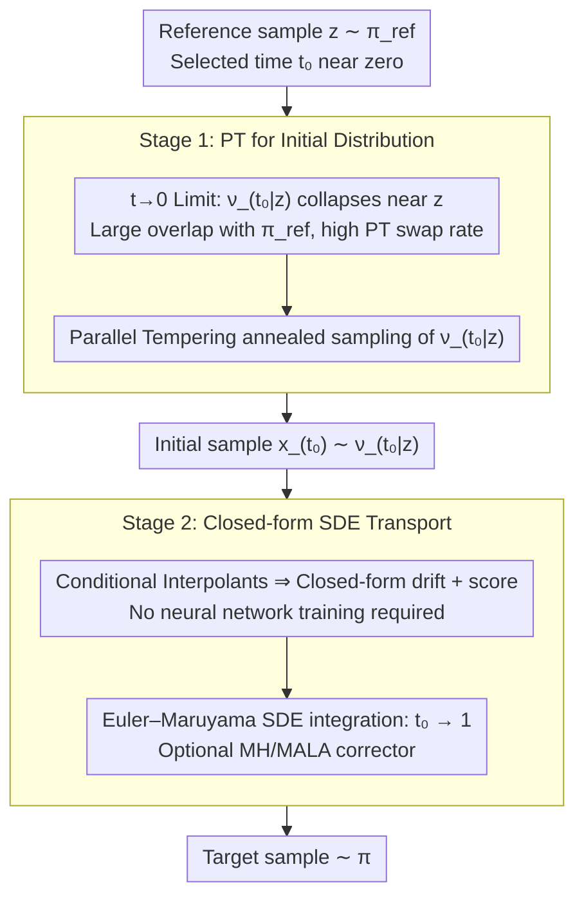

# Conditional Diffusion Sampling

**Conference**: ICML 2026  
**arXiv**: [2605.04013](https://arxiv.org/abs/2605.04013)  
**Code**: https://github.com/Franblueee/conditional_diffusion_sampling  
**Area**: Sampling Algorithms / Diffusion Models; MCMC; Bayesian Inference  
**Keywords**: Parallel Tempering, Conditional Interpolants, closed-form SDE, Multi-modal sampling, Training-free

## TL;DR
This paper proposes Conditional Diffusion Sampling (CDS): by deriving a class of conditional interpolants, an **exact closed-form SDE** (requiring no neural network fitting) is obtained for an unnormalized target distribution. Parallel Tempering (PT) is then used to efficiently sample the initial distribution of this SDE — combining the global exploration capability of PT with the local refinement capability of the diffusion process. It simultaneously outperforms traditional MCMC, training-free MCMC, and neural samplers with fewer density evaluations across 8 target distributions and 4 task types.

## Background & Motivation

**Background**: Independent sampling from an unnormalized multi-modal distribution $\pi(x)\propto \tilde\pi(x)$ is a fundamental problem in ML and natural sciences. Mainstream methods are divided into two categories: (i) annealing-based MCMC (e.g., Parallel Tempering, AIS, SMC), which transmits information between multiple chains by constructing a sequence of intermediate distributions from a reference $\pi_{\text{ref}}$ to the target $\pi$; (ii) diffusion/interpolation-based generative models (neural samplers, stochastic interpolants), which use neural networks to fit the score or drift.

**Limitations of Prior Work**: (i) Annealing methods like PT require many intermediate distributions to remain stable when the overlap between $\pi_{\text{ref}}$ and $\pi$ is small, leading to an explosion in density evaluations (a bottleneck in scenarios like molecular dynamics). (ii) Neural samplers must use a large number of target density evaluations to train neural networks to fit drift/score; the training cost itself consumes the "savings from sampling," and retraining is required for new target distributions. (iii) Existing "training-free diffusion sampling" such as DiGS and RDMC either rely on Metropolis-within-Gibbs (which degrades in high dimensions) or nested MCMC (multiple density evaluations per iteration).

**Key Challenge**: The score function for a general unnormalized distribution is **non-analytical** in diffusion sampling, requiring either neural network training for fitting (leading to the cost dilemma of neural samplers) or nested MCMC for approximation (leading to the overhead dilemma of DiGS/RDMC).

**Goal**: (i) Design a class of interpolation processes such that the SDE drift and score both have closed-form expressions, completely avoiding neural network training. (ii) Control the initialization cost of this SDE so that the entire method significantly outperforms SOTA under a fixed density evaluation budget.

**Key Insight**: Standard stochastic interpolants (Albergo et al. 2025) study the drift of the marginal distribution, which is non-analytical. However, if one **fixes a reference point $z\sim\pi_{\text{ref}}$ and considers the conditional distribution** $\nu_{t\mid z}$, since $\nu_{t\mid z}$ is the pushforward of $\nu$ through a diffeomorphic mapping $F_{t\mid z}$, its density can be **analytically written from the target $\pi$ using the change-of-variable formula**—and the score naturally becomes closed-form!

**Core Idea**: Decompose "sampling $\pi$" into two stages: (1) At a small time $t_0$, $\nu_{t_0\mid z}$ is highly concentrated around $z$ and has a large overlap with $\pi_{\text{ref}}$, allowing for extremely fast sampling using PT. (2) Use the closed-form SDE to transport these samples from $t_0\to 1$ to the target $\pi$.

## Method

### Overall Architecture
Two-stage pipeline (Alg. 1):

- **Stage 1 (PT for Initial Distribution)**: Select a $t_0>0$ close to zero. Starting from a reference $z\sim\pi_{\text{ref}}$, use Parallel Tempering to sample the conditional distribution $\nu_{t_0\mid z}$. Since $\nu_{t_0\mid z}\to \delta_z$ as $t_0\to 0$, it almost completely overlaps with $\pi_{\text{ref}}$, resulting in extremely high PT swap acceptance and fast mixing.
- **Stage 2 (Closed-form SDE Transport)**: Use Euler–Maruyama to integrate a closed-form SDE, transporting samples from $\nu_{t_0\mid z}$ along time $t_0\to 1$ to the target $\nu$. Both the SDE drift and score are analytically available, and an optional MH corrector can be inserted to further reduce discretization error.

The entire method is **completely free of neural network training**, operating solely on evaluations of the target density $\tilde\pi$ and the score $\nabla\log\tilde\pi$.

### Key Designs

**1. Conditional Interpolants: Reclaiming the score from "must train" to "analytical transform of target distribution"**

The fundamental pain point of diffusion sampling is that the score function is not analytical for general unnormalized distributions, forcing people to either train neural networks to fit it or use nested MCMC to approximate it. Standard stochastic interpolants define $x_t = F_t(z, x)$ ($z\sim\nu_{\text{ref}}, x\sim\nu$) and study the marginal distribution of $x_t$—and it is the marginal score that is non-analytical. This paper switches perspectives: **fixing the reference point $z$**, and letting $F_{t\mid z}(\cdot) = F_t(z,\cdot)$ be a diffeomorphism. Then the conditional distribution $\nu_{t\mid z}$ is the pushforward of the target $\nu$ via $F_{t\mid z}$, which can be directly written via the change-of-variable formula as

$$\pi_{t\mid z}(x) = |\det \mathrm{J}F_{t\mid z}(F^{-1}_{t\mid z}(x))|^{-1}\,\pi(F^{-1}_{t\mid z}(x)).$$

As long as the target $\pi$ is evaluable, the conditional density and conditional score $\nabla\log\pi_{t\mid z}$ are both available in closed form. By defining a conditional velocity field $u_{t\mid z}(x) = \partial_t F_{t\mid z}(F^{-1}_{t\mid z}(x))$ and applying the Fokker-Planck equation, an exact SDE that preserves $\pi_{t\mid z}$ is derived: $dx_t = (u_{t\mid z}(x_t) + \frac{\sigma_t^2}{2}\nabla\log\pi_{t\mid z}(x_t))dt + \sigma_t dW_t$. In short, the conditional perspective replaces neural training with "dimensional transformation + analytical density evaluation."

**2. $t\to 0$ Limit: Making initialization cost monotonically vanish, breaking the "sampling initial distribution" catch-22**

The closed-form SDE has a singularity at $t=0$ ($F_{t\mid z}$ is non-invertible, drift diverges), so it must be started from some $t_0>0$. This creates a new task—sampling the initial distribution $\nu_{t_0\mid z}$ at $t_0$, which sounds like returning to square one. The authors prove that this new task is actually much easier than the original one: as $t\to 0$, $W_1(\delta_z, \nu_{t\mid z})\to 0$ (Eq. 10), and the conditional distribution collapses onto the reference point $z$. Using Lipschitz properties, it is further proved that as long as the Lipschitz constant $L_t\le 1$ for the transformed Markov kernel, the error in sampling $\nu_{t\mid z}$ is strictly lower than sampling $\nu$ directly. Common interpolants like linear or trigonometric ones satisfy $L_t\to 0$. Thus, the smaller $t_0$ is, the easier it is for PT to jump from $\pi_{\text{ref}}$ to $\nu_{t_0\mid z}$—this is the pivot of the "free lunch" argument for CDS.

**3. Division of Roles for PT and SDE: Global exploration to PT, local refinement to SDE**

The two stages are not just combined arbitrarily; they complement the respective strengths of the two types of methods. Stage 1 uses Parallel Tempering to anneal from $\pi_{\text{ref}}$ to $\nu_{t_0\mid z}$. Since $t_0$ is small, the intermediate ladder is short, swap acceptance is high, and density evaluations are saved—PT is assigned to the "shortest segment of the distance." Stage 2 uses Euler–Maruyama to integrate the closed-form SDE, pushing these "nearly correct" samples from $t_0\to 1$ to the target. The SDE provides continuous score-correction throughout. There are two non-trivial points here: initialization must actually sample from $\nu_{t_0\mid z}$ rather than simply setting $x_{t_0}=z$ (Appx H proves single-point initialization leads to severe degradation as diffusion cannot create enough support); and directly using the inverse interpolation map $F^{-1}_{t_0\mid z}$ to map samples to $\nu$ is also worse than the SDE path (Fig. 5), because the SDE's continuous correction can automatically fix initialization errors during transport. PT is strong at multi-modal global exploration but sensitive to the $\pi_{\text{ref}}\leftrightarrow\nu$ distance, while the SDE is strong at local refinement but requires a score—CDS leverages the strengths of both while avoiding their weaknesses.

### Loss & Training
**Training-free**. Stage 1 PT uses a non-reversible variant; Stage 2 SDE uses Euler–Maruyama discretization with an optional MH corrector. Hyperparameters include PT steps $K$, integration steps $N$, noise schedule $\sigma_t$, and initial time $t_0$ (optimal values in Fig. 4).

## Key Experimental Results

### Main Results

| Method | Mean HVR (Aggregate 8 tasks, higher is better) |
|------|------------------------------------|
| **CDS (Ours)** | **0.9976 ± 0.0015** |
| NRPT (SOTA non-reversible PT) | 0.9827 ± 0.0083 |
| OASMC (Optimized Annealed SMC) | 0.9287 ± 0.0277 |
| HMC | 0.6263 ± 0.1261 |
| DiGS (Diffusive Gibbs) | 0.5464 ± 0.1550 |
| MALA | 0.5241 ± 0.1494 |

Tasks include Gaussian Mixture (2D and 16D, including non-uniform versions), Lennard-Jones (LJ-13 and LJ-55, chemical potential), Alanine Dipeptide (66D molecular dynamics), and Bayesian Neural Network (550D posterior inference).

### Ablation Study

| Configuration | Main Phenomenon | Explanation |
|------|---------|------|
| $t_0=1.0\to 0.0$ (Fig. 4) | RT monotonically increases, error decreases; degrades when too small | Validates existence of an optimal $t_0$ range |
| SDE transport vs Inverse Map $F^{-1}_{t_0\mid z}$ (Fig. 5) | SDE wins overall, inverse map wins slightly for GM-2 at low budget | SDE score correction repairs initialization errors |
| Init with $x_{t_0}=z$ vs sampling $\nu_{t_0\mid z}$ (Appx H) | Single-point initialization degrades severely | Noise is insufficient to diffuse out the support |
| ALDP 200k budget (Fig. 2) | Only CDS and NRPT reproduce correct mode proportions | A hard metric for multi-modal fidelity |

### Key Findings
- **CDS leads by an cliff-like margin on BNN (550D)**: High-dimensional multi-modal posteriors are a weakness for traditional PT and DiGS; CDS significantly exceeds all baselines in HVR here, demonstrating the advantage of the conditional SDE in high dimensions.
- **Local samplers (MALA/HMC) perform best on LJ tasks**: Local structures dominate LJ potential and mode separation is weak; CDS is comparable to NRPT, reflecting the "method-task fit" principle—CDS is not universally better.
- **An optimal value exists for $t_0$**: If too large, the gap between $\nu_{t_0\mid z}$ and the target $\nu$ is large, degrading PT; if too small, $\nu_{t_0\mid z}$ is overly concentrated, and insufficient replica overlap causes PT swap failure. This trade-off is the core practical hyperparameter of CDS.
- **Linear interpolation has geometric disadvantages on LJ/ALDP**: It can push particle distances near zero, causing numerical instability in high-energy regions; this suggests future work could design task-aware geometric interpolants.
- **DiGS is comparable to CDS on GM-2 but degrades as dimensionality increases**: This is because DiGS's Metropolis-within-Gibbs performs worse in high dimensions, whereas CDS has no such dimensionality penalty.

## Highlights & Insights
- **The "conditional perspective" is an underrated key**: Standard stochastic interpolants were "neuralized" because the marginal score is non-analytical; this paper shows that switching to the conditional score makes it immediately closed-form—this trick of "using conditioning to turn non-analytical into analytical" can be generalized to many generative modeling problems.
- **t→0 is a gift, not a problem**: The $t=0$ singularity in conventional diffusion is seen as a nuisance; this paper turns it around by using the collapse of the initial distribution to a Dirac at $t_0\to 0$ to make Stage 1 nearly free—an aesthetic design that turns a defect into a feature.
- **PT and Diffusion are complementary, not competitive**: They were previously viewed as two separate paths; CDS proves they are a natural pair for "global vs local," providing a new synthesis paradigm for the sampling field.
- **Completely training-free + excellent high-dimensional performance**: Compared to neural samplers that must be retrained for every new target, CDS is truly zero-shot and directly applicable to new molecules or posteriors, which is of great engineering significance.

## Limitations & Future Work
- **Dependence on the choice of interpolation map**: The authors admit linear interpolation in potentials with singularities (LJ, ALDP) may drive trajectories through high-energy regions causing numerical instability; future task-aware nonlinear interpolants (e.g., geometry-adaptive based on $\pi$) are needed.
- **Practical $t_0$ selection lacks automation**: Although Appx C provides some heuristics, grid search is still needed in practice, increasing tuning costs for new tasks.
- **PT swap may still fail at extremely small $t_0$**: If the conditional distribution is too concentrated, replicas do not overlap, leading to collapse; CDS does not provide a fundamental fix, relying on engineering values for $t_0$.
- **Not compared with large-scale neural samplers like Adjoint Sampling under equal budget**: The authors exclude neural samplers as "amortized regime," but for industrial users, "train once, sample cheaply forever" might not be worse than CDS.
- **Lack of end-to-end bounds for theoretical convergence guarantees**: Vanishing transport cost and Lipschitz properties were proven separately, but the total error bound for the two combined stages was not provided.

## Related Work & Insights
- **vs Parallel Tempering (NRPT)**: NRPT is the current gold standard; CDS uses PT for the shortest segment and SDE for the rest, essentially "using PT to solve PT's own pain points."
- **vs Neural samplers (NETS, Adjoint Sampling)**: Neural types must train before sampling, while CDS is training-free; however, neural types can amortize training costs when distributions are shared, whereas CDS runs from scratch every time.
- **vs DiGS / RDMC**: Both are "non-neural diffusion sampling," but DiGS's marginal score uses Gibbs fitting (degrading in high dimensions), and RDMC uses nested MCMC (multiple density evaluations per step); CDS replaces the marginal with a closed-form conditional.
- **vs Stochastic Interpolants (Albergo 2025)**: This paper is its conditional incarnation—changing a framework "for training" into a framework "for zero-shot sampling," which is the first systematic application of this theory to the sampling side.
- **Insight**: This conditional reformulation trick might also be applicable to accelerating normalizing flow training, score matching, and conditional sampling under constraints.

## Rating
- Novelty: ⭐⭐⭐⭐⭐ "Conditional interpolation → closed-form SDE" is a genuine theoretical breakthrough that flips diffusion sampling from "must train" to "completely training-free," with an overall sophisticated framework design.
- Experimental Thoroughness: ⭐⭐⭐⭐ Coverage of 8 distributions across 4 task types, 5 strong baselines, and detailed ablations; however, it was not validated on higher-dimensional scientific applications (e.g., protein conformation sampling), and a fair comparison with the latest neural samplers in an amortized perspective was omitted.
- Writing Quality: ⭐⭐⭐⭐ Rigorous theoretical derivation with a clear two-stage structure; however, the symbol density is high, making it quite steep for readers without a background in interpolation theory.
- Value: ⭐⭐⭐⭐ High value for scenarios like computational chemistry and Bayesian inference where "sampling on-demand per target without pre-training" is required; also provides a generalizable conditional-as-closed-form idea for the ML community.

<!-- RELATED:START -->

## Related Papers

- [\[ICML 2026\] Text-Conditional JEPA for Learning Semantically Rich Visual Representations](text-conditional_jepa_for_learning_semantically_rich_visual_representations.md)
- [\[ICML 2026\] Dimension-Free Multimodal Sampling via Preconditioned Annealed Langevin Dynamics](dimension-free_multimodal_sampling_via_preconditioned_annealed_langevin_dynamics.md)
- [\[CVPR 2026\] Thinking Diffusion: Penalize and Guide Visual-Grounded Reasoning in Diffusion Multimodal Language Models](../../CVPR2026/multimodal_vlm/thinking_diffusion_penalize_and_guide_visual-grounded_reasoning_in_diffusion_mul.md)
- [\[CVPR 2026\] BiomedCCPL: Causal Conditional Prompt Learning for Biomedical Vision-Language Models](../../CVPR2026/multimodal_vlm/biomedccpl_causal_conditional_prompt_learning_for_biomedical_vision-language_mod.md)
- [\[ICML 2026\] Beyond VLM-Based Rewards: Diffusion-Native Latent Reward Modeling](beyond_vlm-based_rewards_diffusion-native_latent_reward_modeling.md)

<!-- RELATED:END -->
