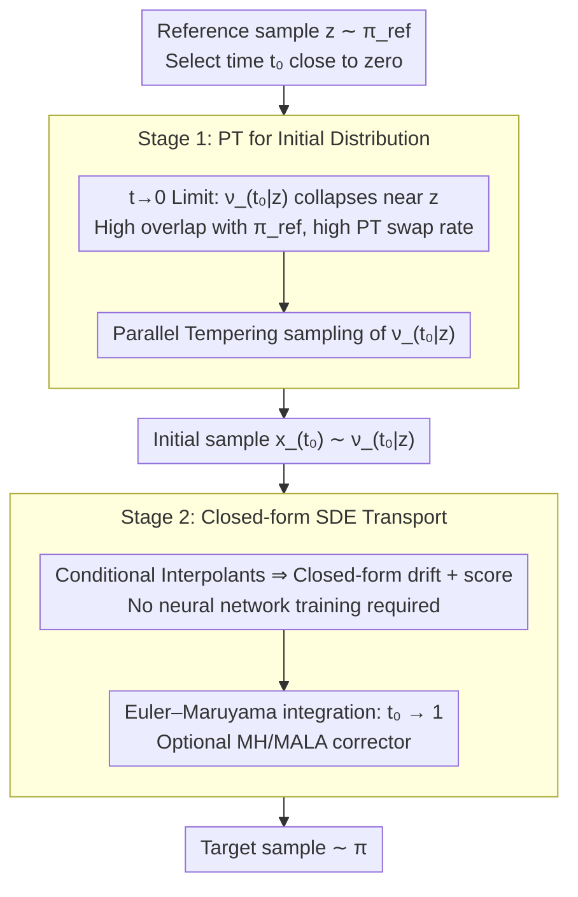

# Conditional Diffusion Sampling

**Conference**: ICML 2026  
**arXiv**: [2605.04013](https://arxiv.org/abs/2605.04013)  
**Code**: https://github.com/Franblueee/conditional_diffusion_sampling  
**Area**: Sampling algorithms / Diffusion models; MCMC; Bayesian inference  
**Keywords**: Parallel Tempering, Conditional Interpolants, closed-form SDE, multimodal sampling, training-free

## TL;DR
This paper proposes Conditional Diffusion Sampling (CDS): by deriving a class of conditional interpolants, an **exact closed-form SDE** for unnormalized target distributions is obtained (without needing neural network approximation). Parallel Tempering (PT) is then used to efficiently sample the initial distribution of this SDE—combining PT's global exploration capability with the diffusion process's local refinement ability. Across 8 target distributions and 4 task categories, it outperforms traditional MCMC, training-free MCMC, and neural samplers with fewer density evaluations.

## Background & Motivation

**Background**: Independent sampling from an unnormalized multimodal distribution $\pi(x)\propto \tilde\pi(x)$ is a fundamental problem in ML and natural sciences. Mainstream methods are divided into two categories: (i) Annealed MCMC (e.g., Parallel Tempering, AIS, SMC), which constructs a sequence of intermediate distributions from a reference $\pi_{\text{ref}}$ to the target $\pi$ to transfer information across chains; (ii) Diffusion/interpolant-based generative models (neural samplers, stochastic interpolants), which use neural networks to fit the score or drift.

**Limitations of Prior Work**: (i) Annealing methods like PT require a massive number of intermediate distributions to remain stable when the overlap between $\pi_{\text{ref}}$ and $\pi$ is small, leading to an explosion in density evaluations (a bottleneck in scenarios like molecular dynamics); (ii) Neural samplers must use a large number of target density evaluations to train NNs to fit the drift/score, where the training cost itself consumes the "sampling savings," and retraining is required for new target distributions; (iii) Existing "training-free diffusion sampling" such as DiGS and RDMC either rely on Metropolis-within-Gibbs (which degrades in high dimensions) or nested MCMC (multiple density evaluations per iteration).

**Key Challenge**: The score function of a diffusion process is **non-analytical** for general unnormalized distributions, necessitating either neural network training (leading to the neural sampler cost dilemma) or nested MCMC approximations (leading to the overhead dilemma of DiGS/RDMC).

**Goal**: (i) Design a class of interpolation processes such that both the drift and score of the SDE have closed-form expressions, completely avoiding neural network training; (ii) Control the initialization cost of this SDE so that the entire method significantly outperforms SOTA under a fixed density evaluation budget.

**Key Insight**: Standard stochastic interpolants (Albergo et al. 2025) study the drift of the marginal distribution, which is non-analytical. However, if one **fixes a reference point $z\sim\pi_{\text{ref}}$ and considers the conditional distribution** $\nu_{t\mid z}$, since $\nu_{t\mid z}$ is the pushforward of $\pi$ through a diffeomorphic mapping $F_{t\mid z}$, its density can be **written analytically from the target $\pi$ using the change-of-variables formula**—and the score naturally becomes closed-form as well!

**Core Idea**: Decompose "sampling $\pi$" into two stages: (1) At a small time $t_0$, $\nu_{t_0\mid z}$ is highly concentrated near $z$ and has a massive overlap with $\pi_{\text{ref}}$, allowing for extremely fast sampling via PT; (2) Use the closed-form SDE to transport these samples along $t_0\to 1$ to the target $\pi$.

## Method

### Overall Architecture
Two-stage pipeline (Alg. 1):

- **Stage 1 (PT for Initial Distribution)**: Select a $t_0>0$ near zero. Starting from a reference $z\sim\pi_{\text{ref}}$, use Parallel Tempering to sample the conditional distribution $\nu_{t_0\mid z}$. Since $\nu_{t_0\mid z}\to \delta_z$ as $t_0\to 0$, it almost completely overlaps with $\pi_{\text{ref}}$, leading to extremely high PT swap acceptance and fast mixing.
- **Stage 2 (Closed-form SDE Transport)**: Integrate a closed-form SDE using Euler–Maruyama to transport samples from $\nu_{t_0\mid z}$ along the time $t_0\to 1$ to the target $\nu$. Both the SDE drift and score are analytically available. An optional MH corrector can be inserted to further reduce discretization errors.

The entire method is **completely free of neural network training**, requiring only evaluations of the target density $\tilde\pi$ and score $\nabla\log\tilde\pi$.

### Key Designs

**1. Conditional Interpolants: Restoring Score from "Must Train" to "Analytical Transform of Target"**

The fundamental pain point of diffusion sampling is that the score function is non-analytical for general unnormalized distributions, forcing researchers into NN training or nested MCMC. Standard stochastic interpolants define $x_t = F_t(z, x)$ ($z\sim\nu_{\text{ref}}, x\sim\nu$) and study the marginal distribution of $x_t$—where the marginal score is precisely what is non-analytical. This paper changes the perspective: **fix the reference point $z$** and let $F_{t\mid z}(\cdot) = F_t(z,\cdot)$ be a diffeomorphism. Then the conditional distribution $\nu_{t\mid z}$ is the pushforward of the target $\nu$ through $F_{t\mid z}$, which can be written directly via the change-of-variables formula:

$$\pi_{t\mid z}(x) = |\det \mathrm{J}F_{t\mid z}(F^{-1}_{t\mid z}(x))|^{-1}\,\pi(F^{-1}_{t\mid z}(x)).$$

As long as the target $\pi$ is evaluable, both the conditional density and the conditional score $\nabla\log\pi_{t\mid z}$ are available in closed-form. By defining the conditional velocity field $u_{t\mid z}(x) = \partial_t F_{t\mid z}(F^{-1}_{t\mid z}(x))$ and applying the Fokker-Planck equation, an exact SDE preserving $\pi_{t\mid z}$ is derived: $dx_t = (u_{t\mid z}(x_t) + \frac{\sigma_t^2}{2}\nabla\log\pi_{t\mid z}(x_t))dt + \sigma_t dW_t$. In short, the conditional perspective swaps neural training for "dimensional transformation + analytical density evaluation."

**2. $t\to 0$ Limit: Making Initialization Cost Vanish to Solve the "Catch-22"**

The closed-form SDE has a singularity at $t=0$ ($F_{t\mid z}$ is non-invertible, drift diverges), necessitating a start from some $t_0>0$. This creates a new task: sampling the initial distribution $\nu_{t_0\mid z}$ at $t_0$, which sounds like returning to square one. The authors prove this new task is significantly easier: as $t\to 0$, $W_1(\delta_z, \nu_{t\mid z})\to 0$ (Eq. 10), meaning the conditional distribution collapses onto the reference point $z$. Using Lipschitz properties, it is proved that as long as the Lipschitz constant $L_t\le 1$ for the transformed Markov kernel, the error in sampling $\nu_{t\mid z}$ is strictly lower than sampling $\nu$ directly. Common interpolants (linear, trigonometric) satisfy $L_t\to 0$. Thus, the smaller $t_0$ is, the easier it is for PT to jump from $\pi_{\text{ref}}$ to $\nu_{t_0\mid z}$—this is the fulcrum of the CDS "free lunch" argument.

**3. Roles of PT and SDE: Global Exploration to PT, Local Refinement to SDE**

The two-stage design complements the strengths of both methods. Stage 1 uses Parallel Tempering to anneal from $\pi_{\text{ref}}$ to $\nu_{t_0\mid z}$; since $t_0$ is small, the ladder is short and swap acceptance is high, saving density evaluations. Stage 2 uses Euler–Maruyama to integrate the closed-form SDE, pushing samples that are "already roughly correct" along $t_0\to 1$ to the target. The SDE handles continuous score-correction throughout the process. Two non-trivial points: initialization must actually sample $\nu_{t_0\mid z}$ rather than simply setting $x_{t_0}=z$ (Appx H shows single-point initialization degrades significantly); and using the inverse interpolant map $F^{-1}_{t_0\mid z}$ to map samples directly to $\nu$ is worse than the SDE path (Fig. 5), as continuous SDE correction automatically fixes initialization errors. PT is strong at multimodal global exploration but sensitive to distance, while SDE is strong at local refinement but requires a score—CDS leverages the best of both.

### Loss & Training
**Training-free**. Stage 1 PT uses a non-reversible variant; Stage 2 SDE uses Euler–Maruyama discretization with an optional MH corrector. Hyperparameters include PT steps $K$, integration steps $N$, noise schedule $\sigma_t$, and initial time $t_0$ (optimal values in Fig. 4).

## Key Experimental Results

### Main Results

| Method | Mean HVR (Aggregate over 8 tasks, higher is better) |
|------|------------------------------------|
| **CDS (Ours)** | **0.9976 ± 0.0015** |
| NRPT (SOTA non-reversible PT) | 0.9827 ± 0.0083 |
| OASMC (Optimized Annealed SMC) | 0.9287 ± 0.0277 |
| HMC | 0.6263 ± 0.1261 |
| DiGS (Diffusive Gibbs) | 0.5464 ± 0.1550 |
| MALA | 0.5241 ± 0.1494 |

Tasks cover Gaussian Mixture (2D and 16D, including non-uniform), Lennard-Jones (LJ-13 and LJ-55, chemical potential), Alanine Dipeptide (66D molecular dynamics), and Bayesian Neural Network (550D posterior inference).

### Ablation Study

| Configuration | Primary Phenomenon | Description |
|------|---------|------|
| $t_0=1.0\to 0.0$ (Fig. 4) | Acceptance rate rises, error drops; degrades if too small | Verifies the existence of an optimal $t_0$ interval |
| SDE transport vs. Inverse map $F^{-1}_{t_0\mid z}$ (Fig. 5) | SDE wins overall | SDE score correction repairs initialization errors |
| $x_{t_0}=z$ vs. sampling $\nu_{t_0\mid z}$ (Appx H) | Single-point initialization seriously degrades | Noise is insufficient to spread out the support |
| ALDP 200k budget (Fig. 2) | Only CDS and NRPT recover correct mode ratios | Hard metric for multimodal fidelity |

### Key Findings
- **CDS leads by a landslide on BNN (550D)**: High-dimensional multimodal posteriors are weaknesses for traditional PT and DiGS. CDS significantly exceeds all baselines in HVR, demonstrating the advantage of conditional SDEs in high dimensions.
- **Local samplers (MALA/HMC) perform best on LJ tasks**: LJ potentials are dominated by local structures with weak mode separation. CDS matches NRPT, illustrating the principle of "method-task matching"—CDS is not universally superior.
- **An optimal $t_0$ exists**: If too large, $\nu_{t_0\mid z}$ remains distant from $\nu$, causing PT degradation; if too small, $\nu_{t_0\mid z}$ is too concentrated, leading to insufficient replica overlap and PT swap failure. This trade-off is the core practical hyperparameter for CDS.
- **Linear interpolants have geometric disadvantages on LJ/ALDP**: They can push particle distances near zero, causing numerical instability in high-energy regions; this suggests future work on task-aware geometric interpolants.
- **DiGS matches CDS on GM-2 but degrades as dimensions rise**: This is because DiGS's Metropolis-within-Gibbs sampler worsens in high dimensions, whereas CDS does not suffer this dimensionality penalty.

## Highlights & Insights
- **The "conditional perspective" is an undervalued key**: Standard stochastic interpolants were neuralized because marginal scores are non-analytical. Changing the perspective to conditional scores makes them analytical—a trick that could be generalized to many generative modeling problems.
- **$t\to 0$ is a gift, not a problem**: The $t=0$ singularity in diffusion is usually viewed as a nuisance; this paper uses the collapse of the initial distribution as $t_0\to 0$ to make Stage 1 almost "free," turning a defect into a feature.
- **PT and Diffusion are complementary, not competing**: Previously viewed as separate paths, CDS proves they are a natural pair for "global vs local" exploration, providing a new synthesis paradigm for sampling.
- **Zero-shot + High-dimensional performance**: Unlike neural samplers that require retraining for every new target, CDS is truly zero-shot and directly applicable to new molecules or posteriors, offering significant engineering value.

## Limitations & Future Work
- **Dependence on interpolant mapping choice**: The authors admit linear interpolants may drive trajectories through high-energy regions in potentials with singularities (LJ, ALDP). Task-aware nonlinear interpolants are needed.
- **Lack of automated $t_0$ selection**: While Appx C provides heuristics, grid search is still needed in practice, increasing tuning costs for new tasks.
- **PT swap failure at infinitesimal $t_0$**: When conditional distributions are overly concentrated, replicas fail to overlap, leading to collapse; CDS does not fix this fundamentally but relies on engineering $t_0$.
- **Not compared with large-scale neural samplers (e.g., Adjoint Sampling) under equal budgets**: Neural samplers are classified as "amortized regime," but for industrial users, "train once, sample infinitely" might be preferred over CDS.
- **Lack of end-to-end theoretical convergence bounds**: Lipschitz properties and vanishing transport costs are proved separately, but a total error bound for the combined two-stage pipeline is missing.

## Related Work & Insights
- **vs. Parallel Tempering (NRPT)**: NRPT is the current gold standard; CDS uses PT for the "shortest distance" segment and SDE for the rest, essentially using PT to solve PT's own bottlenecks.
- **vs. Neural samplers (NETS, Adjoint Sampling)**: Neural types require training; CDS is training-free. However, neural samplers can amortize training costs when distributions are shared.
- **vs. DiGS / RDMC**: Both are "non-neural diffusion sampling," but DiGS uses Gibbs for marginal scores (high-dim degradation) and RDMC uses nested MCMC (high cost); CDS uses conditioning to replace marginals with closed-forms.
- **vs. Stochastic Interpolants (Albergo 2025)**: This paper is the conditional incarnation of that theory—shifting the framework from "for training" to "for zero-shot sampling," representing the first systematic application in sampling.

## Rating
- Novelty: ⭐⭐⭐⭐⭐ "Conditional interpolation → Closed-form SDE" is a genuine theoretical breakthrough, flipping diffusion sampling from "must train" to "completely training-free."
- Experimental Thoroughness: ⭐⭐⭐⭐ Covers 8 distributions, 5 strong baselines, and detailed ablations; however, it lacks validation on higher-dimensional scientific apps (e.g., protein conformation) and fair comparison with amortized neural samplers.
- Writing Quality: ⭐⭐⭐⭐ Rigorous derivation and clear structure, though the notation density is high for readers without an interpolant theory background.
- Value: ⭐⭐⭐⭐ Highly valuable for computational chemistry and Bayesian inference where "on-the-fly" sampling is required; also provides a generalizable "conditional-as-closed-form" logic for the ML community.

<!-- RELATED:START -->

## Related Papers

- [\[ICML 2026\] Text-Conditional JEPA for Learning Semantically Rich Visual Representations](text-conditional_jepa_for_learning_semantically_rich_visual_representations.md)
- [\[ICML 2026\] Dimension-Free Multimodal Sampling via Preconditioned Annealed Langevin Dynamics](dimension-free_multimodal_sampling_via_preconditioned_annealed_langevin_dynamics.md)
- [\[ICLR 2026\] Asynchronous Matching with Dynamic Sampling for Multimodal Dataset Distillation](../../ICLR2026/multimodal_vlm/asynchronous_matching_with_dynamic_sampling_for_multimodal_dataset_distillation.md)
- [\[CVPR 2026\] BiomedCCPL: Causal Conditional Prompt Learning for Biomedical Vision-Language Models](../../CVPR2026/multimodal_vlm/biomedccpl_causal_conditional_prompt_learning_for_biomedical_vision-language_mod.md)
- [\[ICML 2026\] Beyond VLM-Based Rewards: Diffusion-Native Latent Reward Modeling](beyond_vlm-based_rewards_diffusion-native_latent_reward_modeling.md)

<!-- RELATED:END -->
