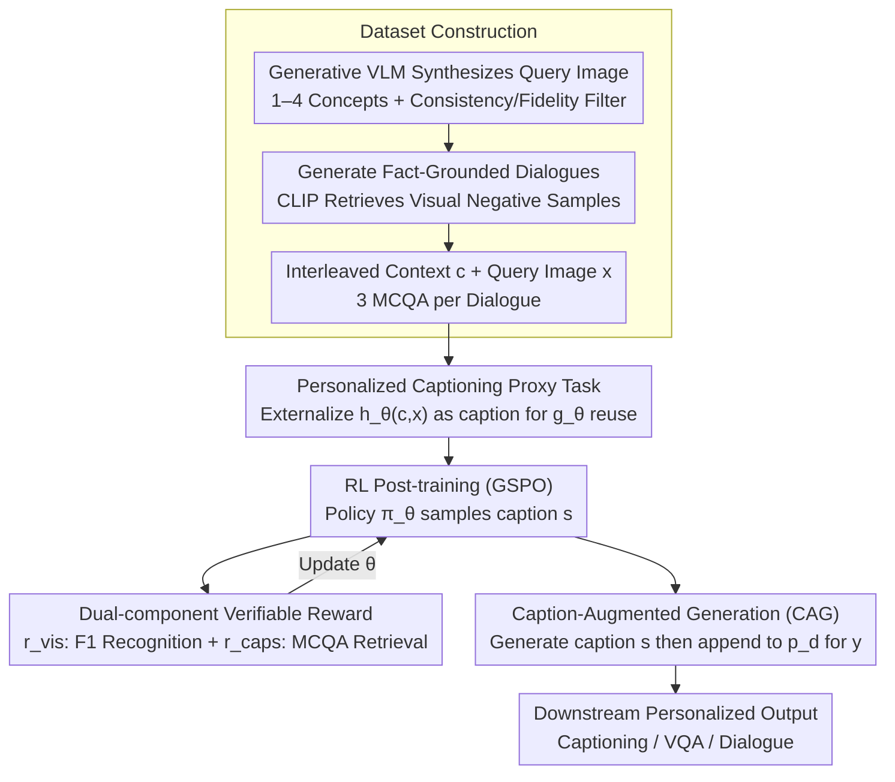

# Contextualized Visual Personalization in Vision-Language Models

**Conference**: ICML2026  
**arXiv**: [2602.03454](https://arxiv.org/abs/2602.03454)  
**Code**: https://oyt9306.github.io/covip.github.io/ (Project Page)  
**Area**: Multimodal VLM  
**Keywords**: Visual Personalization, Personalized Captioning, RL Post-training, Contextual Memory, Multimodal Dialogue

## TL;DR
CoViP converges the open task of "visual personalization based on user historical experience" into a shared underlying process of "personalized image captioning." Through RL post-training with verifiable rewards and Caption-Augmented Generation (CAG) at inference, it enables VLMs to truly "speak human" within interleaved image-text contexts. It also introduces an MCQA diagnostic benchmark to exclude textual shortcuts.

## Background & Motivation

**Background**: Current VLMs (LLaVA, Qwen-VL, InternVL, etc.) excel at describing images and performing basic dialogue/VQA. However, "personalization" remains superficial—given a photo, the model might say "a man in a black suit" without recognizing him as the "brother" mentioned in a previous round of dialogue.

**Limitations of Prior Work**: Existing visual personalization works (MyVLM, Yo'LLaVA, TAME, RAP, RePIC, etc.) face three categories of limitations: (1) They only support simple attributes or single-identity personalization, failing to handle rich contextual "episodic memory"; (2) Evaluation metrics focus on "name recall," allowing VLMs to cheat by searching for text shortcuts in the context; (3) Most rely on SFT or external memory banks, making them difficult to generalize to arbitrary downstream tasks without scene-specific retraining.

**Key Challenge**: Personalization in real-world scenarios is open-ended and long-tailed—users may ask any question related to episodic history, leading to a massive output space. Pure task-specific post-training cannot exhaust all prompt forms, yet zero-shot models fail the "identify in-context concepts → associate with user history → reuse in answers" capability.

**Goal**: (1) Formally define the new paradigm of "Contextualized Visual Personalization"; (2) Identify a learnable "shared underlying process" that generalizes to downstream tasks; (3) Propose a diagnostic evaluation protocol resistant to textual shortcuts.

**Key Insight**: The authors observe that regardless of whether the downstream task is captioning, VQA, or dialogue, the VLM must first "interpret the current image within the user's context." This step can be decoupled. By formalizing VLM computation into $z=h_\theta(c,x)$ (contextual visual encoder) and $y=g_\theta(z,p)$ (task-specific generator), it is found that $h_\theta$ is isomorphic to "personalized image captioning," which explicitly externalizes $z$ into natural language.

**Core Idea**: Treat "personalized image captioning" as a proxy task to train $h_\theta$. Use RL with verifiable rewards to teach the model both "fine-grained recognition of in-context concepts" and "accurate retrieval of corresponding textual experience." During inference, use model-generated captions as additional conditions (Caption-Augmented Generation, CAG) to indirectly amplify personalization quality across downstream tasks.

## Method

### Overall Architecture
Given a query image $x$, a user prompt $p$, and an interleaved image-text context $c$, the VLM $f_\theta$ outputs $y=f_\theta(c,x,p)$. CoViP splits internal computation into $z=h_\theta(c,x),\,y=g_\theta(z,p)$. The pipeline consists of four components:

1.  **Personalized Captioning Benchmark Construction**: Uses a generative VLM (Gemini-class) to synthesize query images containing 1–4 concepts based on open-source galleries like Unsplash, with instruction consistency and visual fidelity filtering. Multi-turn, strictly fact-grounded "user-model" dialogues are generated for each positive sample. CLIP-L/14 is used to retrieve visually similar negative samples for context construction.
2.  **CapEval-QAs Evaluation Protocol**: For each dialogue, an LLM generates 3 factual MCQA pairs $(q_{ik},a_{ik})\sim\mathcal{G}(d_i)$. During evaluation, a judge model $\mathcal{J}$ is only provided with the caption $s$ and the question $q_{ik}$. Positive concept questions must be answered correctly ($\text{Acc}^+$, measuring "accurate capture of relevant info"), while negative concept questions should result in "cannot be determined" ($\text{Acc}^-$, measuring "avoidance of hallucinations").
3.  **RL Post-training**: Uses the GSPO algorithm to maximize the expected verifiable reward $\mathbb{E}_{(x,c)\sim\mathcal{D}_{\text{tr}}}\mathbb{E}_{s\sim\pi_\theta(\cdot\mid x,c,p_s)}[r(s,x,c)]$, where $r=r_{\text{vis}}+r_{\text{caps}}$ drives both recognition and retrieval.
4.  **CAG Inference**: The model first generates a caption $s\sim\pi_\theta(\cdot\mid x,c,p_s)$ based on a captioning prompt $p_s$, then appends $s$ to the downstream prompt $p_d$ to produce the final answer $y\sim\pi_\theta(\cdot\mid x,c,p_d,s)$.

### Key Designs

**1. Personalized Captioning as a Proxy Task: Converging open-ended downstream tasks into a single supervised, rewarded, and generalizable objective.**

Real-world personalization tasks are open and long-tailed, making it impossible to perform SFT or design rewards for every possible downstream form. CoViP breaks this by leveraging the decomposition $z=h_\theta(c,x),\,y=g_\theta(z,p)$. Regardless of the task, the model must interpret the current image within the user's context ($h_\theta$). Personalized captioning is isomorphic to $h_\theta$ as it externalizes $z$ into language without intermediate reasoning redundancies. Training a model to write personalized captions essentially trains a high-quality contextual visual processor that any downstream $g_\theta$ can reuse.

**2. Dual-component Verifiable Reward: F1 for "Recognition" and MCQA for "Retrieval" to block cheating.**

Previous personalization RL relied on BLEU/CIDEr (encouraging text shortcut copying) or "name recall" (too coarse). CoViP splits the reward into two orthogonal components. The recognition reward uses set-level F1: $r_{\text{vis}}(x,c)=\text{F1}(\hat{H},H)=\frac{2|\hat{H}\cap H|}{|\hat{H}|+|H|}$, scoring the prediction of which in-context concepts appear in the query image. The retrieval reward $r_{\text{caps}}(s,c)$ utilizes the MCQA protocol, measuring retrieval through the difference in probabilities $\sigma^+(s;QA^+)-\sigma^-(s;QA^-)$ and penalizing output degeneration. These hard, verifiable metrics prevent the model from "hacking" rewards via keyword stuffing.

**3. Caption-Augmented Generation (CAG): Reusing refined captioning capabilities as a "draft" for downstream tasks.**

How to migrate the refined captioning capability to VQA or dialogue without retraining? CoViP treats the caption as an explicit "internal draft." Instead of one-step generation $y\sim\pi_\theta(\cdot\mid x,c,p_d)$, CAG uses two steps: first generating $s\sim\pi_\theta(\cdot\mid x,c,p_s)$, then answering $y\sim\pi_\theta(\cdot\mid x,c,p_d,s)$. Both steps use the same $\pi_\theta$ without new modules. Captions after RL provide denser personalization details than direct answers, allowing $g_\theta$ to leverage the work already done by $h_\theta$, similar to a lightweight chain-of-thought.

### Loss & Training
The policy $\pi_\theta(s\mid x,c,p_s)$ is optimized using GSPO (Group Sequence Policy Optimization) to maximize $\mathbb{E}[r(s,x,c)]$. The training set contains 2.8K samples, and the test set 1.3K. The judge model $\mathcal{J}$ for rewards is a fixed external LLM, ensuring stable RL signals.

## Key Experimental Results

### Main Results

CapEval-QAs $\text{Acc}^+$/$\text{Acc}^-$ under 1–4 concepts (abbreviated):

| Model | 1-Concept $\text{Acc}^+$ / $\text{Acc}^-$ | 4-Concepts $\text{Acc}^+$ / $\text{Acc}^-$ | Remarks |
|---|---|---|---|
| GPT-4o | 34.2 / 98.2 | 15.3 / 99.2 | High $\text{Acc}^-$, low $\text{Acc}^+$ |
| GPT-5 (SOTA) | 48.3 / 97.3 | 26.1 / 98.7 | Strongest closed-source baseline |
| Baseline Open VLM | Low | Significantly Low | Fails with multiple concepts |
| **CoViP (Ours)** | **Significant Outperformance** | **Significant Outperformance** | Large Gain in $\text{Acc}^+$ across all concept counts |

Closed-source models achieve near-ceiling $\text{Acc}^-$ (avoiding hallucinations) but have lower $\text{Acc}^+$ (recalling what should be said), indicating a conservative output strategy. CoViP improves both ends through RL.

### Ablation Study

| Configuration | Observation | Explanation |
|---|---|---|
| Full CoViP ($r_{\text{vis}}+r_{\text{caps}}$ + CAG) | Best | Synergy of proxy task, dual reward, and CAG |
| w/o $r_{\text{vis}}$ (No F1 reward) | $\text{Acc}^+$ drops | Loss of fine-grained discrimination between concepts |
| w/o $r_{\text{caps}}$ (No MCQA reward) | $\text{Acc}^-$ drops | Captions include irrelevant contextual content |
| w/o $R(s)$ (No degeneration filter) | Degenerated output | Repetitive or empty captions occur |
| w/o CAG (Direct downstream answer) | Score drops across tasks | Loss of the "caption as internal draft" benefit |

### Key Findings
- **Closed-source VLMs approach a ceiling in $\text{Acc}^-$ (98–99) but show significant $\text{Acc}^+$ decay with more concepts**: They stay safe by "saying less," sacrificing recall. CoViP's dual rewards correct this behavior.
- **CAG is efficient**: One extra caption forward pass provides a unified boost to all downstream tasks, which is more cost-effective than task-specific training.
- **Verifiable rewards prevent reward hacking**: Hard metrics (F1 + MCQA) prevent models from gaming the system with long or repetitive strings.
- **Diagnostic tasks cover reactive → proactive**: CoViP remains stable from "passively answering questions about history" to "proactively mentioning relevant history," showing general contextual modeling.

## Highlights & Insights
- Projecting the open task space back to a single learnable proxy (captioning) is an elegant decoupling: training $h_\theta$ once enables transfer to all $g_\theta$ variants.
- F1-based set-level VR provides much denser signals than 0/1 rewards in multi-concept scenarios, offering smooth gradients for multimodal RL.
- The MCQA-based VR aligns the evaluation protocol with the reward signal, avoiding the common "train on A, test on B" objective mismatch.
- CAG is a practical implementation of "the model as its own retriever," offering a lightweight alternative to CoT by generating a caption draft without requiring a full reasoning trace.

## Limitations & Future Work
- The 2.8K/1.3K benchmark size is small compared to modern datasets, and synthetic data may have distribution shifts.
- $r_{\text{caps}}$ relies heavily on an external judge; shifts in the judge model could contaminate the reward signal.
- The $h_\theta/g_\theta$ decomposition is a functional hypothesis; if VLM internal computation does not follow this order, the transferability may weaken.
- CAG introduces latency; performance-sensitive applications may need caption caching or asynchronous generation.
- The evaluation currently lacks coverage of long-term evolving user experiences and context eviction.

## Related Work & Insights
- **vs MyVLM / Yo'LLaVA**: Early methods only support single-concept zero-shot personalization via templates. CoViP scales to long-context, multi-concept RL.
- **vs RAP (SFT version)**: RAP uses SFT; CoViP shifts to RL with set-level F1 and CAG, allowing downstream tasks to benefit with zero additional training.
- **vs RePIC**: RePIC evaluates "name recall" in captioning; CoViP's CapEval-QAs scores both accuracy and hallucination avoidance across multiple downstream tasks.
- **vs TAME**: TAME uses external controllers; CoViP follows a pure learning route with a single model, making deployment simpler.

## Rating
- Novelty: ⭐⭐⭐⭐ (Converging personalization to a captioning proxy is a major insight).
- Experimental Thoroughness: ⭐⭐⭐⭐ (Diagnostic tasks and baselines are comprehensive).
- Writing Quality: ⭐⭐⭐⭐ (Clear argumentation and logical transitions).
- Value: ⭐⭐⭐⭐ (The framework of "Proxy + Verifiable Reward + CAG" is directly applicable to industrial VLM deployment).

<!-- RELATED:START -->

## Related Papers

- [\[CVPR 2026\] Ego: Embedding-Guided Personalization of Vision-Language Models](../../CVPR2026/multimodal_vlm/ego_embedding-guided_personalization_of_vision-language_models.md)
- [\[ICML 2026\] Jailbreaking Vision-Language Models Through the Visual Modality](jailbreaking_vision-language_models_through_the_visual_modality.md)
- [\[CVPR 2026\] Same or Not? Enhancing Visual Perception in Vision-Language Models](../../CVPR2026/multimodal_vlm/same_or_not_enhancing_visual_perception_in_vision-language_models.md)
- [\[CVPR 2025\] RAP: Retrieval-Augmented Personalization for Multimodal Large Language Models](../../CVPR2025/multimodal_vlm/rap_retrieval-augmented_personalization_for_multimodal_large_language_models.md)
- [\[ICML 2026\] On the Adversarial Robustness of Large Vision-Language Models under Visual Token Compression](on_the_adversarial_robustness_of_large_vision-language_models_under_visual_token.md)

<!-- RELATED:END -->
