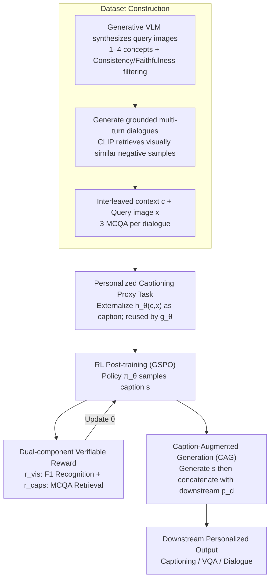

# Contextualized Visual Personalization in Vision-Language Models

**Conference**: ICML2026  
**arXiv**: [2602.03454](https://arxiv.org/abs/2602.03454)  
**Code**: https://oyt9306.github.io/covip.github.io/ (Project Page)  
**Area**: Multimodal VLM  
**Keywords**: Visual Personalization, Personalized Captioning, Reinforcement Learning Post-training, Contextual Memory, Multimodal Dialogue

## TL;DR
CoViP converges the open-ended task of "visual personalization based on user history" into a shared underlying process of "personalized image captioning." By employing RL post-training with verifiable rewards and inference-time Caption-Augmented Generation (CAG), it enables VLMs to "generate human-like grounded descriptions" within interleaved vision-language contexts, complemented by an MCQA diagnostic benchmark designed to exclude textual shortcuts.

## Background & Motivation

**Background**: Current VLMs (e.g., LLaVA, Qwen-VL, InternVL) excel at describing images and performing basic dialogue or VQA. However, "personalization" remains superficial. Given a photo, the model might say "a man in a black suit," but it fails to recognize that this person is the "brother" mentioned by the user in a previous turn.

**Limitations of Prior Work**: Existing visual personalization works (e.g., MyVLM, Yo'LLaVA, TAME, RAP, RePIC) suffer from three main limitations: (1) support is limited to simple attributes or single identities, failing to handle rich "episodic memory" contexts; (2) evaluation metrics rely on "name recall," which VLMs can "cheat" by searching for textual shortcuts in the context; (3) most rely on SFT or external memory banks, making it difficult to generalize to arbitrary downstream tasks without scene-specific retraining.

**Key Challenge**: Personalization in real-world scenarios is open-ended and long-tailed. Users may ask any question related to episodic history, leading to a massive output space. Task-specific post-training cannot cover all prompt forms, yet zero-shot models lack the ability to "identify visual concepts in context $\rightarrow$ associate with user history $\rightarrow$ reuse in responses."

**Goal**: (1) Formally define the new paradigm of "Contextualized Visual Personalization"; (2) identify a learnable "shared underlying process" that generalizes to arbitrary downstream tasks; (3) provide a diagnostic evaluation protocol that prevents textual shortcuts.

**Key Insight**: The authors observe that regardless of whether the downstream task is captioning, VQA, or dialogue, the VLM must first "interpret the current image within the context of the user background." This step can be decoupled. By formalizing the VLM internal computation as $z=h_\theta(c,x)$ (contextual visual encoder) and $y=g_\theta(z,p)$ (task-specific generator), they find that $h_\theta$ is isomorphic to "personalized image captioning"—captioning explicitly externalizes $z$ into natural language.

**Core Idea**: Use "personalized image captioning" as a proxy task to train $h_\theta$. Employ RL with verifiable rewards to enable the model to simultaneously "recognize in-context concepts with fine granularity" and "accurately retrieve corresponding textual experiences." During inference, the model-generated caption is fed back as an additional condition (Caption-Augmented Generation, CAG) to indirectly amplify personalization quality across downstream tasks.

## Method

### Overall Architecture
Given a query image $x$, a user prompt $p$, and interleaved vision-language context $c$, the VLM $f_\theta$ outputs a response $y=f_\theta(c,x,p)$. CoViP decomposes this as $z=h_\theta(c,x),\,y=g_\theta(z,p)$. The pipeline consists of four components:

1.  **Personalized Captioning Benchmark Construction**: A generative VLM (Gemini-class) synthesizes query images containing 1–4 concepts based on open-source libraries like Unsplash, followed by instruction consistency and visual faithfulness filtering. Multi-turn, factually grounded "user-model" dialogues are generated for positive samples. CLIP-L/14 retrieves visually similar negative samples to construct interleaved contexts.
2.  **CapEval-QAs Evaluation Protocol**: For each dialogue, an LLM generates three factual MCQA pairs $(q_{ik},a_{ik})\sim\mathcal{G}(d_i)$. During evaluation, the judge model $\mathcal{J}$ receives only the caption $s$ and question $q_{ik}$. It must correctly answer positive concept questions ($\text{Acc}^+$, measuring accurate information capture) and select "cannot determine" for negative concept questions ($\text{Acc}^-$, measuring avoidance of hallucinations).
3.  **RL Post-training**: The GSPO algorithm is used to maximize the expected verifiable reward $\mathbb{E}_{(x,c)\sim\mathcal{D}_{\text{tr}}}\mathbb{E}_{s\sim\pi_\theta(\cdot\mid x,c,p_s)}[r(s,x,c)]$, where $r=r_{\text{vis}}+r_{\text{caps}}$ drives both recognition and retrieval.
4.  **CAG Inference**: The model first generates a caption $s\sim\pi_\theta(\cdot\mid x,c,p_s)$ based on a captioning prompt $p_s$. This $s$ is then appended to the downstream prompt $p_d$ to produce the final response $y\sim\pi_\theta(\cdot\mid x,c,p_d,s)$.

### Key Designs

**1. Captioning as Proxy Task: Converging open-ended tasks into a supervised, rewardable, and generalizable goal**

Personalization tasks are long-tailed; it is impossible to perform SFT or design rewards for every possible downstream task. CoViP breaks this by decomposing the process into $z=h_\theta(c,x)$ and $y=g_\theta(z,p)$. Since any task requires interpreting the image in context ($h_\theta$), training for personalized captioning—which explicitly externalizes $z$—effectively trains a high-quality $h_\theta$ that any $g_\theta$ can reuse. This choice treats "personalization capability" as a shared primitive rather than a task-specific feature.

**2. Dual-component Verifiable Reward: F1 for Recognition, MCQA for Retrieval**

To avoid textual shortcut exploitation (common in BLEU/CIDEr), CoViP splits the reward into orthogonal parts. The recognition reward uses set-level F1: $r_{\text{vis}}(x,c)=\text{F1}(\hat{H},H)=\frac{2|\hat{H}\cap H|}{|\hat{H}|+|H|}$, scoring predictions of which in-context concepts appear in the query image. The retrieval reward $r_{\text{caps}}(s,c)$ utilizes MCQA to measure how well the caption answers positive/negative questions, penalizing degradation ($R(s)>0$) with a score of $-1$. These hard metrics prevent the model from "hacking" rewards via keyword stuffing.

**3. Caption-Augmented Generation (CAG): Reusing captioning skills as "drafts" for downstream tasks**

Once RL optimizes captioning, CoViP applies this to tasks like VQA without further training. Instead of a single step $y\sim\pi_\theta(\cdot\mid x,c,p_d)$, CAG generates $s\sim\pi_\theta(\cdot\mid x,c,p_s)$ first, then uses $s$ as context for $y$. Since the RL-trained caption contains dense personalized details, $g_\theta$ is relieved from re-interpreting the visual context. This acts as a lightweight Chain-of-Thought (CoT), requiring only one extra forward pass.

### Loss & Training
The policy $\pi_\theta(s\mid x,c,p_s)$ is optimized via GSPO to maximize $\mathbb{E}[r(s,x,c)]$. The dataset contains 2.8K training and 1.3K test personalized captioning samples. The judge model $\mathcal{J}$ is a fixed external LLM, ensuring stable RL signals decoupled from the policy model.

## Key Experimental Results

### Main Results

$\text{Acc}^+$/$\text{Acc}^-$ on CapEval-QAs (1–4 concepts):

| Model | 1-Concept $\text{Acc}^+$ / $\text{Acc}^-$ | 4-Concepts $\text{Acc}^+$ / $\text{Acc}^-$ | Note |
|---|---|---|---|
| GPT-4o | 34.2 / 98.2 | 15.3 / 99.2 | High $\text{Acc}^-$, low $\text{Acc}^+$ |
| GPT-5 | 48.3 / 97.3 | 26.1 / 98.7 | Strongest closed-source baseline |
| Baseline Open VLM | Low | Significantly low | Fails at multiple concepts |
| **CoViP (Ours)** | **Significant improvement** | **Significant improvement** | Large gain in $\text{Acc}^+$ for all counts |

Closed-source models achieve near-perfect $\text{Acc}^-$ (avoiding hallucinations) but have low $\text{Acc}^+$ (recalling relevant info), indicating a conservative output strategy. CoViP improves both ends via RL.

### Ablation Study

| Configuration | Observation | Explanation |
|---|---|---|
| Full CoViP ($r_{\text{vis}}+r_{\text{caps}}$ + CAG) | Best | Synergy of proxy task, dual rewards, and CAG |
| w/o $r_{\text{vis}}$ (No F1 reward) | $\text{Acc}^+$ drops | Failure to distinguish multiple concepts |
| w/o $r_{\text{caps}}$ (No MCQA reward) | $\text{Acc}^-$ drops | Captions include irrelevant context content |
| w/o degradation filter $R(s)$ | Output degrades | Repetitive or empty captions appear |
| w/o CAG (Direct inference) | Downstream scores drop | Loses benefit of "caption as draft" |

### Key Findings
- **Closed-source VLMs hit a ceiling on $\text{Acc}^-$ (98–99) but $\text{Acc}^+$ drops with more concepts**: They avoid hallucinations by "saying less," sacrificing recall. CoViP's dual rewards correct this behavior.
- **CAG is efficient**: A single extra captioning pass provides universal gains across downstream tasks, which is more cost-effective than task-specific retraining.
- **Verifiable rewards prevent reward hacking**: Hard metrics (F1 and MCQA) prevent the model from gaming the system with long or repetitive strings.
- **Diagnostic tasks cover reactive to proactive**: CoViP remains stable whether responding to user questions about the past or proactively mentioning relevant history.

## Highlights & Insights
- Decoupling personalization into a single learnable proxy task (captioning) is an elegant solution to the open-ended task space.
- F1-based set-level rewards provide a dense gradient for RL in multi-concept scenarios compared to binary rewards.
- The use of MCQA for both evaluation and reward ensures alignment between training objectives and performance metrics.
- CAG demonstrates a "model as its own retriever" approach, serving as a lightweight alternative to full reasoning traces.

## Limitations & Future Work
- Benchmark size (2.8K/1.3K) is relatively small and relies on synthetic data, which may involve domain shift from real-world usage.
- $r_{\text{caps}}$ depends on an external judge model; judge drift could contaminate reward signals.
- The $h_\theta/g_\theta$ decomposition is a functional assumption; architectural constraints are not strictly enforced to guarantee this separation.
- CAG introduces inference latency, necessitating potential optimizations like caption caching for real-time applications.

## Related Work & Insights
- **vs. MyVLM / Yo'LLaVA**: Earlier methods focused on zero-shot personalization for single concepts using retrieval; CoViP scales this to long-context, multi-concept RL.
- **vs. RAP (SFT version)**: While RAP uses SFT for captioning, CoViP uses RL with fine-grained F1 feedback and extends benefits to downstream tasks via CAG.
- **vs. RePIC**: RePIC evaluates "name recall" in RL; CoViP introduces CapEval-QAs to punish both missing info and hallucinations.

## Rating
- **Novelty**: ⭐⭐⭐⭐ Converging open tasks to a captioning proxy is a major conceptual shift.
- **Experimental Thoroughness**: ⭐⭐⭐⭐ Solid diagnostic results across multiple baselines, though real-world long-term user data is missing.
- **Writing Quality**: ⭐⭐⭐⭐ Clear arguments and logical flow between method and evaluation.
- **Value**: ⭐⭐⭐⭐ The "proxy task + verifiable reward + CAG" framework is highly practical for industrial deployment.

<!-- RELATED:START -->

## Related Papers

- [\[CVPR 2026\] Ego: Embedding-Guided Personalization of Vision-Language Models](../../CVPR2026/multimodal_vlm/ego_embedding-guided_personalization_of_vision-language_models.md)
- [\[ICML 2026\] Jailbreaking Vision-Language Models Through the Visual Modality](jailbreaking_vision-language_models_through_the_visual_modality.md)
- [\[CVPR 2026\] Same or Not? Enhancing Visual Perception in Vision-Language Models](../../CVPR2026/multimodal_vlm/same_or_not_enhancing_visual_perception_in_vision-language_models.md)
- [\[CVPR 2025\] RAP: Retrieval-Augmented Personalization for Multimodal Large Language Models](../../CVPR2025/multimodal_vlm/rap_retrieval-augmented_personalization_for_multimodal_large_language_models.md)
- [\[ICML 2026\] Focusing Where Vision Matters: Selective Training for Large Vision Language Models via Visual Information Gain](focusing_where_vision_matters_selective_training_for_large_vision_language_model.md)

<!-- RELATED:END -->
