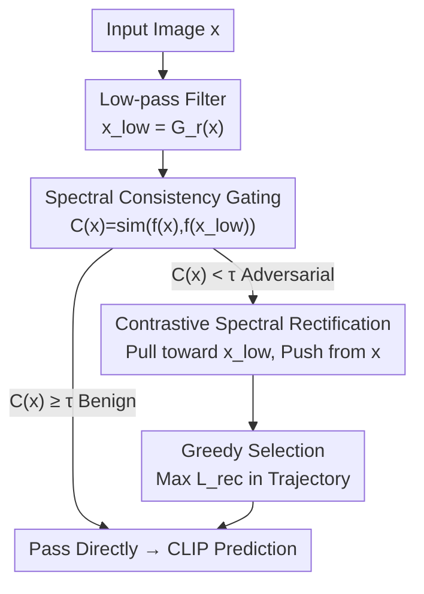

# Contrastive Spectral Rectification: Test-Time Defense towards Zero-shot Adversarial Robustness of CLIP

**Conference**: ICML2026  
**arXiv**: [2601.19210](https://arxiv.org/abs/2601.19210)  
**Code**: https://github.com/Summu77/CSR  
**Area**: Multimodal VLM / Adversarial Robustness  
**Keywords**: CLIP, Adversarial Examples, Test-Time Defense, Frequency Domain, Contrastive Learning  

## TL;DR
The authors discover that adversarial features collapse sharply when middle and high frequencies are gradually removed (unlike clean samples). Based on this, they propose CSR, a test-time defense: it utilizes "spectral consistency" as a gate to detect adversarial samples and then optimizes a rectification perturbation on the input using a contrastive objective—pulling features toward low-pass anchors and pushing them away from original adversarial features—to return the image to the natural manifold. CSR achieves an average improvement of 18.1% against the strong APGD attack across 16 classification benchmarks with minimal inference overhead.

## Background & Motivation
**Background**: Vision-Language Models like CLIP achieve impressive zero-shot generalization through cross-modal contrastive learning. However, they are extremely vulnerable to human-imperceptible adversarial perturbations; minor noise can completely derail classification, posing risks in safety-critical open scenarios.

**Limitations of Prior Work**: Existing defenses are insufficient. Adversarial fine-tuning (e.g., TeCoA, FARE) requires expensive retraining and significantly degrades performance on clean samples. Test-time defenses (e.g., TTC) do not require retraining but fail under stronger attacks like AutoAttack, suffer from high inference latency, and often lack generalizability to broader tasks like segmentation or VQA.

**Key Challenge**: Achieving "effectiveness against strong attacks," "inference efficiency," and "cross-task universality" simultaneously is difficult. Previous attempts to "disrupt" adversarial samples with random noise failed to validate the intuition that adversarial perturbations are inherently fragile.

**Key Insight**: The authors analyze the problem in the frequency domain. By applying low-pass filtering with a gradually decreasing bandwidth radius $r$ and observing the cosine similarity of CLIP features, they found that clean samples (including those with Gaussian noise) maintain stable features, while adversarial features collapse sharply—even under a minimal budget of $\ell_\infty=1/255$ and across various attack types.

**Core Idea**: The authors attribute this fragility to the "spectral bias" of CLIP—the model assigns excessive predictive weight to non-robust middle and high-frequency features, which attackers exploit as "shortcuts." Since adversarial signals reside in these frequencies and are sensitive to filtering, CSR uses "spectral consistency" for detection and "contrastive spectral rectification" for purification as a plug-and-play, training-free defense.

## Method

### Overall Architecture
CSR is a per-sample adaptive purification module placed before CLIP inference. It takes a potentially attacked image $\boldsymbol{x}$ and outputs a "reliable" rectified image $\boldsymbol{x}^*$ for zero-shot prediction, keeping model parameters frozen. The process has two stages: first, a low-pass filter calculates a consistency score $\mathcal{C}(\boldsymbol{x})$—if consistent, it is passed as benign (saving computation); if inconsistent, it is flagged as adversarial, triggering a few steps of PGD to optimize a rectification perturbation $\boldsymbol{\delta}$ using a contrastive objective. A greedy selection strategy picks the best step from the optimization trajectory.

### Key Designs

**1. Spectral Consistency Gating: Zero-cost Adversarial Detection**

This addresses the overhead of blind per-sample rectification. Using a Gaussian low-pass filter $G_r(\cdot)$ of radius $r$, a smoothed version $\boldsymbol{x}_{low}=G_r(\boldsymbol{x})$ is generated. The consistency score is the cosine similarity between the original and smoothed features:

$$\mathcal{C}(\boldsymbol{x})=\text{sim}(f(\boldsymbol{x}),f(\boldsymbol{x}_{low}))=\frac{f(\boldsymbol{x})^{\top}f(\boldsymbol{x}_{low})}{\|f(\boldsymbol{x})\|_2\,\|f(\boldsymbol{x}_{low})\|_2}.$$

Benign semantics are anchored in low frequencies, leading to high $\mathcal{C}(\boldsymbol{x})$. Adversarial samples rely on fragile high frequencies, leading to feature collapse and low $\mathcal{C}(\boldsymbol{x})$ upon filtering. If $\mathcal{C}(\boldsymbol{x})<\tau$, rectification is triggered.

**2. Contrastive Spectral Rectification: Manifold Recovery via Low-frequency Anchors**

Standard low-pass filtering over-smooths images, losing fine-grained details. Instead, CSR optimizes a perturbation $\boldsymbol{\delta}$ on the input image $\boldsymbol{x}'=\boldsymbol{x}+\boldsymbol{\delta}$ using a contrastive loss:

$$\mathcal{L}_{rec}(\boldsymbol{\delta})=\underbrace{\text{sim}(f(\boldsymbol{x}+\boldsymbol{\delta}),f(\boldsymbol{x}_{low}))}_{\text{Attraction}}-\lambda\cdot\underbrace{\text{sim}(f(\boldsymbol{x}+\boldsymbol{\delta}),f(\boldsymbol{x}))}_{\text{Repulsion}}.$$

The attraction term treats $f(\boldsymbol{x}_{low})$ as a semantic anchor on the benign manifold. Unlike TTC, which only "escapes" the adversarial subspace, CSR provides guidance on "where to go" using the low-frequency anchor.

**3. Greedy Selection: Stability in Non-convex Trajectories**

To handle potential oscillations during PGD optimization, the authors monitor $\mathcal{L}_{rec}$ at each step and retain the candidate with the maximum value:

$$\boldsymbol{x}^*=\boldsymbol{x}+\underset{\boldsymbol{\delta}_t\in\{\boldsymbol{\delta}_1,\dots,\boldsymbol{\delta}_N\}}{\arg\max}\mathcal{L}_{rec}(\boldsymbol{\delta}_t).$$

This ensures the input to the final inference is the most "spectrally consistent" and furthest from the adversarial state.

### Loss & Training
CSR is performed entirely at test-time without updating model parameters. Only the input perturbation $\boldsymbol{\delta}$ is optimized within a budget $\epsilon$, using step size $\alpha$ for $N$ steps. Parameters include radius $r$, threshold $\tau$, weight $\lambda$, budget $\epsilon$, and steps $N$.

## Key Experimental Results

### Main Results
Evaluated on 16 zero-shot benchmarks across General, Fine-Grained, Scene, and Domain categories. CSR significantly improves robust accuracy against PGD and AutoAttack (APGD) while maintaining clean accuracy.

| Dataset | CLIP Clean/Robust | CSR Clean/Robust | ΔRobust |
|--------|---------------|---------------|-------|
| ImageNet | 63.9 / 0.0 | 62.5 / 58.9 | +58.9 |
| CIFAR10 | 88.1 / 0.5 | 87.2 / 75.0 | +74.5 |
| STL10 | 97.5 / 4.8 | 97.2 / 87.5 | +82.7 |
| SUN397 | 63.6 / 0.2 | 63.0 / 66.3 | +66.1 |
| FGVCAircraft | 23.1 / 0.0 | 22.7 / 31.2 | +31.2 |

*(Note: Data for PGD 10-step at $\ell_\infty=1/255$.)*

### Key Findings
- **Spectral Consistency** is a strong discriminative signal: Adversarial samples collapse at $\ell_\infty=1/255$, providing a foundation for zero-cost gating.
- **Spectral Bias**: CLIP gradients are concentrated in high frequencies. Attacks restricted to low frequencies require $\ell_\infty=16/255$ to match the damage of high-frequency $\ell_\infty=2/255$ noise.
- **Benign Guidance**: The attraction term (low-frequency anchor) is crucial, providing significant gains over repulsion-only methods (like TTC) against strong attacks.
- **Generalization**: CSR is effective beyond classification, extending to semantic segmentation, image captioning, and VQA.

## Highlights & Insights
- The observation of "spectral fragility" of adversarial samples serves as both a detector and a source for rectification.
- The contrastive objective cleverly uses the image's own low-frequency version as a benign anchor, removing the need for external clean references or diffusion priors.
- Adaptive gating is a reusable trick: any scenario where benign samples are stable under degradation while anomalies are not can benefit from "consistency-based" fast/slow pathing.

## Limitations & Future Work
- The threshold $\tau$ requires a trade-off between sensitivity and false positives; its cross-dataset calibration needs further study.
- Robustness against adaptive attacks (attacks targeting the CSR objective itself) requires further validation.
- The method relies on the premise of CLIP's spectral bias towards high frequencies; while consistent across large VLMs, it remains an empirical observation.

## Related Work & Insights
- **vs FARE (Adversarial Fine-tuning)**: FARE sacrifices clean accuracy and requires retraining; CSR preserves clean accuracy and is training-free.
- **vs TTC (Test-time Purification)**: TTC lacks benign guidance and can distort semantics; CSR uses low-frequency anchors to guide rectification.
- **vs CLIPure (Diffusion-based)**: CLIPure relies on heavy diffusion models; CSR is more lightweight, using only CLIP's internal features.

## Rating
- Novelty: ⭐⭐⭐⭐⭐ Unified frequency-domain framework for detection and purification.
- Experimental Thoroughness: ⭐⭐⭐⭐ Extensive benchmarks and tasks, though adaptive attack evaluation could be strengthened.
- Writing Quality: ⭐⭐⭐⭐⭐ Logical flow from observation to mechanism and derivation.
- Value: ⭐⭐⭐⭐⭐ Plug-and-play and cross-task utility make it highly practical for secure CLIP deployment.

<!-- RELATED:START -->

## Related Papers

- [\[CVPR 2026\] AGFT: Alignment-Guided Fine-Tuning for Zero-Shot Adversarial Robustness of Vision-Language Models](../../CVPR2026/multimodal_vlm/agft_alignment-guided_fine-tuning_for_zero-shot_adversarial_robustness_of_vision.md)
- [\[CVPR 2026\] Explaining CLIP Zero-shot Predictions Through Concepts](../../CVPR2026/multimodal_vlm/explaining_clip_zero-shot_predictions_through_concepts.md)
- [\[NeurIPS 2025\] TOMCAT: Test-time Comprehensive Knowledge Accumulation for Compositional Zero-Shot Learning](../../NeurIPS2025/multimodal_vlm/tomcat_test-time_comprehensive_knowledge_accumulation_for_compositional_zero-sho.md)
- [\[CVPR 2026\] Multi-Hierarchical Contrastive Spectral Fusion for Multi-View Clustering](../../CVPR2026/multimodal_vlm/multi-hierarchical_contrastive_spectral_fusion_for_multi-view_clustering.md)
- [\[CVPR 2026\] Controllable Federated Prompt Learning at Test Time](../../CVPR2026/multimodal_vlm/controllable_federated_prompt_learning_at_test_time.md)

<!-- RELATED:END -->
