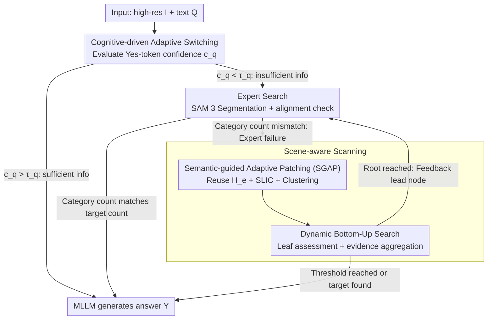

# CVSearch: Empowering Multimodal LLMs with Cognitive Visual Search for High-Resolution Image Perception

**Conference**: ICML2026  
**arXiv**: [2605.23655](https://arxiv.org/abs/2605.23655)  
**Code**: https://github.com/ICML26-CVSearch (Open-sourced as declared in the paper)  
**Area**: Multimodal VLM  
**Keywords**: High-resolution perception, visual search, training-free framework, semantic adaptive patching, bottom-up search  

## TL;DR
CVSearch proposes a training-free "Assess-then-Search" cognitive framework: a rapid localization is first performed using a visual expert (SAM 3); if the expert fails, a semantic-guided adaptive patching and bottom-up search are triggered as a fallback. It achieves SOTA in both accuracy and efficiency on high-resolution benchmarks such as V*Bench and HR-Bench.

## Background & Motivation

**Background**: Most current Multimodal Large Language Models (MLLMs) process images at fixed low resolutions (e.g., $336\times336$). For high-resolution images in real-world scenarios (thousands of pixels on the long side), aggressive downsampling is required before proceeding through the visual encoder, projection, and language model pipeline.

**Limitations of Prior Work**: Three main routes have emerged for high-resolution perception, yet none are entirely satisfactory. The Cropping route (e.g., LLaVA-NeXT) cuts images into fixed grids, causing objects to be split across grids, resulting in "semantic aliasing." The High-resolution Encoder route (e.g., LLaVA-HR) modifies architectures to inject high-frequency features but adapts poorly to varying aspect ratios. The Visual Search route is further divided into two camps: Expert-assisted models (e.g., SEAL, DyFo, V2-SAM) are fast but rely entirely on the proposal quality of external detectors, prone to "blind spots" for small or abstract targets; Scanning models (e.g., ZoomEye, RAP, DC²) use exhaustive tree-grid coverage, which is robust but wastes computation on the background and still suffers from splitting objects with grids.

**Key Challenge**: A dualism exists between efficiency and robustness—expert assistance is fast but brittle, while scanning is stable but expensive. Furthermore, both methods are "semantically unaware," treating the entire image as a uniform grid.

**Goal**: To unify these two routes into a single framework, enabling the model to "glance" first like a human before deciding how to look deeper, and to partition the image according to semantic structures rather than regular grids when deep inspection is necessary.

**Key Insight**: The authors draw inspiration from the dual-pathway visual search theory in cognitive science—a non-selective pathway extracts a global gist, while a selective pathway performs serial inspection of objects based on attention templates. It emphasizes that scene structure is the primary guide for attention deployment. Implementing this in MLLMs results in a cascade: "Assess if it can be answered directly → if not, find the expert → if the expert fails, perform semantic scanning."

**Core Idea**: Use the MLLM's own "Yes/No" confidence as an information sufficiency signal, treating visual expert failure as a trigger to switch to semantic scanning rather than an endpoint. During the scanning stage, the features extracted by the expert are reused for semantic clustering and partitioning, followed by bottom-up evidence transmission to avoid error propagation in top-down searches.

## Method

### Overall Architecture
The input consists of a high-resolution image $\bm{I}\in\mathbb{R}^{H\times W\times 3}$ and a text query $\bm{Q}$. The output is the answer $Y$ generated by the MLLM. The process follows a three-stage **Assess-then-Search** pipeline:

1. **Assess**: Feed $(\bm{I},\bm{Q})$ into the MLLM and quantify information sufficiency using the Yes-token probability $c_q(\bm{I})$ for the question "Can the current visual information answer the query?". If $c_q(\bm{I})>\tau_q$, the answer is generated directly, bypassing the search process.
2. **Expert Search**: When $c_q$ is insufficient, extract target objects $\bm{O}=\{o_1,\dots,o_m\}$ via MLLM in-context extraction (falling back to SpaCy). Use SAM 3 for open-vocabulary segmentation to obtain bounding boxes $\bm{B}_e$ and dense visual features $\bm{H}_e$. If the number of object categories segmented matches $|\bm{O}|$, the image is cropped according to $\bm{B}_e$ for answering; otherwise, proceed to the third stage.
3. **Scene-aware Scanning**: Reuse $\bm{H}_e$ (saving one recalculation) and perform semantic adaptive partitioning using SLIC + agglomerative clustering constrained by an adjacency graph. Construct an image tree $\bm{T}$ of depth $D$ recursively, then explore from the deepest leaf nodes bottom-up. Terminate if the stopping threshold is exceeded. If the root is reached without success, provide the highest priority node at the root level back to the visual expert for the next iteration of search.

### Key Designs

**1. Cognitive-driven adaptive switching: Translating "Expert failure" into "Switch to scanning" instead of "Given up"**

A common flaw in previous frameworks is either forcing the expert route or forcing the scanning route, leading to failure with small targets or abstract queries and wasting computation on every image. CVSearch lets the MLLM act as a judge, dynamically scheduling among three tiers. Information sufficiency follows ZoomEye's formulation $c_q(\bm{I})=\mathcal{M}(\text{"Yes"}\mid p_q(\bm{Q}),\bm{I})$, using the normalized probability of the "Yes" token as internal confidence. If it exceeds $\tau_q=0.9$, the search is bypassed. The key ingenuity lies in redefining "expert failure" as "SAM 3 segmented category count does not align with $|\bm{O}|$"—a more reliable signal that triggers a switch to semantic scanning. Search termination uses an adaptive descending threshold $\tau_{curr}$ (annealing from $\tau_q$ to a minimum $\hat{\tau}_q=0.5$), maintaining high certainty for easy samples while accepting less confident predictions for hard ones. This ensures expensive scanning is only activated when truly needed.

**2. Scene-guided Adaptive Patching (SGAP): Partitioning by semantic regions to avoid splitting objects**

Fixed grid cropping creates "semantic aliasing"—after an object is cut by grid lines, subsequent reasoning receives incomplete tokens that VL models struggle to reconstruct. SGAP reuses the already computed features $\bm{H}_e$ to run SLIC in the feature space, obtaining $N$ atomic superpixels and constructing a spatial adjacency graph $G$. Agglomerative clustering constrained by $G$ merges these into $k$ spatially-connected semantic clusters. Each cluster's bounding box is a patch. The number of clusters $k$ is selected within $[k_\min,k_\max]=[4,8]$ to minimize:

$$\mathcal{L}(k)=\mathcal{L}_o(\bm{B}_k)-\mathcal{L}_s(\bm{H}_a,\bm{l}_k),$$

where $\mathcal{L}_o$ penalizes spatial overlap between patches and $\mathcal{L}_s$ is the silhouette score for cluster compactness. Each patch also has a Visual Complexity $c_v(\bm{I}_{d,t})=\max(0,\,1-\tfrac{1}{|\bm{R}|}\sum_{i\in\bm{R}}\mathrm{cosim}(\bm{h}_i,\bar{\bm{h}}))$, using average cosine distance to measure feature divergence. Background nodes with $c_v<\tau_v=0.4$ are pruned. Aligning the partitioning strategy with visual representation ensures objects remain intact and focuses computational budget on high-entropy areas.

**3. Dynamic Bottom-Up Search: Allowing small targets to be verified first in the clearest local views**

Top-down search starts by picking nodes in low-resolution global views, which is difficult for small targets. If a branch is wrongly selected, the entire path is wasted. CVSearch reverses this, evaluating from the leaf nodes at the deepest layer of the semantic tree $\bm{T}$ and aggregating evidence upward. Node priority is $c_x=\alpha\cdot c_v+\beta\cdot c_o+\gamma\cdot c_x^*$, where $c_v$ is visual complexity, $c_o$ is Yes-confidence for $o_i$, and $c_x^*$ is the maximum priority of child nodes ($0$ for leaves), with hyperparameters $(\alpha,\beta,\gamma)=(0.2,0.4,0.4)$. Multi-object queries use ZoomEye's decoupling strategy. The loop design is elegant: if search fails at the deepest level, it moves up. If the entire tree is traversed without success, the highest-scoring first-layer node is sent back to the expert for a new "Expert Search"—interpreting "not found" as an iterative state rather than an impasse.

### Loss & Training
The entire pipeline is **training-free** with no backpropagation—all "scores" are MLLM forward-pass token probabilities or geometric/clustering heuristics. Major hyperparameters: $\tau_q=0.9$, $\tau_v=0.4$, $\hat{\tau}_q=0.5$, $(k_\min,k_\max)=(4,8)$, depth $D=2$ (single object) or $D=3$ (multi-object), $(\alpha,\beta,\gamma)=(0.2,0.4,0.4)$. Visual expert is SAM 3. Baseline MLLMs include Qwen2.5-VL-7B, LLaVA-OV-7B, and InternVL2.5-8B. Experiments were run on 4×A6000, though this refers only to configuration rather than weight training.

## Key Experimental Results

### Main Results
Evaluated on high-resolution benchmarks (V*Bench, HR-Bench 4K/8K), general real-world scenarios (MME-RealWorld-Lite, TreeBench), and drone-view tiny object datasets (FineRS-4K), with average resolutions of $\approx 2000\times1500$.

| Baseline MLLM | V*Bench | HR-Bench 4K | HR-Bench 8K | Gain Source |
|---|---|---|---|---|
| LLaVA-OV-7B | 75.4 → **91.6** | 63.0 → **75.6** | 59.8 → **74.8** | +CVSearch |
| Qwen2.5-VL-7B | 71.2 → **90.1** | 68.8 → **76.6** | 65.3 → **75.6** | +CVSearch |
| InternVL2.5-8B | 69.1 → **89.0** | 66.0 → **77.0** | 57.4 → **77.6** | +CVSearch |
| GPT-4o (Closed-source Ref) | 66.0 | 59.0 | 55.5 | — |
| Qwen2.5-VL-32B | 85.9 | 74.8 | 71.6 | Control only |

Applying CVSearch to 7B-class models allows them to outperform 32B models and GPT-4o, proving that the bottleneck lies in "where to look" rather than parameter count.

### Ablation Study

| Configuration | V* / HR-4K / HR-8K (Representative) | Description |
|---|---|---|
| Full CVSearch | 90.1 / 76.6 / 75.6 | Complete version with Qwen2.5-VL-7B |
| w/o Expert Search | Significant Decrease | Loses fast path; simple samples forced into deep search |
| w/o Scene-aware Scanning | Significant Decrease | Loses fallback for expert failure; small target blind spots return |
| w/o SGAP (back to grid) | Moderate Decrease | Semantic aliasing and background computation waste |
| w/o Bottom-Up (changed to top-down) | Moderate Decrease | Small target errors cannot be recovered |

### Key Findings
- **Expert and Scanning mutually fallback**: Neither branch alone outperforms the combination, proving the efficiency-robustness trade-off can be resolved via cascading rather than architecture modification.
- **SGAP gains mainly from small targets**: Preventing objects from being split ensures the VL model receives complete tokens, which is crucial for reasoning.
- **Bottom-Up + Annealing is key to the iterative loop**: When annealing triggers, missing hard samples are fed back to the expert for a second round, creating an "Assess-then-Search" cycle particularly effective for abstract targets.
- **Training-free is a structural advantage**: No modification of MLLM weights means LLaVA-OV, Qwen2.5-VL, and InternVL2.5 are all plug-and-play.

## Highlights & Insights
- Using the MLLM's own Yes-token confidence as a scheduler reuses existing capabilities and avoids the cost of training a separate judge model; this is transferable to any search process requiring termination criteria.
- Translating "expert failure" into a trigger for scanning turns detector limitations into useful signals for the framework.
- SGAP reveals that partitioning strategies and subsequent VLM representations share the same space. Reusing expert features $\bm{H}_e$ instead of introducing new features is a strategy applicable to any "partition-then-VLM" pipeline.
- Bottom-up search + annealing (strict-to-broad scheduling) naturally integrates with MLLM uncertainty expression and can be extended to RAG or multi-step agent retrieval tasks.

## Limitations & Future Work
- The pipeline's performance is sensitive to SAM 3; if the expert drifts in specific domains (e.g., medical, remote sensing), the fast path degrades, increasing scanning costs.
- Information sufficiency $c_q$ relies on MLLM Yes-token probabilities, which can exhibit overconfidence on out-of-distribution samples.
- The search interval $[k_\min,k_\max]$ and tree depth $D$ are manually set. Future work could explore automatic selection of $k$ and $D$ based on scene complexity.
- Training-free is a double-edged sword: the performance ceiling is largely determined by the baseline MLLM's fine-grained perception. This cognitive workflow could potentially be used as a distillation signal to fine-tune baseline models.

## Related Work & Insights
- **vs SEAL / DyFo (Expert-assisted)**: Ours retains the "fast expert localization" but uses SAM 3 with category alignment checks instead of simple box thresholds and connects failures to a scanning branch.
- **vs ZoomEye / RAP / DC² (Scanning)**: Also uses tree search, but SGAP replaces fixed grids, Visual Complexity prunes background nodes, and bottom-up replaces top-down traversal to address cost, aliasing, and error propagation.
- **vs LLaVA-HR / HR Encoders**: Avoids architecture engineering costs. Proves that without weight updates, a 7B model can approach the performance of 32B closed-source models, making it highly friendly for compute-constrained scenarios.

## Rating
- Novelty: ⭐⭐⭐⭐ Bridging the two visual search routes via "Expert failure triggers semantic scanning" shows high engineering elegance.
- Experimental Thoroughness: ⭐⭐⭐⭐ Covers multiple baselines and benchmarks, though cross-domain scenarios like medical imaging would be even more convincing.
- Writing Quality: ⭐⭐⭐⭐ Clear structure with well-aligned cognitive scientific motivations.
- Value: ⭐⭐⭐⭐ Training-free, plug-and-play, and significant SOTA gains make it a benchmark difficult to ignore for high-resolution VLMs.

<!-- RELATED:START -->

## Related Papers

- [\[CVPR 2026\] SenseSearch: Empowering Vision-Language Models with High-Resolution Agentic Search-Reasoning via Reinforcement Learning](../../CVPR2026/multimodal_vlm/sensesearch_empowering_vision-language_models_with_high-resolution_agentic_searc.md)
- [\[ICML 2026\] Self-Prophetic Decoding to Unlock Visual Search in LVLMs](self-prophetic_decoding_to_unlock_visual_search_in_lvlms.md)
- [\[ICLR 2026\] GLYPH-SR: Can We Achieve Both High-Quality Image Super-Resolution and High-Fidelity Text Recovery via VLM-Guided Latent Diffusion Model?](../../ICLR2026/multimodal_vlm/glyph-sr_can_we_achieve_both_high-quality_image_super-resolution_and_high-fideli.md)
- [\[ICCV 2025\] HRScene: How Far Are VLMs from Effective High-Resolution Image Understanding?](../../ICCV2025/multimodal_vlm/hrscene_how_far_are_vlms_from_effective_high-resolution_image_understanding.md)
- [\[ICML 2026\] ACTIVE-o3: Empowering MLLMs with Active Perception via Pure Reinforcement Learning](active-o3_empowering_mllms_with_active_perception_via_pure_reinforcement_learnin.md)

<!-- RELATED:END -->
