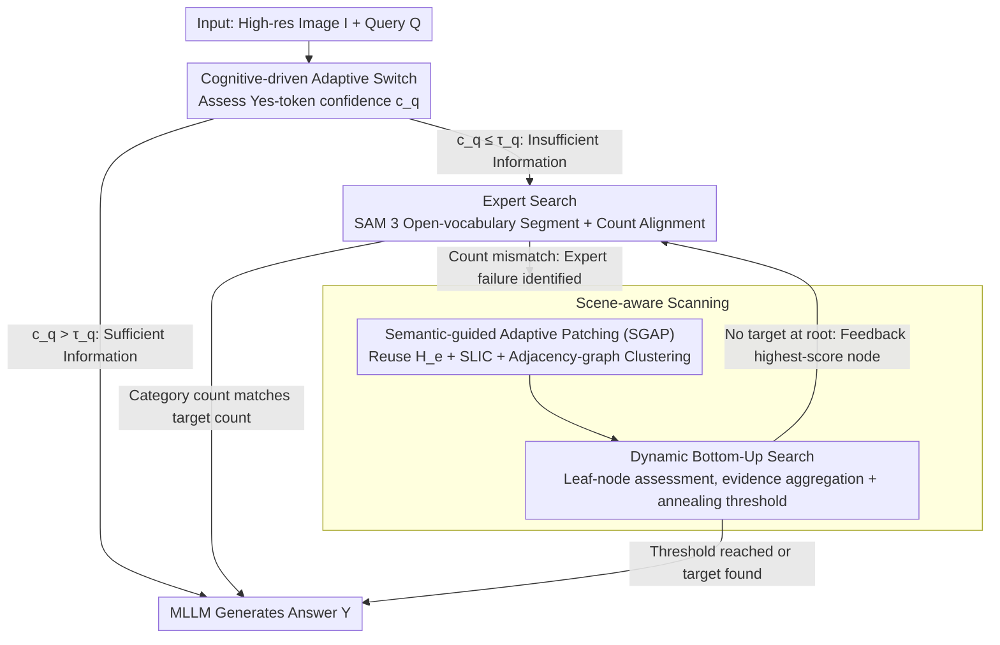

# CVSearch: Empowering Multimodal LLMs with Cognitive Visual Search for High-Resolution Image Perception

**Conference**: ICML2026  
**arXiv**: [2605.23655](https://arxiv.org/abs/2605.23655)  
**Code**: https://github.com/ICML26-CVSearch (Open-sourced as stated in the paper)  
**Area**: Multimodal VLM  
**Keywords**: High-resolution perception, visual search, training-free framework, semantic adaptive cropping, bottom-up search

## TL;DR
CVSearch proposes a training-free "Assess-then-Search" cognitive framework: it first utilizes a visual expert (SAM 3) for fast localization and triggers semantic-guided adaptive patching + bottom-up search as a fallback when the expert fails, achieving SOTA in accuracy and efficiency on high-resolution benchmarks like V*Bench and HR-Bench.

## Background & Motivation

**Background**: Current Multimodal Large Language Models (MLLMs) mostly process images at a fixed low resolution (e.g., $336\times336$). For high-resolution images in real-world scenarios (thousands of pixels on the long side), they require aggressive downsampling before following the standard pipeline of visual encoder + projection + language model.

**Limitations of Prior Work**: Three main technical routes for high-resolution perception have emerged, but none are fully satisfactory. The Cropping route (e.g., LLaVA-NeXT) uses fixed grids, causing "semantic aliasing" where objects are split across patches. The High-resolution encoder route (e.g., LLaVA-HR) modifies architectures to inject high-frequency features but adapts poorly to varied aspect ratios. Visual search routes are divided into two categories: Expert-assisted (e.g., SEAL, DyFo, V2-SAM), which are fast but rely entirely on the proposal quality of external detectors, leading to "blind spots" for small or abstract targets; and Scanning-based (e.g., ZoomEye, RAP, DC²), which use exhaustive tree-grid coverage, being robust but wasting computation on background areas and still suffering from grid-split objects.

**Key Challenge**: A dualistic opposition between efficiency and robustness—expert-assisted methods are fast but fragile, while scanning methods are stable but expensive. Both categories are "semantic-unaware," treating the entire image as a uniform grid.

**Goal**: To unify these two routes into a single framework, allowing the model to "glance" before deciding how to "look deep," and to crop based on semantic structure rather than regular grids when intensive search is necessary.

**Key Insight**: The authors draw inspiration from the dual-pathway visual search theory in cognitive science—the non-selective pathway extracts a global gist, while the selective pathway performs serial inspection of objects based on attention templates. Scene structure is emphasized as the primary guide for attention deployment. In MLLMs, this translates to a cascade: "Assess if a direct answer is possible → If not, find experts → If experts fail, perform semantic scanning."

**Core Idea**: Use the MLLM's own "Yes/No" confidence as an information sufficiency signal, treating visual expert failure as a trigger for semantic scanning rather than an end-point. During the scanning phase, features extracted by the expert are reused for semantic clustering to perform adaptive patching, followed by bottom-up evidence propagation to avoid the error accumulation found in top-down searches.

## Method

### Overall Architecture
The input consists of a high-resolution image $\bm{I}\in\mathbb{R}^{H\times W\times 3}$ and a text query $\bm{Q}$. The output is the MLLM-generated answer $Y$. The process follows a three-stage **Assess-then-Search** pipeline:

1. **Assess**: Feed $(\bm{I},\bm{Q})$ into the MLLM and quantify information sufficiency using the Yes-token probability $c_q(\bm{I})$ for the question "Can the answer be determined solely from the current visual information?". If $c_q(\bm{I})>\tau_q$, the answer is generated directly, bypassing the search.
2. **Expert Search**: When $c_q$ is insufficient, $\bm{Q}$ is decomposed into a set of target objects $\bm{O}=\{o_1,\dots,o_m\}$ via internal in-context extraction (falling back to SpaCy). Open-vocabulary segmentation with SAM 3 yields a set of bounding boxes $\bm{B}_e$ and dense visual features $\bm{H}_e$. If the number of categories identified by SAM 3 matches $|\bm{O}|$, the cropped patches in $\bm{B}_e$ are used for answering; otherwise, the third stage is triggered.
3. **Scene-aware Scanning**: Reuse $\bm{H}_e$ (saving recomputation cost) for semantic adaptive patching via SLIC and adjacency-graph-constrained agglomerative clustering. A semantic image tree $\bm{T}$ of depth $D$ is recursively constructed. Exploration starts from the deepest leaf nodes and proceeds bottom-up, terminating if the threshold is met. If the root is reached without a target, the highest-priority node at the root level is fed back to the visual expert for a new iteration of searching.

### Key Designs

**1. Cognitive-driven Adaptive Switching: Translating "Expert Failure" to "Switch to Scan" rather than "Give Up"**
A common flaw in previous frameworks is either strictly following an expert or strictly scanning, leading to failures on small objects/abstract queries or wasting computation on every image. CVSearch acts as a scheduler across three tiers: information sufficiency is quantified as $c_q(\bm{I})=\mathcal{M}(\text{"Yes"}\mid p_q(\bm{Q}),\bm{I})$, using the normalized probability of the "Yes" token as internal confidence. If it exceeds $\tau_q=0.9$, the search is bypassed. A key innovation is redefining "expert failure" from "no boxes found" to "mismatch between SAM 3 categories and target set $|\bm{O}|$". This is a more reliable signal that triggers a switch to semantic scanning rather than termination. Search termination uses an adaptive descending threshold $\tau_{curr}$ (annealing from $\tau_q$ to a minimum $\hat{\tau}_q=0.5$), maintaining high certainty for easy samples while accepting less confident predictions for hard samples.

**2. Semantic-guided Adaptive Patching (SGAP): Cropping by Semantic Contiguous Regions**
Fixed grid cropping creates "semantic aliasing"—when an object is split by grid lines, the subsequent reasoning receives incomplete tokens that VL models struggle to reconstruct. SGAP reuses the features $\bm{H}_e$ already produced by the expert. It performs SLIC on this feature space to obtain $N$ atomic superpixels and builds a spatial adjacency graph $G$. Agglomerative clustering constrained by $G$ then merges atoms into $k$ spatially contiguous semantic clusters, where the bounding box of each cluster forms a patch. The choice of cluster number $k$ is optimized within $[k_\min,k_\max]=[4,8]$ to minimize:

$$\mathcal{L}(k)=\mathcal{L}_o(\bm{B}_k)-\mathcal{L}_s(\bm{H}_a,\bm{l}_k),$$

where $\mathcal{L}_o$ penalizes spatial overlap between patches and $\mathcal{L}_s$ is the silhouette score for clustering tightness. Each patch also has a Visual Complexity score $c_v(\bm{I}_{d,t})=\max(0,\,1-\tfrac{1}{|\bm{R}|}\sum_{i\in\bm{R}}\mathrm{cosim}(\bm{h}_i,\bar{\bm{h}}))$. Background nodes with $c_v<\tau_v=0.4$ are pruned. Sharing the representation between patching and understanding ensures calculation is concentrated on high-entropy regions while preserving object integrity.

**3. Dynamic Bottom-Up Search: Letting Small Objects be Verified in the Clearest Local Views First**
Top-down searches start by picking nodes in low-resolution global views, which is difficult for small objects. If a branch is misidentified, the entire path is lost. CVSearch reverses this, evaluating from the deepest leaf nodes of the semantic tree $\bm{T}$ and aggregating evidence upward. Node priority is $c_x=\alpha\cdot c_v+\beta\cdot c_o+\gamma\cdot c_x^*$, where $c_v$ is visual complexity, $c_o$ is the MLLM confidence for "Does $o_i$ exist in the image?", and $c_x^*$ is the maximum priority of child nodes ($0$ for leaves), with $(\alpha,\beta,\gamma)=(0.2,0.4,0.4)$. Multi-target queries use a decoupled strategy. The "closed-loop" design allows for backtracking: if the deepest level ends without termination, it moves up. If the entire tree is traversed, the highest-scored node at the first level is sent back to the visual expert for a new round of Expert Search.

### Loss & Training
The entire pipeline is **training-free** with no backpropagation—all "scores" are derived from MLLM forward token probabilities or geometric/clustering heuristics. Major hyperparameters: $\tau_q=0.9$, $\tau_v=0.4$, $\hat{\tau}_q=0.5$, $(k_\min,k_\max)=(4,8)$, depth $D=2$ for single-target, $D=3$ for multi-target, and $(\alpha,\beta,\gamma)=(0.2,0.4,0.4)$. The visual expert is SAM 3. Baseline MLLMs include Qwen2.5-VL-7B, LLaVA-OV-7B, and InternVL2.5-8B. Experiments were conducted on 4×A6000.

## Key Experimental Results

### Main Results
Evaluation covers high-resolution specialized benchmarks (V*Bench, HR-Bench 4K/8K), general real-world scenarios (MME-RealWorld-Lite, TreeBench), and drone-based small object benchmarks (FineRS-4K), with average resolutions of $\approx 2000\times1500$.

| Baseline MLLM | V*Bench | HR-Bench 4K | HR-Bench 8K | Source of Gain |
|---|---|---|---|---|
| LLaVA-OV-7B | 75.4 → **91.6** | 63.0 → **75.6** | 59.8 → **74.8** | +CVSearch |
| Qwen2.5-VL-7B | 71.2 → **90.1** | 68.8 → **76.6** | 65.3 → **75.6** | +CVSearch |
| InternVL2.5-8B | 69.1 → **89.0** | 66.0 → **77.0** | 57.4 → **77.6** | +CVSearch |
| GPT-4o (Closed-source) | 66.0 | 59.0 | 55.5 | — |
| Qwen2.5-VL-32B | 85.9 | 74.8 | 71.6 | Comparison only |

Combined with 7B open-source models, the framework outperforms 32B models and GPT-4o, proving that the bottleneck lies in "where to look" rather than parameter count.

### Ablation Study
| Configuration | V* / HR-4K / HR-8K (Relative) | Description |
|---|---|---|
| Full CVSearch | 90.1 / 76.6 / 75.6 | Qwen2.5-VL-7B Full Version |
| w/o Expert Search | Significant Decrease | Simple samples forced into deep search |
| w/o Scene-aware Scanning | Significant Decrease | Small object blind spots return |
| w/o SGAP (Grid fallback) | Moderate Decrease | Semantic aliasing and background overhead |
| w/o Bottom-Up (Top-down) | Moderate Decrease | Failure to recover from wrong top-level paths |

### Key Findings
- **Experts and Scanning are Complementary**: Neither alone outperforms the combination, demonstrating that the efficiency-robustness trade-off can be resolved via cascading.
- **SGAP's Gain comes from Small Objects**: By avoiding the splitting of objects, SGAP ensures the VLM reasoning receives complete semantic units.
- **Bottom-Up + Annealing is Critical for the Loop**: When the annealing condition is met, unidentified difficult samples are fed back to the expert for a second round, forming a "Search-Assess-Research" cycle.
- **Training-free is a Structural Advantage**: Using LLaVA-OV, Qwen2.5-VL, or InternVL2.5 out-of-the-box without modifying weights allows for broader deployment.

## Highlights & Insights
- Using MLLM's internal "Yes-token" confidence as a scheduler reuses existing capabilities without the cost of training a separate judge model.
- The "Expert failure → Trigger scan" step treats detector limitations as useful internal signals, reframing single-point failure into a rational state within a multi-stage decision process.
- SGAP highlights that patching strategies and subsequent VLM representations share the same space; re-using $\bm{H}_e$ instead of introducing new features is an efficient design applicable to any "patch-then-VLM" pipeline.
- The bottom-up search + annealing threshold strategy is naturally compatible with MLLM uncertainty and can be extended to RAG or Agentic multi-step retrieval tasks.

## Limitations & Future Work
- The pipeline is sensitive to the performance of SAM 3; if the expert performs poorly in specific domains (e.g., medical, satellite), the "fast path" degrades, and scanning costs rise.
- Confidence $c_q$ from MLLMs often exhibits overconfidence on OOD samples, potentially allowing the "direct answer" path to bypass necessary searches.
- Hyperparameters such as $[k_\min,k_\max]$ and depth $D$ are manually set; automatic selection based on scene complexity remains to be explored.
- The accuracy ceiling is still bounded by the baseline MLLM's fine-grained perception; future work could use this cognitive workflow as a distillation signal to fine-tune the base models.

## Related Work & Insights
- **vs SEAL / DyFo (Expert-assisted)**: CVSearch preserves the "fast expert" idea but replaces simple box thresholds with SAM 3 + category alignment and adds a scanning fallback.
- **vs ZoomEye / RAP / DC² (Scanning-based)**: While using tree-search, CVSearch replaces fixed grids with SGAP, prunes background nodes, and uses bottom-up traversal to solve the "expensive, split, and error-prone" issues of traditional scanning.
- **vs LLaVA-HR / High-res Encoders**: Avoids the engineering cost of architectural changes, allowing 7B models to approach 32B models through search strategy alone.

## Rating
- Novelty: ⭐⭐⭐⭐ Connects the two main branches of visual search via a "failure-triggered cascade" with high engineering elegance.
- Experimental Thoroughness: ⭐⭐⭐⭐ Extensive baseline MLLMs and benchmarks, though OOD scenarios (medical/OCR) would further strengthen results.
- Writing Quality: ⭐⭐⭐⭐ Clear structure with sound grounding in cognitive science motivations.
- Value: ⭐⭐⭐⭐ Training-free, plug-and-play, and achieving SOTA; highly friendly for industrial deployment.

<!-- RELATED:START -->

## Related Papers

- [\[ICML 2026\] Self-Prophetic Decoding to Unlock Visual Search in LVLMs](self-prophetic_decoding_to_unlock_visual_search_in_lvlms.md)
- [\[ICCV 2025\] HRScene: How Far Are VLMs from Effective High-Resolution Image Understanding?](../../ICCV2025/multimodal_vlm/hrscene_how_far_are_vlms_from_effective_high-resolution_image_understanding.md)
- [\[ACL 2025\] VisuoThink: Empowering LVLM Reasoning with Multimodal Tree Search](../../ACL2025/multimodal_vlm/visuothink_empowering_lvlm_reasoning_with_multimodal_tree_search.md)
- [\[ICLR 2026\] GLYPH-SR: Can We Achieve Both High-Quality Image Super-Resolution and High-Fidelity Text Recovery via VLM-Guided Latent Diffusion Model?](../../ICLR2026/multimodal_vlm/glyph-sr_can_we_achieve_both_high-quality_image_super-resolution_and_high-fideli.md)
- [\[ICCV 2025\] FALCON: Resolving Visual Redundancy and Fragmentation in High-resolution Multimodal Large Language Models via Visual Registers](../../ICCV2025/multimodal_vlm/falcon_resolving_visual_redundancy_and_fragmentation_in_high.md)

<!-- RELATED:END -->
