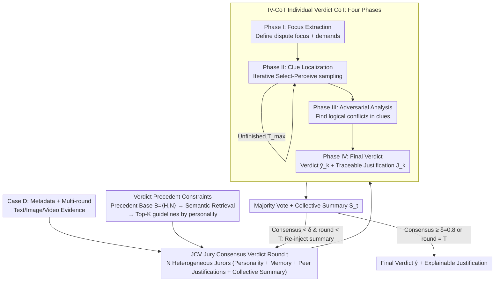

# CyberJurors: A Multi-Agent Simulation Task for E-Commerce Disputes Verdict

**Conference**: ICML 2026  
**arXiv**: [2605.28369](https://arxiv.org/abs/2605.28369)  
**Code**: https://github.com/YanhuiS/CyberJurors  
**Area**: Multi-Agent / Legal and E-Commerce AI / Multimodal Reasoning  
**Keywords**: E-commerce Dispute Verdict, Crowdsourced Jury, Multi-agent Simulation, IV-CoT, Precedent Constraint  

## TL;DR
The authors formalize the real-world crowdsourced jury mechanism of e-commerce platforms into the EDV (E-commerce Dispute Verdicts) task. They construct VerdictBench, the first multimodal benchmark containing 6,000 cases with ground-truth voting distributions from 17 jurors (text/images/video/multi-round). They propose CyberJurors, which uses a four-phase Individual Verdict Chain-of-Thought (IV-CoT) for fine-grained evidence localization and a Jury Consensus Verdict (JCV) mechanism that incorporates historical precedents via "Stare Decisis" for collective consensus. On VerdictBench, CyberJurors improves accuracy by $+9.48\%$, $+9.38\%$, and $+6.19\%$ compared to the strongest LLM, MLLM, and court simulators, respectively.

## Background & Motivation
**Background**: To efficiently handle massive transaction disputes, e-commerce platforms have introduced "crowdsourced jury" mechanisms where buyers and sellers submit multi-round multimodal evidence (chat logs, images, videos) for 17 volunteer jurors to decide the outcome. The bottleneck for scaling this mechanism is the time required to recruit 17 jurors, which often takes several days. Recently, multi-agent systems (ChatEval, AgentCourt, etc.) have demonstrated potential in legal judgment tasks.

**Limitations of Prior Work**: Directly migrating legal multi-agent court simulations to e-commerce dispute verdicts is infeasible for two reasons:

**Key Challenge**: (1) Evidence in e-commerce disputes is **redundant, multi-round, and cross-modal** (alternating between questioning, rebuttal, and clarification), with key clues often buried in large volumes of evidence. Existing methods are limited to text-only reasoning or passive one-time MLLM input, failing to capture fine-grained visual clues (e.g., a flashing 2% battery indicator in a video). This leads to an unintuitive phenomenon where MLLMs underperform text-only LLMs on EDV. (2) Unlike formal courts that rely on rigid legal statutes, e-commerce verdicts depend on **flexible, platform-specific transaction conventions** without explicit guidelines, causing models to exhibit inherent biases that undermine fairness and interpretability.

**Goal**: (a) Propose the EDV task and provide a multimodal benchmark; (b) Design a multi-agent system that simultaneously addresses "fine-grained evidence localization" and "collective consensus + fair judgment."

**Key Insight**: The authors draw on the "Stare Decisis" principle from common law, where historical precedents provide normative references. They transform traditional one-time MLLM reasoning into an iterative, active "select-perceive" evidence sampling process.

**Core Idea**: Use IV-CoT to decompose single-juror reasoning into four phases: "Focus Extraction → Active Evidence Selection & Perception → Adversarial Analysis → Final Verdict." Introduce precedent constraints into multi-round voting via JCV to ensure that the 17-juror simulation is both accurate and aligned with the ground-truth voting distribution.

## Method

### Overall Architecture
**Dataset VerdictBench**: 6,000 cases across five categories (Appliances, Clothing, Food, Digital, Others), preserving transaction metadata, multi-round multimodal evidence, and 17 ground-truth juror votes. Each case averages 14 images and 0.9 videos; the seller's win rate is 62.6% (due to better familiarity with fulfillment rules). Cases are stratified by category $\times$ difficulty (based on the 17-vote margin) in a 3:1:2 ratio for train/val/test.

**Ours (CyberJurors)**: Modeled as a directed social network $\boldsymbol{G}=\langle\boldsymbol{A}, \boldsymbol{E}\rangle$, where $\boldsymbol{A}=\{a_1, ..., a_N\}$ represents $N$ heterogeneous jurors and $e_{k,j} \in \boldsymbol{E}$ denotes that $a_k$ follows $a_j$. Given a case $\boldsymbol{D}=\{d, \bm{e}_1^b, \bm{e}_1^s, ...\}$ (where $d$ is metadata, and $\bm{e}_i^b=\{\bm{T}_i^b, \bm{I}_i^b, \bm{V}_i^b\}$ are the buyer's $i$-th round text/image/video evidence), JCV simulates $T$ rounds of discussion. In each round, all jurors receive the previous round's Collective Verdict Summary and the Verdict Precedent Base, then independently generate verdicts $\hat y_{k,t}$ and justifications $J_{k,t}$ via IV-CoT. Finally, a majority vote yields the final verdict, with the summary serving as the interpretable justification. The architecture is a nested structure with "Collective JCV multi-round simulation" on the outside and "Individual IV-CoT four-phase reasoning" on the inside, with precedents injecting norms between layers:

### Key Designs

**1. Individual Verdict Chain-of-Thought (IV-CoT): Decomposing single-juror reasoning into four phases with active "Select-Perceive" iteration.**

MLLMs performing "passive one-time perception" in ultra-long contexts often lose key visual clues (e.g., a flashing 2% battery light in a video) amidst redundant evidence. IV-CoT decomposes reasoning into four steps, enabling active clue retrieval. Phase I (Focus Extraction) $\boldsymbol{O}_{\text{I}}:\{F,F^b,F^s\}=\mathcal{F}_{\text{extract}}(d,\bm{T}^b,\bm{T}^s)$ defines the dispute focus and demands. Phase II (Clue Localization) is the core innovation, replacing one-time multimodal understanding with "Select-Perceive" iterations: each round, $\bm{e}^b_{*,t}=\mathcal{F}_{\text{select}}(\boldsymbol{O}_{\text{I}},\bm{T}^b-\bm{T}^b_{select})$ selects the evidence segment most likely to contain key clues, and $\{K_t^b,A_t^b\}=\mathcal{F}_{\text{perceive}}(\boldsymbol{O}_{\text{I}},\bm{e}^b_{*,t},\boldsymbol{O}_{t-1}^b)$ performs fine-grained perception on that segment only. This loops for $T_{max}$ rounds independently for buyer and seller. Phase III (Adversarial Analysis) identifies logical conflicts, and Phase IV (Final Verdict) provides the judgment. This approach constrains context to one piece of evidence per round, bypassing window bottlenecks and explicitly recording the "focus $\to$ evidence" causal chain in $\boldsymbol{O}_{\text{II}}$. Ablations show Select-Perceive adds $+3.28\%$ accuracy over single-step selection.

**2. Jury Consensus Verdict (JCV): Flattening single-model bias through multi-round simulation of $N$ heterogeneous jurors.**

A single LLM lacks statutory constraints and often repeats biases from training data (e.g., systemic bias toward sellers). JCV models the verdict as multi-round discussion over a directed social network $\boldsymbol{G}$. Each juror $a_k=\{\boldsymbol{P}_k, \boldsymbol{M}_k\}$ consists of a personality $\boldsymbol{P}_k$ and memory $\boldsymbol{M}_k$. Decision-making at round $t$ depends on the case, personality, memory, peer justifications $\boldsymbol{R}_{k,t}=\{J_{j,t-1}\mid e_{k,j}\in\boldsymbol{E}\}$, and the global collective summary $\boldsymbol{S}_t=\mathcal{F}_{\text{sum}}(d,\bigcup_j J_{j,t-1})$. By allowing $N$ heterogeneous jurors to exchange opinions locally while receiving macro-guidance from the global summary, the system maintains independent reasoning while nudging jurors to reconsider extreme positions, resulting in more stable decisions.

**3. Verdict Precedent: Injecting "Stare Decisis" from common law into agent memory.**

Due to the absence of rigid statutes in e-commerce, the authors use historical precedents to bridge the gap. They construct a Precedent Base $\boldsymbol{B}=\langle\boldsymbol{H},\boldsymbol{N}\rangle$ ($\boldsymbol{H}$ is historical cases, $\boldsymbol{N}$ is distilled guidelines). For a new case, semantic retrieval $\boldsymbol{H}_{\text{guide}},\boldsymbol{N}_{\text{guide}}=\mathcal{F}_{\text{retrieve}}(\boldsymbol{D},\boldsymbol{B})$ finds relevant precedents. Each juror's memory $\boldsymbol{M}_k$ is initialized with top-$K$ guidelines matching their personality. Here, precedents serve as personalized norms, simulating natural differences in juror focus while ensuring the collective verdict remains aligned with platform conventions, enhancing fairness and interpretability.

### Mechanism: Case Walkthrough
Consider a digital dispute where a buyer claims a phone won't charge, attaching 14 screenshots and an unboxing video, while the seller blames improper operation. (1) IV-CoT Phase I extracts the focus: "Is the device dead on arrival?" (2) In Phase II, Select-Perceive skips reading everything at once, first selecting the unboxing video for fine-grained perception and capturing the 2% flashing battery indicator, then selecting chat logs for corroboration. (3) Phase III highlights the conflict between "the seller's claim of testing success" and "the video evidence showing failure to charge." (4) Phase IV generates a verdict for the buyer. Simultaneously, 16 other jurors run their own IV-CoT. JCV feeds peer justifications and precedents for further discussion rounds until consensus $\delta=0.8$ is reached or rounds expire.

### Loss & Training
The system is an inference-only framework using Gemini-2.5-Flash-Lite-Nothinking as the backbone. Hyperparameters: $T_{max}=3$ (IV-CoT rounds), $T=3$ (JCV rounds), $K=3$ (precedent guidelines per juror), early-stop threshold $\delta=0.8$, and 30-frame uniform video sampling. $\boldsymbol{G}$ initialization follows standard social simulation protocols.

## Key Experimental Results

### Main Results
Evaluation against 5 categories of baselines (Closed/Open LLMs, Closed/Open MLLMs, Court Simulators) on VerdictBench:

| Category | Method | Acc ↑ | Weig. F1 ↑ | Macro F1 ↑ | MAE ↓ | RMSE ↓ | Token ↓ |
|------|------|-------|-----------|-----------|-------|-------|---------|
| Closed LLM | GPT-5.2-Chat | 0.6344 | 0.6309 | 0.6340 | - | - | 158k |
| Closed LLM | DeepSeek-V3 | 0.6080 | 0.6042 | 0.6075 | - | - | 114k |
| Open LLM | Dolphin3.0-R1-24B | 0.4929 | 0.4568 | 0.4790 | - | - | 145k |
| Closed MLLM | Gemini-3-Pro | 0.6354 | 0.6378 | 0.6351 | - | - | 4.37M |
| Closed MLLM | Claude-Opus-4.5 | 0.5910 | 0.5901 | 0.5910 | - | - | 2.70M |
| Closed MLLM | GPT-5.2 | 0.4833 | 0.4907 | 0.4798 | - | - | 1.63M |
| Open MLLM | Qwen3-VL-235B | 0.4843 | 0.4748 | 0.4825 | - | - | 2.99M |
| Court Sim | ChatEval | 0.6589 | 0.6645 | 0.6525 | - | - | 0.92M |
| Court Sim | AgentCourt | 0.6673 | 0.6644 | 0.6383 | - | - | 75.28M |
| **Ours** | **CyberJurors** | **0.7292** | **0.7258** | **0.7037** | **4.7312** | **6.3724** | 62.33M |

CyberJurors achieves a $+6.19\%$ Acc gain over the runner-up (AgentCourt). It is the only method that aligns with the 17-vote distribution (MAE/RMSE). An unintuitive finding: Average MLLM Acc ($52.98\%$) < Average Text LLM Acc ($55.78\%$), confirming that "passive perception" in long contexts fails to locate key visual clues.

### Ablation Study
Incremental module activation on the validation set:

| Configuration | Acc ↑ | Weig. F1 ↑ | Macro F1 ↑ | Remarks |
|------|-------|-----------|-----------|------|
| Baseline | 0.5416 | 0.5433 | 0.5385 | Gemini-2.5-Flash-Lite direct prediction |
| + Rules | 0.5876 | 0.5887 | 0.5875 | With prompt guidelines: +4.60% |
| + SR-CoT | 0.6406 | 0.6416 | 0.6810 | Stage II single-step selection: +5.30% |
| + IV-CoT | 0.6734 | 0.6788 | 0.6757 | With Select-Perceive iteration: +3.28% |
| + Jury | 0.7018 | 0.7043 | 0.6868 | Multi-juror simulation: +2.84% |
| + Precedent | **0.7252** | 0.7196 | 0.6980 | Precedent constraints: +2.34% |

### Key Findings
- "Select-Perceive" iteration provides a $+3.28\%$ Acc gain over single-step selection, indicating that **active multi-round sampling** outperforms one-time context ingestion for redundant multimodal evidence.
- The gains from Jury simulation ($+2.84\%$) and Precedents ($+2.34\%$) are comparable, proving both the effectiveness of "collective consensus" and the value of injecting norms into individual agent memory.
- Token consumption (62.33M) is significantly higher than single LLMs but lower than AgentCourt (75.28M), representing a more efficient design for court simulation.

## Highlights & Insights
- **Practical Value**: EDV directly addresses real e-commerce operations. The "17-vote ground truth" includes difficulty (margin), allowing the benchmark to evaluate both accuracy and alignment with social consensus.
- **Active vs Passive Perception**: The failure of MLLMs in redundant multimodal settings is a critical warning: visual encoding must be paired with active retrieval or iterative perception to be valuable.
- **Stare Decisis as a Normative Source**: Injecting legal principles as memory rather than hard constraints allows "precedent $\to$ personalized guidance" to be a novel alignment mechanism for other non-statutory multi-agent tasks like content moderation.

## Limitations & Future Work
- CyberJurors was tested with a single backbone (Gemini-2.5-Flash-Lite); the effect of juror heterogeneity across different backbones requires verification.
- The class imbalance in VerdictBench (Seller win rate 62.6%) might mean CyberJurors inherits a "pro-seller" bias—fairness metrics split by verdict direction are needed.
- Retrieval quality of the precedent base directly affects $\boldsymbol{M}_k$; handling rare categories or cold-start scenarios remains unexplored.
- Uniform 30-frame video sampling may miss critical event-based evidence (e.g., specific unboxing moments); event-aware sampling is a future direction.

## Related Work & Insights
- **vs ChatEval / AgentCourt**: Prior work focused on "general debate / legal court simulation" with text-heavy inputs. Ours targets e-commerce multimodal rounds, introducing active evidence sampling and personalized precedents to make court-simulators viable for "redundant multimodal evidence."
- **vs End-to-End MLLM**: Feeding 14 images and 1 video directly to an MLLM is inferior to text LLM baselines. CyberJurors provides a template for decomposing long-input tasks into "goal-driven local perception."
- **vs Chain-of-Thought**: Standard CoT is a single reasoning line. IV-CoT explicitly decouples "evidence selection" and "perception" in Stage II, creating a dual-layer evidence-logic chain that is more effective when evidence selection itself is the bottleneck.

## Rating
- Novelty: ⭐⭐⭐⭐ Formalizing EDV, first 17-vote multimodal benchmark, and precedents as agent memory.
- Experimental Thoroughness: ⭐⭐⭐⭐ 14 baselines, 5-step ablation, and token analysis; missing cross-backbone/fairness breakdown.
- Writing Quality: ⭐⭐⭐⭐ Clear motivation, with formal definitions for IV-CoT phases and JCV simulation.
- Value: ⭐⭐⭐⭐⭐ High-quality benchmark and a deployable assistive system for both academia and industry.

<!-- RELATED:START -->

## Related Papers

- [\[ICML 2026\] Task-Aware Structured Memory for Dynamic Multi-modal In-Context Learning](task-aware_structured_memory_for_dynamic_multi-modal_in-context_learning.md)
- [\[CVPR 2026\] Hierarchical Attacks for Multi-Modal Multi-Agent Reasoning](../../CVPR2026/multimodal_vlm/hierarchical_attacks_for_multi-modal_multi-agent_reasoning.md)
- [\[ACL 2026\] AFMRL: Attribute-Enhanced Fine-Grained Multi-Modal Representation Learning in E-commerce](../../ACL2026/multimodal_vlm/afmrl_attribute-enhanced_fine-grained_multi-modal_representation_learning_in_e-c.md)
- [\[CVPR 2026\] VS-Bench: Evaluating VLMs for Strategic Abilities in Multi-Agent Environments](../../CVPR2026/multimodal_vlm/vs_bench_evaluating_vlms_for_strategic_abilities_in_multi_agent_environments.md)
- [\[ACL 2026\] From Heads to Neurons: Causal Attribution and Steering in Multi-Task Vision-Language Models](../../ACL2026/multimodal_vlm/from_heads_to_neurons_causal_attribution_and_steering_in_multi-task_vision-langu.md)

<!-- RELATED:END -->
